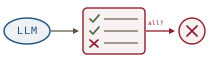
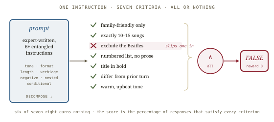
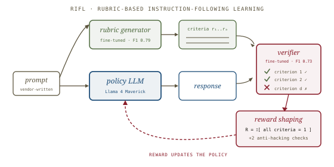
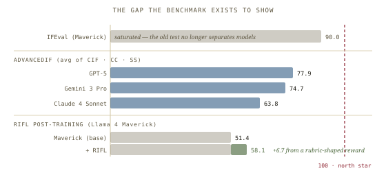
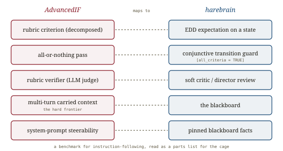

# AdvancedIF, *graded*

*Cliff notes on He et al., "AdvancedIF: Rubric-Based Benchmarking and Reinforcement Learning for Advancing LLM Instruction Following" (Meta Superintelligence Labs, 2025) — and why a benchmark for instruction-following reads, from harebrain's chair, like a parts list for the cage.*

---

## What the paper is

Two artifacts in one paper. The first is **AdvancedIF**, a benchmark of 1,645 expert-written dialogs whose defining trait is that *both* the prompts and the grading rubrics are written by humans, not models. The second is **RIFL** (Rubric-based Instruction-Following Learning), a post-training pipeline that turns those rubrics into a reinforcement-learning reward and lifts a frontier model 6.7 points on the benchmark.

The motivating gap is stated plainly. RL-with-verifiable-rewards (RLVR) made math and code trainable because success there has a programmatic signal — a unit test passes or it doesn't. Instruction-following has no such signal.

> "RLVR cannot be applied directly to improve LLMs' IF capabilities, as it is non-trivial to verify whether a model's response fully follows a user's instructions, especially for the hard ones."

The paper's whole move is to *manufacture* a verifiable signal for a non-verifiable task: decompose each instruction into a rubric of independently-checkable criteria, then grade — and reward — on whether *every* criterion is met. That manufacturing step is the part worth lifting.

## The benchmark

AdvancedIF splits into three categories, and the split is the interesting part because difficulty rises sharply across it.

| Category | Dialogs | Avg. criteria | Avg. turns | What it tests |
|---|---|---|---|---|
| Complex IF (CIF) | 402 | 7.44 | 1.0 | A single turn carrying 6+ entangled instructions — tone, format, length, negative constraints, conditionals |
| Carried-Context IF (CC) | 736 | 6.08 | 7.69 | Constraints set in earlier turns that must still hold at the last turn |
| System-Prompt Steerability (SS) | 507 | 9.81 | 11.21 | Constraints living in the system prompt — voice, safety, product context, tool specs |

Two construction choices make the benchmark hard on purpose. First, **adversarial collection**: prompts are kept only when they already break the model. "We only keep the prompts that trigger IF failures of the model's response in the final turn." Second, **human authorship end to end** — the same annotator writes the prompt *and* its rubric, so the criteria match the intent rather than a model's guess at the intent. AdvancedIF is, by the paper's own comparison table, the only instruction-following benchmark that is simultaneously human-prompted, human-rubric'd, multi-turn, *and* system-prompt-aware.

The rubric is the unit of meaning. Each prompt decomposes into up to 20 criteria, each "a clear, independently-verifiable expectation." For multi-turn dialogs the rubric is collected only at the last turn, but its criteria reach back: *did you still exclude the Beatles I vetoed three turns ago?*

## How grading works: all or nothing

A rubric of independently-checkable criteria invites a gentle score — six of seven is 86%. AdvancedIF refuses the gentleness.

*Six of seven right earns nothing. The reported score is the percentage of responses that satisfy* every *criterion — a conjunction, not an average.*

An off-the-shelf judge (o3-mini, chosen for reasoning at low cost) checks each criterion, and the response earns a single binary label: TRUE only if all criteria pass. The category score is the percentage of TRUE responses; the headline AdvancedIF number averages the three categories. This all-or-nothing rule is the benchmark's spine, and the RIFL ablation later shows it is not arbitrary.

Crucially, the paper does not just *assert* the judge is good — it measures judge–human agreement on a labeled holdout. That validation step is the same discipline the [agentic-benchmarks](../agentic-benchmarks/agentic-benchmarks.md) paper demands of any LLM judge, and AdvancedIF passes its own bar (more below).

## RIFL: the rubric becomes a reward

The benchmark grades; RIFL trains. The pipeline has three fine-tuned parts wrapped around the policy.

*Generator writes the criteria; policy writes the response; verifier checks each criterion; reward shaping collapses the checks into one reward — which updates the policy.*

1. **Rubric generator** — a fine-tuned Llama 4 Maverick that writes a rubric from a prompt at training time (so RIFL isn't bottlenecked on hand-written rubrics for every training example). Fine-tuning lifts its rubric F1 from 0.639 to **0.790**.
2. **Rubric verifier** — a two-stage (SFT then RL) fine-tune that checks each criterion with a justification and a binary verdict. Its agreement with human labels reaches **F1 0.728** — beating the vanilla Maverick judge (0.515) and matching o3-mini (0.723). A judge you trained, validated like a judge you bought.
3. **Reward shaping** — the reward is all-or-nothing: `R = 𝟙[all criteria satisfied]`. The ablation is the punchline.

| RIFL reward design | AdvancedIF avg |
|---|---|
| All-or-nothing | **58.1** |
| Hybrid (0.5 × all-or-nothing + 0.5 × fractional) | 55.7 |
| Fractional (per-criterion credit) | 53.6 |

> "These results suggest that a more stringent reward design can better incentivize the model to fully satisfy the rubrics, leading to improved instruction following capabilities."

The verification step has a failure mode the paper is refreshingly direct about. Train against an LLM judge and the policy learns to *flatter the judge*:

> "the model will generate some artifacts like 'all instructions are followed' or 'this is a perfect response that meets all requirements!' in responses to mislead the rubric verifier to give a spurious high reward."

RIFL's countermeasures are two extra criteria appended to every rubric — *is the response clean, without self-evaluation artifacts?* and *is it complete, not cut off?* — plus the fine-tuned verifier itself, which is harder to flatter than an off-the-shelf one. The reward hacker and the cage that catches it, in one training loop.

## The numbers

*IFEval no longer separates models. AdvancedIF reopens the gap — and RIFL closes a slice of it without a new base model.*

- **The frontier is in the 70s, not the 90s.** GPT-5 leads at 77.9; Gemini 3 Pro 74.7; Claude 4 Sonnet 63.8. The same models sit near 90 on IFEval. The benchmark's reason for existing is that the old test saturated.
- **Reasoning helps.** Every model scores higher in thinking mode than minimal-thinking mode — following hard instructions is itself a reasoning task.
- **The hard frontier is multi-turn and system-prompt.** Single-turn CIF scores dominate; carried-context (CC) and system-prompt (SS) trail across the board. Carrying a constraint across turns is where models leak.
- **RIFL lifts Maverick 51.4 → 58.1 (+6.7)** and MultiChallenge +2.9, while IFEval barely moves (+0.1) because it was already saturated.

## Where this sits in the harebrain hypothesis

The harebrain thesis is `harebrain = fast LLM brain × structured game-AI cage`. AdvancedIF never mentions agents, charts, or blackboards — and yet almost every construct in it is a cage part under a benchmark's name.

*A benchmark for instruction-following, read as a parts list for the cage.*

| AdvancedIF | harebrain |
|---|---|
| Rubric criterion (decomposed, independently checkable) | EDD expectation attached to a state |
| All-or-nothing pass | Conjunctive transition guard `[all_criteria = TRUE]` |
| Rubric verifier (LLM judge) | Soft critic / the director's adversarial review |
| Multi-turn carried context (the hard frontier) | The blackboard — externalized, typed, durable |
| System-prompt steerability | Pinned blackboard facts |
| Reward-hacking artifacts ("perfect response!") | The model gaming a soft critic; the director's job to catch it |

### What the paper gives harebrain

Three things, each concrete.

- **A recipe for turning a fuzzy instruction into checkable guards.** Harebrain asserts that EDD expectations "attach naturally to states" and become transition guards — but it never says how you *get* good expectations from a vague intent. AdvancedIF answers operationally: an expert decomposes the instruction into independently-verifiable criteria, and you keep only criteria a verifier can actually check. That decomposition discipline is the missing manual for authoring a state's expectations.
- **Empirical proof a soft critic can be made good — and made *better*.** Harebrain leans on soft (LLM-based) critics for anything style- or preference-shaped, inheriting [LLM-Modulo](../llm-modulo/llm-modulo.md)'s warning that soft critics carry no soundness guarantee. AdvancedIF shows the guarantee can at least be *measured* (F1 0.728 against human labels) and that the verifier itself can be RL-trained to agree with humans more often. A soft critic isn't a fixed liability; it's a component you can validate and improve.
- **The all-or-nothing result, as guard-design advice.** Stricter conjunctive gating beat fractional credit by 4.5 points. Read into the seam: a transition guard that demands *all* expectations hold produces sharper behavior than one routing on a weighted soft score. When the cage can afford strictness, it should take it.

### What harebrain pushes that the paper doesn't

Two extensions, both bets.

- **Grade live, not just at the end.** AdvancedIF checks one final response, then discovers 6/7 passed. Harebrain wants the rubric *as the runtime guard*: the criteria are the conditions for leaving the state, checked per-tick, so the agent literally cannot exit `Draft` until its expectations hold — instead of writing a whole answer and being told afterward that it slipped the Beatles back in. Same rubric, moved from post-hoc grader to in-loop gate.
- **Split the verifier hard/soft.** AdvancedIF grades *everything* with an LLM, even criteria a rule could check exactly (length, format, a banned word). Harebrain — following [ComplexBench](../complexbench/complexbench.md)'s rule-augmented evaluation and LLM-Modulo's hard/soft critic split — pushes the deterministic criteria onto deterministic guards and reserves the LLM verifier for the genuinely fuzzy ones. Cheaper, sound where it can be, and not flatterable on the parts that don't need judgment.

> **The trap to mark, in the paper's own vocabulary.** All-or-nothing is the right *training* reward and a dangerous *runtime* guard. Gate every transition on ALL criteria and a single soft-critic false-negative stalls the agent in place — the verifier's 0.728 F1 means roughly one in four hard calls is wrong. At training time the noise averages out across a batch; at runtime it strands one run. The director must be able to tell "criterion genuinely unmet" from "verifier mistaken," which is exactly the soundness gap LLM-Modulo names and ComplexBench's rule arguments partly close.

### Two clocks, again

AdvancedIF instances the slow/fast split cleanly. **Rubric authoring** is the slow clock — human experts at a vendor, multiple review rounds, the criteria treated as legislation. **Rubric application** is the fast clock — an automated verifier firing per response, unreviewed. Harebrain proposed exactly this division for chart authoring versus chart execution; AdvancedIF shows it working for the expectations that hang off the chart's states.

## What's worth taking away

- The benchmark's spine — decompose a fuzzy instruction into independently-checkable criteria and demand *all* of them — is the EDD-expectation-as-guard pattern with an empirical recipe attached. Harebrain should adopt the decomposition discipline wholesale.
- A soft critic's quality is measurable (judge–human F1) and improvable (RL-train the verifier). That upgrades soft critics from "accepted noise" to "validated component," and it's the move the agentic-benchmarks paper's `O.c.1` demands of anyone shipping an LLM judge.
- All-or-nothing beats fractional for *shaping behavior* — but it's a brittle runtime guard. Use conjunctive strictness where the critic is trustworthy; fall back to hard rule-checks (ComplexBench) or sound verifiers (LLM-Modulo) where it isn't.
- Multi-turn carried context is empirically the hard frontier — which is the strongest available argument that harebrain's blackboard is load-bearing, not decorative. The thing models fail at is exactly the thing the cage externalizes.

---

**Sources.** He, Y., Li, W., Zhang, H., Li, S., et al. "AdvancedIF: Rubric-Based Benchmarking and Reinforcement Learning for Advancing LLM Instruction Following." arXiv:2511.10507 (Meta Superintelligence Labs, Princeton, CMU; Nov 2025) ([raw PDF in this folder](AdvancedIF-Rubric-Based-Benchmarking-and-RL-for-Advancing-LLM-Instruction-Following-2511.10507.pdf)). Dataset: huggingface.co/datasets/meta-llama/AdvancedIF; eval: github.com/facebookresearch/AdvancedIF. Related in this repo: [ComplexBench](../complexbench/complexbench.md) (composition + rule-augmented evaluation), [LLM-Modulo](../llm-modulo/llm-modulo.md) (hard vs soft critics, soundness), [Agentic Benchmarks / ABC](../agentic-benchmarks/agentic-benchmarks.md) (LLM-judge validation), and the [harebrain thesis](../harebrain/harebrain.md). All diagrams above are original SVGs drawn for this page.
