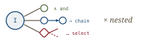
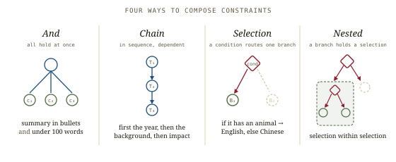
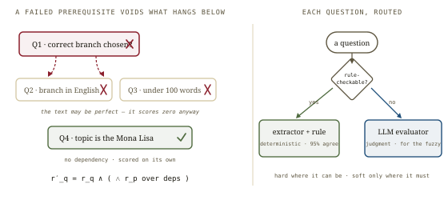
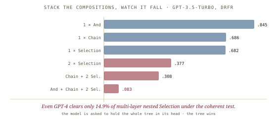
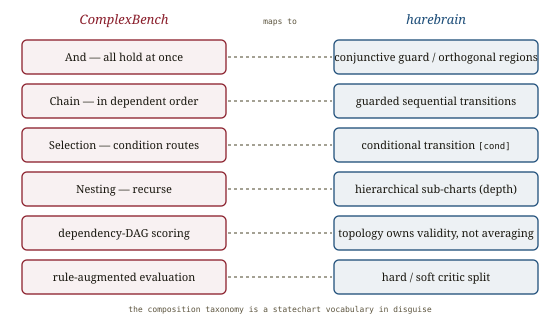

# ComplexBench, *composed*

*Cliff notes on Wen et al., "Benchmarking Complex Instruction-Following with Multiple Constraints Composition" (NeurIPS 2024 D&B) — the benchmark that stopped treating a list of constraints as a bag and started treating it as a structure. Which is to say: a statechart.*

---

## The thing it measures

Most instruction-following benchmarks treat a hard prompt as a *set* of constraints and score the average: satisfy four of five, get 80%. ComplexBench's claim is that this throws away the most important information in a real instruction — *how the constraints are wired together*.

> "simple aggregation methods for each constraint result, such as direct averaging, which is commonly adopted by existing benchmarks neglect the dependency among constraints brought by composition, causing potential biases in evaluation results."

A real instruction isn't a bag. *"First introduce the year, then the background, then the impact"* is a sequence — getting the impact right is meaningless if you skipped the background. *"If the painting has an animal, answer in English, otherwise Chinese"* is a branch — the English-quality constraint only applies on one side of a condition. ComplexBench is the first benchmark to name these wirings, build a dataset around them, and score *through* them rather than around them.

## The taxonomy

Two orthogonal axes. **What** each constraint demands (4 types, 19 dimensions) and **how** constraints combine (4 composition types).

| Constraint type | Dimensions | Examples |
|---|---|---|
| Lexical | 2 | word matching, keyword inclusion/exclusion |
| Format | 8 | JSON, Markdown, bullets, length, start/end-with, punctuation, template |
| Semantic | 4 | language style, personalization, topic, sentiment |
| Utility | 5 | helpfulness, target language, supportiveness, consistency, factuality |

The composition axis is the contribution, and it earns its own diagram.

*And, Chain, Selection, Nested. The first is a conjunction; the rest are topology — sequence, branch, and recursion.*

- **And** — every constraint holds at once. The flat case prior benchmarks already handled.
- **Chain** — tasks `{T₁…Tₙ}` done in order, where `T_{k+1}` may depend on the output of `T_k`.
- **Selection** — a condition `cond` picks one of `m` branches; only the chosen branch's constraints apply.
- **Nested** — any branch or task may itself contain another composition. Selection within selection, chains inside branches — a tree.

## Why composition is the right axis

The motivation isn't academic. Sampling a chat platform with over a million daily users, the authors found that *professional* users compose constantly while general users mostly don't:

| User population | Single | And | Chain | Selection | Nested |
|---|---|---|---|---|---|
| General | 77% | 19% | 0% | 0% | 4% |
| Professional | 0% | 96% | 34% | 33% | 45% |

The hard, valuable, agent-shaped work *is* compositional. And it is exactly where models fall apart — which is the whole point of building the benchmark.

## Scoring that respects structure

ComplexBench scores each constraint as a hand-written yes/no **scoring question**, then does two things prior benchmarks don't.

*Left — composition induces a dependency DAG; a failed prerequisite voids everything beneath it. Right — rule-checkable questions get a deterministic rule; only the genuinely fuzzy ones reach an LLM.*

First, **dependency aggregation**. Composition makes some questions prerequisites for others. If the model picked the wrong branch, the "did you answer that branch in English?" question is automatically failed — even if the text it produced happened to be flawless English. Formally `r′_q = r_q ∧ (⋀_{p ∈ Dep(q)} r_p)`. The final metric is **DRFR** (Decomposed Requirements Following Ratio), the fraction of scoring questions passed after dependency propagation.

Second, **Rule-Augmented LLM evaluation (RAL)**. A question that a rule can check exactly — length, a banned keyword, JSON validity — is routed to an LLM *extractor* plus a deterministic rule, not to an LLM's judgment. Only genuinely open-ended questions reach the LLM evaluator.

Both choices are validated, and both pay off:

| Evaluation method | Pairwise agreement w/ human |
|---|---|
| RAL with dependency aggregation (theirs) | **0.614** |
| …without dependency aggregation | 0.574 |
| Direct 1–10 scoring | 0.512 |

| Question subset | RAL | RAL w/o rule | Direct scoring |
|---|---|---|---|
| Rule-defined | **95.36%** | 82.02% | 62.02% |
| Open-ended | 86.28% | 86.28% | 77.83% |
| Overall | **87.82%** | 85.56% | 75.18% |

Modeling the structure improves agreement (0.614 vs 0.574). Using a deterministic rule where one exists lifts rule-defined agreement from 82% to 95%. Both numbers matter for harebrain, below.

## The collapse

*The cliff. Each composition you stack costs more than the last, and nested Selection is where the floor gives way.*

- **Even GPT-4 fails one in five.** Best overall DRFR is GPT-4-1106 at 0.800: "the widely recognized powerful GPT-4 still fails to complete 20% of complex instructions."
- **Chain is the hardest basic composition; Selection second.** And the diagnosis is precise: "the main difficulty in *Selection* lies not in choosing the correct branch but in executing it without interference from irrelevant branches."
- **Nesting is where it breaks.** Under the coherent test for multi-layer nested Selection, "even the state-of-the-art LLM, GPT-4, achieves only 14.9% accuracy."
- **Length is the single worst dimension** (best model ≤ 0.532) — a constraint a one-line rule checks perfectly, that no model reliably honors.
- **Naïve decomposition makes it worse.** Splitting a complex instruction into a multi-turn execution *lowered* scores (0.682 → 0.652 for GPT-3.5), the authors attributing it to cumulative error across turns. Hold that finding; harebrain has a reading of it.

## Where this sits in the harebrain hypothesis

The harebrain thesis is `harebrain = fast LLM brain × structured game-AI cage`. ComplexBench is, almost line for line, a measurement of what happens to the brain when you hand it a cage's worth of structure and ask it to hold the structure *in its head*. The composition taxonomy is a statechart vocabulary wearing a benchmark's clothes.

*The composition taxonomy is a statechart vocabulary in disguise.*

| ComplexBench | harebrain |
|---|---|
| And — all hold at once | conjunctive guard / orthogonal regions |
| Chain — in dependent order | guarded sequential transitions |
| Selection — condition routes | conditional transition `[cond]` |
| Nesting — recurse | hierarchical sub-charts (depth) |
| dependency-DAG scoring | topology owns validity, not averaging |
| rule-augmented evaluation (RAL) | hard / soft critic split |

### What the paper gives harebrain

- **A vocabulary bridge: instruction composition *is* chart topology.** And/Chain/Selection/Nesting are conjunction, sequence, conditional, and Harel depth. This is more than analogy — it means a complex instruction can be *compiled* into a statechart, one composition node at a time, rather than handed to a model as a paragraph to be held in working memory. The taxonomy is a parser spec for turning prose constraints into a cage.
- **Empirical proof that modeling topology improves even *evaluation*.** The dependency-DAG aggregation beats flat averaging on human agreement (0.614 vs 0.574). Harebrain argues topology improves *execution*; ComplexBench shows it improves *scoring* too, for the same reason — a downstream result is meaningless if its upstream prerequisite failed. The DAG is the chart, used as a grader.
- **The rule-augmented result, as direct support for the hard/soft split.** Routing rule-checkable questions to a deterministic rule lifted agreement from 82% to 95%. This is [LLM-Modulo](../llm-modulo/llm-modulo.md)'s hard-vs-soft critic distinction, measured: where a sound check exists, use it; reserve the LLM for the genuinely fuzzy. It's also the extension harebrain wants to push back onto [AdvancedIF](../advanced-if/advanced-if.md), which grades everything with an LLM.

### What harebrain pushes that the paper doesn't

- **Run the structure, don't recite it.** ComplexBench hands the model the whole composite instruction in one prompt and grades the output. The 14.9%-on-nested-Selection collapse is the sound of a model trying to hold a tree in its head. Harebrain's move is to make the tree *external* — compile the Chain into guarded transitions, the Selection into a conditional, the nesting into sub-charts — so the topology is enforced by the cage and the LLM only ever does one leaf at a time. The thing the model fails at is precisely the thing the chart is *for*.
- **A reading of why decomposition hurt.** ComplexBench found that splitting an instruction into multi-turn execution *lowered* scores, blaming cumulative error. That's the un-caged version of harebrain's own proposal: decomposition into a blind chat, with no shared typed state, where each turn inherits a noisy transcript. Harebrain's bet is that decomposition fails *without a blackboard and guards*, and succeeds with them — each step reads fresh typed slots, not an accreting conversation. ComplexBench measured the failure of harebrain-minus-the-cage. That's a warning about *how* to decompose, not evidence against decomposing.

> **The trap to mark, in the paper's own vocabulary.** Selection's difficulty "lies not in choosing the correct branch but in executing it without interference from irrelevant branches." In chart terms: once a conditional transition fires, the *inactive* branch's constraints must not leak into the active state. A flat LLM keeps the whole instruction — both branches — in context and bleeds the wrong one in. A statechart that has actually *left* the unchosen branch cannot. Proper state exit isn't bookkeeping; it's the mechanism that solves the exact failure ComplexBench isolates.

## What's worth taking away

- Composition is the difficulty axis that matters, and it is the axis the cage is built on. And/Chain/Selection/Nesting map one-to-one onto conjunction, sequence, conditional, and hierarchy — so a complex instruction is a chart waiting to be compiled.
- Modeling dependencies beats averaging, for grading *and* (harebrain's bet) for executing. Topology owns validity; a flat conjunction loses the information that makes the hard cases hard.
- Rule-augmented evaluation is the hard/soft critic split with receipts: 95% vs 82% agreement on rule-checkable questions. Use a deterministic guard wherever one exists; this is the lesson to carry to AdvancedIF and back from LLM-Modulo.
- "Decomposition hurt" is not a refutation of decomposition — it's a measurement of decomposition without a blackboard. The cage is the difference between the two readings.

---

**Sources.** Wen, B., Ke, P., Gu, X., Wu, L., et al. "Benchmarking Complex Instruction-Following with Multiple Constraints Composition." *NeurIPS 2024*, Datasets and Benchmarks Track. arXiv:2407.03978v3 (Tsinghua University, Zhipu AI; Oct 2024) ([raw PDF in this folder](Benchmarking-Complex-Instruction-Following-with-Multiple-Constraints-Composition-2407.03978.pdf)). Code/data: github.com/thu-coai/ComplexBench. Related in this repo: [AdvancedIF](../advanced-if/advanced-if.md) (rubric grading, all-or-nothing), [LLM-Modulo](../llm-modulo/llm-modulo.md) (hard vs soft critics), [Agentic Benchmarks / ABC](../agentic-benchmarks/agentic-benchmarks.md) (benchmark rigor), and the [harebrain thesis](../harebrain/harebrain.md). All diagrams above are original SVGs drawn for this page.
