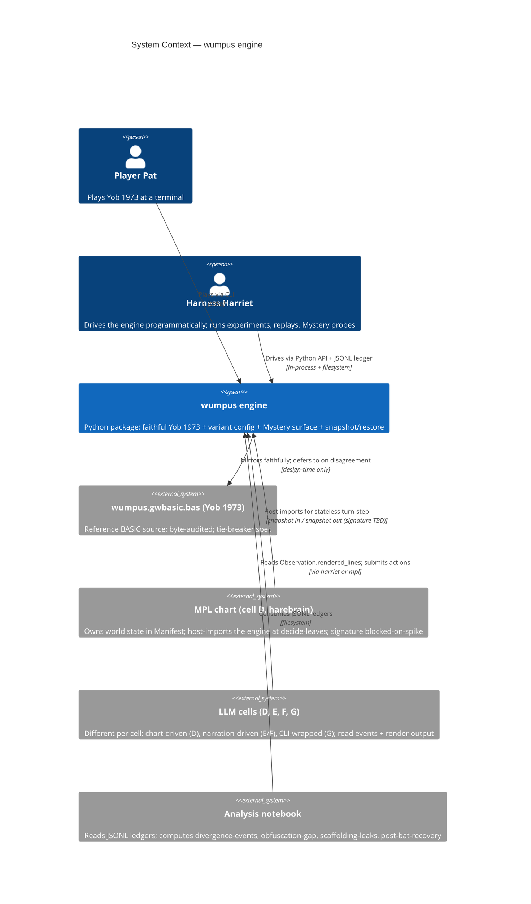
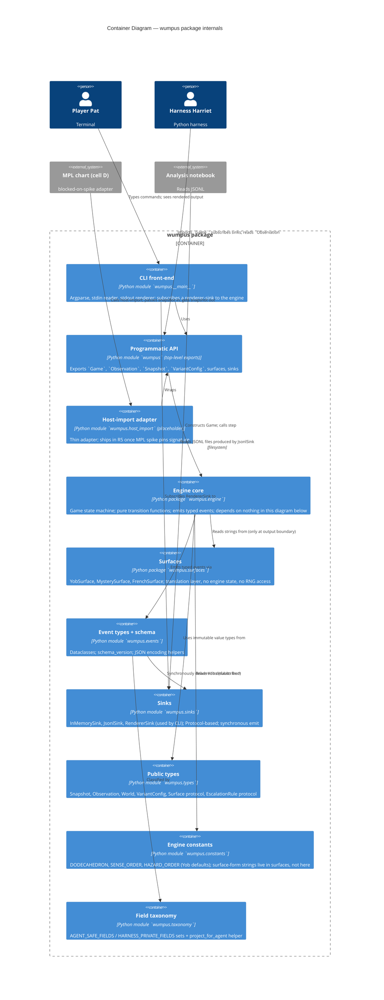
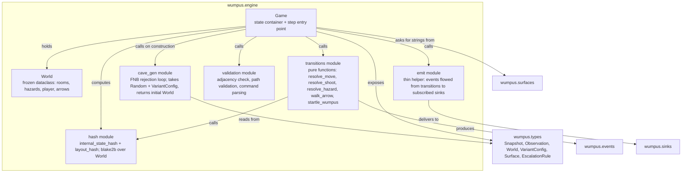

# Feature Delta — `wumpus`

<!-- markdownlint-disable MD024 -->

> Engine the harebrain experiment matrix runs on. Faithful Yob 1973 at the core, extensible at the seams, observable by construction. Three first-class surfaces (CLI, programmatic `Game.step()`, MPL host-import). Source of record: `wumpus/docs/wumpus_python_goals.md`.

---

## Wave: DISCUSS / [REF] Phase Tracker

Workflow status (live during DISCUSS execution). Mark each phase as it completes.

| # | Phase | Status | Output |
|---|---|---|---|
| 1 | JTBD Analysis (Decision 4 = Yes) | **done** | `[REF] JTBD`, `[REF] Personas` sections below |
| 1.5 | Scope Assessment (Elephant Carpaccio gate) | **done** — user confirmed PASS (one feature) | `[REF] Scope Assessment` |
| 2 | Journey Design (mental model → emotional arc → shared artifacts → error paths → Gherkin) | **done** | `[REF] Journeys`, `[REF] Shared Artifacts Registry` |
| 2.5 | Story Mapping + Slice Carpaccio (≤1 day slices, learning hypotheses, taste tests) | **done** | `[REF] Story Map` (inline; harebrain single-file convention) |
| 3 | Requirements & Stories (LeanUX + Elevator Pitch + AC + DoR + outcome KPIs) | **done** | `[REF] System Constraints`, `[REF] User Stories`, `[REF] Acceptance Criteria`, `[REF] Outcome KPIs`, `[REF] DoR Validation` |
| 4 | Optional per-wave review (only on trigger) | **skipped** (not triggered; user directed proceed straight to handoff) | invoked via `/nw-review nw-product-owner-reviewer` |
| 5 | Handoff (DESIGN + DEVOPS-KPI) + SSOT back-propagation | **done** (vision.md changes deferred per user direction; jobs.yaml + journey-pointer updates applied) | `[REF] Wave Decisions`, `[REF] Changed Assumptions`, `[REF] Handoff Package`, `docs/product/` updates |

---

## Wave: DISCUSS / [REF] Inputs Consulted

Read before Phase 1 begins (prior-wave consultation gate):

- ✓ `wumpus/docs/wumpus_python_goals.md` — five-goal substrate; this wave's primary spec
- ✓ `wumpus/docs/wumpus_idea.md` — parent note; experiment-matrix consumer context (cells A–G, LLM-Modulo probes)
- ✓ `docs/product/vision.md` — wumpus-scoped; contains contradicted OUT-OF-SCOPE list (back-propagation required)
- ✓ `docs/product/jobs.yaml` — 3 existing jobs (Player Pat + Harness Harriet), inline personas
- ✓ `docs/product/journeys/play-classic-wumpus.yaml` — `$ref` pointer to archived feature path (broken; replaced this wave)
- ⊘ `docs/feature/wumpus/diverge/` — does not exist (no DIVERGE wave); validation flag for stories = `synthesized-from-goals-doc`
- ✓ `docs/feature/.archive/wumpus-classic-2026-05-20/discuss/*` — 7 archived stories; wording/AC mined for Yob-fidelity slice
- ✓ `docs/project-brief.md` / `docs/stakeholders.yaml` — not present in repo; skipped

**Contradictions to back-propagate at handoff (see `[REF] Changed Assumptions`):**
1. `vision.md` § Out of scope lists "WUMP2 cave variants", "escalation-ladder rules L2-L4", "MPL integration" — all three are IN-SCOPE per the new goals doc.
2. `vision.md` names the package `python/packages/wumpus_classic/` — the new goals doc names `python/packages/wumpus/`.
3. `journeys/play-classic-wumpus.yaml` is a `$ref` to an archived path — must be rewritten or split.

---

## Wave: DISCUSS / [REF] JTBD

Phase 1 output. Every user story in Phase 3 traces to a `job_id` here.

### Job inventory

Five jobs, three personas. Three jobs carry forward from `docs/product/jobs.yaml` with refined statements; two jobs are NEW for this wave (surface seam + host-import driving).

| job_id | Title | Primary persona | Validation |
|---|---|---|---|
| `play-classic-wumpus` | Play the 1973 Hunt the Wumpus game faithfully | player-pat | synthesized-from-goals-doc (refined from existing) |
| `instrument-wumpus-play` | Capture every game event from a live or programmatic session | harness-harriet | synthesized-from-goals-doc (refined) |
| `replay-wumpus-deterministically` | Reproduce a specific game from a recorded seed | harness-harriet | synthesized-from-goals-doc (refined) |
| `probe-llm-obfuscation-gap` | Run the same game under a relabeled surface to measure LLM pattern-completion vs reasoning | harness-harriet, llm-cell-consumer | NEW, synthesized-from-goals-doc |
| `drive-engine-from-host-import` | Drive a wumpus turn from a chart's decide-leaf via a host-import contract | mpl-cell-consumer | NEW, synthesized-from-goals-doc, **blocked-on-mpl-spike** for signature |

### Job stories

#### `play-classic-wumpus`

> When a person who knows or wants to learn Yob's 1973 Hunt the Wumpus opens a terminal,
> they want to play the game with byte-recognizable fidelity to the BASIC original
> (typos, message swap, startle rule, crooked-arrow-passes-through-player and all),
> so they can experience the game that lives in the historical record without an emulator detour.

**Dimensions:**

- *Functional* — get to a terminal prompt, type `S` or `M`, navigate a 20-room dodecahedron, kill the wumpus or die trying, observe the right strings at the right times.
- *Emotional* — feel disoriented in the way Yob's design intends. Bat-teleport erases your map; the 25% startle stay-put rule means "I shot, I missed" tells you nothing. The good outcome is the **experience** of disorientation, not its absence (per existing `player-pat.anti-confidence` note).
- *Social* — be able to say "I played the actual 1973 game" to other software-history people. The byte fidelity is what earns the claim.

**Four forces:**

- *Push* — Running PC-BASIC requires an isolated Python 3.12 tool environment and tolerating GW-BASIC dialect patches. Reading the BASIC source for atmosphere doesn't substitute for playing.
- *Pull* — A `pip install`-able (or `uv run`-able) Python game runnable anywhere Python runs, that **feels** like the original. ALL CAPS, double-space after `ROOM`, the works.
- *Anxiety* — A "modern reimplementation" that softens the original's quirks (the win/lose message swap, the startle rule, the `RAMDOM` typo) is not the game. If the package "fixes" Yob's bugs, it isn't faithful.
- *Habit* — Players reach for PC-BASIC or the kingsawyer mirror. To displace those, this needs to be at least as one-step as `pc-basic wumpus.gwbasic.bas`.

#### `instrument-wumpus-play`

> When a researcher runs an LLM agent or a human against Hunt the Wumpus and needs to diff
> what the agent claimed against what actually happened, they want a structured, append-only,
> schema-validated event stream from every game session, so they can compute divergence-event
> metrics post-hoc without re-running the game.

**Dimensions:**

- *Functional* — get a JSONL file per game with one event per turn including pre-state, senses-fired, raw stdin, effects, post-state, surface_variant, seed, RNG cursor, and timestamps.
- *Emotional* — confidence that the ledger is **the** truth. Notebooks read JSONL, not the live engine. If the ledger and the engine ever disagree, the ledger is what gets cited.
- *Social* — be able to point a collaborator at a JSONL file and have them reconstruct what happened without your in-memory context.

**Four forces:**

- *Push* — Without instrumentation, divergence metrics require re-running the game alongside the agent. That doubles compute and risks RNG drift between the run and the oracle.
- *Pull* — One JSONL stream, schema-validated on write, with every field the parent note's metric table (`wumpus_idea.md:104-122`) needs (divergence events, scaffolding leaks, obfuscation gap, back-prompt convergence, scratchpad accuracy, verification accuracy, post-bat recovery, arrow-shoot accuracy, tokens-per-turn).
- *Anxiety* — Instrumentation that mutates game behavior (observer effect) invalidates every measurement built on it. A background-thread logger that buffers across turn boundaries can lose the in-progress event on crash. Both are disqualifying.
- *Habit* — Researchers reach for print-statement archaeology or stdout regex parsing. The typed schema must be **easier** than either or it loses.

#### `replay-wumpus-deterministically`

> When a researcher finds an interesting divergence or scenario in a recorded transcript,
> they want to replay the exact game from a seed value, so they can investigate without
> searching for a needle in a stochastic haystack.

**Dimensions:**

- *Functional* — `Game(seed=k)` plus the input transcript reconstructs the game byte-for-byte. `replay(ledger_path)` reconstructs the world at any turn. Snapshot/restore captures full state and resumes later.
- *Emotional* — trust that "seed=42" means something stable across machines, across days, across CI runs. The whole oracle pattern collapses if seeded replay drifts.
- *Social* — be able to file a bug report as "seed=42, turn 17" and have anyone else reproduce it.

**Four forces:**

- *Push* — Non-seeded runs can't be replayed; bug reports become unreproducible folklore. Yob didn't seed; that's a documented controlled deviation.
- *Pull* — Seed value in the transcript header is sufficient. `Game(seed=42)` works like `random.Random(42)` — the obvious mental model.
- *Anxiety* — A seeded mode that differs from unseeded mode (e.g., picks layouts from a different distribution) silently invalidates cross-comparisons. Equally bad: a seed that's "stable" in one Python version and not the next.
- *Habit* — Researchers expect NumPy / `random.Random(42)` semantics. Anything else (string seeds, opaque tokens) loses.

#### `probe-llm-obfuscation-gap`

> When a researcher wants to measure how much an LLM's Hunt the Wumpus performance came from
> pattern-completing the 1973 game (on the public internet since '73) versus actually reasoning
> from observations, they want to run the same engine, same seed, same rules, but with every
> player-facing string relabeled to unfamiliar tokens, so the obfuscation gap (classic-minus-mystery
> win rate) is a clean measurement.

**Dimensions:**

- *Functional* — flip a `--surface mystery` flag (or pass a surface object to `Game`) and the same seed produces the same internal layout, the same RNG draws, the same rule outcomes — but every byte the LLM reads changes (room labels, sense strings, command verbs, hazard names in the instructions).
- *Emotional* — confidence that the seam is **structural**, not cosmetic. If a Mystery run accidentally takes one extra RNG draw, the obfuscation gap measurement is contaminated.
- *Social* — be able to say "this is the Mystery Blocksworld experiment applied to Wumpus" and have other LLM-Modulo readers immediately know what's being claimed (per `docs/research/agents/llm-modulo-benchmarks-as-supplements-deep-dive.md`).

**Four forces:**

- *Push* — Without a surface seam, you'd fork the engine for Mystery; now you maintain two copies that drift, and any measured gap is confounded by the fork.
- *Pull* — One config switch, identical internals, only the bytes the LLM reads change. Localization (French Wumpus) drops into the same hook for free.
- *Anxiety* — A surface seam that leaks (the engine references a room number by its surface form somewhere, or the surface object accidentally consumes an RNG draw) destroys the measurement. The seam must be provably structural.
- *Habit* — Researchers reach for "rename a few constants" — but constants embedded in `print()` calls are not a seam, they're a copy-paste fork waiting to happen.

#### `drive-engine-from-host-import`

> When the harebrain agent (cell D) plays Wumpus, the MPL chart owns the world state and the
> LLM consults at the decide-leaf via a host import. The host import sees an opaque snapshot,
> wants to step the game by one turn from that snapshot, and wants a new snapshot back —
> with no assumption that a long-lived Python process owns the world, so the chart can
> resurrect a Game on demand from a serialized state.

**Dimensions:**

- *Functional* — `Game.snapshot()` returns a serializable object; `Game.from_snapshot(snap).step(action)` returns a new snapshot + observation; the engine has no module-level mutable state that would prevent this round-trip.
- *Emotional* — confidence that the engine "fits" the MPL host-import contract without contortions, even before the exact contract is pinned by the MPL spike.
- *Social* — be able to say "MPL chart for Hunt the Wumpus calls the engine" without an asterisk explaining a process-lifetime workaround.

**Four forces:**

- *Push* — A `Game` that assumes a long-running Python process owning the world doesn't fit a chart that may serialize state across ticks. Globals, singletons, module-cached RNGs all break this.
- *Pull* — A `Game.snapshot()` / `Game.from_snapshot()` round-trip that preserves byte-identical determinism (snapshot, step, snapshot, restore, step, get same observation as if no round-trip).
- *Anxiety* — The MPL spike (`wumpus_idea.md:147`) hasn't been done yet. The exact function signature of the host-import surface is unknown today. Building too much around an imagined signature creates rework.
- *Habit* — Python game engines default to "long-lived process, mutable Game object, no serialization story." This is the failure mode to avoid.

### Opportunity scores (importance × satisfaction gap)

Five jobs is enough to score. Scale: importance and satisfaction both 1–10; opportunity = importance + max(0, importance − satisfaction). (Ulwick formula.)

| Job | Importance | Current satisfaction | Opportunity score | Ranking notes |
|---|---:|---:|---:|---|
| `play-classic-wumpus` | 10 | 3 (PC-BASIC exists but is painful, faithful Python reimpls are scarce) | 17 | The baseline; nothing else works without this |
| `instrument-wumpus-play` | 10 | 1 (no instrumented Wumpus exists; stdout-regex is the alternative) | 19 | **Highest** — gates every metric downstream |
| `replay-wumpus-deterministically` | 9 | 1 (Yob's source is unseeded; no replay anywhere) | 17 | Tied with #1; required for cross-cell comparison |
| `probe-llm-obfuscation-gap` | 8 | 0 (no Mystery Wumpus implementation exists) | 16 | Single-config probe; high research leverage |
| `drive-engine-from-host-import` | 7 (essential for cell D, irrelevant elsewhere) | 0 (MPL spike not yet done) | 14 | **Blocked-on-spike for signature**, but constraints knowable now |

### Job-to-story bridge

Phase 3 stories will trace to jobs per this map. Story IDs are placeholders; final IDs assigned in Phase 3.

| Job | Stories that will serve it (provisional) |
|---|---|
| `play-classic-wumpus` | US-01 engine-boot-with-seeded-cave, US-02 Yob-faithful-CLI-loop, US-03 hazards-and-senses, US-04 shooting-end-to-end, US-06 bug-for-bug-fidelity-pin |
| `instrument-wumpus-play` | US-07 versioned-JSONL-ledger-schema |
| `replay-wumpus-deterministically` | US-05 seeded-replay-byte-identical, US-08 programmatic-API-with-snapshot-restore |
| `probe-llm-obfuscation-gap` | US-09 surface-seam-for-mystery-variant |
| `drive-engine-from-host-import` | US-08 (shared — snapshot/restore round-trip), US-10 host-import-determinism-contract |
| (cross-cutting variant config) | US-11 variant-config-with-yob-defaults |

That's ~10–11 stories provisional. Phase 1.5 will assess whether this is right-sized as one feature.

---

## Wave: DISCUSS / [REF] Personas

Goals-doc + parent note implicate three personas. Two already exist inline in `jobs.yaml`; one is new. Per the output contract, each gets its own file under `docs/product/personas/` (created at handoff). Summaries below; the persona files are the SSOT.

### `player-pat` (existing, refined)

- **Role**: a person at a terminal who wants to play Yob's 1973 Hunt the Wumpus.
- **Sub-shapes**: (a) someone who already knows the game and recognizes the quirks ("HA HA HA - YOU LOSE!" on death is the tell); (b) someone learning the game for the first time who needs the on-disk INSTRUCTIONS prompt to do its job.
- **Surface**: CLI (line-buffered, all-caps prompts, no curses, no scrollback hijack).
- **Success feel**: "This is the 1973 game."
- **Emotional arc**: curious/off-balance → tension (smell + draft + bats-nearby triangulation) → catharsis (win or lose, the message text confirms it).
- **Anti-confidence note (preserved)**: Yob's game does not build player confidence as it progresses. Bat teleports erase mental maps; the wumpus's 25% stay-put startle rule means "I shot, I missed" doesn't tell the player where the wumpus is. Designing for player confidence would be designing against the game.

### `harness-harriet` (existing, refined)

- **Role**: a researcher or LLM agent driving the game programmatically. Runs thousands of games unattended, diffs transcripts across replays, tees event streams into JSONL ledgers.
- **Surface**: Python API (`Game(seed=k).step(command) -> Observation`) **and** the JSONL ledger. Both must serve.
- **Success feel**: "Deterministic, instrumented, oracular."
- **Emotional arc**: skepticism ("does this really agree with PC-BASIC?") → trust (seeded replays come back byte-identical; event stream covers every rule from the Yob audit) → conviction (the engine is now the ground-truth oracle; LLM divergences are measurable against it).
- **Concrete sub-roles** (same persona, different harness): scripted-baseline driver (cell A); random-legal driver (cell B); heuristic driver (cell C); LangChain/LangGraph trusted-narrator harness operator (cells E/F); wild-baseline observer wrapping the CLI with pexpect/wexpect (cell G).

### `mpl-cell-consumer` (NEW)

- **Role**: the MPL chart that owns Hunt the Wumpus world state for cell D (harebrain). The "user" is the chart author; the consumer of the engine API is the chart's host-import call. Wires a snapshot through the engine, gets a new snapshot back, has no Python process to assume.
- **Surface**: programmatic API restricted to serializable inputs/outputs (no Game object held across ticks).
- **Success feel**: "The engine fits the host-import contract without asterisks."
- **Emotional arc**: caution (the MPL spike hasn't pinned the exact signature) → relief (the engine's snapshot/restore round-trip already satisfies the underlying constraints) → confidence (when the spike lands, the engine doesn't need a refactor — just a thin adapter).
- **Why this is a persona, not just a job**: this consumer has *different* needs from `harness-harriet`. Harriet wants a long-lived `Game` object and an observation stream. The MPL chart wants stateless turn-stepping from opaque snapshots. The engine has to serve both without contortions.

### Note on cells A–G as personas vs. jobs

The parent note's six-cell matrix (`wumpus_idea.md:82-103`) names seven distinct actors (A scripted, B random-legal, C heuristic, D harebrain, E LangGraph, F LangChain, G wild-baseline). For this wave: **cells A–C and E–G are all instances of `harness-harriet`** with different harness code on top. **Cell D is the `mpl-cell-consumer`**. **A human player at the terminal is `player-pat`**. Three personas, not seven, because the engine's interface to each is the same surface (CLI for Pat and G; programmatic API for A/B/C/E/F; host-import for D).

---

## Wave: DISCUSS / [REF] Scope Assessment

**Verdict: PASS — 10–11 stories, 1 bounded context, projected ~18–25 days, absorbed by Phase 2.5 carpaccio slicing into ≤1 day verticals.** A feature-split alternative exists and is documented below; user can veto PASS before Phase 2.

### Signals (honest read)

| Signal | Threshold | Observed | Triggered? |
|---|---|---|---|
| User stories | >10 | 10–11 provisional | borderline (at the line) |
| Bounded contexts | >3 | **1** (the engine package) | no |
| WS integration points | >5 | 5–6 (seeded RNG, room graph, senses, CLI render, JSONL writer, transcript-fixture compare) | borderline (at the line) |
| Estimated effort | >2 weeks | ~18–25 days | **yes** |
| Independent user outcomes that could ship separately | "multiple" | engine + CLI as one; host-import as a defensible second | **mildly** (case exists; substrate is shared) |

That's **1 hard + 2 borderline + 1 mild trigger**. By the strict 2-of-N heuristic this lands in "propose a split" territory.

### Why I'm recommending PASS anyway

Three reasons:

1. **One bounded context.** The engine — Game state, room graph, RNG, rule loop, snapshot/restore, event emission — is one unified model. The three surfaces (CLI, programmatic API, host-import) are **inbound ports** on the same hexagon, not separate bounded contexts. Splitting them into separate features means publishing/freezing the shared types (`Game`, `Observation`, `Snapshot`, `Event`, `Surface`, `VariantConfig`) before all three surfaces have shaped them — Conway-violating its own substrate.

2. **The goals doc is explicit on this point.** `wumpus_python_goals.md` § "Where this sits" and `vision.md` (current, even before this wave's edits) both say it directly: *"The engine must serve all three from one source of truth. That is why this is a single feature, not three."* That's not decorative — it's the design wager. Splitting it down the middle and shipping engine + CLI first would land an API that has to be revised when the host-import constraint (no module-level state, snapshot/restore round-trip) gets added.

3. **The effort signal is a Phase 2.5 problem, not a Phase 1.5 problem.** ≤1 day elephant-carpaccio slices absorb ~20 days across ~20 slices, each one shipped independently with its own learning hypothesis. Phase 1.5's job is to detect *features that need to be split into multiple features*; Phase 2.5's job is to slice *the work inside the feature* into thin verticals. The effort number says "this is a lot of slices," not "this is multiple features."

### The split alternative (recorded for user veto)

If the user prefers to split anyway, the **clean seam is the host-import boundary**, not the surface boundary. Specifically:

- **Feature A — `wumpus` (engine + CLI + programmatic API + JSONL ledger + variant config + Mystery surface seam).** ~8 stories. ~14–18 days. Walking skeleton = cell A scripted plays Yob from seed → ledger byte-identical to BASIC transcript.
- **Feature B — `wumpus-host-import` (snapshot/restore round-trip + signature pinned by MPL spike + host-import determinism contract).** ~2–3 stories. ~4–7 days. Walking skeleton = snapshot → step → snapshot byte-identical round-trip.

Why this seam and not "engine vs CLI vs host-import as three features":
- Feature B has the spike blocker (R2). Splitting it out keeps Feature A from being held up by an unrelated unknown.
- Feature A's surfaces (CLI + programmatic API) genuinely share their substrate; the JSONL ledger and the `Game.step()` shape want to be designed together with cell-A-through-G all visible.
- Feature B's "users" (the MPL chart, cell D) don't exist yet — the chart and the harebrain agent ship in separate features anyway. Pushing Feature B later doesn't strand a real downstream user.

The cost of splitting: two DESIGN/DEVOPS/DISTILL/DELIVER cycles instead of one; Feature A has to publish a programmatic API that **anticipates** the host-import constraints (no module-level state, etc.) without being able to test against the host-import contract until Feature B; risk that Feature B reveals API churn requirements that ripple back into Feature A's already-shipped surface.

### Recommendation

**PASS as one feature.** The carpaccio slicing in Phase 2.5 will produce ≤1 day verticals; the effort number lives there, not here. The shared substrate argument from the goals doc and vision.md is the decisive one.

**Stop here if the user disagrees.** If you'd rather split into `wumpus` (engine + CLI + API) and `wumpus-host-import` (snapshot/restore + spike-blocked host-import contract), say so before I open Phase 2 — the work for Feature B's DESIGN would otherwise happen too early relative to its spike blocker.

---

## Wave: DISCUSS / [REF] Journeys

Phase 2 output. Four journeys, one per structurally-distinct surface-persona pair (per `[REF] Personas`):

| # | Journey ID | Primary persona | Surface | Job(s) served | Validation |
|---|---|---|---|---|---|
| J1 | `play-classic-wumpus` | player-pat | CLI (Yob default surface) | `play-classic-wumpus` | mined-from-archive + goals-doc |
| J2 | `run-mystery-wumpus-probe` | harness-harriet (orchestrator); LLM-cell-consumer (the player) | Programmatic API + CLI subprocess; mystery surface variant | `probe-llm-obfuscation-gap`, `play-classic-wumpus` (under mystery surface) | synthesized-from-goals-doc |
| J3 | `instrument-wumpus-session` | harness-harriet | Programmatic API + JSONL ledger | `instrument-wumpus-play`, `replay-wumpus-deterministically` | synthesized-from-goals-doc + mined-from-archive |
| J4 | `drive-wumpus-from-host-import` | mpl-cell-consumer | MPL host-import (snapshot-step-snapshot) | `drive-engine-from-host-import` | synthesized-from-goals-doc, **blocked-on-mpl-spike for signature** |

Conventions for each journey below:
- **Mental model** is how the consumer thinks they are using the engine — the words they would use, the contract they are imagining. The engine must not surprise them.
- **Emotional arc** is start → middle → end. Where a journey has two consumers in the same session (J2, J3), each arc is split.
- **Shared artifacts** lists the cross-journey artifacts consumed. Full ownership map lives in `[REF] Shared Artifacts Registry`.
- **Steps** are the minimum needed for the slice; the archived `journey-play-classic-wumpus.yaml` carries the byte-level Yob mockups and is the mining source. Re-inlining 1973-typo-level detail here would duplicate the archive without adding signal.
- **Error paths** are the failure modes the engine must handle correctly; full Yob branch detail lives in DISTILL.
- **Gherkin** captures the acceptance-test-shaped scenarios *unique* to the journey. Pan-engine fidelity scenarios (every Yob string, every adjacency) belong in DISTILL, not here.

---

### J1 — `play-classic-wumpus`

**Persona:** `player-pat` (sub-shapes a + b — knows-the-game and learning-the-game).
**Job:** `play-classic-wumpus`.
**Surface:** CLI — `python -m wumpus` or `wumpus` entry-point.
**Yob-fidelity claim:** byte-recognizable parity with `wumpus/experiments/g_wild_baseline/wumpus.gwbasic.bas`.

**Mental model.** Pat thinks: "this is the 1973 game; I type `S` or `M`, it talks back in ALL CAPS, when I lose it tells me HA HA HA — and when I win it tells me HEE HEE HEE, because Yob swapped them." Pat does **not** think about surface objects, variant configs, RNG seeds, JSONL ledgers, or snapshots. Those are present in the engine but never surface to Pat unless Pat passed a CLI flag.

**Emotional arc.**

| Phase | Pat's state | Trigger | Engine signal |
|---|---|---|---|
| Start | Curious / off-balance | sees `INSTRUCTIONS (Y-N)?` and the `HUNT THE WUMPUS` banner | exact Yob strings, including double-spaces |
| Orient | Ready to think | `YOU ARE IN ROOM <n>` + `TUNNELS LEAD TO  a  b  c` | sense lines fire if and only if a hazard is adjacent |
| Tension | Weighing options | `SHOOT OR MOVE (S-M)?` after sense triangulation | re-prompt on bad input without advancing turn |
| Commit | Committed (move or shoot) | typed `M` + room, or `S` + path | engine accepts, validates, advances world |
| Hazard or hit | Bracing or elated | `...OOPS! BUMPED A WUMPUS!`, `YYYIIIIEEEE . . . FELL IN PIT`, `ZAP--SUPER BAT SNATCH!`, `AHA! YOU GOT THE WUMPUS!`, `OUCH! ARROW GOT YOU!` | hazard order is wumpus → pit → bat; arrows decrement only on miss or self-shot |
| Terminal | Catharsis (the swap confirms) | `HA HA HA - YOU LOSE!` *or* `HEE HEE HEE - THE WUMPUS'LL GETCHA NEXT TIME!!` | swap preserved — this is the recognition signal |
| Replay | Re-entered, same disorientation | `SAME SET-UP (Y-N)?` Y → identical layout, fresh entropy | `Game._initial_layout` restored verbatim |

**Anti-confidence note (preserved from `[REF] Personas`):** the arc does NOT build confidence as it progresses. Bat teleports erase Pat's mental map; the 25% wumpus-stay-put startle rule means "I shot, I missed" tells Pat nothing about where the wumpus is now. Designing FOR confidence is designing against the game. The arc above is the *target* arc — the one Yob designed for. The engine's job is to deliver that arc faithfully, not to soften it.

**Steps (compressed; mockups in archived `journey-play-classic-wumpus.yaml` are mine-able verbatim):**

1. **Boot.** `wumpus` (or `wumpus --seed 42`); engine prompts `INSTRUCTIONS (Y-N)?`; on `Y` prints the verbatim instruction block including the `RAMDOM` typo (`goals.md` line 50); then banner `HUNT THE WUMPUS`.
2. **Orient.** On entry to a room, engine emits sense events in L-array order (wumpus, pit, pit, bat, bat — `[REF] Shared Artifacts Registry` → `sense_order`), then prints `YOU ARE IN ROOM  <n>` and `TUNNELS LEAD TO  <a>  <b>  <c>`.
3. **Choose action.** `SHOOT OR MOVE (S-M)?` — `S` or `M` only; anything else re-prompts.
4. **Resolve move.** `WHERE TO?` → adjacency-validated. Hazard resolution order wumpus → pit → bat (`HAZARD_ORDER` in registry). Bat teleport recurses into a fresh entry, sense lines fire again.
5. **Resolve shoot.** `NO. OF ROOMS(1-5)?` then `ROOM #?` per segment; crooked-path rejection re-prompts that slot only; arrow walks through dodecahedron taking random tunnel on missing connection; final-room match with player kills (preserves Yob's "crooked-arrow passing through player does not kill" — `goals.md` line 74).
6. **Terminal.** Yob's swapped messages (HA HA HA on lose, HEE HEE HEE on win). `SAME SET-UP (Y-N)?` Y restores the saved initial layout.

**Shared artifacts consumed:** `DODECAHEDRON`, `SENSE_ORDER`, `HAZARD_ORDER`, `PROMPTS`, `MESSAGES`, `arrow_count`, `wumpus_startle` (FNC distribution), `Surface` (defaulted to Yob), `VariantConfig` (defaulted to Yob).

**Error paths.**

- **Off-graph move** → `NOT POSSIBLE -` + re-prompt; turn counter does not advance.
- **Move to current room** → Yob permits (`bas` line 4090). Engine permits.
- **Invalid action input** (not `S`/`M`) → re-prompt; no `ActionChosen` event emitted.
- **Path length out of range** (`0` or `6+`) → re-prompt `NO. OF ROOMS(1-5)?`.
- **Crooked path** (`P(K) == P(K-2)`, K>2) → `ARROWS AREN'T THAT CROOKED - TRY ANOTHER ROOM` + re-prompt for that slot only; earlier slots preserved.
- **Arrow tunnel missing** → arrow takes `S(L, FNB(1))` random adjacent; remaining path is discarded; emits `ArrowPathStep(deflected=True)`.
- **Bat teleport into pit** → game ends (Yob's recursion through line 4130).
- **Wumpus startled onto player** (bumped *or* shot-miss) → `TSK TSK TSK- WUMPUS GOT YOU!` then `HA HA HA - YOU LOSE!`.
- **Out of arrows** → `HA HA HA - YOU LOSE!` (`GameEnded(outcome=out_of_arrows)`).
- **EOF on stdin** (e.g., pexpect/wexpect harness disconnects) → `SessionAborted` event, clean exit (does not hang).

**Gherkin (J1-specific; pan-engine fidelity scenarios live in DISTILL, mined from archived `journey-play-classic-wumpus.yaml`):**

```gherkin
Scenario: Pat sees Yob's swapped win message
  Given Pat is in room 8 with 5 arrows
  And the wumpus is in room 14 and rooms 8-7, 7-14 are connected
  When Pat shoots a 2-room path through rooms 7 then 14
  Then Pat sees "AHA! YOU GOT THE WUMPUS!"
  And Pat sees "HEE HEE HEE - THE WUMPUS'LL GETCHA NEXT TIME!!"
  # Yob swap: win prints HEE HEE HEE, not HA HA HA. The swap is the recognition signal.

Scenario: Pat sees Yob's typo preserved in instructions
  Given Pat answers "Y" to "INSTRUCTIONS (Y-N)?"
  Then the printed instruction block contains the exact string "RAMDOM"
  # Yob's typo (goals.md line 50); preservation is a fidelity claim, not a bug.

Scenario: Crooked arrow passing through Pat's room does not kill Pat mid-path
  Given Pat is in room 8 and shoots a 3-room path
  And the path walks rooms 7, then 8 (passing through Pat's room mid-path), then 9
  When the arrow walks the path
  Then Pat does not see "OUCH! ARROW GOT YOU!" when the arrow is in slot 2 (room 8)
  And the arrow continues to slot 3
  # goals.md line 74: arrow-self-shot detection fires only on FINAL room. Bug-for-bug fidelity.

Scenario: Bat teleport recurses into a chained hazard
  Given Pat moves into a bat room
  And the engine's next bat-teleport target is a pit room
  Then Pat sees "ZAP--SUPER BAT SNATCH! ELSEWHEREVILLE FOR YOU!"
  And Pat sees "YYYIIIIEEEE . . . FELL IN PIT"
  And Pat sees "HA HA HA - YOU LOSE!"

Scenario: SAME SET-UP=Y restores the initial layout exactly
  Given Pat just finished a game with wumpus in room 14, pits in rooms 4 and 17, bats in rooms 5 and 9, start room 8
  When Pat answers "Y" to "SAME SET-UP (Y-N)?"
  Then the new game has the same wumpus, pit, bat, and start placements
  And the engine emits GameStarted with the same layout_hash

Scenario: Subprocess wrapper (pexpect/wexpect) does not hang on prompt
  Given a pexpect/wexpect harness wraps `wumpus`
  When the harness reads up to "INSTRUCTIONS (Y-N)?"
  Then the prompt is observable WITHOUT requiring a trailing newline
  And the harness can write a response without deadlock
  # goals.md § 5.1: line-buffered stdout, no curses, no SDL, no readline.
```

---

### J2 — `run-mystery-wumpus-probe`

**Persona:** `harness-harriet` (orchestrator) **+** any LLM cell (D/E/F/G — the "player") **+** later, `player-pat` running a Mystery variant for calibration.
**Job:** `probe-llm-obfuscation-gap` (primary); incidentally also `play-classic-wumpus` under a non-default surface.
**Surface:** Mystery surface variant — same engine, same seed, same rules; **only** the bytes the LLM reads change.
**Structural claim being measured:** an LLM that reasons should be ~invariant under relabeling; one that pattern-completes from a 50-year-old training corpus is not.

**Mental model.** Harriet thinks: "I'll run the same seeded game twice — once with the Yob surface, once with the Mystery surface — and the **internal** trajectory must be byte-identical at the engine layer. The only diff is the strings the LLM read. If any non-surface byte differs between the two ledgers, the seam is leaking and the measurement is contaminated." The LLM player thinks (we hope): "I am in cadence Φ; I detect resonance ζ; I hear harmonics III; what should I do?" — and produces a move whose semantics are obvious to the engine via verb-token translation.

**Emotional arc (orchestrator, harness-harriet):**

| Phase | Harriet's state | Trigger |
|---|---|---|
| Start | Cautious — "this only works if the seam is structural" | constructs `Game(seed=k, surface=MysterySurface(), variant=YobVariant())` |
| Mid | Trust building — internal trajectory matches classic | `Game(seed=k).step(a).snapshot() == Game(seed=k, surface=Mystery()).step(a').snapshot()` where `a' = mystery.translate(a)` |
| End | Conviction — the obfuscation gap is a clean `GROUP BY surface_variant` | every event in the ledger carries `surface_variant`; analysis aggregates classic-minus-mystery win rate |

**Mental model (LLM player, secondary).** The LLM sees Mystery tokens, has no canonical-form retrieval to lean on, and must reason from observations. The engine offers no help — that's the experimental point.

**Steps:**

1. **Construct paired games.** `g_classic = Game(seed=k, surface=YobSurface())`; `g_mystery = Game(seed=k, surface=MysterySurface())`. Layout determined by `seed`, NOT by surface. Engine MUST consume zero RNG draws during surface translation (per `goals.md` § Goal 3 — "the surface object accidentally consumes an RNG draw" would contaminate the measurement).
2. **Drive a turn.** Harness reads classic prompt + LLM-A's response, drives `g_classic.step(action)`; reads mystery prompt + LLM-B's (or same-LLM-different-context) response, drives `g_mystery.step(mystery.translate_back(action))`. Engine's *internal* effect must be identical given identical `(seed, action)` pairs.
3. **Verify seam.** Engine emits an event per turn with `surface_variant: yob | mystery` and `internal_state_hash: <hash>`. Across the two ledgers, `internal_state_hash` MUST agree at every turn that received translation-equivalent actions.
4. **Aggregate.** Post-hoc notebook joins classic + mystery ledgers on `(seed, turn)`, computes win-rate-classic minus win-rate-mystery per LLM cell, per N-seeds.

**Shared artifacts consumed:** `Surface` (the seam — `YobSurface`, `MysterySurface`, future `FrenchSurface`); `seed`; `Event/Ledger record` (with `surface_variant` field); `VariantConfig` (the *non-surface* dimensions — wumpus count, room count, arrow count — frozen at Yob across both runs); `internal_state_hash` (engine emits per turn for seam verification).

**Error paths.**

- **Surface object holds engine state** → contamination; surface must be a pure translation layer with no mutable state of its own. Rejected at construction.
- **Surface consumes an RNG draw** (e.g., randomizing the symbol map per-game without seeding) → contamination. Mystery surface's symbol map must be either fixed or seeded by a *separate, declared* seed logged in the ledger header.
- **Engine references a room number by its surface form anywhere** (e.g., `print(surface.room(n))` inside the engine's move-validation path) → seam leak. The engine operates on internal IDs only; surface translates at the boundary.
- **`internal_state_hash` mismatch across paired runs** at the same turn → seam is leaking; the measurement is invalid; the experiment is paused.
- **Mystery surface assigns ambiguous verb tokens** (e.g., two distinct commands map to indistinguishable strings post-translation) → ill-defined player input. Surface validation rejects.
- **Localization third-variant test** (`FrenchSurface`) — a stretch goal of the seam — passes the same hash check as a smoke test that the seam is general, not just Mystery-shaped.

**Gherkin:**

```gherkin
Scenario: Paired classic and mystery runs produce identical internal trajectories
  Given Harriet constructs g_classic = Game(seed=42, surface=YobSurface())
  And Harriet constructs g_mystery = Game(seed=42, surface=MysterySurface())
  When Harriet steps both games with translation-equivalent actions for 20 turns
  Then for every turn t, g_classic.events[t].internal_state_hash == g_mystery.events[t].internal_state_hash

Scenario: Mystery surface does not consume engine RNG
  Given Harriet runs Game(seed=42, surface=YobSurface()) for 50 turns
  And Harriet runs Game(seed=42, surface=MysterySurface()) for 50 turns with identical translation-equivalent inputs
  Then the engine's internal RNG cursor (logged per turn) is identical between the two runs
  # goals.md § Goal 3: "if a Mystery run accidentally takes one extra RNG draw, the obfuscation gap measurement is contaminated."

Scenario: Every ledger event records the active surface variant
  Given Harriet runs Game(seed=42, surface=MysterySurface())
  When the ledger is read
  Then every event carries surface_variant = "mystery"
  And no event references a Yob string ("I SMELL A WUMPUS!", "HA HA HA - YOU LOSE!", etc.) under mystery surface

Scenario: Engine code paths reference no surface-form strings
  Given a static code audit of the engine package
  Then no print statement, no comparison, no error message inside the engine references a surface-layer string literal
  # goals.md § Goal 3 structural claim: surface is the only boundary; engine operates on internal IDs and enum tags.

Scenario: A second non-Mystery surface (FrenchSurface) drops in without engine changes
  Given Harriet implements FrenchSurface as a pure translation layer
  When Harriet runs Game(seed=42, surface=FrenchSurface())
  Then the engine's internal_state_hash sequence equals Game(seed=42, surface=YobSurface()) at every turn
  And the ledger emits surface_variant = "french"
  # The seam is general; Mystery is one instance.
```

---

### J3 — `instrument-wumpus-session`

**Persona:** `harness-harriet` (cells A, B, C, E, F, G in primary; D via host-import is J4's territory).
**Job:** `instrument-wumpus-play` (primary), `replay-wumpus-deterministically` (secondary — every instrumented session is also a replay seed).
**Surface:** programmatic Python API + JSONL ledger sink. Can also tee from CLI runs (`--ledger PATH`).
**The ledger is the source of truth for analysis** (`goals.md` § Goal 4) — notebooks read JSONL, not the live engine.

**Mental model.** Harriet thinks: "I subscribe a sink, I drive `Game.step(action)`, I get back an `Observation`. Every byte of behavior I care about for the parent note's metric table (`wumpus_idea.md:104-122`) shows up in the ledger as a typed event. If I close the sink and re-instantiate `Game(seed=k)` and re-feed the same actions, I get a byte-identical ledger." Harriet does NOT think about background threads, async event buses, or "logging strategy" — the ledger writes synchronously, ordered, on every event.

**Emotional arc:**

| Phase | Harriet's state | Trigger |
|---|---|---|
| Start | Skeptical — "does this really agree with PC-BASIC?" | first run against a captured BASIC transcript fixture |
| Mid | Trust — seeded replays come back byte-identical | `assert events1 == events2` passes across N seeds and command sequences |
| End | Conviction — the engine is the oracle | LLM divergence-event metrics can be computed post-hoc by joining ledger against the agent's narration |

**Steps:**

1. **Construct + subscribe.** `game = Game(seed=42)`; `sink = JsonlSink(path='session.jsonl')`; `game.events.subscribe(sink)`. Or `Game(seed=42, ledger='session.jsonl')` as sugar. The sink owns the file; the engine knows nothing about disks.
2. **Drive turns.** `obs = game.step(action)` returns an `Observation` (parsed fields + the strings Pat would see). On every effect, the engine emits a typed event to all attached sinks, synchronously, ordered, before `step()` returns.
3. **Observe.** Harriet can inspect `obs`, `game.world_state()` (ground truth — distinct from `Observation`), or read the ledger downstream. The engine never mutates state in `world_state()` (read-only inspection).
4. **Replay.** `Game(seed=42).replay(actions)` produces a byte-identical event sequence; `replay(ledger_path)` reconstructs the world at any turn.
5. **Snapshot/restore.** `snap = game.snapshot()`; `game2 = Game.from_snapshot(snap)`; `game2.step(action)` produces the next observation from the captured state (J4 also depends on this round-trip; the test fixtures live here).
6. **Schema versioning.** Every event carries `schema_version`; new fields are additive; existing fields never change meaning. Notebook code from N versions ago still reads N+k ledgers.

**Shared artifacts consumed:** `Snapshot`, `Observation`, `Event/Ledger record` (the full schema — `[REF] Shared Artifacts Registry`), `seed`, `layout_hash`, `surface_variant` (recorded per event for J2 joins), `RNG cursor` (recorded per event for seeded-replay verification), `VariantConfig` (recorded in ledger header).

**Error paths.**

- **Observer effect** — running with a sink attached changes the event sequence vs. running without. Disqualifying. Tested via paired runs: with sink, without sink, must produce identical event sequence (sink is downstream of emission).
- **Schema drift** — code emits a field not declared in the schema, or vice versa. Synchronous schema validation on write catches this at the first event; engine refuses to start a session that would silently corrupt analysis.
- **Background-thread logging** — engine SHALL NOT emit events from a background thread. Buffer crashes mid-turn lose the in-progress event. Forbidden.
- **Verbosity-up from off** — `goals.md` § Goal 4: harness can turn logging *down* from "log everything," never *up* from "off." Anything not logged is not measurable.
- **`time.time()` / `os.urandom` in engine code** — `goals.md` § Goal 5 cross-cutting: seed is the only entropy. A code-search audit at handoff to DESIGN catches violations.
- **Sink subscription order changes event emission order** — sinks are downstream; emission order is engine-internal and seed-determined. Attaching multiple sinks does not reorder.
- **Ledger missing header** — `Game(seed=k)` without a logged `seed` makes the ledger unreplayable. Ledger header is the first emitted event (`GameStarted` with full `VariantConfig`, `Surface` identifier, `schema_version`).

**Gherkin:**

```gherkin
Scenario: Seeded replay produces byte-identical events
  Given Harriet runs Game(seed=42) with command sequence C
  And Harriet captures the event sequence E1
  When Harriet creates a fresh Game(seed=42) and replays C
  Then the new event sequence equals E1 byte-for-byte

Scenario: Sink attachment does not alter event emission
  Given Harriet runs Game(seed=42) with command sequence C and no sinks
  And Harriet captures the in-memory event sequence E_none
  When Harriet runs Game(seed=42) with command sequence C and a JsonlSink + an in-memory sink attached
  Then the event sequence emitted matches E_none exactly
  # goals.md § Goal 4: logging is complete by default; sinks are downstream of emission.

Scenario: Snapshot round-trip preserves determinism
  Given Harriet runs Game(seed=42) for 10 turns
  And Harriet takes snap = game.snapshot() and continues to turn 20
  And Harriet captures the event sequence E_continuous from turns 11..20
  When Harriet reconstructs Game.from_snapshot(snap) and replays the same actions for turns 11..20
  Then the new event sequence equals E_continuous byte-for-byte

Scenario: Engine refuses to start with a schema-drift sink
  Given a sink declares an event schema older than the engine's emitted schema
  When Harriet attaches the sink and calls Game(...)
  Then construction raises a SchemaVersionMismatch with a clear message
  # goals.md § Goal 4: schema drift surfaces immediately, not three notebooks later.

Scenario: No background-thread logging
  Given a static audit of the engine package
  Then the engine source contains no Thread/asyncio.create_task/concurrent.futures use that emits events
  # Synchronous, ordered logging is a Goal 4 constraint.

Scenario: Ledger header carries everything needed to replay
  Given Harriet runs Game(seed=42, variant=YobVariant(), surface=YobSurface())
  When Harriet reads the first line of the ledger
  Then it parses as GameStarted with schema_version, seed=42, layout_hash, variant_config, surface_variant="yob", wumpus_engine_version
  And nothing in the rest of the ledger depends on engine state not captured in the header
```

---

### J4 — `drive-wumpus-from-host-import`

**Persona:** `mpl-cell-consumer` (the chart for cell D, harebrain).
**Job:** `drive-engine-from-host-import`.
**Surface:** MPL host-import — a pure function that takes a serializable snapshot + action and returns a new serializable snapshot + observation. **Signature blocked-on-mpl-spike** (R2); underlying constraints are knowable + testable today.
**Note.** The MPL chart and the harebrain agent (the LLM in cell D's decide-leaf) ship in *separate, downstream features* — they are not built by this feature. This feature ships the engine half: the constraints the chart will need are tested here, and a thin adapter (when the spike pins the signature) lands either as a tail-end story of this feature or as the first story of the chart feature.

**Mental model.** The MPL chart thinks: "I own world state in my Manifest. At a decide-leaf, I call a host import; it gets an opaque snapshot, calls the engine, gets a new snapshot back, and writes the result back into my Manifest. There is no Python process I control. Each call may start a fresh interpreter; the engine must not assume otherwise."

**Emotional arc (chart author + cell D operator):**

| Phase | Consumer state | Trigger |
|---|---|---|
| Start | Cautious — "the MPL spike hasn't pinned the signature" | first attempt to round-trip a snapshot through the host-import contract (mocked signature) |
| Mid | Relief — snapshot/restore is already byte-identical and engine has no module-level state | `from_snapshot(snap).step(a).snapshot()` round-trips equal a single-process `step(a).snapshot()` |
| End | Confidence — when the spike lands, no engine refactor is needed; only a thin adapter | the spike-shaped signature is implemented as an adapter over the engine's existing `from_snapshot`/`step`/`snapshot` |

**Steps:**

1. **Capture a snapshot.** `snap_t = game.snapshot()` — a JSON-serializable dataclass. No tuples-as-keys, no `random.Random` objects in the payload, no closures. The dataclass schema is versioned alongside the event schema.
2. **Persist.** The MPL chart writes `snap_t` into the Manifest (out of scope for this feature, but the *shape* must permit it — pure data).
3. **Resurrect.** `game_resurrected = Game.from_snapshot(snap_t)` — the engine reconstructs a fully usable `Game` instance. No global initialization side effects. No singleton RNG. The reconstructed `Game` has its `Random` instance restored from the snapshot's RNG cursor.
4. **Step once.** `obs, snap_t1 = game_resurrected.step(action)` (or some shape pinned by the spike) — exactly one turn, returning the new snapshot AND the observation, with byte-identical events emitted to whatever sink the host import wires up (typically an in-memory list returned to the chart).
5. **Return snapshot.** The chart receives `snap_t1` and writes it back to the Manifest. The Python interpreter for that decide-leaf may now exit; the chart has everything it needs.
6. **Verify equivalence.** Property: for any seed `s`, action sequence `A`, and split point `k`, `single_process_run(s, A)` produces a final snapshot byte-identical to `snapshot_split_run(s, A, k)` where the split run takes a snapshot at turn `k`, resurrects from it, and continues.

**Shared artifacts consumed:** `Snapshot` (the serializable dataclass — must be designed for this journey, with serialization round-trip tests as the primary acceptance criterion); `Observation`; `Event` (in-memory sink returned per call); `seed`; `RNG cursor` (must be in the snapshot, not held in an unsnapshotable `random.Random` object alone); `VariantConfig`, `Surface` identifier (both in snapshot — a host-import call must not need to be told them out of band).

**Error paths.**

- **Module-level mutable state in the engine** — any `module.SOME_LIST.append(...)` or singleton-cached RNG bypasses the snapshot. Audited at handoff.
- **`Game()` constructor has side effects on import-time globals** — e.g., it registers a logger, mutates a module-level cache. Forbidden.
- **Snapshot dataclass is not JSON-serializable** — e.g., it contains a `random.Random` instance, a frozenset of frozensets keyed by tuples that don't round-trip through JSON, a Python set in the field type, an `Enum` without a string serialization. Snapshot must declare an explicit serialization contract.
- **RNG state lost across snapshot/restore** — `random.Random(seed)` after N draws is *not* the same state as a freshly seeded Random; the cursor must be captured. Property test: `snap → restore → step` produces the same event as continuing the original would have.
- **MPL spike pins a signature that the engine can't satisfy without refactor** — the *known unknown* of this journey. Mitigation: the spike's expected output is a function-signature shape — if it requires async, the engine's synchronous step path is wrapped by the adapter; if it requires a specific naming, the adapter renames; if it requires multiple return values in a specific order, the adapter destructures. The engine's job is to expose the underlying capability; the adapter shapes it.
- **Long-lived `Game` assumption** — anything that requires `Game` to be held across ticks (e.g., a long-lived database connection, a TCP socket, an open file handle in `Game`) breaks the round-trip. The engine has no such resources.

**Gherkin:**

```gherkin
Scenario: Snapshot round-trip preserves the next event byte-identically
  Given a fresh Game(seed=42) is stepped through actions A1..A10
  And the snapshot is taken at turn 10: snap_10 = game.snapshot()
  When a new Game.from_snapshot(snap_10).step(A11) is performed
  And a different Game(seed=42) is stepped through A1..A11 in one process
  Then the event emitted by the snapshot-resurrected step is byte-identical to the event at turn 11 of the single-process run

Scenario: Snapshot is JSON-serializable
  Given a Game has been stepped through 20 turns
  When the snapshot is JSON-encoded and JSON-decoded back into a snapshot
  And a new Game.from_snapshot(decoded_snap).step(A) is performed
  Then the resulting observation and the next snapshot's internal_state_hash equal those from the in-memory snapshot path

Scenario: Engine has no module-level mutable state
  Given a static audit of the wumpus engine source
  Then no module-level statement creates a mutable container that engine code subsequently writes to
  # goals.md § 5.3: "nothing in the engine assumes a long-lived Python process owns the world."

Scenario: Two parallel game instances do not share state
  Given Game(seed=42) and Game(seed=99) are instantiated simultaneously
  When Game(seed=42).step(A) is performed
  Then Game(seed=99)'s snapshot is unchanged
  # Engine does not lean on any global RNG, global counter, or shared cache.

Scenario: RNG cursor advances across snapshot/restore
  Given Game(seed=42) has consumed N RNG draws (cave gen + some turn-driven draws)
  And game.snapshot() captures the RNG cursor at position N
  When Game.from_snapshot(snap) consumes one more RNG draw
  Then the value drawn equals the (N+1)th draw the original Random(42) would have produced

# BLOCKED-ON-MPL-SPIKE scenario (placeholder; lands when spike pins signature):
# Scenario: Host-import contract round-trip
#   Given the MPL spike has pinned the host-import contract as `f(snap, action) -> (snap', obs, events[])`
#   When the chart wires the wumpus engine into a decide-leaf via that contract
#   Then a Manifest with a captured snapshot can call f, write the returned snap back, and progress the game one turn
#   And the chart's process can exit between turns without affecting the next call
```

---

### Coherence check across journeys

A cross-journey scan to surface contradictions before Phase 3 stories are written.

| # | Coherence claim | Verified |
|---|---|---|
| C1 | Every persona has at least one journey | ✓ — pat (J1), harriet (J2, J3), mpl-cell-consumer (J4) |
| C2 | Every job has at least one journey | ✓ — `play-classic-wumpus` (J1), `instrument-wumpus-play` (J3), `replay-wumpus-deterministically` (J3), `probe-llm-obfuscation-gap` (J2), `drive-engine-from-host-import` (J4) |
| C3 | Every journey traces to at least one job and one persona | ✓ — table at top of section |
| C4 | Shared artifacts are consistent across journeys (no two journeys claim ownership of the same artifact under different shapes) | ✓ — registry below is the SSOT; per-journey lists are consumers, never owners |
| C5 | Surface seam (J2) does not contradict the JSONL ledger (J3) | ✓ — every event carries `surface_variant`; J2's seam-leak test is the same test J3's `surface_variant` field enables |
| C6 | Snapshot/restore (J3) is the same primitive as host-import round-trip (J4) | ✓ — J4 adds the *serialization* constraint on top; J3's in-memory snapshot test is the floor, J4's JSON round-trip test is the ceiling |
| C7 | CLI (J1) and programmatic API (J3) emit equivalent event streams | ✓ — CLI is `Game()` + a renderer subscribed as a sink; J3's "no observer effect" test covers this |
| C8 | The four journeys collectively cover Goals 1–5 of `wumpus_python_goals.md` | Goal 1 (faithful Yob): J1. Goal 2 (extensible without breaking): J1 default + variant-config exercised most directly in DISTILL parametric tests. Goal 3 (Mystery): J2. Goal 4 (observable): J3. Goal 5 (LLM/harness use): J1 (5.1 CLI) + J3 (5.2 API) + J4 (5.3 host-import). ✓ |

---

## Wave: DISCUSS / [REF] Shared Artifacts Registry

Every cross-journey shared piece of state has a single source of truth here. Untracked artifacts are the primary cause of horizontal integration failures and rule-fidelity drift. Engine constants (the parts already audited in the archived `shared-artifacts-registry.md` for `wumpus_classic`) are referenced; this section adds the *new* artifacts introduced by Mystery surface, host-import snapshot, and VariantConfig.

**Two tiers:**
- **Tier A — Cross-journey contract types** (Snapshot, Observation, Event, VariantConfig, Surface). These are new in this wave; they did not exist in the archived registry. Designed as a coherent set across J1–J4.
- **Tier B — Engine constants and runtime artifacts** (DODECAHEDRON, MESSAGES, PROMPTS, seed, RNG cursor, etc.). Mostly re-affirmed from the archived registry, renamed `wumpus_classic → wumpus` per D1, with surface-variant generalization.

---

### Tier A — Cross-journey contract types (NEW)

These types are public API surface — once they ship, changes are breaking (`schema_version` field on each).

#### A1 — `Snapshot`

**Owner:** `wumpus.types.Snapshot` (DESIGN locks the exact module; constructor lives on `Game`).
**Shape (placeholder; DESIGN refines):**

```
Snapshot = {
  schema_version: int,
  engine_version: str,
  seed: int,                    # the integer passed to Game(seed=...) — drawn from OS entropy if None at construction; logged
  rng_cursor: bytes | int,      # full state of the engine's random.Random — sufficient to resume mid-draw
  variant_config: VariantConfig,
  surface_id: str,              # "yob" | "mystery" | "french" | ... — name only, surface code is not in snapshot
  turn: int,
  world: {
    player_room: int,
    wumpus_rooms: list[int],    # length determined by variant_config.wumpus_count
    pit_rooms: list[int],
    bat_rooms: list[int],
    arrows: int,
    initial_layout: ...         # snapshotted at Game(seed=k) for SAME SET-UP=Y replay
  },
  pending_prompt: enum | None,  # if mid-turn awaiting input (e.g., between NO. OF ROOMS and ROOM #)
  pending_arrow_path: list[int] # partially-collected arrow path slots, if any
}
```

**Consumers:**
- J3 — `Game.snapshot()` / `Game.from_snapshot(snap)` for replay + mid-game state capture
- J4 — host-import round-trip; **MUST** be JSON-serializable end-to-end (no `random.Random` object as a field; cursor is bytes/int)
- DESIGN — locks the exact field types and serialization contract
- DISTILL — pins acceptance tests for snapshot round-trip (J3) and JSON round-trip (J4)

**Integration risks:**
- **HIGH** — Snapshot is the host-import contract's foundation (J4). Any non-serializable field added later forces a breaking version bump.
- **HIGH** — Missing `rng_cursor` makes seeded replay diverge after the first post-snapshot draw.
- **MEDIUM** — `pending_prompt` is easy to overlook; without it, a chart that snapshots mid-arrow-path cannot resume.

**Validation:**
- Property test (J3): `Game(seed=s).run(A).snapshot() == Game(seed=s).run(A[:k]).snapshot() ; Game.from_snapshot(that).run(A[k:]).snapshot()` — round-trip equality at the final snapshot.
- Round-trip test (J4): `Snapshot.from_json(snap.to_json()) == snap`.
- Negative test: any `random.Random` object stored as a field fails the JSON round-trip with a clear error, not a silent loss.

#### A2 — `Observation`

**Owner:** `wumpus.types.Observation`.
**Shape (placeholder):**

```
Observation = {
  schema_version: int,
  turn: int,
  surface_variant: str,
  player_room: int,
  adjacencies: list[int],
  senses: list[{kind: "smell"|"draft"|"bats"|<mystery-equivalents>, ...}],
  prompt: enum | None,              # what the engine is awaiting next, or None if turn complete
  rendered_lines: list[str],        # the strings Pat would see this turn (already surface-translated)
  outcome: enum | None,             # win / lose-eaten / lose-pit / lose-out-of-arrows / None
}
```

**Consumers:**
- J1 — CLI renderer reads `rendered_lines` and prints
- J2 — LLM agents receive `rendered_lines` as prompt input
- J3 — harness inspects parsed fields (`player_room`, `senses`) for ground-truth comparison
- J4 — host-import returns Observation alongside snapshot

**Integration risks:**
- **MEDIUM** — `Observation` overlaps with `Event` (Tier A4); the rule: `Observation` is what the *player* sees at the END of a step; `Event` is the *per-effect* engine trace WITHIN the step. Multiple events per observation.
- **MEDIUM** — `rendered_lines` is surface-translated; the parsed fields are surface-invariant. The seam claim in J2 depends on this split.

**Validation:**
- For paired classic/mystery runs (J2), parsed fields are identical; `rendered_lines` is different.

#### A3 — `VariantConfig`

**Owner:** `wumpus.types.VariantConfig`.
**Shape:** the table from `goals.md` § Goal 2 (room_count, topology, wumpus_count, pit_count, bat_count, arrow_count, arrow_max_range, wumpus_move_prob, escalation_rules slot).
**Yob default** is the no-args constructor.

**Consumers:**
- All four journeys — every `Game(...)` call carries a `VariantConfig`, even if defaulted.
- J1 — CLI exposes `--yob` (default) + individual override flags
- J2 — Mystery surface is *orthogonal* to variant config; you can run Mystery on Yob defaults OR Mystery on a non-Yob variant
- DISTILL — parametric tests sweep variant dimensions
- DESIGN — locks the `escalation_rules` slot shape (downstream features for L3/L4 plug in here)

**Integration risks:**
- **HIGH** — Variants must **not** change the internal state schema (`goals.md` § Goal 2 constraint: "two wumpuses means a list of length two, not a new field"). Snapshot (A1) is variant-config-independent in shape.
- **MEDIUM** — `escalation_rules` slot must be designed extensible (additive); L3 / L4 plug into it without rewriting the engine.

**Validation:**
- Yob default produces byte-identical output to BASIC transcript (the J1 fidelity claim).
- Non-Yob variant declares the invariants it relaxes; engine logs `active_variant_set` in `GameStarted`.

#### A4 — `Event` (and the Ledger Record schema)

**Owner:** `wumpus.events` module.
**Shape:** the event types pinned in the archived registry are still the right starter set (`GameStarted`, `PromptIssued`, `ActionChosen`, `MoveAttempted`, `MoveRejected`, `MoveResolved`, `SenseEmitted`, `LocationReported`, `HazardTriggered`, `WumpusStartled`, `PlayerTeleported`, `PlayerEaten`, `ArrowFired`, `ArrowPathStep`, `ArrowMissed`, `ArrowHitWumpus`, `ArrowHitPlayer`, `ArrowCountChanged`, `CrookedPathRejected`, `GameEnded`, `SessionAborted`).

**New required fields on every event (added in this wave; not in archived registry):**

| Field | Purpose | Journey requiring it |
|---|---|---|
| `surface_variant` | classic-vs-mystery `GROUP BY` | J2 |
| `internal_state_hash` | seam-leak detection | J2 |
| `rng_cursor` | per-event seeded-replay verification | J3, J4 |
| `schema_version` | additive evolution; notebooks survive engine upgrades | J3 |
| `wall_clock_ts` (ledger-only metadata) | per-event timestamps (`goals.md` § Goal 4 "Timestamps — wall-clock per event"). **Ledger-side only**: emitted by the sink, NOT by the engine; exempt from SC1's determinism contract per SC1's "datetime.now() for ledger-only wall-clock metadata" carve-out. Replay does not consult this field. | J3 |
| `monotonic_turn` | monotonic turn counter (`goals.md` § Goal 4 "monotonic turn counter") | J3 |
| `cause` (on `PlayerTeleported`) | enum: `bat \| <other>`. `goals.md` § Goal 4 "bat teleports emit a `cause = 'bat'` move event"; pins post-bat-recovery metric. | J3 |
| `sense_history_at_decision` (on `ArrowFired`) | list of `SenseEmitted` events the player had observed up to the moment they committed to the shot. `goals.md` § Goal 4 "every shot logs the full sense history available to the player at decision time"; pins arrow-shoot-accuracy metric. | J3 |
| `raw_input_bytes` (on input-side events: `ActionChosen`, `MoveAttempted`, `ArrowFired`, etc.) | the literal bytes received before parsing — `goals.md` § Goal 4 "Player input — the raw stdin bytes received, the parsed command, validation result". `None` for programmatic API calls (where there are no stdin bytes); populated for CLI sessions. | J3 |
| `actor_node` (optional, harness-supplied) | scaffolding-leak tagging (LangGraph harness — `goals.md` § Goal 4 / `wumpus_idea.md:64-78`) | J3 (downstream consumer; engine accepts as optional input field, not engine-emitted) |
| `back_prompted` (optional, harness-supplied) | back-prompt convergence metric | J3 (downstream consumer; engine accepts as optional input field) |
| `actor_scratchpad` (optional, harness-supplied) | the agent's claimed working memory at decision time. `goals.md` § Goal 4 "Scratchpad accuracy — the harness logs the agent's claimed working memory; the diff is computed against the ledger's post-state." Engine reserves the field; harness fills it. | J3 |
| `tokens_in` / `tokens_out` (optional, harness-supplied) | tokens-per-turn metric | J3 (downstream consumer; engine reserves the field shape, harness fills it) |

**Reserved event types (harness-emitted, not engine-emitted, but ledger-schema-recognized):**

| Event type | Purpose | Journey |
|---|---|---|
| `Verification` (harness-supplied) | out-of-band Q&A logged as `event_type = "verification"` with question, answer, and oracle-ledger-row matched. `goals.md` § Goal 4 "Verification accuracy — out-of-band Q&A is logged as event_type = 'verification'". Engine schema-validates this event type when it appears in the ledger; engine itself never emits it. | J3 (substrate); LLM-cell-consumers fill |

**Pre-state / post-state framing (per `goals.md` § Goal 4 "What gets logged" pre-state + post-state requirement):**

Goals doc says each per-turn structured event has both a pre-state and a post-state. This wave **does not pin a single event-per-turn carrying both fields**. Instead:

- The engine emits **per-effect** events (one or more per turn — e.g., `MoveAttempted`, `SenseEmitted`, `MoveResolved`, `HazardTriggered`).
- `internal_state_hash` on each event captures the full world state hash *after* that event applies.
- Pre-state for turn `t` = post-state at the last event of turn `t-1` (the prior `internal_state_hash` + cumulative state).
- Post-state for turn `t` = `internal_state_hash` on the last event of turn `t`.
- Each turn is delimited by either a `PromptIssued` (start) and a follow-on `ActionChosen` (end of input phase) or a `GameEnded` (terminal).

**DESIGN must close one open decision here:** either (a) accept the per-effect framing above and document that analysis derives pre/post-state from cumulative events + state hashes, OR (b) add a once-per-turn `TurnBoundary(pre_state_snapshot, post_state_snapshot)` event that explicitly frames each turn (heavier ledgers; simpler analysis). Recommended: (a), with (b) reserved as an opt-in verbose-mode for difficult-to-debug sessions.

**Consumers:**
- CLI renderer (J1) — translates events to Yob-faithful text under default surface
- JSONL sink (J3) — serializes events to disk, append-only, one line per event
- In-memory sink (J3, J4) — host-import returns events list inline
- Replay verifier (J3, J4) — compares event sequences for byte-identical determinism
- Analysis notebooks (`wumpus_idea.md:104-122` metric table) — every metric must be computable from this stream

**Integration risks:**
- **HIGH** — Event schema is published API; renames are breaking.
- **HIGH** — Adding `surface_variant` and `internal_state_hash` is non-negotiable for J2; the archived registry didn't have them.

**Validation:**
- `schema_version` on every event.
- Schema validation on write (synchronous, fail-fast — `goals.md` § Goal 4).
- DISTILL pins exact event sequences for seeded fixture scenarios.

#### A5 — `Surface`

**Owner:** `wumpus.surfaces` package (interface) — implementations `YobSurface`, `MysterySurface`, future `FrenchSurface`.
**Shape:**

```
Surface (interface) = {
  id: str,                                   # "yob" | "mystery" | ...
  room_label(room_id: int) -> str,           # 1 → "1" (Yob) | 1 → "α" (Mystery)
  sense_string(kind: SenseKind) -> str,      # SMELL → "I SMELL A WUMPUS!" | "YOU DETECT RESONANCE ζ"
  hazard_name(kind: HazardKind) -> str,
  command_token(verb: CommandVerb) -> str,   # SHOOT → "S" | "<mystery-token>"
  command_parse(token: str) -> CommandVerb,  # inverse — needed for input
  prompt_text(kind: PromptKind) -> str,
  instructions_block() -> str,
}
```

**Hard contract:**
1. Surfaces are pure translation layers. No internal mutable state, no engine references.
2. Surface methods are pure functions; constructors may seed internal *display* state (e.g., the symbol map for Mystery) from a separately-declared, logged seed.
3. Surface MUST NOT call into the engine's RNG.
4. Engine code MUST NOT compare or print surface-form strings directly — it operates on internal IDs (`int` for rooms, enums for senses/hazards/commands).

**Consumers:**
- J1 — Yob surface (default)
- J2 — Mystery surface (the obfuscation gap probe); French as a generality smoke-test
- J3 — `surface_variant` field on every event records which surface was active
- J4 — surface identifier in snapshot; chart receives translated strings only at the boundary

**Integration risks:**
- **CRITICAL** — Surface leak (engine references a surface-form string anywhere) destroys the J2 measurement. The structural argument in `goals.md` § Goal 3 rests on the absence of any such leak. Static-audit gate at DESIGN handoff.
- **HIGH** — A surface that consumes engine RNG contaminates J2 (`goals.md` § Goal 3 quote: "if a Mystery run accidentally takes one extra RNG draw...").
- **MEDIUM** — Mystery command-token ambiguity: two distinct verbs must produce distinguishable tokens under translation. Surface validation rejects ambiguous mappings.

**Validation:**
- `internal_state_hash` paired-run agreement test (J2 Gherkin).
- Static audit: no surface-form string literal inside `wumpus.engine` modules.
- Surface contract test: every Surface instance round-trips every CommandVerb (`command_parse(command_token(v)) == v`).

---

### Tier B — Engine constants and runtime artifacts (mostly re-affirmed)

These are mined from the archived `docs/feature/.archive/wumpus-classic-2026-05-20/discuss/shared-artifacts-registry.md`. Renamed `wumpus_classic → wumpus` per D1. Surface-form strings (PROMPTS, MESSAGES) now live behind the Surface interface (A5); the constants below are the Yob surface's *backing data*, but other surfaces have their own.

| Artifact | Source of truth (new path) | Origin | Owning journey | Status vs. archive |
|---|---|---|---|---|
| `DODECAHEDRON` adjacency | `wumpus.constants.DODECAHEDRON` (Yob default topology) | `bas` lines 0130-0160 | J1 (move + sense + arrow); J3 ground-truth | unchanged; now part of `VariantConfig.topology`'s Yob default |
| `SENSE_ORDER` | `wumpus.constants.SENSE_ORDER` | `bas` lines 2020-2120 | J1 | unchanged |
| `HAZARD_ORDER` | `wumpus.constants.HAZARD_ORDER` (wumpus → pit → bat) | `bas` lines 4140-4310 | J1 | unchanged |
| Yob `PROMPTS` | `wumpus.surfaces.yob.PROMPTS` | `bas` source | J1 via Surface (A5) | **moved behind Surface** — was a flat constant in archive |
| Yob `MESSAGES` (incl. win/lose swap) | `wumpus.surfaces.yob.MESSAGES` | `bas` source | J1 via Surface (A5); J3 byte-fidelity tests | **moved behind Surface** |
| `seed` (entropy source) | `Game.__init__(seed=...)` ctor arg, stored as `Game.seed`; written to ledger header | constructor | J1 (CLI `--seed`), J2 (paired runs), J3 (replay), J4 (snapshot field) | unchanged; surfaces in all four journeys |
| `RNG cursor` | `Game._random` state, snapshotted in `Snapshot.rng_cursor` | `random.Random(seed)` | J3 (replay), J4 (snapshot/restore) | **NEW (lifted from implicit) — explicit field for J4** |
| `layout_hash` | `Game._layout_hash` (blake2b over initial entity placement) | computed at construction | J3 (ledger header + replay verification) | unchanged |
| `arrow_count` | `Game._arrows` (init from `VariantConfig.arrow_count`, default 5) | `bas` line 0360 | J1 | unchanged; now variant-configurable |
| `wumpus_startle` distribution | `Game._move_wumpus_startle()` — `FNC(0) ∈ {1..4}`, parameterized by `VariantConfig.wumpus_move_prob` | `bas` lines 3370-3440 | J1 | unchanged at Yob default; now variant-configurable per `goals.md` § Goal 2 table |
| `initial_layout` | `Game._initial_layout` (saved at construction for `SAME SET-UP=Y`) | `bas` lines 0560-0610 | J1 | unchanged; included in `Snapshot.world` |

**Archived registry remains mine-able** for:
- The exact 20×3 dodecahedron adjacency table (lines 9–46 of archived file)
- The full Yob prompt/message strings (archived file lines 81–131)
- The "Validation checklist" at the bottom of the archived registry (still mostly applies; rewritten for J2 surface-leak audit + J4 snapshot-serializability audit)

---

### Cross-artifact integration claims (`must_match_across` from archive, refreshed)

| # | Claim | Across journeys | Failure surface |
|---|---|---|---|
| X1 | `DODECAHEDRON` is the ONLY adjacency table; every consumer (cave gen, sense check, move validation, arrow path) imports it | J1 | "Phantom geography" divergences (`wumpus_idea.md:55`) |
| X2 | `seed` value in ledger header equals `Game.seed` equals the integer the user passed (or the integer the engine drew, if `None`) | J1 (header), J3 (replay), J4 (snapshot) | Unreplayable bug reports |
| X3 | `rng_cursor` snapshot/restore round-trip is byte-exact across snapshot boundary | J3 (mid-game snapshot), J4 (host-import) | Cross-process replay drift |
| X4 | `internal_state_hash` for the same `(seed, action_sequence)` is identical across all surface variants | J2 (paired classic/mystery), J3 (per-event field), J4 (per-snapshot field) | Obfuscation-gap measurement contamination |
| X5 | Win/lose message swap from Yob preserved exactly under the default surface | J1 | Recognition-signal fidelity break |
| X6 | Event schema additive evolution: no field rename, no enum-value rename, no semantic change | J3 (notebooks must survive engine upgrades) | Three-notebooks-later schema drift |
| X7 | Snapshot is JSON-serializable end-to-end | J4 | Host-import contract violation; chart cannot persist state |
| X8 | Engine source contains no `time.time()`, `os.urandom`, module-level RNG access, or background-thread event emission | All four | Silent non-determinism; observer effect |

### Audit gates handed to DESIGN

These are not stories; they are *static audits* run at DESIGN handoff and re-run before any release:

- **Surface-leak audit (J2).** `grep` engine modules for any reference to a Yob-surface string literal. Expected: zero hits outside `wumpus.surfaces.yob`.
- **Determinism-source audit (X8).** `grep` for `time.time`, `time.monotonic`, `os.urandom`, `secrets`, top-level `random.` (without `random.Random` instance access). Expected: zero hits.
- **Snapshot-serializability audit (X7).** `Snapshot.from_json(snap.to_json()) == snap` for a fixture suite of snapshots covering: turn 0, mid-arrow-path, post-bat-teleport, post-startle, terminal-win, terminal-lose.
- **Module-level mutable state audit (J4).** `grep` for module-level mutable containers (lists, dicts, sets, dataclass instances with mutable fields) that engine code subsequently writes to. Expected: zero.

---

## Wave: DISCUSS / [REF] Story Map

Phase 2.5 output. Carpaccio-style: each slice is independently shippable and learnable, ≤1 day for one focused developer (or one Claude session). Per Phase 2 coherence check (C8), the four journeys collectively cover Goals 1–5 of `wumpus_python_goals.md`; the slices below decompose those journeys into the smallest verticals that each deliver a *demonstrable* increment.

### Backbone (big user activities, left to right)

Eight horizontal activities. Each release slices vertically through some subset of these.

| # | Activity | What it means | Journey it lights up |
|---|---|---|---|
| B1 | Construct an engine | `Game(seed=k, variant=V, surface=S)` returns a usable instance | J1, J2, J3, J4 |
| B2 | Receive a turn input | `step(action)` (programmatic) or stdin (CLI); validate; reject non-advancing inputs | J1, J3 |
| B3 | Resolve the world | hazards, startle, arrow walk; mutate snapshot | J1 |
| B4 | Render to the player | `Observation.rendered_lines` (Yob strings) — surface-translated | J1, J2 |
| B5 | Emit the event trace | events fire synchronously to all attached sinks | J1, J2, J3 |
| B6 | Persist + replay | JSONL ledger, schema validation, replay from seed | J3 |
| B7 | Snapshot / restore | `snapshot()` / `from_snapshot()` round-trip, JSON-serializable | J3, J4 |
| B8 | Run a variant or surface | non-Yob VariantConfig, MysterySurface, paired-run hash equality | J2 |

Reading left-to-right: a single turn flows B1 → B2 → B3 → B4 → B5. B6/B7/B8 are observability + portability layers on top.

### Walking Skeleton — R0 (1 day, 1 slice)

A toy-cave end-to-end run that proves the abstractions before any Yob fidelity layers on.

**R0** — *Toy-cave engine round-trips a deterministic step* — `Game(seed=k)` on a hard-coded 3-room linear cave with one wumpus; programmatic `step("move N")` advances player; events fire to an in-memory sink; running twice with the same seed + same actions produces identical event sequences. No CLI yet. No cave gen. No JSONL. No hazards beyond wumpus-bump. No Yob strings (placeholder strings).

The walking-skeleton's *purpose* is to force the architecture (Observation/Event split, Game-as-pure-function-of-state, deterministic-from-seed, in-memory event subscription) into existence on the cheapest possible substrate so the Yob-fidelity work in R1 has somewhere to land.

### Release slices

Conventions for each slice:
- **Pitch:** the elevator pitch in one or two sentences.
- **Demo:** the taste test — what we can show to declare the slice done.
- **Learning hypothesis:** what we expect to discover (the slice is a falsifiable bet).
- **AC sketch:** the acceptance criteria in Given-When-Then shape, abbreviated; full text lands in Phase 3.
- **Depends on:** prior slices that must be done first.
- **Risk:** the failure mode that would invalidate the slice; sometimes "none worth listing."

---

#### Release 0 — Walking Skeleton

**R0** — *Toy-cave engine, deterministic, event-emitting*

- **Pitch:** Build the smallest possible `Game` that round-trips a deterministic step. Programmatic only. 3 rooms in a line. One wumpus, no other hazards. Move-only (no shoot). Placeholder strings.
- **Demo:** `g1 = Game(seed=42); g1.step("move 2"); g1.step("move 3")` produces 4 events (GameStarted, MoveResolved×2, ...). `g2 = Game(seed=42)` with the same actions produces an equal event list.
- **Learning hypothesis:** the Observation/Event split is the right primary distinction; `Game` can be a pure state container with sinks attached for side-effect emission; `random.Random(seed)` as the only entropy source is workable.
- **AC sketch:** *Given* seed and actions, *When* step is called, *Then* event sequence is deterministic. *Given* same seed + actions across two instances, *Then* event sequences are equal.
- **Depends on:** nothing.
- **Risk:** abstractions chosen here propagate everywhere; if the Observation/Event split is wrong, every subsequent slice carries the wrong shape. Mitigation: keep R0 minimal so refactor cost stays low.

---

#### Release 1 — Yob fidelity (CLI playable)

Goal of release: a human at a terminal can run `wumpus` and play Yob's 1973 game with byte-recognizable fidelity. The goals-doc done-criterion #1 ("cell A scripted plays Yob from a seed → ledger byte-identical to BASIC transcript") lands at the *end* of R1, not as a single slice.

**R1-S01** — *Dodecahedron + cave gen from seed*

- **Pitch:** Replace R0's hardcoded 3-room cave with the real 20-room dodecahedron + seeded random entity placement per Yob's `FNB` rejection loop.
- **Demo:** `Game(seed=42).world_state()` shows a layout with 1 wumpus, 2 pits, 2 bats, 1 player, all in distinct rooms, on the audited 20×3 adjacency.
- **Learning hypothesis:** `random.Random(seed)` produces a stable layout across Python minor versions; the `FNB` rejection loop terminates quickly in practice.
- **AC sketch:** *Given* seed `k`, *When* `Game(seed=k)`, *Then* `_initial_layout` is deterministic and entity rooms are all distinct.
- **Depends on:** R0.
- **Risk:** Python random's stability across versions is *not* a Python guarantee. If it ever drifts, all replays drift. Mitigation: pin the Python version in `pyproject.toml` (`requires-python >= 3.11`) and add a regression test that `random.Random(42).randrange(20)` equals a known constant — catches drift at CI time.

**R1-S02** — *Sense emit on entry (Yob L-array order)*

- **Pitch:** On entering a room, emit `SenseEmitted` events for wumpus/pit/bat adjacency in Yob's L-array order. Multiple adjacent same-kind hazards emit the same event repeatedly.
- **Demo:** Forced-adjacency fixture: player enters a room adjacent to wumpus + pit → `SenseEmitted(WUMPUS_SMELL)` fires before `SenseEmitted(PIT_DRAFT)`.
- **Learning hypothesis:** the `SENSE_ORDER` table is sufficient; nothing about Yob's BASIC iteration leaks beyond the ordering.
- **AC sketch:** *Given* a room with N adjacent hazards of kinds K1..KN, *When* entered, *Then* N `SenseEmitted` events fire in `SENSE_ORDER` and precede the `LocationReported` event.
- **Depends on:** R1-S01.
- **Risk:** none worth listing.

**R1-S03** — *Move + wumpus bump + startle*

- **Pitch:** `step("M <room>")` validates adjacency, advances player; on entry to the wumpus's room emits `HazardTriggered(WUMPUS)` and runs the startle distribution (`FNC`: 75% move to adjacent, 25% stay). If startled wumpus lands on player → eaten → `GameEnded(eaten_after_bump)`.
- **Demo:** Forced fixture: player moves into wumpus's room, RNG forced to "stay" → game ends.
- **Learning hypothesis:** the `FNC` distribution implementation is the right approach; the recursive "wumpus lands on player" is detectable.
- **AC sketch:** *Given* wumpus in adjacent room and forced startle = stay, *When* player moves there, *Then* `GameEnded(eaten_after_bump)` fires.
- **Depends on:** R1-S01.
- **Risk:** none worth listing.

**R1-S04** — *Move + pit + bat teleport (recursive)*

- **Pitch:** Move into pit → `GameEnded(fell_in_pit)`. Move into bat room → `PlayerTeleported` to a random adjacent room → recursive re-entry (re-emits sense + location, may trigger another hazard).
- **Demo:** Forced fixture: bat target is a pit room → game ends with pit message.
- **Learning hypothesis:** the recursive bat-teleport pattern fits the engine's step model without a recursion-depth issue (cave-gen no-co-location invariant prevents pathological chains).
- **AC sketch:** *Given* bat-target rolls to a pit, *When* player moves into bat room, *Then* both BAT_SNATCH and FELL_IN_PIT events fire, in that order, before `GameEnded(fell_in_pit)`.
- **Depends on:** R1-S03.
- **Risk:** none worth listing.

**R1-S05** — *Shoot path collection + crooked-path rejection*

- **Pitch:** `step("S")` starts a shoot sub-state-machine: prompt `NO. OF ROOMS(1-5)?`, then per-slot `ROOM #?`. Reject path entries where `P(K) == P(K-2)` (Yob crooked-arrow rule). Emits `ArrowFired` when path collection completes.
- **Demo:** Shooter enters path `[7, 14, 7]` → engine emits `CrookedPathRejected(slot=3)` and re-prompts that slot only.
- **Learning hypothesis:** the engine's "pending_prompt + pending_arrow_path" state in Snapshot (Tier A1) is the right shape for mid-turn state capture — a snapshot mid-collection round-trips.
- **AC sketch:** *Given* path entries [7, 14], *When* the third entry is 7, *Then* `CrookedPathRejected` fires and re-prompt is for slot 3.
- **Depends on:** R1-S01.
- **Risk:** the mid-prompt snapshot shape might not be quite right here; this is the slice where we find out. R3-S04 cleans up if needed.

**R1-S06** — *Arrow walk + hit + miss + self-shot + out-of-arrows*

- **Pitch:** Walk the collected arrow path through the dodecahedron; on a non-connecting hop, take a random adjacent room (`FNB(1)`) and stop checking remaining path. If final-room match with player → self-shot (Yob's bug-for-bug rule, *not* mid-path). If lands on wumpus → kill. Otherwise → miss + wumpus startle + decrement arrow + check out-of-arrows.
- **Demo:** Forced crooked-arrow-through-player fixture passes WITHOUT killing the player mid-path. Separate forced-final-room-equals-player fixture DOES kill.
- **Learning hypothesis:** the bug-for-bug fidelity is genuinely implementable as a final-room check, not a per-step check.
- **AC sketch:** see J1 Gherkin "Crooked arrow passing through Pat's room does not kill Pat mid-path".
- **Depends on:** R1-S05.
- **Risk:** Yob's arrow walk has subtle branching (line 3170-3210); honest read of the BASIC source matters here. Mitigation: pair the slice with a re-read of `wumpus.gwbasic.bas` before implementation.

**R1-S07** — *Terminal state + Yob win/lose message swap + SAME SET-UP*

- **Pitch:** On any terminal state, emit `GameEnded(outcome, message_kind)`. The CLI renderer prints HA HA HA on lose, HEE HEE HEE on win (Yob's swap). `SAME SET-UP (Y-N)?` Y restores `Game._initial_layout` exactly.
- **Demo:** Forced-win fixture prints HEE HEE HEE. Forced-loss fixture prints HA HA HA. `SAME SET-UP=Y` → second game's layout_hash equals first.
- **Learning hypothesis:** the swap is robust against any "helpful corrector" in the engine code; the recognition-signal claim holds.
- **AC sketch:** see J1 Gherkin "Yob's swapped win message" and "SAME SET-UP=Y restores the initial layout exactly".
- **Depends on:** R1-S03, R1-S04, R1-S06.
- **Risk:** none worth listing.

**R1-S08** — *Instructions block (incl. RAMDOM typo)*

- **Pitch:** On `INSTRUCTIONS (Y-N)?` Y, print Yob's verbatim instruction block — including the typo `RAMDOM` in the arrow-deflection sentence.
- **Demo:** Byte-comparison: engine output for `Y` answer to instructions matches a captured Yob transcript byte-for-byte through the end of the instruction block.
- **Learning hypothesis:** the byte-for-byte fidelity story holds for the largest single fixed-text block in the game.
- **AC sketch:** *Given* user answers Y to INSTRUCTIONS, *Then* output contains the exact string "RAMDOM" once.
- **Depends on:** R0 (CLI shell needed by then).
- **Risk:** none.

**R1-S09** — *CLI subprocess-safe (line-buffered, no curses/SDL/readline)*

- **Pitch:** Wire the engine to a CLI that `pexpect`/`wexpect` can drive without deadlock. Line-buffered stdout (`flush=True` after every print or `sys.stdout.reconfigure(line_buffering=True)`). No SDL window, no curses, no readline mode that confuses non-TTY stdin.
- **Demo:** A pexpect (Linux/macOS) or wexpect (Windows) smoke test wraps `wumpus` and drives a fixed action sequence to a known terminal state without hanging.
- **Learning hypothesis:** Python's default stdio behavior under subprocess wrapping is what we expect, modulo explicit `flush=True`.
- **AC sketch:** see J1 Gherkin "Subprocess wrapper (pexpect/wexpect) does not hang on prompt".
- **Depends on:** R1-S07.
- **Risk:** Windows + wexpect is known-finicky. Mitigation: get this working on one platform first; document the other as a Phase 3 risk.

**R1-S10** — *Byte-identical BASIC transcript regression fixture suite*

- **Pitch:** Capture N (suggest: 10) PC-BASIC + GW-BASIC transcripts for `wumpus.gwbasic.bas` driven by deterministic input scripts and fixed seeds. Engine output for the same seed + input MUST match byte-for-byte. **This slice is the goals-doc done-criterion #1.**
- **Demo:** All N fixtures pass byte-comparison in CI.
- **Learning hypothesis:** every Yob mechanic R1-S01 through R1-S08 has been gotten right; if any failed, this slice surfaces it precisely.
- **AC sketch:** *Given* fixture `f_i` with seed `s_i` and inputs `I_i`, *When* engine runs with the same `(s_i, I_i)`, *Then* stdout equals `f_i.stdout` byte-for-byte.
- **Depends on:** R1-S01 through R1-S09.
- **Risk:** capturing BASIC transcripts deterministically requires a seeded `5 RANDOMIZE <seed>` patch line (per `wumpus/experiments/g_wild_baseline/README.md` caveat). This is a prerequisite, not a sub-slice — flag it in `[REF] Pre-requisites`.

---

#### Release 2 — Harness usable (ledger + replay)

Goal of release: any non-CLI consumer (cells A, B, C, E, F, G) can run the engine programmatically, get a typed event stream, persist it as JSONL, and replay it.

**R2-S01** — *Schema v1 event types + JSONL sink + schema validation on write*

- **Pitch:** Define all event dataclasses (per Tier A4) with `schema_version=1`. JSONL sink writes one event per line, synchronously. Schema validation rejects malformed events at emission time.
- **Demo:** Run R1-S10's fixture suite with `--ledger=session.jsonl` attached; resulting JSONL has one line per event, schema-validates clean.
- **Learning hypothesis:** synchronous schema validation is fast enough to leave on by default.
- **AC sketch:** see J3 Gherkin "Engine refuses to start with a schema-drift sink" and "No background-thread logging".
- **Depends on:** R1-S07.
- **Risk:** if the schema validator is too slow (>1ms per event), it'll show up in long property tests. Mitigation: benchmark in this slice; if slow, switch to dataclass-based validation rather than Pydantic.

**R2-S02** — *Ledger header (GameStarted with full context) + replay from ledger*

- **Pitch:** First event is `GameStarted` with `schema_version`, `engine_version`, `seed`, `layout_hash`, `variant_config`, `surface_id`. `replay(ledger_path)` reconstructs world at any turn by re-running from the header.
- **Demo:** Take a fixture run's ledger; `replay(ledger).advance_to(turn=15).world_state()` equals the original run's world at turn 15.
- **Learning hypothesis:** the header is sufficient to replay — nothing else is needed (no separate save file).
- **AC sketch:** see J3 Gherkin "Ledger header carries everything needed to replay".
- **Depends on:** R2-S01.
- **Risk:** none.

**R2-S03** — *Per-event rng_cursor + internal_state_hash + observer-effect property*

- **Pitch:** Every emitted event carries `rng_cursor` (state of `Game._random` after this event's draws) and `internal_state_hash` (hash of full world state). Add the property test that running with and without a JsonlSink produces identical in-memory event sequences.
- **Demo:** Property test passes: 100 seeded runs × paired sink/no-sink check all produce identical event sequences.
- **Learning hypothesis:** the observer-effect-absence claim is structurally true given the sink-is-downstream-of-emission design.
- **AC sketch:** see J3 Gherkin "Sink attachment does not alter event emission".
- **Depends on:** R2-S02.
- **Risk:** none.

---

#### Release 3 — Snapshot / host-import readiness

Goal of release: the J4 underlying constraints are testable (snapshot/restore byte-identical round-trip, JSON-serializable, no module-level state, parallel-instance isolation). The MPL-spike-pinned signature comes later as an adapter.

**R3-S01** — *Snapshot dataclass + in-memory round-trip*

- **Pitch:** `Game.snapshot()` returns a `Snapshot` dataclass (Tier A1 shape). `Game.from_snapshot(snap)` reconstructs. Property: at any turn `k`, `Game(seed=s).run(A[:k]).snapshot()` round-tripped through `from_snapshot().run(A[k:]).snapshot()` equals the single-process `Game(seed=s).run(A).snapshot()`.
- **Demo:** 1000-action property test passes at every split point.
- **Learning hypothesis:** the Snapshot shape covers everything; mid-prompt state (pending_arrow_path, etc.) is correctly captured.
- **AC sketch:** see J4 Gherkin "Snapshot round-trip preserves the next event byte-identically".
- **Depends on:** R2-S03 (needs the rng_cursor field).
- **Risk:** Snapshot may need extension for mid-prompt states surfaced in R1-S05/R1-S06. Mitigation: design R1-S05 with snapshot serialization in mind from the start.

**R3-S02** — *Snapshot JSON round-trip*

- **Pitch:** `Snapshot.to_json() / from_json()` preserves byte-identical state, including RNG cursor encoding. Fixture suite: turn 0, mid-arrow-path, post-bat-teleport, post-startle, terminal-win, terminal-lose.
- **Demo:** All fixtures round-trip through JSON file + read + restore + step and produce events identical to the in-memory path.
- **Learning hypothesis:** the snapshot shape really *is* JSON-serializable; nothing snuck in an unserializable field.
- **AC sketch:** see J4 Gherkin "Snapshot is JSON-serializable".
- **Depends on:** R3-S01.
- **Risk:** Python's `random.Random` state pickles but doesn't JSON-serialize natively. Mitigation: explicit encoding via `random.Random.getstate()` → tuple → base64-encoded bytes in the JSON. Documented as a serialization convention.

**R3-S03** — *Module-state audit + parallel-instance isolation property*

- **Pitch:** Static grep audit for module-level mutable state, `time.time`, `os.urandom`, top-level `random.`, background-thread event emission. Plus a property test: 100 parallel `Game(seed=k_i)` instances stepping concurrently never observe each other's state.
- **Demo:** Grep audit exits with zero hits in CI; parallel property test passes.
- **Learning hypothesis:** the engine genuinely has no shared mutable state. If audit finds anything, fix it in this slice.
- **AC sketch:** see J4 Gherkin "Engine has no module-level mutable state" and "Two parallel game instances do not share state".
- **Depends on:** R3-S02.
- **Risk:** the audit may surface things that need refactoring elsewhere. Time-boxed: if the audit finds >2 violations, split the cleanup into a follow-up slice; if 0–2, fix in-place.

---

#### Release 4 — Variant + surface seam

Goal of release: J2's obfuscation gap measurement is runnable. A MysterySurface paired against YobSurface produces equal `internal_state_hash` at every turn under translation-equivalent actions.

**R4-S01** — *VariantConfig type + Yob default + non-Yob smoke (arrow_count variant)*

- **Pitch:** `VariantConfig` dataclass holds the dimensions from `goals.md` § Goal 2 table. `VariantConfig()` is Yob defaults. `VariantConfig(arrow_count=3)` is a non-Yob variant. `GameStarted` event records the active VariantConfig.
- **Demo:** `Game(seed=42, variant=VariantConfig(arrow_count=3))` plays through to out-of-arrows in 3 misses; same seed with default plays through 5.
- **Learning hypothesis:** variants don't change internal schema (the constraint from `goals.md` § Goal 2); the engine's hazard/arrow/sense code is genuinely parameterized.
- **AC sketch:** *Given* non-Yob `arrow_count`, *When* engine runs, *Then* terminal state on out-of-arrows triggers at the configured count.
- **Depends on:** R1-S06, R3-S01 (snapshot carries variant_config).
- **Risk:** parameterization may surface hard-coded Yob assumptions (e.g., `arrows=5` in a constant). Catching these IS the slice's purpose.

**R4-S02** — *escalation_rules slot (extension point, empty)*

- **Pitch:** `VariantConfig.escalation_rules: list[EscalationRule]` is a public extension slot. `EscalationRule` is a Protocol/ABC; the engine consults it at specific decision points (TBD in DESIGN). For this slice: define the protocol + a no-op `IdentityRule()` and verify a Yob run with `escalation_rules=[IdentityRule()]` is byte-identical to a Yob run with `[]`.
- **Demo:** R1-S10 fixture suite re-run with `escalation_rules=[IdentityRule()]` — byte-identical.
- **Learning hypothesis:** the slot is non-intrusive at default; downstream L3/L4 features can plug in.
- **AC sketch:** *Given* `escalation_rules=[IdentityRule()]`, *Then* engine output matches the no-rules run byte-for-byte.
- **Depends on:** R4-S01.
- **Risk:** the slot's exact API is a DESIGN decision; this slice may need to defer the API and just punch the hole. Acceptable.

**R4-S03** — *Surface interface + YobSurface (strings moved out of engine constants)*

- **Pitch:** Define the `Surface` interface (Tier A5 shape). Implement `YobSurface` with all the Yob strings (lifted from R1's `wumpus.constants.PROMPTS` and `MESSAGES`). Engine code refactored to use `surface.prompt_text(...)`, `surface.sense_string(...)`, etc.
- **Demo:** R1-S10 fixture suite re-run after the refactor — byte-identical output.
- **Learning hypothesis:** the surface boundary is locatable; the refactor doesn't surface any "where do I print this from?" ambiguity.
- **AC sketch:** *Given* the refactor lands, *Then* R1-S10 fixtures all still pass.
- **Depends on:** R1-S10.
- **Risk:** the refactor may be wider than expected; some engine code may not have a natural "ask the surface" hook. Mitigation: time-box; if the refactor stalls, defer the un-refactored cases as known leak sites for R4-S04 to flag.

**R4-S04** — *Surface-leak audit*

- **Pitch:** Static `grep` of engine modules (`wumpus.engine.*`) for any reference to a Yob-surface string literal. Expected: zero hits outside `wumpus.surfaces.yob`. CI gate.
- **Demo:** Audit script runs in CI, fails the build on any hit.
- **Learning hypothesis:** the structural seam claim (J2's foundation) holds; nothing in the engine references a Yob string.
- **AC sketch:** see J2 Gherkin "Engine code paths reference no surface-form strings".
- **Depends on:** R4-S03.
- **Risk:** R4-S03's known-leak sites get flagged here; if any are genuinely necessary (e.g., a debug log inside the engine), it's a real architecture issue and the slice escalates.

**R4-S05** — *MysterySurface + paired-run internal_state_hash equality property*

- **Pitch:** Implement a `MysterySurface` with a fixed-but-arbitrary symbol map (no surface-level RNG). Paired property test: `Game(seed=k, surface=Yob())` and `Game(seed=k, surface=Mystery())` driven with translation-equivalent actions produce equal `internal_state_hash` at every turn.
- **Demo:** 100-seed × 50-turn paired property test passes.
- **Learning hypothesis:** the seam is structural, not cosmetic. J2's obfuscation gap measurement is sound.
- **AC sketch:** see J2 Gherkin "Paired classic and mystery runs produce identical internal trajectories" and "Mystery surface does not consume engine RNG".
- **Depends on:** R4-S04, R2-S03 (needs internal_state_hash field).
- **Risk:** the slice may surface that some Yob mechanic encoded a surface-form decision (e.g., command parsing was string-based at the wrong layer). If so, R4-S03 wasn't deep enough — fix in this slice.

**R4-S06** — *FrenchSurface smoke (surface generality)*

- **Pitch:** Implement a second non-Mystery surface (`FrenchSurface`) as a generality smoke test — Mystery isn't the only test. Paired Yob-vs-French run produces equal `internal_state_hash`.
- **Demo:** Paired property test passes with French surface; ledger emits `surface_variant="french"`.
- **Learning hypothesis:** the surface system is general, not Mystery-shaped.
- **AC sketch:** see J2 Gherkin "A second non-Mystery surface (FrenchSurface) drops in without engine changes".
- **Depends on:** R4-S05.
- **Risk:** none worth listing.

---

#### Release 5 — Tail (blocked + optional)

Goal of release: ship the items that depend on external work (the MPL spike) or that are nice-to-have polish. R5 is not required for the feature to be "done" per goals-doc done-criteria #1–4; it gates done-criterion #3.

**R5-S01** — *Host-import adapter (BLOCKED-ON-MPL-SPIKE)*

- **Pitch:** Once the MPL spike (`wumpus_idea.md:147`) lands and pins the host-import signature, implement a thin adapter `wumpus.host_import` that exposes the engine's `from_snapshot/step/snapshot` capability in the spike-pinned shape.
- **Demo:** A test chart in the harebrain package calls the adapter and round-trips a turn through the host-import contract.
- **Learning hypothesis:** the adapter really is thin — the engine's underlying capability is the right shape.
- **AC sketch:** see J4 Gherkin commented placeholder "Host-import contract round-trip".
- **Depends on:** the MPL spike (external), R3-S03 (parallel-instance isolation).
- **Risk:** **R2 from `[REF] Wave Decisions`** — the spike-pinned signature may surface a constraint the engine doesn't satisfy. Mitigation: R3-S01/S02/S03 cover the *known* constraints today; the adapter only fails if the spike adds a *new* constraint, which would be a real DESIGN issue.

**R5-S02** — *Variant parametric property tests (broader sweep)*

- **Pitch:** Property tests sweep `VariantConfig` dimensions beyond R4-S01's smoke (wumpus_count ∈ {1,2,3}, room_count ∈ {10,20,30}, etc.). Engine MUST not crash and snapshot round-trip MUST hold for all combinations.
- **Demo:** 500-config property test passes.
- **Learning hypothesis:** the variant parameterization is robust beyond Yob-default-plus-arrow-count.
- **AC sketch:** *For all* VariantConfig combinations in the swept space, *Then* engine runs to a terminal state without crash and snapshot round-trips byte-identically.
- **Depends on:** R3-S01, R4-S01.
- **Risk:** the sweep will surface bugs in non-Yob variants. Catching them IS the slice's purpose; they get logged as their own slices if found.

---

### Slice count + effort estimate

| Release | Slices | Days | Cumulative |
|---|---:|---:|---:|
| R0 walking skeleton | 1 | 1 | 1 |
| R1 Yob fidelity | 10 | 10 | 11 |
| R2 ledger | 3 | 3 | 14 |
| R3 snapshot | 3 | 3 | 17 |
| R4 variant + surface | 6 | 6 | 23 |
| R5 tail (blocked + optional) | 2 | 2 + spike-delay | 25 + spike |
| **Total** | **25** | **~25 days + MPL spike** | |

This matches the Phase 1.5 verdict's ~18–25 day estimate (the upper bound). Phase 1.5's claim that "the effort signal is a Phase 2.5 problem, not a Phase 1.5 problem" is now testable: if R0–R4 deliver in ~23 days, the verdict holds. If they stretch to 35+ days, Phase 1.5 should be revisited (and the split alternative reconsidered before R5).

### Priority Rationale

**R0 first** because the abstractions chosen there propagate everywhere. A wrong R0 means a costly refactor across every subsequent slice.

**R1 before R2/R3/R4** because Yob fidelity is the goals-doc's primary done-criterion (#1), the BASIC transcript regression test is the strongest *external* validation we can build, and every subsequent release builds on the substrate R1 produces. Mathematically: R2/R3/R4 each independently could come before R1, but each would face the same risk of being invalidated by a Yob-fidelity bug discovered later.

**R2 before R3** because the ledger schema is *referenced* by Snapshot (Tier A1 — Snapshot carries an `engine_version` that must match the ledger's `engine_version`; both come from the same constants). Building Snapshot first would force a guess about the schema; building the schema first means Snapshot just imports.

**R3 before R4** because R4-S01 (VariantConfig) is recorded in Snapshot (Tier A1), and R4-S03 (Surface interface) requires the engine to be already snapshot-friendly before the refactor lands (the refactor is wider if Snapshot is also being moved around).

**R5 last** because R5-S01 is genuinely blocked on the MPL spike (external dependency), and R5-S02 is non-blocking polish; neither is on a critical path.

**Within R1, the 10 slices follow Yob's own structural decomposition** (cave gen → sense → move → shoot → terminal → instructions → CLI → regression fixture), which matches the natural test-of-test layering: each slice's acceptance test depends on the prior slices' code being correct.

### Demo cadence

Every slice is independently demoable. Suggested cadence:
- R0 → ~1 day in: "the engine exists; here's a 3-room toy run."
- R1-S10 → ~11 days in: "byte-identical Yob — here are 10 captured BASIC transcripts the engine matches exactly."
- R2-S03 → ~14 days in: "every game emits a ledger; replay byte-identical from seed."
- R3-S03 → ~17 days in: "snapshot round-trips through JSON across processes; engine has no shared state."
- R4-S06 → ~23 days in: "Mystery surface produces equal internal-state-hash trajectories to Yob across 100 seeds — the obfuscation-gap measurement substrate is sound."
- R5 → spike-dependent.

The five demos line up with the goals-doc's five done-criteria.

### What's deferred to Phase 3 from this story map

- Full AC text per slice (the Given-When-Then expansions of the AC sketches above)
- DoR validation per story (9-item checklist)
- Story IDs (currently slice IDs; Phase 3 maps slice → story ID and writes the LeanUX statement)
- Outcome KPIs per slice (some are obvious — R1-S10's KPI is "10/10 BASIC fixtures pass" — others need quantification)
- The persona traceability matrix (each slice → which persona's job it serves)
- Cross-references to the elephant-carpaccio learning-hypothesis confirmations (this map's hypotheses become tracked claims in Phase 3)

---

## Wave: DISCUSS / [REF] System Constraints

Cross-cutting non-functional constraints. Every story below inherits these; stories MAY add more but cannot weaken these. Sourced from `wumpus_python_goals.md` § 5 cross-cutting constraints and `[REF] Shared Artifacts Registry` audit gates.

### SC1 — Determinism

The engine's only entropy source is the integer `seed` passed to (or drawn at) `Game(seed=...)`. The contract: given the same `(seed, variant_config, action_sequence)`, the engine produces a byte-identical event sequence, byte-identical rendered lines under a given surface, and a byte-identical final snapshot — across processes, across operating systems, and across CI runs.

**Forbidden in engine code:** `time.time()`, `time.monotonic()`, `os.urandom`, `secrets`, top-level `random.X(...)` calls (only `Game._random = random.Random(seed)` instance access is permitted), `datetime.now()` for any purpose other than ledger-only wall-clock metadata. **Enforced by:** static grep audit at every CI run (audit script lives in CI; see `[REF] Audit Gates`).

### SC2 — Faithful surface defaults (Yob fidelity)

The default `Surface` is `YobSurface`; the default `VariantConfig` is Yob 1973. With both defaults active, the engine MUST produce stdout byte-identical to a captured `wumpus.gwbasic.bas` transcript driven by the same `(seed, action_sequence)`. **Enforced by:** R1-S10 fixture suite (10 captured BASIC transcripts, byte-compared in CI).

### SC3 — Subprocess-safe CLI

The CLI MUST run cleanly under `pexpect` (Linux/macOS) and `wexpect` (Windows). Concretely:
- Line-buffered stdout (`flush=True` after every print OR `sys.stdout.reconfigure(line_buffering=True)`).
- No `curses`, no `SDL`, no `readline` mode that changes stdin handling for non-TTY input.
- Prompts (`SHOOT OR MOVE (S-M)?`, `WHERE TO?`, etc.) MUST be observable at the harness before the engine awaits input — i.e., the prompt text is flushed before `input()` is called.

**Enforced by:** R1-S09 pexpect/wexpect smoke test in CI.

### SC4 — Observability is on by default

Logging is **complete by default**. The harness may turn verbosity *down*, never *up from off*. Every game session (CLI, programmatic, host-import) emits a full event stream. Events are emitted **synchronously, in order, before `step()` returns**. No background threads, no async queues, no buffering across turn boundaries. **Enforced by:** R2-S03 paired-sink property test + a static audit for `threading`, `asyncio.create_task`, `concurrent.futures.submit` in engine modules.

### SC5 — Schema versioning is additive

Every event carries `schema_version: int`. Once a `schema_version` ships, the engine MUST NOT rename a field, MUST NOT rename an enum value, MUST NOT change the semantic of an existing field. New fields are additive. A schema mismatch between engine and sink fails fast at session start, not three notebooks later. **Enforced by:** R2-S01 schema validation on write + a Phase 3 ADR (in DESIGN) on schema-evolution policy.

### SC6 — Snapshot is fully serializable

`Snapshot` (Tier A1) is JSON-serializable end-to-end. No `random.Random` object as a field; the RNG state is encoded as bytes/int via `random.Random.getstate()` → tuple → base64-bytes. No closures, no tuples-as-dict-keys, no `Enum` instances without explicit string serialization. **Enforced by:** R3-S02 fixture suite (6 snapshot states, round-trip through JSON).

### SC7 — No module-level mutable state

The engine package contains no module-level mutable containers (list, dict, set) that engine code subsequently writes to. No singleton-cached `random.Random`. No registry-pattern globals. `Game()` construction has no side effects on import-time state. **Enforced by:** R3-S03 static audit.

### SC8 — Surface is the only string boundary

Engine code (`wumpus.engine.*`) MUST NOT reference a surface-form string literal (e.g., `"I SMELL A WUMPUS!"`, `"HA HA HA - YOU LOSE!"`). The engine operates on internal IDs (`int` for rooms, enums for senses/hazards/commands). All surface-form strings live in `wumpus.surfaces.*`. **Enforced by:** R4-S04 static grep audit.

### SC9 — Paired-run internal-state-hash equality (surface seam structurality)

For any `(seed, variant_config)` and any action sequence `A`, `Game(seed, variant, surface=YobSurface()).run(A)` and `Game(seed, variant, surface=MysterySurface()).run(translate(A))` MUST produce the same `internal_state_hash` at every turn. The Mystery surface's symbol map MUST NOT draw from the engine's RNG. **Enforced by:** R4-S05 paired property test (100 seeds × 50 turns).

### SC10 — No framework dependencies in the engine

The engine package (`wumpus.engine.*`) MUST NOT import LangChain, LangGraph, MPL, or any AI/ML framework. The engine is plain Python (stdlib + minimal dependencies — `pydantic` or `attrs` for typed dataclasses is acceptable; nothing larger). **Enforced by:** `pyproject.toml` review + a static-import audit.

### SC11 — Engine ↔ experiments imports are clean (DEFERRED to DESIGN)

Cross-package imports between `python/packages/wumpus/` and `python/packages/harebrain/`, the `experiments/` directory, and the MPL host-import surface are constrained per Decision 5: no source modifications, no hand-rolled `sys.path` injection. The exact mechanism (workspace package vs. editable install vs. namespace package) is a DESIGN-wave decision. **Enforced by:** DESIGN's import-graph review.

### SC12 — Snapshot is the host-import contract floor

For J4, the engine MUST allow:
- `snap = game.snapshot()` (serializable)
- `game' = Game.from_snapshot(snap)` (fresh instance)
- `obs, snap' = game'.step(action)` (one turn)
- Parallel `Game` instances with no shared state (`game_a` and `game_b` do not influence each other's snapshots)

The exact host-import *signature* is blocked-on-MPL-spike (R2), but the underlying capability above is testable and required today. **Enforced by:** R3-S01, R3-S02, R3-S03.

---

## Wave: DISCUSS / [REF] User Stories

Twenty-five LeanUX stories, one per slice from `[REF] Story Map`. Each story carries: elevator pitch, As-a/I-want/So-that, full AC (Given-When-Then), job traceability, persona, depends-on. AC text expands the AC sketches from the story map.

Story IDs use `<release>-S<NN>` to match the slice IDs. Where a slice in the map is named `R1-S03`, the story ID is `R1-S03`. Stories not in a release (the lone walking-skeleton slice) are `R0`.

Cross-cutting note: every story inherits all System Constraints from `[REF] System Constraints` above (SC1–SC12). Where a story is the one that *first* makes a specific SC enforceable, the constraint is noted as `enforces:` in that story.

---

### Story R0 — Toy-cave engine, deterministic, event-emitting

**Elevator pitch.** Build the smallest possible `Game` that round-trips a deterministic step on a 3-room toy cave. Programmatic-only, in-memory sink, placeholder strings, no Yob fidelity yet. The point is to lock the Observation/Event/Snapshot abstractions before any 1973 mechanics layer on top.

**As-a / I-want / So-that.**
- **As** a wumpus-engine maintainer
- **I want** the engine's core abstractions (`Game`, `Observation`, `Event`, deterministic-from-seed) to exist end-to-end on the cheapest possible substrate
- **So that** R1's Yob-fidelity work has a known-good architectural foundation to build on, and any architecture surprise surfaces here when refactor cost is minimal.

**Persona:** harness-harriet (only the engineer; player-pat enters at R1-S07).
**Job traceability:** indirectly serves `instrument-wumpus-play` and `replay-wumpus-deterministically` (the substrate, not the journey).
**Enforces:** SC1 (determinism), SC4 (synchronous emit), SC7 (no module-level state).
**Depends on:** nothing.

**AC.**
```gherkin
Scenario: Deterministic-from-seed event sequence
  Given a 3-room linear cave with one wumpus
  And a sequence of actions A = ["move 2", "move 3"]
  When two independent Game(seed=42) instances run A
  Then both produce equal event sequences (==, deep)
  And both produce equal final Snapshots
  And neither instance has any module-level side effect

Scenario: In-memory sink does not change emission
  Given Game(seed=42) running A
  When the run is performed once with no sinks and once with an in-memory sink
  Then the event sequences observable inside Game are identical
  And the in-memory sink's recorded events equal Game's internal emission order

Scenario: Game.world_state() exposes full internal state without mutation
  Given Game(seed=42) is in any state
  When Game.world_state() is called
  Then it returns a structured object containing the full internal world: player_room, hazard rooms, arrow count, alive/dead, turn counter, pending_prompt, pending_arrow_path
  And Game.world_state() does not mutate any field on Game (calling it twice returns equal structures with no side effects between calls)
  And calling Game.world_state() does not advance the rng_cursor or emit any event
  # goals.md § Goal 5.2: "The API is inspectable. A Game.world_state() method returns the full internal state as a structured object — for cells A, B, C that need ground truth, and for the divergence-events oracle in E and F."
```

---

### Release 1 — Yob fidelity

### Story R1-S01 — Dodecahedron + cave gen from seed

**Elevator pitch.** Replace R0's hardcoded toy cave with the audited 20-room dodecahedron and Yob's `FNB` rejection-loop entity placement. From this slice forward, `Game(seed=k).world_state()` exposes a real Yob layout.

**As / Want / So.**
- **As** a researcher driving harness experiments
- **I want** `Game(seed=k)` to produce a deterministic dodecahedron layout with 1 wumpus, 2 pits, 2 bats, 1 player in distinct rooms
- **So that** seeded replays and cross-cell comparisons share a known geometry without any per-run regeneration drift.

**Persona:** harness-harriet. **Job:** `play-classic-wumpus`, `replay-wumpus-deterministically`. **Depends on:** R0.

**AC.**
```gherkin
Scenario: Layout is determined by seed
  Given seed = 42
  When Game(seed=42) is constructed twice in separate Python processes
  Then both constructions produce identical _initial_layout (wumpus room, pit rooms, bat rooms, player start)

Scenario: All entity rooms are distinct
  Given Game(seed=k) for any integer k
  Then the wumpus room, both pit rooms, both bat rooms, and the player start are all distinct rooms

Scenario: Adjacency is the audited 20×3 dodecahedron
  Given the wumpus.constants.DODECAHEDRON table
  Then it matches the 20×3 table in the archived shared-artifacts-registry (rooms 1–20 with their three tunnels each)

Scenario: random.Random stability regression
  Given a Python 3.11+ interpreter
  When random.Random(42).randrange(20) is invoked
  Then the result equals a pinned constant (catches Python-stdlib drift at CI time)
```

---

### Story R1-S02 — Sense emit on entry (Yob L-array order)

**Pitch.** On entering a room, emit `SenseEmitted` events for each adjacent wumpus/pit/bat in Yob's `L`-array order. Multiple adjacent same-kind hazards emit the event once per match.

**As / Want / So.**
- **As** player-pat
- **I want** the sense lines to appear in the same order Yob's BASIC source prints them
- **So that** the recognition-signal of the 1973 game is preserved and I can triangulate from senses the way the original game intended.

**Persona:** player-pat (primary), harness-harriet (event-stream consumer). **Job:** `play-classic-wumpus`. **Depends on:** R1-S01.

**AC.**
```gherkin
Scenario: Senses fire in L-array order
  Given the player enters a room adjacent to the wumpus AND adjacent to a pit
  Then a SenseEmitted(WUMPUS_SMELL) event fires
  And then a SenseEmitted(PIT_DRAFT) event fires
  And then a LocationReported event fires

Scenario: Repeated same-kind hazards repeat the sense
  Given the player enters a room adjacent to two pits
  Then two SenseEmitted(PIT_DRAFT) events fire (one per adjacency match)

Scenario: No sense fires for a non-adjacent hazard
  Given the player enters a room with no adjacent hazards
  Then no SenseEmitted event fires before LocationReported
```

---

### Story R1-S03 — Move + wumpus bump + startle

**Pitch.** `step("M <room>")` validates adjacency, advances player; on entry to the wumpus's room, emit `HazardTriggered(WUMPUS)` and run the `FNC` startle distribution (75% move to adjacent, 25% stay). If startled wumpus lands on player → `GameEnded(eaten_after_bump)`.

**As / Want / So.**
- **As** player-pat
- **I want** the wumpus startle rule to behave exactly as Yob's `FNC(0)` distribution
- **So that** the 25% stay-put rule (the "I shot, I missed but I have no information" feel) is preserved.

**Persona:** player-pat. **Job:** `play-classic-wumpus`. **Depends on:** R1-S01.

**AC.**
```gherkin
Scenario: Bumping the wumpus triggers startle to an adjacent room
  Given the wumpus is in room 7 and the player is in room 8 (adjacent to 7)
  And the engine's next startle draw will be 1 (move to first adjacent room)
  When the player moves to room 7
  Then a HazardTriggered(WUMPUS) event fires
  And a WumpusStartled(from=7, to=<first-adjacent-of-7>, ate_player=False) event fires
  And the game continues

Scenario: Bumping the wumpus and being eaten
  Given the wumpus is in room 7 and the player is in room 8
  And the engine's next startle draw will leave the wumpus on room 8 (the player's room)
  When the player moves to room 7
  Then a HazardTriggered(WUMPUS) event fires
  And a WumpusStartled(ate_player=True) event fires
  And a GameEnded(outcome=eaten_after_bump) event fires

Scenario: 25% stay-put rule
  Given the wumpus is in room 7 and the player is in room 8
  And the engine's next startle draw will be 4 (stay)
  When the player moves to room 7
  Then WumpusStartled(from=7, to=7, ate_player=True) fires (the wumpus stays in 7, which is now the player's room)
```

---

### Story R1-S04 — Move + pit + bat teleport (recursive)

**Pitch.** Move into a pit → `GameEnded(fell_in_pit)`. Move into a bat room → `PlayerTeleported` to a random adjacent room → recursive re-entry that re-emits sense + location and may trigger another hazard.

**As / Want / So.**
- **As** player-pat
- **I want** bat teleports to recurse into chained hazards exactly as Yob does (line 4130 GOTO)
- **So that** the cascading bat→pit and bat→bat patterns of the 1973 game are preserved.

**Persona:** player-pat. **Job:** `play-classic-wumpus`. **Depends on:** R1-S03.

**AC.**
```gherkin
Scenario: Falling into a pit ends the game
  Given a pit is in room 4 and the player is in room 3 (adjacent to 4)
  When the player moves to room 4
  Then HazardTriggered(PIT) fires
  And GameEnded(outcome=fell_in_pit) fires

Scenario: Bat teleport to a safe room re-emits senses for the new room
  Given a bat is in room 5 and the engine's next bat-teleport target is room 17
  And room 17 is adjacent to no hazards
  When the player moves to room 5
  Then PlayerTeleported(from=5, to=17) fires
  And LocationReported(room=17) fires
  And no SenseEmitted event fires for the new room

Scenario: Bat teleport into a pit ends the game (recursive hazard)
  Given a bat is in room 5 and a pit is in room 17
  And the engine's next bat-teleport target is room 17
  When the player moves to room 5
  Then PlayerTeleported(from=5, to=17) fires
  And HazardTriggered(PIT) fires
  And GameEnded(outcome=fell_in_pit) fires
```

---

### Story R1-S05 — Shoot path collection + crooked-path rejection

**Pitch.** `step("S")` starts a shoot sub-state-machine: prompt path length, then per-slot room. Reject path entries where `P(K) == P(K-2)` (Yob crooked-arrow rule, K>2). Emit `ArrowFired` when path collection completes.

**As / Want / So.**
- **As** player-pat
- **I want** the engine to reject crooked arrow paths with Yob's exact `ARROWS AREN'T THAT CROOKED - TRY ANOTHER ROOM` re-prompt for that slot only
- **So that** the multi-room arrow path mechanic feels exactly like 1973.

**Persona:** player-pat (primary), harness-harriet (event-stream consumer for J3's sub-prompt state coverage). **Job:** `play-classic-wumpus`. **Enforces:** Tier A1 mid-prompt snapshot fields (`pending_prompt`, `pending_arrow_path`) shape — first slice to exercise them. **Depends on:** R1-S01.

**AC.**
```gherkin
Scenario: Path-length out of range re-prompts
  Given the player has chosen S
  When the player enters 0 for NO. OF ROOMS(1-5)?
  Then NO. OF ROOMS(1-5)? is re-prompted
  And no turn counter advance has occurred

Scenario: Crooked path triggers slot-specific re-prompt
  Given the player has entered path entries [7, 14] for a 3-room shoot
  When the player enters 7 for the third slot
  Then a CrookedPathRejected(slot=3, attempted_room=7) event fires
  And ROOM #? is re-prompted ONLY for slot 3
  And the previously-entered rooms 7 and 14 remain unchanged

Scenario: Mid-shoot snapshot round-trips
  Given the player is mid-shoot, has entered NO. OF ROOMS=3 and ROOM #=7 for slot 1
  When game.snapshot() is taken and Game.from_snapshot(snap) is constructed
  Then the resurrected game prompts for ROOM #? at slot 2
  And the pending_arrow_path is [7]
```

---

### Story R1-S06 — Arrow walk + hit + miss + self-shot + out-of-arrows

**Pitch.** Walk the collected arrow path through the dodecahedron; on a non-connecting hop, take a random adjacent room (`FNB(1)`) and stop checking remaining path. If FINAL room matches the player → self-shot (Yob's bug-for-bug rule — *not* mid-path). If lands on wumpus → kill. Otherwise → miss + wumpus startle + decrement arrow + check out-of-arrows.

**As / Want / So.**
- **As** player-pat
- **I want** the arrow-walk mechanics to preserve Yob's "crooked arrow passing through me does NOT kill me mid-path" rule
- **So that** the bug-for-bug fidelity claim holds even for the most subtle Yob bugs.

**Persona:** player-pat. **Job:** `play-classic-wumpus`. **Depends on:** R1-S05.

**AC.**
```gherkin
Scenario: Successful shot kills the wumpus
  Given the player is in room 8 with 5 arrows
  And the wumpus is in room 14 and rooms 8-7, 7-14 are connected
  When the player shoots a 2-room path through rooms 7, 14
  Then ArrowFired(path=[7, 14]) fires
  And ArrowPathStep(room=7, deflected=False) fires
  And ArrowPathStep(room=14, deflected=False) fires
  And ArrowHitWumpus(room=14) fires
  And GameEnded(outcome=wumpus_shot) fires

Scenario: Crooked arrow passing through player's room mid-path does NOT kill
  Given the player is in room 8 with 5 arrows
  And the arrow path walks rooms 7, then 8 (mid-path, passing through player), then 9
  When the arrow walks the path
  Then ArrowPathStep(room=8, deflected=False) fires (no ArrowHitPlayer)
  And ArrowPathStep(room=9, ...) fires
  And the player is unharmed at this step

Scenario: Arrow's FINAL room matches player → self-shot
  Given the player is in room 8 and the arrow's final room is room 8
  Then ArrowHitPlayer(room=8) fires
  And ArrowCountChanged(new_count=4) fires (decrement-as-if-missed)
  And the game continues unless arrow count is now 0

Scenario: Arrow takes random tunnel on missing connection
  Given the player is in room 8 and shoots a path beginning with room 14 (not adjacent to 8)
  When the arrow is walked
  Then ArrowPathStep(room=<random-adjacent-of-8>, deflected=True) fires
  And no further path rooms are consulted (remaining slots discarded)

Scenario: Missing the wumpus startles it and decrements the arrow
  Given the player misses and the next startle draw will leave the wumpus in place
  Then ArrowMissed fires
  And WumpusStartled(moved=False) fires
  And ArrowCountChanged(new_count=<prev-1>) fires

Scenario: Out of arrows ends the game
  Given the player has 1 arrow remaining and misses
  Then ArrowMissed fires
  And ArrowCountChanged(new_count=0) fires
  And GameEnded(outcome=out_of_arrows) fires

Scenario: ArrowFired captures sense history available at decision time
  Given the player has been in rooms 1, 5, 8 over prior turns
  And SenseEmitted events fired for those rooms ([draft in 5], [smell + draft in 8])
  When the player chooses S and completes path collection
  Then the ArrowFired event carries sense_history_at_decision = [the SenseEmitted events visible to the player up to this turn]
  # goals.md § Goal 4: "every shot logs the full sense history available to the player at decision time"; pins arrow-shoot-accuracy metric.

Scenario: ArrowFired captures raw_input_bytes from CLI sessions
  Given a CLI session in progress
  When the player types "S\n2\n7\n14\n" through stdin
  Then the ArrowFired event carries raw_input_bytes = b"S\n2\n7\n14\n" (or the per-input split equivalent)
  # goals.md § Goal 4: "Player input — the raw stdin bytes received, the parsed command, validation result."

Scenario: ArrowFired raw_input_bytes is None for programmatic API calls
  Given a programmatic Game(seed=42).step("S 2 7 14") call (no stdin)
  Then the ArrowFired event carries raw_input_bytes = None
  # raw_input_bytes is populated only when there are literal stdin bytes; programmatic calls bypass stdin.
```

---

### Story R1-S07 — Terminal state + Yob win/lose message swap + SAME SET-UP

**Pitch.** On any terminal state, emit `GameEnded(outcome, message_kind)`. The CLI renderer (and YobSurface) prints `HA HA HA - YOU LOSE!` on lose, `HEE HEE HEE - THE WUMPUS'LL GETCHA NEXT TIME!!` on win — Yob's swap. `SAME SET-UP (Y-N)?` Y restores `Game._initial_layout` exactly.

**As / Want / So.**
- **As** player-pat (specifically the "knows the game" sub-shape)
- **I want** the win/lose message swap preserved exactly
- **So that** the recognition signal of the 1973 game is intact — the swap is the tell.

**Persona:** player-pat. **Job:** `play-classic-wumpus`. **Enforces:** SC2 partially (the famous swap row). **Depends on:** R1-S03, R1-S04, R1-S06.

**AC.**
```gherkin
Scenario: Win message is Yob's swapped HEE HEE HEE text
  Given the player has just shot the wumpus
  Then GameEnded(outcome=wumpus_shot, message_kind=win) fires
  And the CLI renderer prints "AHA! YOU GOT THE WUMPUS!"
  And the CLI renderer prints "HEE HEE HEE - THE WUMPUS'LL GETCHA NEXT TIME!!"

Scenario: Loss message is Yob's swapped HA HA HA text
  Given the player has just fallen in a pit
  Then GameEnded(outcome=fell_in_pit, message_kind=lose) fires
  And the CLI renderer prints "YYYIIIIEEEE . . . FELL IN PIT"
  And the CLI renderer prints "HA HA HA - YOU LOSE!"

Scenario: SAME SET-UP=Y restores the initial layout exactly
  Given the player has just finished a game with wumpus in 14, pits in 4 and 17, bats in 5 and 9, start 8
  When the player answers Y to SAME SET-UP (Y-N)?
  Then a new GameStarted event fires
  And the new game's _initial_layout equals the just-finished game's _initial_layout
  And the new game's layout_hash equals the just-finished game's layout_hash
```

---

### Story R1-S08 — Instructions block (incl. RAMDOM typo)

**Pitch.** On `INSTRUCTIONS (Y-N)?` Y, print Yob's verbatim instruction block — including the typo `RAMDOM` in the arrow-deflection sentence.

**As / Want / So.**
- **As** player-pat (the "learning the game" sub-shape)
- **I want** the on-disk INSTRUCTIONS prompt to do its job exactly as Yob wrote it — typos and all
- **So that** bug-for-bug fidelity holds for fixed-text content too, not just dynamic gameplay.

**Persona:** player-pat. **Job:** `play-classic-wumpus`. **Depends on:** R0 (CLI shell).

**AC.**
```gherkin
Scenario: Instructions block contains Yob's RAMDOM typo
  Given the user answers Y to "INSTRUCTIONS (Y-N)?"
  Then the printed output contains the exact substring "RAMDOM" exactly once
  And the full instruction block matches a captured Yob transcript byte-for-byte through the end of the instructions

Scenario: Answering N skips the instructions
  Given the user answers N to "INSTRUCTIONS (Y-N)?"
  Then the next printed output is the "HUNT THE WUMPUS" banner
  And the captured "RAMDOM" string is not in the output
```

---

### Story R1-S09 — CLI subprocess-safe (pexpect/wexpect)

**Pitch.** Wire the engine to a CLI that `pexpect`/`wexpect` can drive without deadlock. Line-buffered stdout, no curses, no SDL, no readline mode that confuses non-TTY stdin.

**As / Want / So.**
- **As** harness-harriet (specifically the wild-baseline `G` cell operator wrapping the CLI with pexpect)
- **I want** the CLI to be drivable from a non-TTY pipe without deadlock
- **So that** subprocess-based harnesses (cell G, oracle replay tools) work out of the box.

**Persona:** harness-harriet. **Job:** `play-classic-wumpus` (Pat's surface, Harriet's reach into it). **Enforces:** SC3. **Depends on:** R1-S07.

**AC.**
```gherkin
Scenario: Pexpect can drive the CLI to a known terminal state
  Given a pexpect/wexpect script wrapping `wumpus`
  When the script writes a fixed action sequence leading to a forced loss
  Then the script reads "HA HA HA - YOU LOSE!" before exiting
  And the wumpus process exits with status 0
  And no deadlock occurs at any prompt

Scenario: Prompt is observable before input is awaited
  Given a pexpect harness reading up to "INSTRUCTIONS (Y-N)?"
  When the harness reads
  Then the prompt text is observable WITHOUT the harness having to write anything first
  # This is the line-buffering / flush=True requirement.
```

---

### Story R1-S10 — Byte-identical BASIC transcript regression fixture suite

**Pitch.** Capture 10 PC-BASIC / GW-BASIC transcripts for `wumpus.gwbasic.bas` driven by deterministic input scripts and fixed seeds. Engine output for the same `(seed, input)` MUST match byte-for-byte. **This slice realizes goals-doc done-criterion #1.**

**As / Want / So.**
- **As** harness-harriet (the oracle role)
- **I want** every Yob mechanic from R1-S01 through R1-S08 verified by byte-comparison against the BASIC source running in PC-BASIC
- **So that** "this is the 1973 game" is a *testable* claim with N=10 evidence points, not a hand-wave.

**Persona:** harness-harriet, player-pat (downstream beneficiary). **Job:** `play-classic-wumpus`, `replay-wumpus-deterministically`. **Enforces:** SC2. **Depends on:** R1-S01 through R1-S09 + a one-time PC-BASIC capture session (pre-requisite; see `[REF] Pre-requisites`).

**AC.**
```gherkin
Scenario: All 10 BASIC fixtures pass byte-comparison
  Given 10 captured PC-BASIC transcripts F1..F10, each with a seed s_i and input script I_i
  When `wumpus --seed s_i` is run with input I_i for each i
  Then the engine's stdout equals F_i.stdout byte-for-byte
  # Acceptance threshold: 10/10. Anything less is a fidelity break.

Scenario: Fixture suite runs in CI on every PR
  Given a PR touching engine code
  When CI runs
  Then the fixture suite executes and the PR fails if any fixture diverges
  And the failure message points at the first diverging byte

Scenario: Capturing a new fixture requires a deterministic input script + seed
  Given a maintainer wants to add fixture F11
  When the maintainer captures a PC-BASIC session
  Then the session's `5 RANDOMIZE <seed>` patch line is recorded
  And the input script is recorded as a separate file
  And the seed value is stored in F11's metadata header
```

---

### Release 2 — Ledger

### Story R2-S01 — Schema v1 event types + JSONL sink + schema validation on write

**Pitch.** Define all event dataclasses per Tier A4 with `schema_version=1`. JSONL sink writes one event per line, synchronously. Schema validation rejects malformed events at emission time.

**As / Want / So.**
- **As** harness-harriet
- **I want** every game session to produce a typed, schema-validated, append-only JSONL ledger
- **So that** divergence-event metrics and post-hoc analysis can be computed without re-running games.

**Persona:** harness-harriet. **Job:** `instrument-wumpus-play`. **Enforces:** SC4, SC5. **Depends on:** R1-S07.

**AC.**
```gherkin
Scenario: Every event type is emittable + JSON-serializable
  Given the wumpus.events module
  When each event type is instantiated with valid payload and emitted
  Then it serializes to a valid JSON line on the JsonlSink
  And the line conforms to the schema_version=1 contract for that event type

Scenario: Schema-drift events fail fast
  Given a session is in progress
  When the engine attempts to emit an event with a payload that does not match the schema (extra field, wrong type, missing required field)
  Then a SchemaValidationError is raised synchronously
  And the session aborts (does not silently corrupt the ledger)

Scenario: JSONL ledger is append-only and one-event-per-line
  Given a 50-turn session is run with --ledger=session.jsonl
  When session.jsonl is read
  Then it contains N lines where N equals the number of emitted events
  And each line parses as a single JSON object
  And no line is rewritten after being written (append-only)

Scenario: No background-thread emission
  Given a static audit of wumpus.events and wumpus.sinks modules
  Then no `threading.Thread`, no `asyncio.create_task`, no `concurrent.futures.submit` is invoked for event emission
```

---

### Story R2-S02 — Ledger header (GameStarted with full context) + replay from ledger

**Pitch.** First event is `GameStarted` carrying `schema_version`, `engine_version`, `seed`, `layout_hash`, `variant_config`, `surface_id`. `replay(ledger_path)` reconstructs world at any turn from the header.

**As / Want / So.**
- **As** harness-harriet
- **I want** the first line of any ledger to be sufficient to replay the game from scratch
- **So that** "ledger" and "savefile" are the same thing — one source of truth, no parallel persistence.

**Persona:** harness-harriet. **Job:** `replay-wumpus-deterministically`. **Depends on:** R2-S01.

**AC.**
```gherkin
Scenario: GameStarted carries everything needed to replay
  Given Game(seed=42, variant=VariantConfig(arrow_count=5), surface=YobSurface()) is constructed with a JsonlSink
  When the first line of the ledger is read
  Then it parses as GameStarted with fields: schema_version, engine_version, seed=42, layout_hash, variant_config (full), surface_id="yob"

Scenario: replay(ledger_path) reconstructs world at turn k
  Given a 30-turn session was logged to session.jsonl
  When replay("session.jsonl").advance_to(turn=15).world_state() is called
  Then the returned world_state equals the original Game.world_state() at turn 15

Scenario: Replay refuses on engine-version mismatch
  Given a ledger logged by engine_version=1.0.0 and the current engine is 2.0.0
  When replay() is called
  Then a VersionCompatibilityError is raised with both versions named
  # additive schema means most version mismatches are recoverable; this AC is for genuine break-compat changes
```

---

### Story R2-S03 — Per-event rng_cursor + internal_state_hash + observer-effect property

**Pitch.** Every emitted event carries `rng_cursor` (state of `Game._random` after this event's draws) and `internal_state_hash` (hash of full world state). Property test: sink attachment does not alter event sequence.

**As / Want / So.**
- **As** harness-harriet running paired classic/mystery probes (J2) and snapshot/restore validations (J3)
- **I want** every event tagged with a state hash and an RNG cursor
- **So that** any divergence between runs is locatable to a specific event boundary, and seam-leak detection (SC9) is computable.

**Persona:** harness-harriet. **Job:** `instrument-wumpus-play`, `replay-wumpus-deterministically`, `probe-llm-obfuscation-gap` (substrate). **Enforces:** SC4 paired-sink property. **Depends on:** R2-S02.

**AC.**
```gherkin
Scenario: Sink attachment does not change event emission
  Given Game(seed=42) running action sequence A
  When the run is performed with [no sinks], then with [JsonlSink], then with [InMemorySink], then with [both]
  Then the in-engine event sequence emitted is identical across all four runs
  And the recorded sinks' contents (when applicable) equal the engine's emission order

Scenario: internal_state_hash is deterministic given (seed, action_sequence, variant, surface)
  Given Game(seed=42, variant=YobVariant(), surface=YobSurface())
  When the same action sequence A is run in two independent processes
  Then for every turn t, the events at turn t have equal internal_state_hash

Scenario: rng_cursor advances monotonically
  Given a session in progress
  When event e_t is emitted, then event e_{t+1} is emitted
  Then e_{t+1}.rng_cursor reflects at least as many RNG draws as e_t.rng_cursor
  # Some events (PromptIssued, ActionChosen on a non-RNG path) may not advance the cursor; never decreases.

Scenario: 100-seed property test passes
  Given 100 random seeds k_1..k_100
  When each is run with a 50-action random script under three sink configurations (none, jsonl, in-memory)
  Then for every seed, the three runs produce identical event sequences
```

---

### Release 3 — Snapshot

### Story R3-S01 — Snapshot dataclass + in-memory round-trip

**Pitch.** `Game.snapshot()` returns a `Snapshot` dataclass (Tier A1 shape). `Game.from_snapshot(snap)` reconstructs. Property: snapshot-at-turn-k → restore → step matches single-process step at turn k+1.

**As / Want / So.**
- **As** mpl-cell-consumer
- **I want** the engine's full state to be capturable as a serializable dataclass and resurrectable from it
- **So that** chart-owned world state (Manifest) can round-trip the engine across decide-leaf calls without a long-lived Python process.

**Persona:** mpl-cell-consumer (primary), harness-harriet (secondary — replay/inspection). **Job:** `drive-engine-from-host-import`, `replay-wumpus-deterministically`. **Enforces:** SC12 (in-memory floor). **Depends on:** R2-S03 (needs rng_cursor field).

**AC.**
```gherkin
Scenario: Snapshot round-trip preserves next event byte-identically
  Given Game(seed=42) is stepped through actions A[0..9] with events captured as E_full
  And snap_10 = game.snapshot() is taken
  When Game.from_snapshot(snap_10) is constructed and stepped through actions A[10..19]
  And the events from this run are captured as E_resurrected
  Then E_resurrected equals E_full[10..19] byte-for-byte

Scenario: Snapshot covers mid-prompt state (pending_arrow_path)
  Given a session in mid-shoot with pending_arrow_path = [7, 14] and pending_prompt = "shoot_path_room slot 3"
  When game.snapshot() is taken and Game.from_snapshot(snap) is constructed
  Then the resurrected game prompts for ROOM #? at slot 3
  And the resurrected game's pending_arrow_path is [7, 14]

Scenario: Property test across 1000 random split points
  Given 100 seeds × 10 action sequences × 10 random split points (1000 trials total)
  When each trial runs (a) single-process and (b) split-via-snapshot
  Then all 1000 trials produce equal final snapshots
```

---

### Story R3-S02 — Snapshot JSON round-trip

**Pitch.** `Snapshot.to_json() / from_json()` preserves byte-identical state. RNG cursor encodes via `random.Random.getstate()` → tuple → base64-bytes. Fixture suite covers turn 0, mid-arrow-path, post-bat-teleport, post-startle, terminal-win, terminal-lose.

**As / Want / So.**
- **As** mpl-cell-consumer
- **I want** every snapshot to be JSON-serializable end-to-end
- **So that** the MPL Manifest can persist engine state as plain data, not as a Python pickle.

**Persona:** mpl-cell-consumer. **Job:** `drive-engine-from-host-import`. **Enforces:** SC6. **Depends on:** R3-S01.

**AC.**
```gherkin
Scenario: Six fixture snapshots round-trip through JSON
  Given six snapshot fixtures: turn-0, mid-arrow-path, post-bat-teleport, post-startle, terminal-win, terminal-lose
  When each is serialized via Snapshot.to_json() and deserialized via Snapshot.from_json()
  Then the round-tripped snapshot equals the original (deep equality, including rng_cursor)
  And a step against the round-tripped snapshot produces the same event the in-memory snapshot would produce

Scenario: No random.Random object as a field
  Given any Snapshot instance
  When the snapshot is introspected
  Then no field holds a random.Random instance
  And the rng_cursor field is one of: bytes, int, or a base64-encoded str (DESIGN-locked choice)

Scenario: Cross-process JSON round-trip
  Given Game(seed=42) has run 15 turns
  When the snapshot is written to /tmp/snap.json in process P1
  And the snapshot is read in process P2 and Game.from_snapshot is called
  Then P2's resurrected game produces the same event sequence as P1 would have, for the next action
```

---

### Story R3-S03 — Module-state audit + parallel-instance isolation property

**Pitch.** Static grep audit for module-level mutable state, `time.time`, `os.urandom`, top-level `random.`, background-thread event emission. Plus a property test: 100 parallel `Game(seed=k_i)` instances stepping concurrently never observe each other's state.

**As / Want / So.**
- **As** mpl-cell-consumer
- **I want** the engine source genuinely free of shared mutable state, with a property test that catches accidental sharing
- **So that** every host-import call can assume the engine "starts fresh from snapshot" without surprises from a co-resident sibling.

**Persona:** mpl-cell-consumer. **Job:** `drive-engine-from-host-import`. **Enforces:** SC1, SC7. **Depends on:** R3-S02.

**AC.**
```gherkin
Scenario: Static audit finds zero violations
  Given a CI run of the audit script over wumpus.engine.* and wumpus.surfaces.*
  Then the script exits 0 with no hits for: time.time, time.monotonic, os.urandom, secrets.*, top-level random.X, threading.Thread (for event emission), asyncio.create_task, concurrent.futures (for emission)
  # Audit-permitted: random.Random instance methods (game._random.X), datetime in ledger header only.

Scenario: Module-level mutable state audit
  Given the audit script
  Then no module-level mutable container (list, dict, set) is written to by engine code at any code path

Scenario: 100 parallel instances do not share state
  Given 100 Game(seed=k_i) instances constructed with distinct seeds in the same process
  When all 100 are stepped concurrently (via threading or asyncio) through 50 random actions each
  Then for every i, Game_i's snapshot at the end equals what a serial-only Game_i would have produced
  And no Game_i observes a snapshot field belonging to any Game_j (i != j)
```

---

### Release 4 — Variant + surface

### Story R4-S01 — VariantConfig type + Yob default + non-Yob smoke

**Pitch.** `VariantConfig` dataclass holds the dimensions from `goals.md` § Goal 2. `VariantConfig()` is Yob defaults. `VariantConfig(arrow_count=3)` is a non-Yob variant. `GameStarted` records the active VariantConfig.

**As / Want / So.**
- **As** harness-harriet
- **I want** to vary Yob's parameters (arrow count, wumpus count, etc.) via configuration without touching engine code
- **So that** the escalation ladder (parent note's L2/L3/L4) and variant experiments can ship as configs, not forks.

**Persona:** harness-harriet. **Job:** `play-classic-wumpus` (under variants), substrate for downstream features. **Depends on:** R1-S06, R3-S01.

**AC.**
```gherkin
Scenario: VariantConfig() is Yob defaults
  Given VariantConfig() with no arguments
  Then room_count=20, wumpus_count=1, pit_count=2, bat_count=2, arrow_count=5, arrow_max_range=5, wumpus_move_prob=0.75, escalation_rules=[]

Scenario: arrow_count variant changes out-of-arrows triggering
  Given Game(seed=42, variant=VariantConfig(arrow_count=3)) is in a forced 3-miss scenario
  When the player misses three times
  Then GameEnded(outcome=out_of_arrows) fires after the third miss

Scenario: VariantConfig is recorded in GameStarted
  Given Game(seed=42, variant=VariantConfig(arrow_count=3))
  When the first ledger line is read
  Then it contains variant_config = {room_count: 20, ..., arrow_count: 3, ...}

Scenario: Variants do not change internal state schema
  Given Game(seed=42, variant=VariantConfig(wumpus_count=2))
  When game.snapshot() is taken
  Then snap.world.wumpus_rooms has length 2 (a list, not a new field)
  And no other snapshot field shape changes
```

---

### Story R4-S02 — escalation_rules slot (extension point)

**Pitch.** `VariantConfig.escalation_rules: list[EscalationRule]` is a public extension slot. `EscalationRule` is a Protocol; engine consults it at specific decision points (TBD in DESIGN). For this slice: define the protocol + a no-op `IdentityRule()` and verify a Yob run with `escalation_rules=[IdentityRule()]` is byte-identical to a Yob run with `[]`.

**As / Want / So.**
- **As** a downstream-feature author (L3 "partial observability" feature, etc.)
- **I want** a public extension point in `VariantConfig` to plug in escalation rules
- **So that** L2/L3/L4 features can ship without forking the engine.

**Persona:** harness-harriet (substrate). **Job:** substrate for downstream features (parent note `wumpus_idea.md:160-164`). **Depends on:** R4-S01.

**AC.**
```gherkin
Scenario: IdentityRule is byte-identical to no-rules
  Given the R1-S10 BASIC fixture suite
  When all 10 fixtures are re-run with VariantConfig(escalation_rules=[IdentityRule()])
  Then all 10 still pass byte-comparison against captured BASIC transcripts

Scenario: EscalationRule is a Protocol (or ABC)
  Given the wumpus.types.EscalationRule type
  Then it is a typing.Protocol (or abc.ABC) with named hook methods
  # Exact hook method names are DESIGN-locked; this AC pins the SHAPE not the methods.

Scenario: Multiple rules can be ordered
  Given VariantConfig(escalation_rules=[RuleA(), RuleB()])
  When the engine consults rules at a decision point
  Then RuleA is consulted before RuleB
  And the order is preserved across snapshot round-trip
```

---

### Story R4-S03 — Surface interface + YobSurface (strings moved out of engine constants)

**Pitch.** Define the `Surface` interface (Tier A5 shape). Implement `YobSurface` with all the Yob strings (lifted from `wumpus.constants.PROMPTS` and `MESSAGES`). Refactor engine code to use `surface.prompt_text(...)`, `surface.sense_string(...)`, etc.

**As / Want / So.**
- **As** harness-harriet running Mystery probes (and as the engine maintainer)
- **I want** all surface-form strings consolidated behind a clean interface
- **So that** the seam claim (SC8) is achievable and a non-Yob surface is implementable.

**Persona:** harness-harriet. **Job:** `probe-llm-obfuscation-gap` (substrate). **Enforces:** prerequisite for SC8. **Depends on:** R1-S10.

**AC.**
```gherkin
Scenario: R1-S10 fixture suite still passes after the refactor
  Given the surface-refactor lands
  When the 10 BASIC fixtures are re-run with surface=YobSurface()
  Then all 10 still pass byte-comparison

Scenario: Surface interface covers all string surfaces
  Given the Surface interface
  Then it has methods (or properties) for: room_label, sense_string, hazard_name, command_token, command_parse, prompt_text, instructions_block

Scenario: Surface contract round-trip for commands
  Given any Surface instance
  When command_parse(command_token(verb)) is invoked for every verb
  Then the result equals the original verb
  # Inverse-translation completeness.
```

---

### Story R4-S04 — Surface-leak audit (CI gate)

**Pitch.** Static grep of engine modules (`wumpus.engine.*`) for any reference to a Yob-surface string literal. Expected: zero hits outside `wumpus.surfaces.yob`. CI gate.

**As / Want / So.**
- **As** harness-harriet (Mystery probe runner)
- **I want** an automated audit that catches accidental surface-string leaks into engine code
- **So that** the obfuscation-gap measurement claim (SC9) can't silently rot.

**Persona:** harness-harriet. **Job:** `probe-llm-obfuscation-gap`. **Enforces:** SC8. **Depends on:** R4-S03.

**AC.**
```gherkin
Scenario: Audit finds zero Yob-string hits in engine
  Given a CI run of the audit script over wumpus.engine.*
  Then the script reports zero hits for the canonical Yob strings ("I SMELL A WUMPUS!", "HA HA HA - YOU LOSE!", "HEE HEE HEE - THE WUMPUS'LL GETCHA NEXT TIME!!", "AHA! YOU GOT THE WUMPUS!", "NO. OF ROOMS(1-5)?", etc.)
  And the script exits 0

Scenario: Audit fails fast on regression
  Given a PR introduces an inline "I SMELL A WUMPUS!" string in wumpus.engine.move
  When CI runs
  Then the audit script exits non-zero and the PR fails
  And the failure message points at the file + line of the violation

Scenario: Audit script itself is tested with a synthetic violation
  Given a tests/audit_self_test.py fixture that injects a synthetic violation
  Then the audit script correctly flags it
  # Tests-the-tester pattern; without it the audit could silently no-op.
```

---

### Story R4-S05 — MysterySurface + paired-run hash equality

**Pitch.** Implement `MysterySurface` with a fixed-but-arbitrary symbol map (no surface-level RNG). Paired property test: `Game(seed=k, surface=Yob())` and `Game(seed=k, surface=Mystery())` driven with translation-equivalent actions produce equal `internal_state_hash` at every turn.

**As / Want / So.**
- **As** harness-harriet (the LLM-obfuscation-gap researcher)
- **I want** Mystery and Yob runs on the same seed to produce byte-identical *internal* trajectories — only the bytes the LLM reads differ
- **So that** the obfuscation gap (Mystery win-rate minus Classic win-rate) is a structurally clean measurement.

**Persona:** harness-harriet. **Job:** `probe-llm-obfuscation-gap`. **Enforces:** SC9. **Depends on:** R4-S04, R2-S03 (internal_state_hash field).

**AC.**
```gherkin
Scenario: 100-seed × 50-turn paired hash equality
  Given 100 random seeds k_1..k_100
  And for each seed, a 50-action sequence A in canonical command verbs
  When Game(seed=k, surface=Yob()).run(A) and Game(seed=k, surface=Mystery()).run(translate(A, mystery)) are paired
  Then for every (seed, turn), the events' internal_state_hash values are equal

Scenario: Mystery surface does not consume engine RNG
  Given Game(seed=42, surface=Mystery()) running A
  And Game(seed=42, surface=Yob()) running A
  When the engine's rng_cursor sequences are compared at each turn
  Then the two cursor sequences are identical
  # Surface-internal symbol maps must NOT touch Game._random.

Scenario: ledger records surface_variant correctly
  Given Game(seed=42, surface=Mystery()) with a JsonlSink
  When the ledger is read
  Then every event carries surface_variant = "mystery"

Scenario: Mystery surface translation is invertible for commands
  Given MysterySurface
  When command_parse(command_token(verb)) is invoked for every CommandVerb
  Then the result equals the original verb
  # Same contract as YobSurface (R4-S03 AC); pinned here as a Mystery-specific check.
```

---

### Story R4-S06 — FrenchSurface smoke (surface generality)

**Pitch.** Implement a second non-Mystery surface (`FrenchSurface`) as a generality smoke test. Paired Yob-vs-French run produces equal `internal_state_hash`.

**As / Want / So.**
- **As** harness-harriet (and any future surface-author)
- **I want** to know the surface system is general, not Mystery-shaped
- **So that** localizations and future probes (Spanish, Japanese, abstract-symbol, etc.) drop into the same seam without engine changes.

**Persona:** harness-harriet. **Job:** `probe-llm-obfuscation-gap` (generality). **Depends on:** R4-S05.

**AC.**
```gherkin
Scenario: French paired-run hash equality
  Given 10 random seeds, 50-action sequences
  When Yob/French paired runs are executed
  Then internal_state_hash equality holds at every turn

Scenario: surface_variant = "french" in ledger
  Given Game(seed=42, surface=French()) with a JsonlSink
  Then every event carries surface_variant = "french"

Scenario: Engine code did not change between R4-S05 (Mystery) and R4-S06 (French)
  Given a diff of wumpus.engine.* between R4-S05's head and R4-S06's head
  Then the diff contains zero engine-module changes (only new files under wumpus.surfaces.french and tests)
  # The generality claim is structural; adding a surface should require no engine touch.
```

---

### Release 5 — Tail (blocked + optional)

### Story R5-S01 — Host-import adapter (BLOCKED-ON-MPL-SPIKE)

**Pitch.** Once the MPL spike pins the host-import signature, implement a thin adapter `wumpus.host_import` exposing the engine's `from_snapshot/step/snapshot` capability in the spike-pinned shape.

**Status:** **BLOCKED-ON-MPL-SPIKE** (R2 risk). DoR is NOT met until the spike completes. This story does NOT block R1–R4 from shipping.

**As / Want / So.**
- **As** mpl-cell-consumer
- **I want** a thin adapter exposing the engine via the MPL host-import contract
- **So that** the harebrain agent (cell D) can drive the engine from a chart's decide-leaf.

**Persona:** mpl-cell-consumer. **Job:** `drive-engine-from-host-import`. **Depends on:** R3-S03, **external: MPL spike**.

**AC (commented placeholder until spike lands):**
```gherkin
# Scenario: Host-import contract round-trip
#   Given the MPL spike has pinned the host-import contract as `f(snap, action) -> (snap', obs, events[])`
#   When the chart wires the wumpus engine into a decide-leaf via that contract
#   Then a Manifest with a captured snapshot can call f, write the returned snap back, and progress the game one turn
#   And the chart's process can exit between turns without affecting the next call
#
# Scenario: Adapter is thin (no engine refactor required)
#   Given the spike-pinned signature
#   Then the adapter implementation is < 100 lines AND does not modify wumpus.engine.* files
#   # If the adapter requires engine modifications, the spike has revealed a DESIGN-level issue.
```

---

### Story R5-S02 — Variant parametric property tests (broader sweep)

**Pitch.** Property tests sweep `VariantConfig` dimensions beyond R4-S01's smoke. Engine MUST not crash and snapshot round-trip MUST hold for all combinations.

**As / Want / So.**
- **As** the engine maintainer
- **I want** broad property-test coverage across the variant parameter space
- **So that** non-Yob variants are robust enough to ship as a configurable, not just-Yob-with-knobs.

**Persona:** harness-harriet (downstream consumer). **Job:** substrate for downstream variant features. **Depends on:** R3-S01, R4-S01.

**AC.**
```gherkin
Scenario: 500-config property test passes
  Given the variant parameter space:
    room_count ∈ {10, 20, 30}
    wumpus_count ∈ {1, 2, 3}
    pit_count ∈ {0, 1, 2, 3}
    bat_count ∈ {0, 1, 2, 3}
    arrow_count ∈ {1, 3, 5, 10}
    arrow_max_range ∈ {1, 3, 5, 10}
    wumpus_move_prob ∈ {0.0, 0.25, 0.5, 0.75, 1.0}
  When 500 random samples are drawn from this space and run with 100 random actions each
  Then no run crashes
  And snapshot round-trip holds at every random split point
  And the final ledger schema-validates

Scenario: Cave-gen handles edge variants
  Given VariantConfig(room_count=10, pit_count=3, bat_count=3, wumpus_count=2)
  Then cave generation succeeds (all entities placed in distinct rooms; rejection loop terminates)

Scenario: Failed parametric runs surface as new slices
  Given a parametric test run finds a crash at VariantConfig(X)
  Then the failure is logged as a candidate slice for follow-up
  # This is meta-AC: bugs found here become their own stories, they don't silently get patched.

Scenario: Non-dodecahedron topology variants run without crash
  Given the variant topology fixtures:
    - 5-room ring (each room adjacent to its 2 neighbors; not 3-regular — relaxed for the smoke test)
    - 6-room cube (3-regular, 6 rooms — alternative 3-regular graph)
    - 30-room random 3-regular graph (deterministic from variant seed)
  When Game(seed=42, variant=VariantConfig(topology=fixture)) runs 50 random actions
  Then no run crashes
  And snapshot round-trip holds at every turn
  And sense, move, and arrow mechanics work correctly under the alternate adjacency
  # goals.md § Goal 2: "Topology: Dodecahedron (Yob default); Any 3-regular graph; arbitrary adjacency for n != 20"
  # L4 escalation ("bigger or non-dodecahedron graph") drops into this slot — engine must handle it without rewrites.
```

---

### Story coverage matrix

Cross-check: every job from `[REF] JTBD` is served by ≥1 story; every story traces to ≥1 job.

| Job | Stories that serve it |
|---|---|
| `play-classic-wumpus` | R0 (substrate), R1-S01 through R1-S10 |
| `instrument-wumpus-play` | R0 (substrate), R2-S01, R2-S02, R2-S03 |
| `replay-wumpus-deterministically` | R1-S01, R2-S02, R2-S03, R3-S01 |
| `probe-llm-obfuscation-gap` | R2-S03 (substrate), R4-S03, R4-S04, R4-S05, R4-S06 |
| `drive-engine-from-host-import` | R3-S01, R3-S02, R3-S03, R5-S01 (blocked) |

Persona coverage:

| Persona | Stories where they are primary |
|---|---|
| player-pat | R1-S02, R1-S03, R1-S04, R1-S05, R1-S06, R1-S07, R1-S08 |
| harness-harriet | R0, R1-S01, R1-S09, R1-S10, R2-S01, R2-S02, R2-S03, R4-S01, R4-S02, R4-S03, R4-S04, R4-S05, R4-S06, R5-S02 |
| mpl-cell-consumer | R3-S01, R3-S02, R3-S03, R5-S01 |

---

## Wave: DISCUSS / [REF] Acceptance Criteria

Per-story AC is **embedded in each story** in `[REF] User Stories` above (LeanUX convention). This section captures the **cross-cutting AC** — claims that span multiple stories, or that are properties of the engine as a whole rather than of any one slice.

### CC-AC-1 — Determinism contract (cross-cutting; SC1)

```gherkin
Scenario: Same (seed, variant, action_sequence, surface) produces equal artifacts across processes
  Given two independent Python processes
  And both run Game(seed=k, variant=V, surface=S) with identical action sequence A
  Then both produce equal event sequences (==, deep)
  And both produce equal final Snapshots
  And both produce equal stdout (when run as CLI)
  And both produce equal layout_hash and rng_cursor at every turn

Scenario: Determinism holds across operating systems
  Given the same engine_version, same Python version (>=3.11), same Python implementation (CPython)
  When the determinism contract scenario above is run on Linux, macOS, and Windows
  Then all three OSes produce equal artifacts
```

Spans: every story. **Concretely enforced by:** R2-S03 (paired-sink property test), R3-S01 (snapshot round-trip property test), R1-S10 (BASIC-fixture byte-comparison in CI matrix).

### CC-AC-2 — Schema evolution contract (cross-cutting; SC5)

```gherkin
Scenario: Engine N+1 reads ledger from engine N (additive schema evolution)
  Given a ledger written by engine_version=N
  And the current engine_version=N+1 introduces only additive schema changes (new fields, new event types, no renames, no semantic changes)
  When replay(ledger) is called by engine N+1
  Then replay succeeds without VersionCompatibilityError
  And events from engine N's ledger parse cleanly into engine N+1's event types
  And new fields in engine N+1 default to None / empty when reading old-format events

Scenario: Engine MUST fail-fast on breaking schema change
  Given engine_version transitions from N to N+1 with a breaking change (field rename, enum-value rename, semantic change)
  Then engine N+1 raises a SchemaCompatibilityError at the first event of a session that would silently corrupt
  AND the error message names the breaking field and recommends manual migration
```

Spans: R2-S01, R2-S02, R3-S01. **Concretely enforced by:** R2-S01 schema validation + an ADR in DESIGN about schema-evolution policy.

### CC-AC-3 — Snapshot is the host-import contract floor (cross-cutting; SC12)

```gherkin
Scenario: Three-call host-import cycle is supported today (signature-agnostic)
  Given Game(seed=42).run(A[0..k]).snapshot() = snap
  When Process P2 calls Game.from_snapshot(snap).step(A[k+1]) = (obs, snap_next, events)
  And Process P3 calls Game.from_snapshot(snap_next).step(A[k+2]) = (obs', snap_next2, events')
  Then the (events + events') sequence equals the events at turns k+1, k+2 of a single-process run
  And neither P2 nor P3 holds any state outside the snapshot

Scenario: Host-import contract gap is bounded
  Given the MPL spike has not yet pinned the exact signature
  Then the engine MUST expose: from_snapshot, snapshot, step, parallel-safe execution
  And these are sufficient to implement ANY pure-function host-import shape via a thin adapter
  # The spike risk is bounded to "shape the adapter," not to "refactor the engine."
```

Spans: R3-S01, R3-S02, R3-S03, R5-S01. **Concretely enforced by:** R3 stories + R5-S01's "adapter is thin (no engine refactor)" AC.

### CC-AC-4 — No regression on goals-doc done-criteria across the lifecycle

```gherkin
Scenario: Done-criterion #1 holds across all subsequent releases
  Given R1-S10 BASIC fixture suite passes at end of R1
  When R2, R3, R4 releases land
  Then R1-S10 fixtures STILL pass byte-for-byte at every release boundary
  # No release may break Yob fidelity; CI runs the fixtures on every PR.

Scenario: Done-criterion #2 (Mystery) does not break done-criterion #1 (Yob)
  Given the surface refactor lands (R4-S03)
  Then R1-S10 fixtures pass with surface=YobSurface() (the default)
  # SC2 says Yob is the default; the refactor must not change defaults.

Scenario: Done-criterion #3 (host-import) does not break done-criteria #1 + #2
  Given R5-S01 lands (whenever the spike completes)
  Then R1-S10 fixtures still pass
  And R4-S05 paired-hash equality still passes
```

Spans: every release boundary. **Concretely enforced by:** CI matrix that runs R1-S10 + R4-S05 + R3 property tests on every PR.

### CC-AC-5 — Audit gates pass at every release

```gherkin
Scenario: All four static audits pass at every PR
  Given a PR touching any file under wumpus.* or its tests
  When CI runs
  Then the surface-leak audit (R4-S04) passes with zero hits
  And the determinism-source audit (R3-S03) passes with zero hits
  And the module-state audit (R3-S03) passes with zero hits
  And the snapshot-serializability audit (R3-S02 fixture suite) passes for all six fixture states
```

Spans: every release after R3 / R4 introduces the respective audits. **Concretely enforced by:** R3-S03 + R4-S04 audit scripts being CI gates, not optional checks.

### CC-AC-6 — Ledger is the source of truth for analysis

```gherkin
Scenario: Every metric named in goals.md § Goal 4 is computable from the ledger alone
  Given a complete ledger from a session
  When the analysis notebook is run against the ledger WITHOUT a live engine
  Then the notebook can compute every metric named in goals.md § Goal 4 "What the schema must support, by name":
    - divergence events, scaffolding leaks, obfuscation gap, back-prompt convergence,
      scratchpad accuracy, verification accuracy, post-bat recovery, arrow-shoot accuracy, tokens per turn
  And no metric requires access to engine state not captured in the ledger

Scenario: Engine state and ledger state never disagree
  Given a session in progress with a JsonlSink attached
  When game.world_state() is compared against the cumulative state derivable from the ledger (replay-up-to-now)
  Then the two are equal at every point
  # goals.md § Goal 4: "The ledger is the source of truth for analysis. Notebooks read JSONL, not the live engine."
  # If the live engine and the ledger ever disagree, the ledger wins; this AC pins that the disagreement-window is zero by construction.

Scenario: Schema is sufficient for downstream cells A-G analysis without special-casing
  Given ledgers from cells A (scripted), B (random-legal), C (heuristic), D (harebrain), E (LangGraph), F (LangChain), G (wild-baseline)
  When the analysis notebook reads each ledger
  Then the same notebook code handles all seven cell-types without per-cell branching
  # goals.md "What earns done" criterion #5: "The analysis notebook consumes JSONL ledgers from cells A, B, C, D, E, F, and G — without special-casing any of them."
```

Spans: every story that emits or consumes events. **Concretely enforced by:** Tier A4's schema completeness + CC-AC-2 (additive evolution) + the fact that the same JSONL format is produced by CLI / programmatic / host-import alike.

---

## Wave: DISCUSS / [REF] Outcome KPIs

Measurable targets aligned with the goals-doc's five done-criteria. Each KPI has: target value, measurement method, the release that first makes it measurable. KPIs are *outcome-level* — the engine "works" or "doesn't" by these numbers; user-story-level acceptance is in `[REF] User Stories`.

### Feature-level KPIs

| KPI | Target | Measured by | First measurable at |
|---|---|---|---|
| **K-1 — Yob byte-fidelity** | 10/10 BASIC fixtures byte-identical | R1-S10 fixture suite in CI | end of R1 |
| **K-2 — Determinism reliability** | 100% paired-process equality across 100 random `(seed, action_sequence)` × 3 platforms (Linux/macOS/Windows) | CI matrix + property test in R2-S03 | end of R2 |
| **K-3 — Mystery seam structurality** | 100% turn-level internal_state_hash equality across 100 seeds × 50 turns × Yob-vs-Mystery paired runs | R4-S05 property test | end of R4 |
| **K-4 — Snapshot round-trip reliability** | 100% byte-identical round-trip across 6 fixture states × in-memory + JSON encodings | R3-S01 + R3-S02 fixture suites | end of R3 |
| **K-5 — Audit-gate cleanliness** | 0 hits across all 4 static audits (surface-leak, determinism-source, module-state, snapshot-serializability) on every PR | CI audit scripts | end of R3 (3 of 4) + end of R4 (all 4) |
| **K-6 — Schema-evolution discipline** | 100% of past-N-version ledgers replay under current engine (additive evolution holds) | replay-cross-version test (introduced in R2-S02, exercised on every release) | end of R2 |
| **K-7 — Subprocess-driveability** | Pexpect + wexpect smoke tests pass on Linux/macOS/Windows | CI matrix | end of R1-S09 |
| **K-8 — Engine independence from frameworks** | 0 imports of LangChain, LangGraph, MPL, or any AI/ML framework in `wumpus.engine.*` and `wumpus.surfaces.*` | static import-graph audit | continuously, from R0 |

### Goals-doc done-criteria mapping

Each goals-doc done-criterion has a corresponding KPI + the release that completes it:

| goals-doc done-criterion | KPI(s) | Release |
|---|---|---|
| #1 — Cell A scripted plays Yob from seed, ledger byte-identical to BASIC transcript | K-1 + K-2 | end of R1 + R2 |
| #2 — Config switch produces Mystery Wumpus on same engine, same seed, only surface changed | K-3 + K-5 (surface-leak audit) | end of R4 |
| #3 — MPL spike imports engine and round-trips a turn through host import | K-4 + (R5-S01 acceptance) | R5 (blocked-on-spike) |
| #4 — L2/L3 drop in as configuration, not rewrites | K-5 (snapshot-serializability holds for variants) + R4-S02 escalation_rules slot | end of R4 |
| #5 — Analysis notebook consumes JSONL from cells A, B, C, D, E, F, G without special-casing | K-6 + K-2 (same surface_variant, same schema_version, same fields across all cells) | end of R2 (substrate); validated downstream when cells ship |

### Per-release KPI snapshots

The release-boundary check at the end of each release. If any of these regresses, the release MUST NOT ship.

**End of R0 — Walking skeleton complete**

- 1 toy-cave smoke test passes: `Game(seed=42).step("move 2").step("move 3")` produces ≥4 deterministic events.
- 1 paired-process equality test passes.
- 0 module-level mutable state in the engine package.

**End of R1 — Yob fidelity (CLI playable)**

- **K-1 = 10/10** BASIC fixtures pass byte-identical.
- 1 pexpect smoke test passes on the primary CI platform.
- All R1-S01 through R1-S08 unit tests pass.
- The CLI completes a forced-loss scenario with `HA HA HA - YOU LOSE!` and a forced-win scenario with `HEE HEE HEE`.

**End of R2 — Ledger usable**

- **K-2 = 100/100** paired-sink property test trials pass.
- **K-6** baseline: a 30-turn fixture ledger replays cleanly via `replay()`.
- Schema validation rejects 3 synthetic schema-drift events at synthesis time.

**End of R3 — Snapshot ready**

- **K-4 = 1000/1000** snapshot-round-trip property test trials pass (in-memory).
- **K-4 = 6/6** JSON-round-trip fixtures pass.
- **K-5 = 3/4 audits pass** (surface-leak audit lands in R4).

**End of R4 — Variant + surface seam**

- **K-3 = 100/100 × 50/50** Mystery-vs-Yob paired-hash equality trials pass.
- **K-5 = 4/4 audits pass** on every PR.
- French surface smoke test passes (10 paired-hash trials).
- VariantConfig sweep (500 random samples) does not crash the engine; all 500 round-trip via snapshot.

**End of R5 (when spike completes)**

- Host-import adapter < 100 lines AND does not modify `wumpus.engine.*` files.
- A test chart in the harebrain package round-trips a wumpus turn through the host-import contract.
- All earlier KPIs (K-1 through K-7) still hold.

### KPI ownership

| KPI | Owned by | Reviewed by |
|---|---|---|
| K-1 (Yob fidelity) | nw-solution-architect at DESIGN; nw-functional-software-crafter at DELIVER | nw-product-owner at DISCUSS handoff |
| K-2 (determinism) | nw-platform-architect at DEVOPS (CI matrix); engineer at DELIVER | nw-product-owner |
| K-3 (Mystery seam) | nw-solution-architect (Surface interface design); engineer at DELIVER | nw-product-owner |
| K-4 (snapshot) | nw-ddd-architect (Snapshot dataclass design); engineer at DELIVER | nw-system-designer (for serialization) |
| K-5 (audits) | nw-platform-architect (CI gates); engineer at DELIVER | nw-software-crafter-reviewer |
| K-6 (schema evolution) | nw-solution-architect (ADR); engineer at DELIVER | nw-product-owner |
| K-7 (subprocess-drive) | nw-platform-architect (CI matrix); engineer at DELIVER | — |
| K-8 (no framework deps) | nw-solution-architect; engineer | nw-platform-architect-reviewer |

---

## Wave: DISCUSS / [REF] DoR Validation

Definition of Ready — 9 items, applied across all 25 stories. A story is **Ready** when all 9 items pass. R5-S01 is the lone story where DoR does NOT pass (blocked-on-spike); the rest are Ready.

### The 9 DoR items

1. **D1 — Job traceability.** Story links to ≥1 job from `[REF] JTBD`.
2. **D2 — Persona named.** Story names ≥1 primary persona from `[REF] Personas`.
3. **D3 — User value articulated.** Elevator pitch + As-a/I-want/So-that are written, non-vacuous, and pass smell test.
4. **D4 — AC testable.** AC is in Given-When-Then form, fully specified, with no `TBD` / `TODO` markers.
5. **D5 — Dependencies named.** Prior stories (slices) this depends on are listed. No circular deps.
6. **D6 — Estimable.** Effort is bounded (≤1 day per slice per Phase 2.5; if a story can't be done in a day, it's split).
7. **D7 — External dependencies resolved.** No story blocked on work outside this feature's control (e.g., third-party APIs, external spikes). When blocked, the blocker is named.
8. **D8 — Test fixtures available.** If the story's AC requires fixtures (BASIC transcripts, paired-run pairs, snapshot fixtures), those fixtures are identified and the path to acquiring them is clear.
9. **D9 — No contradiction with prior waves.** AC does not contradict `[REF] Wave Decisions`, `[REF] System Constraints`, or any prior-wave SSOT artifact.

### Per-story DoR matrix

`✓` = pass, `✗` = fail, `~` = pass with caveat (caveat noted below table).

| Story | D1 job | D2 pers | D3 value | D4 AC | D5 deps | D6 est | D7 ext | D8 fix | D9 prior | **Ready?** |
|---|:-:|:-:|:-:|:-:|:-:|:-:|:-:|:-:|:-:|:-:|
| R0 | ✓ | ✓ | ✓ | ✓ | ✓ | ✓ | ✓ | ✓ | ✓ | **Yes** |
| R1-S01 | ✓ | ✓ | ✓ | ✓ | ✓ | ✓ | ✓ | ✓ | ✓ | **Yes** |
| R1-S02 | ✓ | ✓ | ✓ | ✓ | ✓ | ✓ | ✓ | ✓ | ✓ | **Yes** |
| R1-S03 | ✓ | ✓ | ✓ | ✓ | ✓ | ✓ | ✓ | ✓ | ✓ | **Yes** |
| R1-S04 | ✓ | ✓ | ✓ | ✓ | ✓ | ✓ | ✓ | ✓ | ✓ | **Yes** |
| R1-S05 | ✓ | ✓ | ✓ | ✓ | ✓ | ~ | ✓ | ✓ | ✓ | **Yes** (caveat: snapshot-shape risk; see C-R1-S05) |
| R1-S06 | ✓ | ✓ | ✓ | ✓ | ✓ | ✓ | ✓ | ✓ | ✓ | **Yes** |
| R1-S07 | ✓ | ✓ | ✓ | ✓ | ✓ | ✓ | ✓ | ✓ | ✓ | **Yes** |
| R1-S08 | ✓ | ✓ | ✓ | ✓ | ✓ | ✓ | ✓ | ~ | ✓ | **Yes** (caveat: needs a captured Yob instructions byte-fixture; see C-R1-S08) |
| R1-S09 | ✓ | ✓ | ✓ | ✓ | ✓ | ~ | ~ | ✓ | ✓ | **Yes** (caveat: wexpect on Windows is finicky; see C-R1-S09) |
| R1-S10 | ✓ | ✓ | ✓ | ✓ | ✓ | ~ | ~ | ✗ | ✓ | **No → Yes after C-R1-S10 resolved** |
| R2-S01 | ✓ | ✓ | ✓ | ✓ | ✓ | ✓ | ✓ | ✓ | ✓ | **Yes** |
| R2-S02 | ✓ | ✓ | ✓ | ✓ | ✓ | ✓ | ✓ | ✓ | ✓ | **Yes** |
| R2-S03 | ✓ | ✓ | ✓ | ✓ | ✓ | ✓ | ✓ | ✓ | ✓ | **Yes** |
| R3-S01 | ✓ | ✓ | ✓ | ✓ | ✓ | ✓ | ✓ | ✓ | ✓ | **Yes** |
| R3-S02 | ✓ | ✓ | ✓ | ✓ | ✓ | ✓ | ✓ | ✓ | ✓ | **Yes** |
| R3-S03 | ✓ | ✓ | ✓ | ✓ | ✓ | ~ | ✓ | ✓ | ✓ | **Yes** (caveat: audit-finding overflow; see C-R3-S03) |
| R4-S01 | ✓ | ✓ | ✓ | ✓ | ✓ | ✓ | ✓ | ✓ | ✓ | **Yes** |
| R4-S02 | ✓ | ✓ | ✓ | ~ | ✓ | ✓ | ✓ | ✓ | ✓ | **Yes** (caveat: EscalationRule hook methods deferred to DESIGN; see C-R4-S02) |
| R4-S03 | ✓ | ✓ | ✓ | ✓ | ✓ | ~ | ✓ | ✓ | ✓ | **Yes** (caveat: refactor scope; see C-R4-S03) |
| R4-S04 | ✓ | ✓ | ✓ | ✓ | ✓ | ✓ | ✓ | ✓ | ✓ | **Yes** |
| R4-S05 | ✓ | ✓ | ✓ | ✓ | ✓ | ✓ | ✓ | ✓ | ✓ | **Yes** |
| R4-S06 | ✓ | ✓ | ✓ | ✓ | ✓ | ✓ | ✓ | ✓ | ✓ | **Yes** |
| **R5-S01** | ✓ | ✓ | ✓ | ✗ | ✓ | ✗ | **✗** | ✗ | ✓ | **No (blocked-on-MPL-spike)** |
| R5-S02 | ✓ | ✓ | ✓ | ✓ | ✓ | ✓ | ✓ | ✓ | ✓ | **Yes** |

**Summary:**
- **24 of 25 stories are Ready** (or Ready-with-caveat).
- **1 story (R5-S01) is genuinely Blocked** — does not block any other story.
- **1 story (R1-S10) needs a one-time pre-requisite resolved** before it becomes Ready (BASIC transcript capture).

### DoR caveats and resolutions

**C-R1-S05 — Snapshot shape risk on mid-prompt state.** D6 caveat: the story's effort may stretch beyond 1 day if Snapshot's `pending_prompt` + `pending_arrow_path` fields need redesign. Mitigation: design Snapshot (Tier A1) explicitly to support mid-prompt capture from R3-S01 onward; pin the shape during DESIGN before R1-S05 starts. Effort estimate stays ≤1 day if shape is pre-locked.

**C-R1-S08 — Captured Yob instructions byte-fixture.** D8 caveat: the BASIC instructions block (Yob lines 1000-1410 per goals.md line 50) needs to be captured as a byte-exact fixture against PC-BASIC output. This is a one-time capture, part of the broader R1-S10 BASIC-capture pre-requisite. Resolution: bundle this fixture capture with R1-S10's pre-requisite work (see C-R1-S10).

**C-R1-S09 — Wexpect on Windows.** D6 + D7 caveat: `wexpect` is known finicky on Windows. Effort may stretch to >1 day if Windows-specific stdio quirks surface. Mitigation: get pexpect (Linux/macOS) working first; document Windows status separately. If Windows blocks, the story is split into R1-S09a (pexpect, linux+mac) and R1-S09b (wexpect, windows) — neither blocks the other.

**C-R1-S10 — BASIC transcript capture pre-requisite.** D8 = ✗ today: the 10 captured BASIC transcripts do NOT exist yet as byte-pinned files. **This must be resolved before R1-S10 can start.** Resolution: pre-R1-S10 task — capture 10 PC-BASIC sessions with `5 RANDOMIZE <seed>` patch (per `wumpus/experiments/g_wild_baseline/README.md` caveat) for 10 deterministic input scripts. Each capture stores: `(seed_i, input_script_i, expected_stdout_i)`. Estimate: 0.5–1 day for the capture session itself. **Action**: surface this as a pre-requisite slice (R1-S00 or as a one-time setup task in `[REF] Pre-requisites`); do NOT start R1-S10 until done.

**C-R3-S03 — Audit-finding overflow.** D6 caveat: if the audit finds >2 violations in existing engine code, fixing them in-place would stretch the slice >1 day. Mitigation: time-box. If audit finds 0–2 violations, fix in-place; if 3+, split the cleanup into a follow-up slice (R3-S03b) and ship R3-S03 with the audit script + tracking issues.

**C-R4-S02 — EscalationRule hook methods deferred to DESIGN.** D4 caveat: AC pins the *shape* of `EscalationRule` (it's a Protocol/ABC) but not the *hook methods* — those are DESIGN-wave decisions. Mitigation: R4-S02 ships with a no-op `IdentityRule()` + the byte-identical-to-no-rules test; the actual hook methods land at the start of the first L3/L4 downstream feature, not this feature.

**C-R4-S03 — Surface-refactor scope.** D6 caveat: the refactor's scope may exceed 1 day if engine code has more inline string references than expected. Mitigation: do an R4-S03 grep-and-count *before* starting; if count > 10 sites, split into R4-S03a (the easy half) and R4-S03b (the harder half). R4-S04's audit then catches whatever leaked through both halves.

**R5-S01 — Blocked-on-MPL-spike.** D4 = ✗ (AC is commented placeholder), D6 = ✗ (cannot estimate without signature), D7 = ✗ (external dependency: MPL spike, `wumpus_idea.md:147`), D8 = ✗ (no fixtures until contract pinned). **Resolution: do not start R5-S01 until the MPL spike completes.** R3-S01 / R3-S02 / R3-S03 cover the underlying constraints today; R5-S01 is the thin-adapter slice that lands when the contract is pinned. The feature CAN ship without R5-S01 (goals-doc done #3 deferred to a downstream feature if necessary). Recorded as R2 risk; PO accepts.

### Pre-requisite slice (NEW — surfaced by DoR validation)

**Pre-R1-S10 — Capture 10 BASIC transcripts** (0.5–1 day)

Not in the original story map; surfaced here as a DoR-required pre-requisite for R1-S10.

- Set up PC-BASIC + `wumpus.gwbasic.bas` patched with `5 RANDOMIZE <seed>`.
- Author 10 deterministic input scripts covering: forced wumpus-shot win, forced pit loss, forced wumpus-eats loss, forced out-of-arrows loss, forced self-shot, forced bat-into-pit, forced bat-into-bat-into-safe, crooked-arrow rejection, SAME SET-UP=Y, INSTRUCTIONS=Y.
- For each script, capture stdout to a byte-exact fixture file with metadata (seed, input script, captured-at-date).
- Verify each fixture is reproducible by re-running the BASIC session.

**Land before:** R1-S10. **Owner:** harness-harriet at engineering time; the engineer takes 0.5–1 day with PC-BASIC.

### DoR summary

| Status | Count | Stories |
|---|---:|---|
| Ready (no caveat) | 17 | R0, R1-S01–S04, R1-S06, R1-S07, R2-S01–S03, R3-S01, R3-S02, R4-S01, R4-S04, R4-S05, R4-S06, R5-S02 |
| Ready with caveat | 6 | R1-S05, R1-S08, R1-S09, R3-S03, R4-S02, R4-S03 |
| Not Ready — needs pre-req | 1 | R1-S10 (needs Pre-R1-S10 capture session) |
| Not Ready — blocked | 1 | R5-S01 (blocked-on-MPL-spike) |
| **Total** | **25** | |

**DISCUSS handoff readiness:** the feature is ready to hand off to DESIGN with 24 of 25 stories Ready. R5-S01 stays in the backlog as a blocked story; R1-S10's pre-requisite slice is added to `[REF] Pre-requisites` and tracked by the engineer.

---

## Wave: DISCUSS / [REF] Wave Decisions

Locked decisions overriding the archived prior wave (`docs/feature/.archive/wumpus-classic-2026-05-20/`):

| D# | Decision | Rationale | Supersedes |
|---|---|---|---|
| D1 | Package location: `python/packages/wumpus/` | Matches the new goals doc; the archived `wumpus_classic/` name implied "there will be a non-classic" which is now false — variants are config on the same engine | Archived Decision 1 (`wumpus_classic/`) |
| D2 | Three first-class surfaces: CLI, programmatic `Game.step()` API, MPL host-import — none secondary | Goals doc § 5.1/5.2/5.3; cross-cutting feature type | New |
| D3 | Mystery surface seam IN-SCOPE; variant-config IN-SCOPE; `escalation_rules` slot IN-SCOPE (rules ship in downstream features) | Goals doc § 2, § 3; user answer Q2/Q4 | `vision.md` OUT-OF-SCOPE list contradicts — see `[REF] Changed Assumptions` |
| D4 | L2 ("wumpus moves when startled") is part of Yob baseline (`FNC` distribution); L3/L4 ship as downstream features in the `escalation_rules` slot | Goals doc § 1 design table + § 2 escalation slot; user answer Q4 | New |
| D5 | Cross-package engine ↔ experiments imports: **DEFERRED to DESIGN**. DISCUSS states constraint only: experiments import the engine without source mods, without hand-rolled `sys.path` injection | User answer Q1 — solution-architect picks the mechanism | New |
| D6 | Host-import surface IN-SCOPE WITH spike-blocker note. Story carries `validation: blocked-on-mpl-spike` for the exact function signature; underlying constraints (no module-level state, snapshot/restore round-trip, no singleton RNG) are knowable + testable now | User answer Q3; goals doc § 5.3 | New |
| D7 | Engine has no framework dependencies (no LangChain, LangGraph, MPL). Plain Python | Goals doc § 5 cross-cutting constraints | New (consistent with archived) |
| D8 | Determinism contract: seed + variant + input transcript reconstructs the game exactly. No `time.time()`, no untracked `os.urandom`, no `RANDOMIZE TIMER` equivalent | Goals doc § 5 cross-cutting constraints | New (consistent with archived) |
| D9 | Subprocess-safe CLI: no SDL, no curses, no readline mode that confuses non-TTY stdin. `sys.stdout` line-buffered or explicit `flush=True` per print | Goals doc § 5.1 | New (consistent with archived) |
| D10 | Synchronous, ordered, schema-validated JSONL logging. Background threads forbidden. Logging is **complete by default**; the harness turns verbosity down, never up from "off" | Goals doc § 4 constraints | New (consistent with archived) |
| D11 | Bug-for-bug fidelity. `RAMDOM` typo preserved; crooked-arrow-passes-through-player preserved; GW-BASIC RND semantic preserved. Each preserved mistake gets a one-line comment in source pointing at the BASIC line it mirrors | Goals doc § 1 "Mistakes — verbatim" | New (the archived feature was less explicit about this) |

**Risks surfaced (PO-level, handed to DESIGN):**

- **R1 — no DIVERGE wave was run.** All five jobs carry `synthesized-from-goals-doc` validation; refinements should happen when real ODI interviews exist. Mitigation: stories cite the goals-doc lines they refine; reviewer applies extra scrutiny to JTBD framing.
- **R2 — MPL spike not done.** US-10 (host-import determinism contract) has `validation: blocked-on-mpl-spike` for the function signature. Mitigation: split the story so the **underlying** constraints (snapshot/restore round-trip, no module-level state) are tested in DELIVER independently of the eventual signature.
- **R3 — back-propagation contradicts the existing `vision.md`.** See `[REF] Changed Assumptions`. Mitigation: vision.md edit lands as part of DISCUSS handoff; reviewer confirms before DESIGN proceeds.

---

## Wave: DISCUSS / [REF] Changed Assumptions

Per back-propagation contract. SSOT files are updated in-place at handoff; quotes preserved here.

**Phase 5 status (2026-05-22):** Changes 1–3 target `docs/product/vision.md`, which is **deleted in the working tree**. Per user direction at Phase 3 review ("ignore vision.md and proceed as you normally would"), Changes 1–3 are **DEFERRED**. The originally-proposed new text below is preserved verbatim as a queued change set; whenever a future wave restores or rewrites vision.md, it should pick these up. Changes 4 (journeys/play-classic-wumpus.yaml broken `$ref`) and 5 (jobs.yaml) **are applied** at Phase 5.

### Change 1 — vision.md OUT-OF-SCOPE list

**Status:** DEFERRED — target file does not exist in working tree.

**Source**: `docs/product/vision.md` § "Out of scope for this feature"

**Original text (verbatim)**:

> - MPL integration (separate package, separate feature)
> - LLM player implementations (cells D, E, F — separate features)
> - Rule extensions: WUMP2 cave variants, WUMP3 hazard variants, escalation-ladder rules L2-L4

**Proposed new text** (to land in `vision.md` at handoff):

> - LLM player implementations (cells D, E, F — separate features)
> - WUMP3 hazard variants (separate feature; out of scope for `wumpus`)
> - Escalation-ladder rules L3 ("partial observability") and L4 ("non-dodec graph") — separate features that drop into the `escalation_rules` slot exposed by `wumpus`
> - GUI, web port, or graphical map rendering
>
> **In scope (contrast):** MPL host-import surface (the engine half — the chart and the LLM agent ship in separate features); variant-config including WUMP2-style room/hazard/arrow counts and wumpus-move probability; Mystery Wumpus surface seam; L2 ("wumpus moves when startled") is already part of Yob baseline.

**Rationale**: The new goals doc (`wumpus/docs/wumpus_python_goals.md`) explicitly lists all three excluded items as IN-SCOPE for the engine. § 5.3 puts the host-import surface in the engine; § 2 puts the variant config (WUMP2-shaped dimensions) in the engine with `escalation_rules` as a public extension slot; § 3 puts the Mystery surface seam in the engine. The vision.md list predates the goals doc and was written when "wumpus_classic" was scoped narrower.

### Change 2 — vision.md package name

**Status:** DEFERRED — target file does not exist in working tree.

**Source**: `docs/product/vision.md` § "This repository delivers, in dependency order:" → item 1

**Original text (verbatim)**:

> 1. **A faithful classic Hunt the Wumpus** (`python/packages/wumpus_classic/`) — Yob 1973 rules, byte-recognizable output, seedable for replay, instrumented for harnessing. The current feature.

**Proposed new text**:

> 1. **A faithful classic Hunt the Wumpus and its declared variants** (`python/packages/wumpus/`) — Yob 1973 rules at the default, byte-recognizable output, seedable for replay, instrumented for harnessing, with a surface seam for Mystery Wumpus and a variant-config slot for room/hazard/arrow counts and the `escalation_rules` extension point. The current feature.

**Rationale**: Package name change per Decision 1 (this wave) supersedes archived Decision 1 (`wumpus_classic/`). The "classic" framing was misleading once Mystery and variant-config landed on the same engine.

### Change 3 — vision.md role table

**Status:** DEFERRED — target file does not exist in working tree.

**Source**: `docs/product/vision.md` § "wumpus_classic plays three concurrent roles, by design:"

**Original text** uses `wumpus_classic` and lists three consumers (player at terminal | MPL chart downstream | experiment harness).

**Proposed new text**: rename to `wumpus`, add a fourth row for the **harebrain agent (cell D) via host import**, which is structurally distinct from "MPL chart (downstream) — rule reference" (the original meaning was "chart authors read the engine source to crib rules into MPL"; the new meaning is "chart at runtime imports the engine and round-trips a turn").

| Consumer | Role | What it needs |
|---|---|---|
| Player at a terminal | The game | A CLI that feels like 1973 |
| Experiment harness (cells A, B, C, E, F, G) | Ground-truth oracle | Deterministic seeded replay + structured event stream + programmatic `Game.step()` |
| MPL chart at design time | Rule reference | Auditable, line-traceable rules from `wumpus.gwbasic.bas` |
| MPL chart at runtime (cell D) | Host-import callee | Snapshot/restore round-trip + serializable inputs/outputs + no module-level state |

**Rationale**: The host-import surface is now first-class (Decision 2 this wave). The original three-role table conflated "chart authors crib rules" with "chart runtime calls engine."

### Change 4 — journeys/play-classic-wumpus.yaml

**Status:** APPLIED at Phase 5. See `docs/product/journeys/play-classic-wumpus.yaml` + `play-classic-wumpus-visual.md` — both now point to the harebrain single-file SSOT (`docs/feature/wumpus/feature-delta.md` § `[REF] Journeys` § J1) rather than the archived path.

**Source**: `docs/product/journeys/play-classic-wumpus.yaml`

**Original text (verbatim)**:

```yaml
# SSOT mirror of docs/feature/wumpus-classic/discuss/journey-play-classic-wumpus.yaml
# Updated as the feature evolves. Do not edit one without the other (or use a sync check).

$ref: ../../feature/wumpus-classic/discuss/journey-play-classic-wumpus.yaml
```

**Proposed new text**: Phase 2 of this wave will produce 2–4 journey YAMLs under `docs/product/journeys/` (candidates: `play-classic-wumpus`, `play-mystery-wumpus`, `instrument-wumpus-session`, `drive-wumpus-from-host-import`). The dangling `$ref` is removed; each new journey is a real document.

**Rationale**: The archived feature path no longer exists; the `$ref` was broken on the day the archive moved. Splitting by journey (per persona/surface) is more honest than widening a single classic-only journey.

### Change 5 — jobs.yaml job statements

**Status:** APPLIED at Phase 5. See `docs/product/jobs.yaml` — 2 new jobs added (`probe-llm-obfuscation-gap`, `drive-engine-from-host-import`), 1 new persona added (`mpl-cell-consumer`), 3 existing job statements refined per Phase 1 JTBD work. Changelog entry recorded in jobs.yaml header.

**Source**: `docs/product/jobs.yaml`

**Refinements** to all three existing jobs (statements + four-forces are sharpened with the goals-doc context; **the job IDs and their primary personas are unchanged**). Two new jobs (`probe-llm-obfuscation-gap`, `drive-engine-from-host-import`) are added.

**Rationale**: Refinements stay backward-compatible (no story breaks); additions are required because the goals doc adds surfaces (Mystery, host-import) that the original three jobs don't cover.

---

## Wave: DISCUSS / [REF] Out of Scope

Reaffirmed by this wave (handed to DESIGN; downstream features handle these):

- **LLM player implementations** — cells D, E, F ship in separate features. The engine exposes the host-import surface; the chart and the LLM agent that wire into it are elsewhere.
- **WUMP3 hazard variants** — additional hazard types beyond the Yob set (pit, bat, wumpus). The variant-config slot supports the counts; new hazard *kinds* are a separate feature.
- **Escalation rules L3 ("partial observability") and L4 ("non-dodec graph")** — these drop into the `escalation_rules` slot exposed by this feature. Surface the slot here; ship the rules elsewhere.
- **L2 ("wumpus moves when startled")** is **NOT** out of scope — it's part of Yob baseline (`FNC` distribution), so it's already in via the faithful-Yob slice.
- **GUI, web port, graphical map rendering** — Yob's CLI is the interface. A future visualizer reads the JSONL ledger; it does not embed the engine.
- **Benchmark runner** — the runner lives in the harness; the engine produces ledgers, the runner consumes them.
- **Solver, planner, agent code** — cells A–G live in the harness, not the engine.

---

## Wave: DISCUSS / [REF] Pre-requisites

- **Greenfield package** — `python/packages/wumpus/` does not yet exist. The walking skeleton (R0) creates it. No `pyproject.toml` to migrate.
- **BASIC reference present** — `wumpus/experiments/g_wild_baseline/wumpus.gwbasic.bas` exists and is byte-audited; it's the spec when this package disagrees with it.
- **No DIVERGE wave** — every story carries `validation: synthesized-from-goals-doc`. The wave doesn't block on a missing DIVERGE; the validation flag is the trail to follow when interviews happen later.
- **Pre-R1-S10 — BASIC transcript capture session** (surfaced by Phase 3 DoR validation; not in the original story map). 10 deterministic input scripts, each captured against PC-BASIC + patched `wumpus.gwbasic.bas` with `5 RANDOMIZE <seed>`. Each fixture stores `(seed, input_script, expected_stdout)` as byte-exact files. Owner: engineer at R1-S10 start. Estimate: 0.5–1 day. Must land before R1-S10 starts. See `[REF] DoR Validation` § Pre-requisite slice for the full scope.
- **`docs/product/vision.md` deletion — DEFERRED per user direction (2026-05-22).** vision.md is deleted in the working tree. The user directed at Phase 3 review to "ignore vision.md and proceed as you normally would". Changes 1, 2, 3 in `[REF] Changed Assumptions` remain queued as proposed-but-deferred text; whenever vision.md is restored or rewritten, those changes should be picked up. DESIGN inherits this decision; not blocking handoff.
- **MPL spike (`wumpus_idea.md:147`) not done.** R5-S01 is blocked on this; the spike is an external prerequisite. The rest of the feature (R0–R4) can ship without it; goals-doc done-criterion #3 deferred to whenever the spike lands.

---

## Wave: DISCUSS / [REF] WS Strategy

**Confirmed in Phase 2.5: Strategy A — straight-line walking skeleton.**

Slice R0 (see `[REF] Story Map`) is the walking skeleton: a programmatic-only, single-event-emitting, deterministic-from-seed `Game` that can be moved, observed, and terminated, on a *toy* 3-room cave with one hazard. It is intentionally *not* the goals-doc done-criterion #1 ("byte-identical BASIC transcript") — that's the target of Release 1 in aggregate, not a single slice. R0's purpose is to prove the architecture (Observation/Event split, deterministic Game(seed), in-memory ledger) before any Yob-fidelity work begins.

Strategies considered and rejected:

- **B (vertical-per-surface, three skeletons in parallel):** rejected. The three surfaces (CLI, programmatic API, host-import) share the same `Game` substrate; building three thin verticals first would force shared types (`Snapshot`, `Observation`, `Event`) to be locked before any single surface had shaped them. Conway-violates its own substrate.
- **C (Yob-fidelity-first single-thread):** rejected as a *strategy*; this is what Release 1 is. The R0 walking skeleton has to come first to validate the abstractions on cheap fixtures before Yob's full mechanics layer on top.
- **D (host-import-first):** rejected. Blocked-on-MPL-spike for the signature; building toward an unknown signature creates rework (per R2 risk).

The straight-line A strategy means: every release after R0 is sequential. Parallelism within a release is fine (R1 slices for move-hazards vs shoot-arrow can run side-by-side once R0 lands), but releases must serialize.

---

## Wave: DISCUSS / [REF] Driving Ports

Three inbound surfaces, one bounded context:

1. **CLI** — `python -m wumpus` (or `wumpus` console-script entry point), line-buffered stdio, `--seed`, `--ledger`, `--surface`, `--yob` (and individual variant flags).
2. **Programmatic Python API** — `from wumpus import Game` for cells A, B, C, E, F.
3. **MPL host-import** — snapshot-step-snapshot pure function. Signature pinned by the MPL spike (R2); constraints knowable now.

The ledger is observability, not a driving port. Files under `docs/product/journeys/` cover one journey per surface.

---

## Wave: DISCUSS / [REF] Benchmark Substrate Notes

This engine is the **substrate** for the experiment matrix described in `wumpus_idea.md`. The benchmarks themselves (cells A–G across classic + mystery + escalation ladders) live in the harness layer **above** the engine. This section records what the substrate *enables* vs. what the *harness must build on top*, aligned with the Agentic Benchmark Checklist (ABC, Zhu et al. 2025, `arXiv:2507.02825`).

### What the substrate ships (engine's responsibility)

- Deterministic-from-seed runs (SC1, K-2) — repeatable end-to-end testing
- Structured ground truth via `Game.world_state()` (R0, R1-S01) — separable from `Observation` shown to the LLM
- Full event ledger with all state diff'able post-hoc (Tier A4 + R2-S01) — no need to re-run for divergence metrics
- Snapshot/restore byte-exact round-trip (R3-S01, R3-S02) — verification probes can pause without losing state
- Surface seam for contamination control (R4-S03 through R4-S06) — Mystery variant addresses public-corpus contamination structurally
- Variant parametric coverage (R5-S02) — fuzz-test depth across 7+ dimensions including topology
- Multiple terminal outcomes explicit (R1-S07) — state-matching covers all achievable outcomes
- Schema-validated events with additive evolution (R2-S01, CC-AC-2) — schema drift fails fast

### What the substrate enables but does NOT ship (harness builds on top)

- **Per-seed solvability filter** — some seeds produce unwinnable boards (player adjacent to wumpus turn 1; bat-loops into pits). The engine does not reject unwinnable seeds. **Harness** filters via `Game.world_state()` + path-search before assigning seeds to tasks, OR reports win-rate as bounded by solvability-rate.
- **Optimal-play oracle** — Cells A/C are scripted/heuristic, not Bayesian-optimal. A true Wumpus oracle (back out wumpus location from sense history under full observability) is feasible against `world_state()` + the event ledger but lives in the harness, not the engine.
- **Per-task statistical significance** — N-seed runs are trivially possible (`Game(seed=i) for i in range(N)`); confidence intervals, hypothesis tests, and effect-size calculations live in the analysis notebook.
- **Non-AI baseline reporting (ABC R.12)** — cells A (scripted), B (random-legal), C (heuristic) wire trivially through the substrate. The *requirement to report them alongside LLM results* lives in the parent note's benchmark protocol.
- **Trivial-agent floor (ABC R.13)** — a no-op or always-room-1 agent runs through the substrate without issue. The *requirement to include such a baseline* is the harness's.
- **LLM-as-Judge guidance (ABC O.c)** — the engine intentionally avoids LLM-as-Judge because ground truth is structured. Where harnesses use LLM-as-Judge for *narration quality* (subjective), the engine substrate is silent; the harness must validate judge accuracy + self-consistency per ABC O.c.1.
- **Open evaluation harness (ABC R.2)** — the engine is open-source; the harness/notebook layer is a separate downstream artifact.

### ABC checklist mapping

Items the engine substrate satisfies, vs. items deferred to the harness layer:

| ABC item | Wumpus alignment | Owner |
|---|---|---|
| **T.4** Residual state cleared between runs | SC7 + R3-S03 audit + R3-S01 snapshot round-trip | engine ✓ |
| **T.5** Agent isolated from ground truth | `world_state()` harness-only; `Observation` player-only | engine ✓ |
| **T.6** Setup does not change over time | Local, frozen, no external URLs | engine ✓ |
| **T.7** Ground truth verified for correctness | BASIC source IS the ground truth; verified via R1-S10 byte-identical fixtures | engine ✓ |
| **T.8** Each task verified solvable | Engine doesn't ship per-seed solvability check | **harness** |
| **T.9** Oracle solver included | Cells A/C are not optimal; true oracle is harness-layer | **harness** |
| **T.10** No exploit vulnerabilities | SC1 + SC7 + SC8 + R4-S04 surface-leak audit | engine ✓ |
| **O.d** Unit testing well-designed | R1-S10 byte-identical regression (not just "tests pass") + R2-S01 schema validation | engine ✓ |
| **O.e.1–3** Fuzz testing covers edge cases / data types / value ranges | R5-S02 sweeps 7+ dimensions including topology (KernelBench failure avoided) | engine ✓ |
| **O.f.1** E2E testing covers all workflow branches | J1 + R1-S10 covers multiple seeds × terminal-outcomes | engine ✓ |
| **O.f.2** E2E prevents non-deterministic ("flaky") results | SC1 forbids `time`/`urandom`; K-2 measures determinism | engine ✓ |
| **O.g.1** Ground truth includes all achievable outcomes | All `GameEnded(outcome=...)` types explicit; multiple terminal outcomes per seed possible | engine ✓ |
| **O.g.2** State space covers relevant + irrelevant states | `internal_state_hash` covers ALL state, not just task-relevant | engine ✓ |
| **O.g.3** State space complex enough to prevent trivial mods | Multi-room, multi-hazard, RNG-cursored snapshot | engine ✓ |
| **R.1–2** Open-source data + harness | Engine open-source; harness is separate downstream artifact | engine ✓ + harness |
| **R.3** Data contamination prevention | **Mystery surface seam IS the contamination control** | engine ✓ (structurally) |
| **R.7–9** Document mitigations + qualitative + quantitative impact | DoR caveats + `[REF] Known Limitations` below + per-slice Risk rows | engine ✓ (this wave) |
| **R.10** Statistical significance reporting | Substrate ready; CI computation is notebook | **harness** |
| **R.12** Non-AI baselines reported | Cells A/B/C wire trivially; reporting is harness | **harness** |
| **R.13** Trivial-agent baselines reported | No-op agent runs; reporting requirement is harness | **harness** |

### Failure modes the design structurally cannot have

Listed for the record so future maintainers don't reintroduce them. Each row is a known failure-mode the ABC paper found in popular agentic benchmarks; each is structurally precluded by a specific wave-decision.

| Paper's failure-mode | Why wumpus cannot have it |
|---|---|
| τ-bench: "do-nothing → 38% success" | No "leave environment unchanged → success" framing; terminal states are explicit; no-op agent dies or runs out of arrows |
| SWE-Lancer: agent overwrote test files for `assert 1 == 1` | No test files to manipulate at runtime; ground truth is captured BASIC transcripts on disk (R1-S10) |
| SWE-bench-Verified: tests pass without resolving issue (24% of top-50) | Closed-form spec (BASIC source); byte-exact regression replaces "did tests pass" |
| WebArena: substring matching with extraneous content | Wumpus uses structured state diff (`internal_state_hash`), never substring matching, anywhere |
| WebArena: LLM-as-judge with unvalidated accuracy | Engine avoids LLM-as-judge — structured ground truth makes it unnecessary |
| OSWorld: HTML selectors broken by website updates | Engine is a frozen pip-installable package; no external URLs anywhere |
| KernelBench: fuzzer only varied tensor values not shapes | R5-S02 sweeps topology, hazard counts, arrow counts, move probability — not just RNG seed |

---

## Wave: DISCUSS / [REF] Known Limitations

What this engine substrate does NOT guarantee. Aggregates DoR caveats from `[REF] DoR Validation`, ABC-audit gaps from `[REF] Benchmark Substrate Notes`, and structural caveats from prior phases. Maintaining this list is **insurance against the ABC paper's headline finding** that 80% of audited agentic benchmarks fail to acknowledge weaknesses.

### Engine-layer limitations (this feature's scope)

- **L1 — Per-seed solvability not verified.** Some random seeds produce unwinnable Wumpus boards. The engine does not filter these out. *Impact:* naive benchmarking under-reports LLM capability if some seeds are structurally unwinnable. *Mitigation:* harness filters via `Game.world_state()` + path-search BEFORE assigning seeds to tasks, OR reports win-rate alongside solvability-rate as a bounded measurement.

- **L2 — No optimal-play oracle ships.** Cell A is scripted (faithful Yob), cell C is heuristic; neither is a Bayesian-optimal player that back-projects wumpus location from sense history. *Impact:* "optimal play" is unmeasured; the ceiling of measurable agent capability is bounded above by whatever oracle the harness chooses. *Mitigation:* the engine's `world_state()` + ledger make a true oracle feasible as a downstream feature; track as a candidate post-feature slice.

- **L3 — Mid-prompt snapshot shape risk** (DoR C-R1-S05). Snapshot's `pending_prompt` + `pending_arrow_path` fields land in R1-S05; if their shape needs adjustment, downstream stories may need rework. *Mitigation:* DESIGN locks shape before R1-S05 starts.

- **L4 — `wexpect` on Windows is fragile** (DoR C-R1-S09). *Mitigation:* slice splits into pexpect (Linux/macOS, ready) and wexpect (Windows, optional) if Windows blocks.

- **L5 — `EscalationRule` hook methods deferred to DESIGN** (DoR C-R4-S02). The extension slot's exact hook API is not pinned. *Mitigation:* slot ships empty + a no-op `IdentityRule`; hook methods land with the first L3/L4 downstream feature.

- **L6 — MPL host-import signature blocked-on-spike** (R5-S01). Engine substrate is ready (SC12, R3); adapter waits on external work. *Mitigation:* R0–R4 ship without R5-S01; goals-doc done-criterion #3 deferred until spike completes.

- **L7 — `random.Random` stability across Python versions is a Python guarantee we depend on but Python does not strongly promise.** Python's stdlib does NOT contractually guarantee `random.Random` produces identical sequences across major Python versions. *Mitigation:* pin Python 3.11+ (`requires-python` in pyproject.toml); R1-S01 has a regression test (`random.Random(42).randrange(20)` equals a pinned constant) that catches drift at CI time. If Python ever breaks this guarantee, every replay fails CI immediately and we know.

- **L8 — Pre-state / post-state framing deferred to DESIGN** (Tier A4 amendment). This wave does not pin a once-per-turn `TurnBoundary` event; instead emits per-effect events with `internal_state_hash`. *Mitigation:* DESIGN closes the open decision (per-effect framing recommended, with opt-in `TurnBoundary` available for verbose-mode sessions).

### Harness-layer limitations (downstream responsibility, surfaced here for explicit handoff)

- **L9 — Statistical significance not computed by engine.** Multi-seed runs produce ledgers; CIs, hypothesis tests, and effect sizes are notebook concerns. (ABC R.10)

- **L10 — Non-AI baselines and trivial-agent baselines must be REPORTED, not just RUN.** Cells A (scripted), B (random-legal), C (heuristic), and a no-op trivial agent all run trivially through the substrate. *The requirement to include them in benchmark output* lives in the parent note's protocol. (ABC R.12, R.13)

- **L11 — LLM-as-Judge for narration quality.** Where downstream benchmarks score *narration quality* via LLM-as-Judge (separate from scoring *correctness* via structured state diff), the judge's accuracy + self-consistency must be validated per ABC O.c.1.

- **L12 — Substring matching is forbidden for correctness-scoring.** Use `internal_state_hash` or structured event diff. Substring matching against rendered text is brittle, surface-form-dependent (defeats J2), and is the exact failure mode τ-bench and WebArena exhibited.

### Validation-hygiene limitations

- **L13 — DIVERGE wave was not run.** All five jobs in `[REF] JTBD` carry `validation: synthesized-from-goals-doc`. Real ODI interviews would refine the JTBD framing and may surface unstated jobs. (See `[REF] Wave Decisions` R1.)

- **L14 — `docs/product/vision.md` is deleted in working tree.** Changes 1–3 in `[REF] Changed Assumptions` are queued as deferred-text per user direction at Phase 3 review. DESIGN inherits the deferred status. (See `[REF] Pre-requisites`.)

### Harness contracts the substrate cannot enforce

These are contracts the engine **cannot enforce at runtime** because they govern the boundary between the engine substrate and the consumers above it (LLM agents, analysis notebooks, oracle solvers, baseline runners). The substrate makes the right path easy and the wrong path possible; the harness layer is responsible for choosing the right path. Each item below could *silently* violate an ABC check if a future harness implementation gets it wrong, even though the engine itself remains unchanged.

- **L15 — Agent-vs-harness ledger-field taxonomy is a HARNESS contract (ABC T.5).** The engine emits a complete ledger including `internal_state_hash`, `rng_cursor`, full `world_state()` snapshots (if the harness chooses to log them), and the `Observation` shown to the player. The engine has no runtime way to tell which consumer is "the LLM agent" vs. "the analysis harness." Therefore: T.5 (agent isolated from ground truth) is **enforced by the harness, not by the engine**. *Impact if violated:* an LLM-agent that naively reads the full ledger sees ground truth and the entire experimental design collapses. *Mitigation:* DESIGN should pin a taxonomy of *"fields safe to forward to an agent context"* vs. *"fields private to harness/analysis"* in an ADR. Likely safe: `surface_variant`, `schema_version`, the player-rendered text in `rendered_lines`. Likely private: `internal_state_hash`, `rng_cursor`, `world_state()` exports, the parsed-fields of `Observation` beyond what the player would derive. Harness implementations adopt the taxonomy or violate T.5.

- **L16 — Schema-extension contamination risk (ABC R.3, T.5).** Every additive schema extension that a downstream feature might add (e.g., `oracle_belief_state`, `divergence_event_kind`, `scratchpad_diff`) lands in the same ledger the agent might see. The substrate's schema-additivity (SC5) is what makes the extension safe to add, but the *visibility* of new fields is a harness contract. *Impact if violated:* a new schema field that contains ground truth (e.g., "did the oracle predict the agent's next move correctly?") leaks if surfaced to the agent context. *Mitigation:* extend L15's taxonomy to require *every new schema field* to be classified as agent-safe or harness-private at the time it's introduced. The DESIGN ADR for L15 should set this as a per-extension requirement.

- **L17 — Speculative-execution affordance is via sink-discard, not a first-class `peek()` method.** Downstream features (per-seed solvability filter, optimal-play oracle) want to explore "what would happen if I played move X?" without committing. The substrate supports this via "use an in-memory sink and discard" — works but is friction. *Impact if not addressed:* solvability filter and oracle harnesses build wrapper code that the substrate could have provided. *Mitigation:* if the harness wave finds the friction material, file a follow-up engine story: `Game.peek(action) -> Observation` (returns hypothetical observation without advancing state or emitting events). Not a substrate gap *today*; flag for review *after* harness work begins.

- **L18 — Sense-history pollution from counterfactual rollouts.** An oracle exploring counterfactual trajectories (snapshot → step → restore → step → ...) MUST do so on a *separate* `Game` instance, never sharing `Game._random` with the main run. Otherwise the speculative sense events could pollute the main run's `sense_history_at_decision` field on `ArrowFired`. The substrate makes the right path natural (separate `Game` instances have isolated RNG per SC1 + R3-S03), but it doesn't prevent the wrong path (an oracle that reuses the main `Game._random` object). *Impact if violated:* arrow-shoot-accuracy metric is contaminated by oracle-internal exploration; metric becomes meaningless. *Mitigation:* DESIGN ADR documents the "rollouts on a fresh instance" rule. Cheap to honor; not enforceable by the engine.

These four items convert the tribal knowledge from the ABC audit into durable handoff artifacts. They are NOT engine-wave gaps — the engine cannot enforce them in principle. They are the contract the harness wave inherits.

### Maintenance contract

- New limitations added as they surface (downstream waves, post-release findings, etc.)
- Items marked **RESOLVED** with date + commit reference rather than removed
- Each limitation has: description, impact (what it breaks if ignored), mitigation (how to live with it or fix it)
- If a limitation is resolved, the resolution mitigates the impact — not just "it stopped mattering"

---

## Wave: DISCUSS / [REF] Handoff Package

End of DISCUSS. Phase 5 output. Structured to match the `/nw-discuss` command's Wave Decisions Summary template + the explicit handoff destinations.

### Handoff destinations

- **Primary:** `nw-solution-architect` (DESIGN wave) — for `[REF] Journeys`, `[REF] Shared Artifacts Registry`, `[REF] System Constraints`, `[REF] User Stories`, `[REF] Acceptance Criteria`, `[REF] Wave Decisions`, `[REF] Story Map`, `[REF] Benchmark Substrate Notes`, `[REF] Known Limitations`.
- **Secondary:** `nw-platform-architect` (DEVOPS wave, KPIs only) — for `[REF] Outcome KPIs`. The eight feature-level KPIs (K-1 through K-8) are the DevOps wave's measurement contract.
- **Tertiary (if invoked):** `nw-ddd-architect` for the `Snapshot` / `Observation` / `Event` / `VariantConfig` / `Surface` type designs (Tier A1–A5) — they have cross-cutting domain implications.

### Wave Decisions Summary (per the `/nw-discuss` template)

#### Key Decisions

- **[D1] Package location:** `python/packages/wumpus/` — matches goals doc; supersedes archived `wumpus_classic/` name. See `[REF] Wave Decisions`.
- **[D2] Three first-class surfaces:** CLI, programmatic `Game.step()` API, MPL host-import — none secondary. See `[REF] Wave Decisions`, `[REF] Driving Ports`.
- **[D3] Variant config + Mystery surface seam + escalation_rules slot IN-SCOPE.** Supersedes the older `vision.md` OUT-OF-SCOPE list (vision.md back-prop deferred per user). See `[REF] Wave Decisions` D3.
- **[D4] L2 (wumpus moves when startled) is part of Yob baseline.** L3 / L4 ship as downstream features through the `escalation_rules` slot. See `[REF] Wave Decisions` D4.
- **[D5] Cross-package engine ↔ experiments imports DEFERRED to DESIGN.** DISCUSS states constraint only (no source mods, no hand-rolled `sys.path`); DESIGN picks the mechanism. See `[REF] Wave Decisions` D5, `[REF] System Constraints` SC11.
- **[D6] Host-import surface IN-SCOPE with `blocked-on-mpl-spike`** for the exact function signature; underlying constraints (snapshot/restore round-trip, no module-level state, no singleton RNG) testable now. See `[REF] Wave Decisions` D6, story R5-S01 status.
- **[D7] Engine has no framework dependencies.** See `[REF] System Constraints` SC10.
- **[D8] Determinism contract: seed is the only entropy source.** See `[REF] System Constraints` SC1, `[REF] Acceptance Criteria` CC-AC-1.
- **[D9] Subprocess-safe CLI** — line-buffered, no SDL, no curses, no readline. See SC3, story R1-S09.
- **[D10] Synchronous + ordered + schema-validated JSONL logging.** Complete by default; harness turns verbosity down, never up from off. See SC4, SC5.
- **[D11] Bug-for-bug fidelity** — `RAMDOM` typo, crooked-arrow-passes-through-player, GW-BASIC RND semantic, win/lose message swap all preserved. See SC2, story R1-S07, R1-S08.

#### Requirements Summary

- **Primary user needs:** Pat plays Yob 1973 faithfully at a terminal (J1). Harriet runs ground-truth-oracle experiments via Python API + JSONL ledger (J3). Harriet runs Mystery-Wumpus obfuscation-gap probes (J2). MPL cell-D consumer drives the engine through a host-import contract (J4, signature blocked-on-spike).
- **Walking-skeleton scope:** Slice R0 — a 3-room toy cave, programmatic-only, deterministic from seed, in-memory event sink, no Yob fidelity yet (1 day). Purpose: force the abstractions into existence on the cheapest substrate before R1's Yob mechanics layer on top.
- **Feature type:** **Cross-cutting** — the engine is one bounded context but spans three driving ports (CLI + programmatic API + MPL host-import) and serves three personas (player-pat + harness-harriet + mpl-cell-consumer). The single-bounded-context determination was the basis for the Phase 1.5 PASS-as-one-feature verdict.

#### Constraints Established

Twelve cross-cutting non-functional constraints (SC1–SC12 in `[REF] System Constraints`):
- SC1 — Determinism (single entropy source: seed)
- SC2 — Faithful Yob defaults (byte-identical BASIC transcript regression)
- SC3 — Subprocess-safe CLI
- SC4 — Observability by default (synchronous, ordered)
- SC5 — Schema evolution is additive
- SC6 — Snapshot is fully serializable (JSON end-to-end)
- SC7 — No module-level mutable state
- SC8 — Surface is the only string boundary
- SC9 — Paired-run internal-state-hash equality (Mystery seam structurality)
- SC10 — No framework dependencies in engine
- SC11 — Engine ↔ experiments imports clean (mechanism deferred to DESIGN)
- SC12 — Snapshot is the host-import contract floor (signature-agnostic constraints testable today)

Plus 5 cross-cutting acceptance criteria (CC-AC-1 through CC-AC-5) that span multiple stories.

Plus 4 static audit gates (surface-leak, determinism-source, module-state, snapshot-serializability) that DESIGN must wire into CI.

#### Upstream Changes

Five back-propagation changes proposed at Phase 1; three deferred, two applied at Phase 5:

| Change | Target | Status |
|---|---|---|
| Change 1 — vision.md OUT-OF-SCOPE list | `docs/product/vision.md` | **DEFERRED** — vision.md deleted in working tree; user directed "ignore" |
| Change 2 — vision.md package name | `docs/product/vision.md` | **DEFERRED** — ditto |
| Change 3 — vision.md role table | `docs/product/vision.md` | **DEFERRED** — ditto |
| Change 4 — journeys/play-classic-wumpus.yaml broken `$ref` | `docs/product/journeys/play-classic-wumpus.yaml` + visual mirror | **APPLIED** — now points to feature-delta.md § J1 |
| Change 5 — jobs.yaml additions + refinements | `docs/product/jobs.yaml` | **APPLIED** — 2 new jobs, 1 new persona, 3 existing job statements sharpened, schema bumped 1 → 2, changelog entry recorded |

#### DISCUSS handoff readiness (per [REF] DoR Validation)

- **24 of 25 stories Ready** (some with documented caveats and mitigations).
- **1 story (R5-S01) BLOCKED** on the MPL spike (`wumpus_idea.md:147`) — does not block any other story; R5-S01 stays in the backlog until the spike lands.
- **1 pre-requisite slice surfaced** (Pre-R1-S10: BASIC transcript capture session, 0.5–1 day) — added to `[REF] Pre-requisites`; must land before R1-S10 starts.
- **vision.md deferred** (per user direction) — DESIGN inherits this decision; not blocking handoff.

### Deliverables for DESIGN

The full feature-delta.md is the deliverable per the harebrain single-file convention. The DESIGN agent reads:

1. **Architecture-shaping content** (primary):
   - `[REF] Journeys` (J1–J4) — what each surface-persona pair needs
   - `[REF] Shared Artifacts Registry` (Tier A1–A5 + Tier B) — the type designs DESIGN must lock
   - `[REF] System Constraints` (SC1–SC12) — non-functional contract DESIGN must respect
   - `[REF] Driving Ports` — the three inbound surfaces

2. **Implementation-shaping content** (secondary):
   - `[REF] Story Map` (R0 + R1–R5) — the slice carpaccio DELIVER will execute
   - `[REF] User Stories` — full AC per slice; DESIGN reviews for technical feasibility
   - `[REF] Acceptance Criteria` (CC-AC-1 through CC-AC-5) — cross-cutting

3. **Open decisions DESIGN must close:**
   - The exact shape of `Snapshot`, `Observation`, `Event`, `VariantConfig`, `Surface` dataclasses (Tier A skeletons land in DISCUSS; locked types land in DESIGN)
   - Schema-evolution ADR (CC-AC-2)
   - Cross-package import mechanism (SC11, D5)
   - The `EscalationRule` Protocol hook methods (R4-S02 caveat C-R4-S02)
   - Choice of dataclass library (`dataclasses` vs `attrs` vs `pydantic` for the typed events)
   - JSONL sink design (whether `JsonlSink` is in `wumpus.sinks` or `wumpus.io`; whether sinks are protocols or ABCs)
   - CI matrix design (which platforms × which Python versions for the determinism KPI K-2)

### Deliverables for DEVOPS (KPIs only)

- `[REF] Outcome KPIs` — 8 feature-level KPIs (K-1 through K-8) with measurement methods and release-boundary checks
- Per-release KPI snapshots (release-gate checks for R0 through R5)
- KPI ownership table (which downstream agent owns each KPI)

### What DISCUSS does NOT hand off

These are explicitly NOT in scope for DISCUSS-to-DESIGN handoff:

- **Code.** No source files, no `pyproject.toml`, no test fixtures.
- **Architecture diagrams.** No C4 diagrams, no sequence diagrams — those are DESIGN deliverables.
- **Database schemas / persistence design.** Not applicable (no DB; JSONL is the only persistence).
- **Deployment topology.** Not applicable yet (pip-installable Python package; DEVOPS picks the release strategy).
- **The MPL spike itself.** External to the engine feature; tracked in the parent harebrain note.
- **Decisions superseded or deferred to DESIGN** — SC11 (cross-package import mechanism), R4-S02 hook methods, R5-S01 adapter (blocked-on-spike).

### Closing the wave

When DESIGN accepts handoff:
- Flip `[REF] Phase Tracker` row 5 from `in-progress` to `done`.
- DISCUSS wave artifacts in this file become read-only for DESIGN purposes (any change requires re-opening DISCUSS).
- The 25 stories become the input to DESIGN's component decomposition.

---

## Wave: DESIGN / [REF] Phase Tracker

Workflow status for the DESIGN wave. All phases completed in a single dispatch following user approval of the trade-offs draft at `docs/feature/wumpus/design-tradeoffs-draft.md`.

| # | Phase | Status | Output |
|---|---|---|---|
| 1 | Mode selection (Guide vs Propose) | **done** — Guide mode | trade-offs draft existed; user weighed options inline |
| 2 | Multi-architect context (read `docs/product/architecture/brief.md`) | **done** (no prior brief.md; first architect for this feature; harebrain single-file convention) | inputs noted in `[REF] Inputs Consulted` below |
| 3 | Requirements analysis (quality attributes, constraints, team structure) | **done** | `[REF] Quality Attributes` |
| 4 | Existing system analysis (Glob/Grep) | **done** | sibling-package patterns mined; see `[REF] Quality Attributes` § Existing system findings |
| 5 | Constraint and priority analysis | **done** | quality attributes ranked; J4 cold-start surfaced as a non-obvious driver |
| 6 | Architecture design (paradigm, C4, components, ADRs, tech stack) | **done** | `[REF] Paradigm`, `[REF] C4 Context`, `[REF] C4 Container`, `[REF] Component Sketch`, `[REF] Tier A type definitions`, `[REF] Engine module layout`, `[REF] ADRs`, `[REF] Tech Stack` |
| 7 | Quality validation (ISO 25010, dependency-inversion, simplest-solution, C4 completeness) | **done** | gates checked inline against `[REF] Quality Attributes` ranking |
| 8 | Peer review + handoff | **deferred** (harebrain convention: peer review is an explicit user trigger, not gate-default; user has approved trade-offs, dispatch finalizes inline) | `[REF] Handoff Package` |

---

## Wave: DESIGN / [REF] Inputs Consulted

Read before DESIGN execution (prior-wave consultation gate). The DISCUSS sections in this file are the primary input.

- ✓ `## Wave: DISCUSS / [REF] JTBD` — five jobs, three personas; quality-attribute prioritization derives from job opportunity scores
- ✓ `## Wave: DISCUSS / [REF] Personas` — three personas (player-pat, harness-harriet, mpl-cell-consumer); each maps to a driving port
- ✓ `## Wave: DISCUSS / [REF] Journeys` — J1 (CLI / Pat), J2 (Mystery probe / Harriet+LLM), J3 (programmatic API + JSONL / Harriet), J4 (host-import / MPL)
- ✓ `## Wave: DISCUSS / [REF] Shared Artifacts Registry` — Tier A (Snapshot, Observation, Event, VariantConfig, Surface skeletons) → DESIGN locks the exact shapes; Tier B (engine constants) → unchanged
- ✓ `## Wave: DISCUSS / [REF] System Constraints` — SC1–SC12; non-functional contract
- ✓ `## Wave: DISCUSS / [REF] User Stories` — R0–R5 slice carpaccio; AC reviewed for technical feasibility
- ✓ `## Wave: DISCUSS / [REF] Acceptance Criteria` — CC-AC-1 through CC-AC-5; cross-cutting
- ✓ `## Wave: DISCUSS / [REF] Wave Decisions` — D1–D11; pinned business decisions
- ✓ `## Wave: DISCUSS / [REF] Known Limitations` — L1–L20; risks that ADRs must address (especially L4 pexpect/wexpect, L7 random.Random stability, L15/L16 agent-vs-harness leak)
- ✓ `wumpus/docs/wumpus_python_goals.md` — five-goal substrate spec
- ✓ `docs/product/jobs.yaml` — confirmed 5 jobs with 2 NEW + 3 refined (DISCUSS Phase 5 update)
- ✓ Existing system: `python/packages/hello_world/`, `python/packages/embedding_db/`, root `python/pyproject.toml` (uv workspace already configured)
- ✓ `wumpus/experiments/g_wild_baseline/wumpus.gwbasic.bas` — BASIC reference for R1-S10
- ⊘ `docs/product/architecture/brief.md` — does not exist; harebrain convention is single-file `feature-delta.md`

---

## Wave: DESIGN / [REF] Quality Attributes

### Quality attributes prioritized (ISO 25010 framing)

Ranked by frequency of appearance in `[REF] System Constraints`, `[REF] Wave Decisions`, and the goals doc:

1. **Reliability — determinism / reproducibility** (SC1, SC2, K-1, K-2). Single hardest constraint. Seed is the only entropy source; same inputs produce byte-identical outputs across processes, OSes, and CI runs.
2. **Maintainability — testability + analyzability** (SC4, SC5, SC8, audit gates). Every behavior observable; ledger is source of truth; schema additive; static audits gate every PR.
3. **Compatibility — interoperability** (SC10, SC11, SC12, D2). Three driving ports on one bounded context; no framework deps; cross-package imports clean.
4. **Functional Suitability — correctness vs. literal reference** (SC2, R1-S10, D11). Bug-for-bug fidelity against `wumpus.gwbasic.bas`.
5. **Performance Efficiency — startup cost** (J4, R5-S01). MPL host-import path may invoke engine for a single turn; cold-start matters. Throughput is not a priority.

Notably *not* priorities: scalability (single-user library), security (no auth/data-at-rest), availability (CLI / lib, not a service), usability beyond CLI faithfulness.

### Constraints inherited from DISCUSS

- **Python 3.11+** (workspace policy, `requires-python` in root `pyproject.toml`).
- **Solo / small team** — Conway's Law is trivial (one head, one architecture).
- **uv workspace + hatchling + src-layout** (workspace convention, observed in `python/pyproject.toml` and sibling packages).
- **No DB**, no service, no deployment — pip-installable library.
- **No framework deps** in engine (SC10 / D7).
- **OSS only** (project default; nothing proprietary appears anywhere upstream).
- **Mostly synchronous Python** — SC4 forbids background-thread emission; engine is a single-threaded state machine.

### Existing system findings (Glob/Grep)

- `python/packages/hello_world/` and `python/packages/embedding_db/` — sibling packages confirm: `src/<pkg>/` layout, hatchling, `requires-python >= 3.11`, no `[tool.uv.sources]` block at the package level.
- Root `python/pyproject.toml` declares `[tool.uv.workspace] members = ["packages/*"]` and uses `[tool.uv.sources] hello_world = { workspace = true }` to wire workspace deps. **This pre-answers ADR-006** (the mechanism already exists).
- `wumpus/experiments/g_wild_baseline/wumpus.gwbasic.bas` — the BASIC reference; byte-audited; the spec for SC2.
- No `python/packages/wumpus/` yet — greenfield (per `[REF] Pre-requisites`).
- MPL lives at `lostinplace/mplv2/` (outside the Python workspace) — host-import path is across-repo; ADR-006 covers in-workspace; cross-repo handled by R5 adapter (blocked-on-spike).

---

## Wave: DESIGN / [REF] Tech Stack

OSS-first; license documented per row.

| Concern | Choice | Version | License | Rationale (one line) |
|---|---|---|---|---|
| Language | Python | 3.11+ (CPython) | PSF | Workspace policy; `random.Random` stability tracked from 3.11 forward (L7 mitigation) |
| Build system | hatchling | latest | MIT | Already used by sibling packages; zero-friction |
| Package layout | `src/wumpus/` | n/a | n/a | Sibling-package convention; avoids implicit import-from-cwd |
| Workspace integration | uv workspace | latest | Apache-2.0 | Root `pyproject.toml` already configured; new package drops in as `packages/wumpus/` |
| Dataclass lib | stdlib `dataclasses` + manual `__post_init__` validators | n/a | PSF | ADR-007; defends against startup cost (J4), avoids third-party schema lock-in, schema-additivity (CC-AC-2) easier to police in pure Python |
| Test framework | pytest | 8+ | MIT | Already in workspace root `[dependency-groups]` |
| Property tests | hypothesis | latest | MPL-2.0 | Required by R2-S03 (100-seed) / R3-S01 (1000-trial) / R4-S05 (100×50) / R5-S02 (500-config) — written into AC |
| Type checker | mypy (strict) | latest | MIT | Required to enforce Surface interface + Snapshot field types |
| Formatter | ruff format | latest | MIT | Modern, fast, single-tool replaces black + isort |
| Linter | ruff | latest | MIT | Includes most flake8 + pylint rules; same tool as formatter |
| Architecture-rules linter (custom audit scripts) | `ast` stdlib + custom `pytest` checks | n/a | PSF | Audit gates (SC8 surface-leak, SC1/SC7 determinism-source + module-state) are project-specific text/AST scans, not generic import-graph checks |
| Optional: import-graph linter | deferred (revisit if engine grows) | — | — | `import-linter` is overkill for a single bounded context; documented as candidate if `wumpus.engine` ever splits |
| JSON Schema validator | jsonschema | latest | MIT | Required by ADR-002 (per-version schema docs); per-event validation in tests |
| JSON serialization | stdlib `json` + custom `to_json/from_json` | n/a | PSF | SC6 (snapshot JSON round-trip) is structural, not a library concern; stdlib sufficient |
| CLI argument parsing | stdlib `argparse` | n/a | PSF | Three flags (`--seed`, `--ledger`, `--surface`); zero need for click/typer |
| Subprocess test harness | pexpect / wexpect | latest | ISC / MIT | Required by R1-S09 AC; pexpect on Linux/macOS, wexpect on Windows (L4 risk) |
| CI runner | GitHub Actions | n/a | n/a | Workspace convention assumed; matrix per ADR-009 |
| Reserve: msgspec for fast JSON | deferred | — | BSD-3-Clause | If R3-S02 finds stdlib `json` is the bottleneck — drop in for encoding only; not recommended today |

**Why no `pydantic`:** pydantic v2 imports `pydantic_core` (Rust extension), adding ~30-50ms cold-start; engine has *no* validation needs that stdlib dataclasses + small helper can't cover; schema-additivity (CC-AC-2) is *easier* to police with raw `@dataclass` (grep field names) than with a pydantic `Model` (validators may shadow field defaults). See ADR-007.

**Why no `attrs`:** attrs is mature and good, but adds a dependency to a package whose constraint is "plain Python" (SC10). Marginal value over stdlib `dataclasses` is `__init_subclass__` hooks and slotted classes — neither needed here.

**Why no `msgspec` today:** msgspec is fast and JSON-native (attractive for SC6) but is a young library (first 1.0 in 2023, low ecosystem awareness) and adds a binary dependency. Deferred candidate; revisit only if benchmarks demand it.

---

## Wave: DESIGN / [REF] Paradigm

**Locked: "OOP at the seam, functional inside."** See ADR-001.

### Why this hybrid

Pure FP in Python is uphill: no real ADTs, no exhaustive pattern matching pre-3.10 (and `match` statements work but read awkwardly), no Haskell-style purity guarantees. Insisting on FP means wrestling with the language. Pure OOP in Python attracts deep inheritance trees and hidden mutation. The hybrid below pays the FP tax where it earns SC1/SC7/SC12, and pays the OOP tax where it earns clarity at the seam.

### Structural rules

- **The `Game` object is a state container with mutation contracts.** `Game.step(action)` returns an `Observation` *and* mutates internal state. Matches Python idiom + the AC in DISCUSS (every `Game.step(action) -> Observation` AC reads that way). However: `Game` carries no identity; two Games with the same `(seed, action_sequence)` are observationally equivalent (SC1).
- **State data is immutable dataclasses (`frozen=True`).** `Snapshot`, `Observation`, `Event`, `VariantConfig`, `World` are all `@dataclass(frozen=True)`. `Game._snapshot()` constructs new values; never mutates.
- **The transition core is pure functions.** Inside `Game.step`, the actual rule logic — `resolve_hazard(world, room) -> (world', events)`, `walk_arrow(world, path) -> (world', events)`, `startle_wumpus(world, rng) -> (world', event)` — are pure functions on values. `Game` is a thin shell that holds the latest `World` value + `Random` instance and emits events.
- **`Surface` is a `typing.Protocol`** (structural typing).
- **`EscalationRule` is a `typing.Protocol`** (see ADR-005).
- **Sinks are duck-typed** — anything with an `emit(event: Event) -> None` method works; `Protocol` for type-checking (see ADR-008).
- **No inheritance hierarchies anywhere.** Composition over inheritance. The `Event` type is per-class `@dataclass` with a `type: Literal["..."]` discriminator field (ADR-010), **not** an ABC + 20 subclasses.

### Recommendation for project-wide CLAUDE.md (advisory; not applied here)

The DELIVER wave should use `nw-software-crafter` (general crafter), **not** the functional crafter, because the codebase wants the hybrid above rather than strict FP. If the project's `CLAUDE.md` carries a paradigm hint, recommend adding a line like:

> *Wumpus engine paradigm: hybrid OOP-at-the-seam + FP-inside; use `nw-software-crafter` for DELIVER; see `docs/feature/wumpus/feature-delta.md` § Wave: DESIGN / [REF] Paradigm and ADR-001.*

This note is **advisory only**. The orchestrator may offer it as a follow-up edit if the user wants project-wide CLAUDE.md to record paradigm hints for wumpus DELIVER dispatch; this DESIGN dispatch does not modify CLAUDE.md.

### Affects slices

Affects every slice; the most load-bearing impact is in R0 — the walking-skeleton chooses this paradigm, and changing it later costs a refactor across all subsequent slices.

---

## Wave: DESIGN / [REF] C4 Context



---

## Wave: DESIGN / [REF] C4 Container



**Notes on the container diagram:**
- **The arrow from `engine` to `surfaces` is one-way only.** Engine reads strings from a Surface at the *output* boundary (rendering an `Observation`). The Surface never calls into the engine, never holds engine state, never touches `Game._random`. This is SC8 ("Surface is the only string boundary") + SC9 (paired-run hash equality).
- **The arrow from `engine` to `sinks` goes through `events`.** Engine emits a typed event; the runtime subscriber list (sinks) consumes it synchronously. Order is engine-controlled.
- **`wumpus.host_import` ships empty until R5.** Placeholder in the diagram so the spike doesn't surprise the architecture.
- **`wumpus.taxonomy` is consulted at PR time, not runtime.** A property test in the engine package iterates Event subclasses and asserts that every declared field is classified XOR. `project_for_agent` is called by harnesses (not the engine) when forwarding events to an agent context.
- **No DB, no broker, no async runtime.** This is a library; everything runs in-process.

---

## Wave: DESIGN / [REF] Component Sketch

C4 L3 view of `wumpus.engine` — the only internal container complex enough to warrant L3 (5+ components). Other containers (`surfaces`, `sinks`, `events`, `types`, `constants`, `taxonomy`) are single-module or trivially-decomposed.



### Module-level dependency direction (top-down, never upward)

```
  wumpus.__main__ / wumpus.cli   (CLI front-end)
  wumpus.host_import             (R5 adapter — blocked-on-spike)
        |
        v
  wumpus (top-level: exports Game, types)
        |
        v
  wumpus.engine
        |--> wumpus.engine.transitions   (pure functions)
        |--> wumpus.engine.cave_gen      (pure)
        |--> wumpus.engine.validation    (pure)
        |--> wumpus.engine.emit          (sink dispatch)
        |--> wumpus.engine.hash          (state-hashing helpers)
        |
        v
  wumpus.events       (event dataclasses + JSON helpers)
  wumpus.types        (Snapshot, Observation, World, VariantConfig, Surface Protocol, EscalationRule Protocol)
  wumpus.sinks        (Protocol + InMemorySink + JsonlSink + RendererSink)
  wumpus.surfaces     (YobSurface + MysterySurface + FrenchSurface)
  wumpus.constants    (DODECAHEDRON, SENSE_ORDER, HAZARD_ORDER — Yob's adjacency/ordering data)
  wumpus.taxonomy     (AGENT_SAFE_FIELDS / HARNESS_PRIVATE_FIELDS sets + project_for_agent)
```

### Hexagonal / ports-and-adapters mapping

- **Driving ports (inbound):** CLI front-end, programmatic API, host-import adapter. Three of them; this is what makes wumpus "cross-cutting" per the DISCUSS scope assessment.
- **Driven ports (outbound):** the `Sink` Protocol (event emission). That's the only outbound port.
- **Adapters:** `JsonlSink` (filesystem), `InMemorySink` (test/host-import), `RendererSink` (CLI stdout).
- **Hexagon (the engine core):** `wumpus.engine.*` — pure-Python rule logic; depends only on `wumpus.events`, `wumpus.types`, `wumpus.constants`.

**What does NOT belong inside `wumpus.engine.*`:**
- Yob string literals (SC8). They live in `wumpus.surfaces.yob`.
- File I/O. That belongs in sinks.
- `time.time()`, `os.urandom`, top-level `random.*` (SC1).
- Module-level mutable state (SC7).

These are exactly the four CI audits (R3-S03 + R4-S04 + R3-S02).

---

## Wave: DESIGN / [REF] Tier A type definitions

These are **shape-pinning sketches**, not implementation files. DISTILL derives Gherkin scenarios from them; DELIVER (software-crafter) writes the actual implementation in `python/packages/wumpus/src/wumpus/`. Field bodies are `...` where DELIVER has freedom.

### A1 — `World` (NEW: first-class shared dataclass — Decision 1b)

```python
# wumpus/types.py
from dataclasses import dataclass
from typing import Sequence

@dataclass(frozen=True)
class World:
    """Engine's internal state-of-record. Value-typed; transitions return new World instances."""
    player_room: int
    wumpus_rooms: tuple[int, ...]       # tuple for frozen hashability; length = variant.wumpus_count
    pit_rooms: tuple[int, ...]
    bat_rooms: tuple[int, ...]
    arrows: int
    initial_layout: "World | None"      # snapshot taken at Game(seed=k) start for SAME SET-UP=Y replay; None on the inner reference to avoid infinite nesting
    turn: int                           # monotonic; advances per Game.step
    pending_prompt: str | None          # mid-turn awaiting input (e.g., between NO. OF ROOMS and ROOM #); None most of the time
    pending_arrow_path: tuple[int, ...] # partially-collected arrow path slots
```

### A2 — `Snapshot` (refined per Decisions 1b + 1c)

```python
# wumpus/types.py
@dataclass(frozen=True)
class Snapshot:
    schema_version: int
    engine_version: str
    seed: int
    rng_cursor: str                     # base64-encoded pickled random.Random.getstate() — Decision 1c
    variant_config: "VariantConfig"
    surface_id: str                     # "yob" | "mystery" | "french" | ...
    world: World                        # same World type Game._world carries — Decision 1b
    active_escalation_rules: tuple[str, ...]  # rule.name list; for ledger reproducibility

    def to_json(self) -> str: ...
    @classmethod
    def from_json(cls, s: str) -> "Snapshot": ...
```

### A3 — `Observation`

```python
# wumpus/types.py
@dataclass(frozen=True)
class Observation:
    """What the player (or LLM) sees this turn."""
    rendered_lines: tuple[str, ...]     # surface-translated lines, in emission order
    prompt: str | None                  # the question text the engine is waiting on (e.g., "SHOOT OR MOVE (S-M)?")
    outcome: str | None                 # "win" | "lose_pit" | "lose_wumpus" | "lose_arrow" | "lose_out_of_arrows" | None (in-game)
    # Parsed fields below are HARNESS_PRIVATE per taxonomy (ADR-004); LLM agents must derive from rendered_lines.
    player_room: int                    # ground truth; classified harness_private
    adjacencies: tuple[int, ...]        # ground truth
    senses: tuple[str, ...]             # parsed sense kinds ("wumpus", "pit", "bat") — ground truth
```

### A4 — `Event` family (per Decision 1a + ADR-010)

Per-type frozen dataclasses with `Literal[...]` discriminator. Shared fields composed via a private helper, not via inheritance for dispatch.

```python
# wumpus/events.py
from dataclasses import dataclass, field
from typing import Literal, Sequence

# Base-fields composition pattern (NOT a polymorphic base; just shared field declaration).
@dataclass(frozen=True)
class _BaseEventFields:
    schema_version: int
    turn: int                           # monotonic_turn equivalent; advances per Game.step
    surface_variant: str
    internal_state_hash: str            # blake2b over World (post-effect)
    rng_cursor: str                     # base64-encoded post-effect cursor
    wall_clock_ts: float | None = None  # optional; harness_private
    actor_node: str | None = None       # optional; harness-supplied; agent_safe by construction
    back_prompted: bool | None = None
    actor_scratchpad: str | None = None
    tokens_in: int | None = None
    tokens_out: int | None = None

# Per-type event dataclass (illustrative; ~21 of these total — see Tier A4 in DISCUSS for the full list)
@dataclass(frozen=True)
class GameStarted(_BaseEventFields):
    type: Literal["GameStarted"] = "GameStarted"
    seed: int = 0
    engine_version: str = ""
    variant_config: "VariantConfig | None" = None
    surface_id: str = ""
    layout_hash: str = ""
    active_escalation_rules: tuple[str, ...] = ()

@dataclass(frozen=True)
class MoveAttempted(_BaseEventFields):
    type: Literal["MoveAttempted"] = "MoveAttempted"
    raw_input_bytes: bytes | None = None
    target_room: int = -1
    accepted: bool = False              # False on adjacency rejection; engine re-prompts

@dataclass(frozen=True)
class SenseEmitted(_BaseEventFields):
    type: Literal["SenseEmitted"] = "SenseEmitted"
    kind: str = ""                      # "wumpus" | "pit" | "bat"; ordered per SENSE_ORDER
    rendered_text: str = ""             # surface-translated string (yob: "I SMELL A WUMPUS!")

@dataclass(frozen=True)
class SinkFailure(_BaseEventFields):
    type: Literal["SinkFailure"] = "SinkFailure"
    sink_name: str = ""
    exception_summary: str = ""

# Discriminated union alias — used at the dispatch boundary; mypy verifies exhaustiveness on match.
Event = GameStarted | MoveAttempted | SenseEmitted | SinkFailure  # ... extended with all 21+ types

# JSON encoding helpers
def encode_event(event: Event) -> dict:
    """Tagged-union dict encoding for JSONL serialization."""
    ...

def decode_event(d: dict) -> Event:
    """Inverse; uses `type` discriminator to pick the right dataclass."""
    ...
```

**Critical:** `_BaseEventFields` is *only* for shared field declaration. No virtual methods, no event-dispatch hierarchy. Pattern-matching at consumers uses `match event: case GameStarted(...): ...` and mypy verifies exhaustiveness.

### A5 — `VariantConfig`

```python
# wumpus/types.py
@dataclass(frozen=True)
class VariantConfig:
    """The non-surface dimensions of a Wumpus game. Frozen at Yob defaults unless explicitly overridden."""
    room_count: int = 20
    wumpus_count: int = 1
    pit_count: int = 2
    bat_count: int = 2
    arrows: int = 5
    topology: str = "dodecahedron"      # "dodecahedron" | "random_3regular" | "complete" | ...
    wumpus_startle_pmf: tuple[float, float, float, float] = (0.25, 0.25, 0.25, 0.25)  # FNC distribution (move 1, 2, 3, stay)
    # ...
```

### A6 — `Surface` (Protocol — structural typing)

```python
# wumpus/types.py
from typing import Protocol

class Surface(Protocol):
    """Translation layer between engine internals (IDs, enum tags) and player-facing strings.
    The engine reads strings from a Surface at the output boundary. The Surface never reads
    engine state and never consumes RNG (SC8, SC9)."""

    surface_id: str                     # "yob" | "mystery" | "french" | ...

    def render_room(self, room_id: int) -> str: ...
    def render_sense(self, kind: str) -> str: ...
    def render_message(self, key: str) -> str: ...  # MESSAGES table lookup
    def render_prompt(self, key: str) -> str: ...   # PROMPTS table lookup
    def parse_command(self, raw: str) -> "ParsedCommand": ...
```

### A7 — `EscalationRule` (Protocol — per Decision 4 + ADR-005)

```python
# wumpus/types.py
from typing import Protocol, Sequence

class EscalationRule(Protocol):
    """Hook surface for downstream L3 (partial observability) and L4 (graph variants) features.
    Rules are pure functions on values; composition is left-to-right."""

    name: str                           # for ledger logging in GameStarted.active_escalation_rules

    def filter_observation(self, obs: Observation, world: World) -> Observation:
        """Modify what the player sees this turn. L3 implements this. Default: identity."""
        ...

    def filter_events(self, events: Sequence[Event], world: World) -> Sequence[Event]:
        """Modify the event stream emitted this turn. Allows adding/dropping/rewriting events.
        Default: identity."""
        ...

class IdentityRule:
    """No-op default; explicitly identity on both hooks."""
    name = "identity"

    def filter_observation(self, obs: Observation, world: World) -> Observation:
        return obs

    def filter_events(self, events: Sequence[Event], world: World) -> Sequence[Event]:
        return events
```

### A8 — `Sink` (Protocol — per Decision 6 + ADR-008)

```python
# wumpus/sinks.py
from typing import Protocol

class Sink(Protocol):
    """Outbound port for event emission. Called synchronously from the engine's thread.
    Sinks MUST NOT assume multi-thread coordination."""
    name: str

    def emit(self, event: Event) -> None: ...

class SchemaValidationError(Exception):
    """Event fails JSON Schema validation. Always propagates; session aborts."""

class SinkIOError(Exception):
    """Sink's underlying I/O fails. Engine emits SinkFailure to remaining sinks; unsubscribes; continues."""
```

---

## Wave: DESIGN / [REF] Engine module layout

Concrete module/file plan for `python/packages/wumpus/src/wumpus/`. For each module: purpose, ~3-bullet content sketch, allowed/forbidden dependencies.

### `wumpus/__init__.py` (top-level package)

- **Purpose:** export the public surface (`Game`, `Observation`, `Snapshot`, `World`, `VariantConfig`, `IdentityRule`, sink classes, surface classes).
- **Contents:** `from .game import Game`; `from .types import *`; `from .sinks import JsonlSink, InMemorySink, RendererSink`; `from .surfaces.yob import YobSurface`; `from .surfaces.mystery import MysterySurface`.
- **Allowed deps:** all internal modules. **Forbidden:** filesystem side-effects on import; logging configuration; any `os.environ` reads.

### `wumpus/types.py`

- **Purpose:** immutable value types (`World`, `Snapshot`, `Observation`, `VariantConfig`) + Protocols (`Surface`, `EscalationRule`).
- **Contents:** the dataclasses + protocols sketched in `[REF] Tier A type definitions` above; `__post_init__` validators (e.g., "room_count > 0").
- **Allowed deps:** stdlib only. **Forbidden:** any other `wumpus.*` module (this is a leaf).

### `wumpus/events.py`

- **Purpose:** Event dataclasses + JSON encoding helpers + schema-version constant.
- **Contents:** `_BaseEventFields`; the ~21 per-type frozen dataclasses (`GameStarted`, `MoveAttempted`, `SenseEmitted`, `HazardResolved`, `ArrowPathStep`, `GameEnded`, `SessionAborted`, `SinkFailure`, ...); `SCHEMA_VERSION = 1`; `encode_event` / `decode_event`.
- **Allowed deps:** `wumpus.types` (for `VariantConfig` referenced in `GameStarted`). **Forbidden:** `wumpus.engine`, `wumpus.sinks`, `wumpus.surfaces`.

### `wumpus/taxonomy.py`

- **Purpose:** field-level classification for ABC T.5 (ADR-004).
- **Contents:** `AGENT_SAFE_FIELDS: frozenset[str]`; `HARNESS_PRIVATE_FIELDS: frozenset[str]`; `project_for_agent(event: Event) -> dict`; a property-test helper that walks every Event subclass and asserts XOR classification.
- **Allowed deps:** `wumpus.events`. **Forbidden:** `wumpus.engine`, `wumpus.sinks`.

### `wumpus/constants.py`

- **Purpose:** Yob's adjacency table + ordering constants. Surface-form strings DO NOT live here.
- **Contents:** `DODECAHEDRON: tuple[tuple[int, int, int], ...]` (20-room adjacency); `SENSE_ORDER: tuple[str, ...] = ("wumpus", "pit", "pit", "bat", "bat")`; `HAZARD_ORDER: tuple[str, ...] = ("wumpus", "pit", "bat")`.
- **Allowed deps:** none. **Forbidden:** all other `wumpus.*` modules.

### `wumpus/engine/__init__.py`

- **Purpose:** engine package marker; expose `Game` to the top-level package.
- **Contents:** `from .game import Game`.

### `wumpus/engine/game.py`

- **Purpose:** the `Game` state container; entry point for `step(action)`, `snapshot()`, `from_snapshot()`.
- **Contents:** `class Game` with `_world: World`, `_random: random.Random`, `_surface: Surface`, `_rules: tuple[EscalationRule, ...]`, `_subscribers: list[Sink]`; methods `step(action) -> Observation`, `snapshot() -> Snapshot`, classmethod `from_snapshot(snap) -> Game`, `subscribe(sink) -> None`, `unsubscribe(sink) -> None`.
- **Allowed deps:** `wumpus.engine.transitions`, `wumpus.engine.cave_gen`, `wumpus.engine.validation`, `wumpus.engine.emit`, `wumpus.engine.hash`, `wumpus.events`, `wumpus.types`, `wumpus.constants`, `wumpus.surfaces` (for default surface lookup at construction only). **Forbidden:** `wumpus.sinks` direct import (sinks are duck-typed via Protocol).

### `wumpus/engine/transitions.py`

- **Purpose:** pure transition functions on `World` values.
- **Contents:** `resolve_move(world, target, rng) -> (World, list[Event])`; `resolve_shoot(world, path, rng) -> (World, list[Event])`; `resolve_hazard(world, room, rng) -> (World, list[Event])`; `walk_arrow(world, path, rng) -> (World, list[Event])`; `startle_wumpus(world, rng) -> (World, Event)`.
- **Allowed deps:** `wumpus.types`, `wumpus.events`, `wumpus.constants`, `wumpus.engine.hash`. **Forbidden:** `wumpus.engine.game` (no upward dep); `wumpus.sinks`; `wumpus.surfaces`.

### `wumpus/engine/cave_gen.py`

- **Purpose:** initial cave layout from a seeded `random.Random` + `VariantConfig`.
- **Contents:** `generate_initial_world(rng: random.Random, variant: VariantConfig) -> World`; FNB rejection-loop logic mirroring Yob's `bas` lines 100-170; topology dispatch based on `variant.topology`.
- **Allowed deps:** `wumpus.types`, `wumpus.constants`. **Forbidden:** `wumpus.engine.game`; module-level `random.*`.

### `wumpus/engine/validation.py`

- **Purpose:** input validation; pure functions returning result types.
- **Contents:** `validate_adjacency(world, target) -> bool`; `validate_arrow_path(path, world) -> ValidationResult`; `parse_command(raw, surface) -> ParsedCommand` (delegates string parsing to the surface).
- **Allowed deps:** `wumpus.types`, `wumpus.constants`. **Forbidden:** `wumpus.engine.game`; `wumpus.sinks`.

### `wumpus/engine/emit.py`

- **Purpose:** thin helper for flowing events from transitions to subscribed sinks.
- **Contents:** `emit(event: Event, subscribers: list[Sink]) -> None`; catches `SinkIOError`, emits `SinkFailure` to remaining sinks, unsubscribes failing sink; re-raises `SchemaValidationError`.
- **Allowed deps:** `wumpus.events`, `wumpus.sinks` (Protocol). **Forbidden:** `wumpus.engine.game`.

### `wumpus/engine/hash.py`

- **Purpose:** state-hashing helpers; deterministic across processes.
- **Contents:** `internal_state_hash(world: World) -> str` (blake2b over a canonical World serialization); `layout_hash(world: World) -> str` (blake2b over initial layout only — for SAME SET-UP=Y).
- **Allowed deps:** `wumpus.types`, stdlib `hashlib`. **Forbidden:** any other `wumpus.*` module.

### `wumpus/surfaces/__init__.py`

- **Purpose:** surface package marker; expose surface classes.
- **Contents:** `from .yob import YobSurface`; `from .mystery import MysterySurface`; (R5+) `from .french import FrenchSurface`.

### `wumpus/surfaces/yob.py`

- **Purpose:** Yob 1973 surface — the default; contains ALL canonical Yob string literals.
- **Contents:** `class YobSurface` implementing `Surface` Protocol; PROMPTS table (verbatim); MESSAGES table (verbatim — including `HEE HEE HEE` for win, `HA HA HA` for lose, the swap); instruction block including `RAMDOM` typo.
- **Allowed deps:** `wumpus.types`. **Forbidden:** `wumpus.engine`; module-level mutable state.

### `wumpus/surfaces/mystery.py`

- **Purpose:** Mystery surface — relabeled tokens for the obfuscation-gap probe (J2).
- **Contents:** `class MysterySurface`; symbol map (fixed or seeded by a *separate*, declared seed logged in ledger header — NOT engine RNG); translation tables; `translate_back` for parsing player input.
- **Allowed deps:** `wumpus.types`. **Forbidden:** access to `Game._random`; engine state.

### `wumpus/surfaces/french.py` (R5 stretch — placeholder)

- **Purpose:** localization smoke-test of the seam (Gherkin C5 in J2).
- **Contents:** drop-in localization; same Protocol, French strings.

### `wumpus/sinks.py`

- **Purpose:** `Sink` Protocol + three reference implementations + error classes.
- **Contents:** `Sink` Protocol; `SchemaValidationError`, `SinkIOError`; `class InMemorySink` (collects events in `.events: list[Event]`); `class JsonlSink` (opens file in `__init__`, appends JSON lines on emit, JSON Schema validates each event); `class RendererSink` (writes `rendered_lines` to stdout).
- **Allowed deps:** `wumpus.events`, stdlib `json`, `jsonschema`. **Forbidden:** `wumpus.engine`.

### `wumpus/cli.py` (also referenced as `wumpus.__main__`)

- **Purpose:** the CLI front-end; argparse + stdin reader + RendererSink wiring.
- **Contents:** `main(argv: list[str] | None = None) -> int`; flag parsing (`--seed`, `--ledger`, `--surface`, `--yob`); constructs `Game(seed=..., surface=..., ledger=...)`; loops on stdin; surfaces engine output via `RendererSink`.
- **Allowed deps:** `wumpus` (top-level), `wumpus.sinks`, `wumpus.surfaces`, stdlib `argparse`, `sys`. **Forbidden:** `wumpus.engine.*` direct (uses the public API).

### `wumpus/__main__.py`

- **Purpose:** entry point for `python -m wumpus`.
- **Contents:** `from .cli import main; raise SystemExit(main())`.

### `wumpus/host_import.py` (R5 placeholder)

- **Purpose:** MPL host-import adapter; blocked-on-spike for signature.
- **Contents:** module exists empty (or with a single `# blocked-on-mpl-spike` comment) until R5-S01 lands. Adapter wraps `Game.from_snapshot(snap).step(action) -> (Snapshot, Observation, list[Event])` into whatever shape MPL pins.
- **Allowed deps:** `wumpus` (top-level). **Forbidden:** until the spike, nothing.

### `wumpus/schemas/v1.json` (per ADR-002)

- **Purpose:** frozen JSON Schema for schema_version = 1. Referenced by `JsonlSink` for per-event validation.
- **Contents:** JSON Schema document describing every event type's shape + the tagged-union discriminator.

---

## Wave: DESIGN / [REF] ADRs

Ten ADRs. Each is one section: title, status, context, decision, alternatives considered + why rejected, consequences. ADRs are immutable once Accepted; supersede via a new ADR. All cite DISCUSS-wave sources (story IDs, SC numbers, journey numbers).

### ADR-001 — Hybrid paradigm: OOP at the seam, FP inside

**Status:** Accepted.

**Context.** The engine's core determinism constraint (SC1) and the host-import round-trip (SC12, J4) want `Game` to be a value you can snapshot/restore — that's the FP "fold over actions" model. But Python idiom + the AC throughout DISCUSS (`Game(seed=k).step(action) -> Observation` everywhere) want OOP entry points. Pure FP in Python fights the language; pure OOP attracts mutation and inheritance hierarchies. DELIVER needs to know which crafter dispatch to use (`nw-software-crafter` general vs. `nw-functional-software-crafter`).

**Decision.** Hybrid: OOP shell + functional core.
- `Game` is an OOP state container with mutation contracts; `step()` mutates internal state but `Game` has no identity (two Games with the same `(seed, action_sequence)` are observationally equivalent).
- `World`, `Snapshot`, `Observation`, `Event`, `VariantConfig` are all `@dataclass(frozen=True)` — immutable values.
- Transition logic (`resolve_move`, `walk_arrow`, `startle_wumpus`, ...) are pure functions on values in `wumpus.engine.transitions`.
- `Surface`, `EscalationRule`, `Sink` are `typing.Protocol` (structural; no inheritance).
- No inheritance hierarchies anywhere; composition only.

**Alternatives considered.**
- *Pure FP (Haskell-style)* — rejected. Python lacks ADTs, lacks compiler-enforced purity, makes `match` exhaustiveness brittle on union-typed events. The cost of policing purity (linting `random.random()` calls, banning class methods) exceeds the benefit. Harness operators expect `game.step(action)`, not `step(game, action)` (goals doc § 5.2 "obvious mental model").
- *Pure OOP (deep inheritance + visitor pattern for events)* — rejected. The DISCUSS Event family is 21+ types in 6 shapes; a `class Event(ABC)` + 21 subclasses + visitor pattern adds boilerplate that mypy + Literal discriminator already give us for free. Mutation inside `World` would break SC12 host-import round-trip.

**Consequences.**
- Positive: SC1, SC7, SC12 satisfied without language fight. Transitions are testable in isolation (pure functions, no mocks). Snapshot/restore is "construct a new `Game` and replay the World" — trivial. Pattern-matching at event consumers is exhaustive (mypy).
- Negative: contributors must internalize the "frozen dataclass + new World value per transition" pattern. Reflexive Python OOP ("just mutate `self._world.player_room`") is wrong here. Tooling (mypy strict) catches most slips.
- DELIVER wave uses `nw-software-crafter` (general), not the functional crafter. The paradigm is internal-functional but the public API and module structure are OOP-flavored.

---

### ADR-002 — Schema evolution: per-version JSON Schema + semver major-version-pinning + cross-version compat shim

**Status:** Accepted.

**Context.** CC-AC-2 (Schema additivity): notebook code from N versions ago must still read N+k ledgers. Without enforcement, "additive only" is a convention that drifts. The substrate's entire analysis story (J3 ledger, divergence-event metrics, parent-note's metric table) depends on schema stability across many months and many engine commits.

**Decision.** Three coordinated mechanisms:
1. **Per-version JSON Schema documents** at `wumpus/schemas/v<N>.json`. `JsonlSink` validates every event at emission time against `schemas/v<schema_version>.json`. Schema bumps are explicit: `schemas/v2.json` is a *new file*; `v1.json` becomes immutable post-release.
2. **Semver major-version-pinning to schema version.** Engine v1.x.x = schema v1; engine v2.x.x = schema v2. Minor versions are additive within a schema version (new optional fields, new event types). Major version bump = schema major bump.
3. **Cross-version compatibility shim.** `wumpus.compat.v1` module ships when v2 lands; translates v1-emitted events into v2 in-memory representations for cross-version replay.

CI gate: any PR touching `wumpus.events` must either edit `schemas/vN.json` additively (new optional field, new event type) or add a new `vN+1.json` + bump `wumpus.events.SCHEMA_VERSION` + add a compat shim entry.

**Alternatives considered.**
- *Manual code review only* — rejected. Schema drift is exactly the failure-mode that gets caught three notebooks later; humans miss it in PR review when the diff doesn't visibly say "schema." (Source: every team's experience with implicit JSON contracts.)
- *Runtime schema discovery (notebooks introspect ledger header)* — rejected. Heavier than per-version files; doesn't solve the additivity-enforcement problem (engine could still ship a renamed field).
- *Pydantic models as the schema source-of-truth* — rejected per ADR-007 (no pydantic dependency).

**Consequences.**
- Positive: SC5 mechanically enforced. Notebook code keyed to schema_version N continues to parse engine emissions until a new major version explicitly retires v1. The compat shim makes cross-version replay (J3) bounded-cost rather than unbounded breakage.
- Negative: JSON Schema validation has per-event runtime cost (~tens of microseconds with `jsonschema`). At ~hundreds of turns per game × thousands of games per experiment, this is bounded; if it becomes a hotspot, the validator caches schema compilation across a process and we can disable validation in NDEBUG mode. Reserve: msgspec-based validation if `jsonschema` is too slow.

**Cites.** CC-AC-2; SC5; J3 (Scenario: Engine refuses to start with a schema-drift sink).

---

### ADR-003 — Pre-state / post-state framing: per-effect events + optional verbose TurnBoundary

**Status:** Accepted.

**Context.** Tier A4 in DISCUSS deferred the framing question: does each event carry both pre-state and post-state, or only post-state with pre-state inferred from chain? J3's "ledger is the source of truth" claim depends on the framing being unambiguous. CC-AC-6 ("engine state and ledger state never disagree") needs a single authoritative hash sequence.

**Decision.** Per-effect events carry `internal_state_hash` (post-state of that effect) and `monotonic_turn`. Pre-state of turn t = post-state of last event at turn t-1. No once-per-turn boundary event in R0–R5.

`TurnBoundary(pre_state_snapshot, post_state_snapshot, turn)` is deferred as an opt-in additive feature (not in R0–R5 scope). When verbose mode is needed for hard-to-debug sessions (or for an experiment that wants snapshot-per-turn ledgers), `TurnBoundary` ships as a new event type via additive schema evolution (ADR-002).

**Alternatives considered.**
- *TurnBoundary always emitted* — rejected. Ledger size at experiment scale (thousands of games × hundreds of turns × ~1KB snapshot serialization per turn) reaches MB-scale per game and GB-scale per experiment. The notebook complexity argument for always-emit is a 10-line `iter_turns(events)` helper in the analysis layer — cheap.
- *Pre-state hash on every event in addition to post-state hash* — rejected. Doubles the hash overhead; redundant (pre-state is post-state of previous event); risks divergence between the two paths.
- *No internal_state_hash at all (rely on `monotonic_turn` + replay)* — rejected. Defeats CC-AC-6 (engine state and ledger state never disagree) — there's no way for a notebook to detect engine/ledger mismatch without a hash.

**Consequences.**
- Positive: ledger size minimized; CC-AC-6 satisfied via per-event hash chain; future TurnBoundary is additive (no schema break).
- Negative: notebooks doing "show me turn N's pre-state" need 10 extra lines. The cost lives in analysis, not in the engine.

**Cites.** Tier A4 DISCUSS deferral; CC-AC-6; SC4 (observability by default); J3 (ledger is source of truth).

---

### ADR-004 — Agent-vs-harness ledger-field taxonomy (ABC T.5 substrate-side)

**Status:** Accepted.

**Context.** Goals doc + parent-note (`wumpus_idea.md:104-122`) and Known Limitations L15/L16 establish a critical isolation requirement: an LLM agent must not see ground-truth engine state (RNG cursor, full world state, parsed sense kinds). The engine cannot enforce this at runtime — it has no way to identify "which consumer is the agent." But the engine *can* declare which fields are agent-safe and which are harness-private, so harnesses build agent-safe projections by construction.

**Decision.** Ship `wumpus.taxonomy` module with:
- `AGENT_SAFE_FIELDS: frozenset[str]` — fields safe to forward to an LLM agent's context (e.g., `type`, `schema_version`, `monotonic_turn`, `surface_variant`, `rendered_lines`, `prompt`, `raw_input_bytes`, `outcome` when terminal, harness-supplied annotations).
- `HARNESS_PRIVATE_FIELDS: frozenset[str]` — ground-truth fields (`internal_state_hash`, `rng_cursor`, `wall_clock_ts`, parsed `player_room`, `adjacencies`, parsed `senses`).
- `project_for_agent(event: Event) -> dict` — returns a JSON-shaped dict with only AGENT_SAFE fields.

**Property test (enforcement):** for every Event subclass in `wumpus.events`, every declared field must be in AGENT_SAFE_FIELDS XOR HARNESS_PRIVATE_FIELDS. CI catches any new field that lacks a classification.

**Schema additivity coupling (extends ADR-002):** every new field added to an event MUST have a taxonomy classification before the schema-bump PR can merge. This makes the leak window structurally zero.

**Critical policy:** when in doubt, classify as `harness_private`. Adding a field to AGENT_SAFE later is additive; reclassifying from safe → private is a leak that already happened.

**Alternatives considered.**
- *Two distinct event-emission paths (`events_agent_safe()` and `events_full()`)* — rejected. Doubles the surface area; the engine would need to *know* which channel an event belongs on; harnesses still have to pick the right channel; doesn't help against "harness subscribed to the wrong channel" failure.
- *Tag-based filtering at parse time* — rejected. Same end result as Option A but enforced at parse time rather than declaration time; less reviewable in PRs.
- *Engine refuses to emit harness-private fields to "agent-shaped" consumers* — rejected. The engine has no way to know what's agent-shaped. Trying to introspect harness code is brittle and impossible.

**Consequences.**
- Positive: L15/L16 mitigated structurally. Harnesses opt into discipline by calling `project_for_agent`; the engine's role is to make discipline mechanically reviewable. Any new field is a one-line PR diff in `wumpus.taxonomy` — easy to review.
- Negative: when-in-doubt-classify-private may surface false-positive private classifications (e.g., `monotonic_turn` is obviously safe but a future field might trigger reviewer disagreement). Tolerable: review is the cost of getting this right.
- Carries forward as a contract for downstream features (the harness wave inherits "use `project_for_agent` or violate ABC T.5").

**Cites.** L15, L16; goals doc § Goal 4; ABC T.5 in `wumpus_idea.md`.

---

### ADR-005 — EscalationRule Protocol surface (lifecycle hooks, two starter methods)

**Status:** Accepted.

**Context.** Goal 2 + R4-S02 caveat: ship the escalation_rules slot empty in R4 with a no-op `IdentityRule`. The exact hook surface must be locked now because downstream L3 (partial observability) and L4 (graph variants) features depend on it.

**Decision.** `EscalationRule` is a `typing.Protocol` with two starter methods:

```python
class EscalationRule(Protocol):
    name: str
    def filter_observation(self, obs: Observation, world: World) -> Observation: ...
    def filter_events(self, events: Sequence[Event], world: World) -> Sequence[Event]: ...
```

- `filter_observation`: L3 (partial observability) implements this. Rule sees full `Observation` and decides what to keep. Cannot inject surface-form strings — that happens before/after via the engine's surface translation step. (Preserves SC8.)
- `filter_events`: L4 (graph variants) or other escalations implement this. Rule sees the event sequence emitted this turn and may rewrite/drop/augment.

Ship `IdentityRule` (no-op default; explicitly identity on both hooks). Rules carry `name: str` for ledger logging: `GameStarted.active_escalation_rules: tuple[str, ...]` records which rules were active at session start.

**Discipline:** Rules MUST NOT import `random` at module scope or call `random.random()` directly. If a rule needs entropy, the engine passes RNG via `RuleContext` (not in starter set; added when needed via additive Protocol extension).

**Alternatives considered.**
- *Single hook `apply(event: Event, context: RuleContext) -> Iterable[Event]`* — rejected. Maximally flexible but minimally specific; rules can do anything including violate SC9 (surface seam) or SC1 (determinism). Hard to test in isolation.
- *Event-bus filter (`consumes: list[str]`)* — rejected. More mechanism than R0–R5 needs; can be added later by enriching the Protocol with an optional `consumes` attribute.
- *Lifecycle hooks (five+ methods: before_transition, after_transition, on_sense, on_hazard, on_terminal)* — rejected. Premature surface expansion. Two hooks cover L3/L4 cleanly; additional hooks can be added via additive Protocol extension when L5/L6 actually surface a need.

**Consequences.**
- Positive: R4-S02 ships with a small, defensible hook surface. L3/L4 downstream features have clear contracts. Protocol extension is additive (existing rules continue to work; new method has a default).
- Negative: a malicious/careless rule could violate SC1 by importing `random`. The engine cannot prevent this in Python; ADR records the discipline explicitly.

**Cites.** R4-S02 caveat C-R4-S02; Goal 2; `wumpus_idea.md:160-164`.

---

### ADR-006 — Cross-package import mechanism: uv workspace member

**Status:** Accepted.

**Context.** D5 + SC11: the engine must be importable from sibling packages (other `python/packages/*`) and from `experiments/` without `sys.path` hacks or per-consumer install steps. DISCUSS deferred the mechanism to DESIGN.

**Decision.** Add `python/packages/wumpus/` as a uv workspace member. The new package gets its own `pyproject.toml` matching the sibling-package template (`hello_world`, `embedding_db`). Downstream consumers declare `dependencies = ["wumpus"]` + `[tool.uv.sources] wumpus = { workspace = true }`. `uv sync` from the workspace root resolves to a local editable install.

For *outside-the-Python-workspace* consumers (MPL host-import at `lostinplace/mplv2/`), the host import is handled by the R5 adapter; the MPL spike pins the import mechanism (likely a Python interpreter invocation with `wumpus` on its path). Not a concern of this ADR.

**Alternatives considered.**
- *Manual editable install (`pip install -e ./python/packages/wumpus`)* — rejected. Works without uv but requires every consumer to remember the install step; brittle in CI.
- *PEP 420 namespace package* — rejected. Different shape; adds nothing here; sibling packages don't use it.
- *Vendor `wumpus` source into each consumer* — rejected. Conway-violating; duplicates source; SC11 explicitly forbids "no source mods, no hand-rolled `sys.path`."

**Consequences.**
- Positive: SC11 satisfied. `uv sync` is the single "developer ready" command. Sibling-package convention preserved (zero training cost for contributors).
- Negative: if uv ever drops workspace support, we re-do as editable install. Tolerable risk; uv workspace is now stable upstream.

**Cites.** D5; SC11; observed in root `python/pyproject.toml`.

---

### ADR-007 — Dataclass library: stdlib `dataclasses` + manual validators

**Status:** Accepted.

**Context.** Engine ships dataclasses for `Snapshot`, `Observation`, `World`, `VariantConfig`, `Surface` (interface), `Event` family. Choice between stdlib `dataclasses`, `attrs`, `pydantic` v2, and `msgspec`.

**Decision.** stdlib `dataclasses` (`@dataclass(frozen=True)`) with manual `__post_init__` validators. JSON encoding via `dataclasses.asdict` + `json.dumps` + custom encoders for non-trivial fields (RNG cursor as base64). Reserve: msgspec as a future option for JSON encoding if R3-S02 benchmarks demand it (drop-in replacement for `encode_event` only, not for the dataclass types).

**Alternatives considered.**
- *pydantic v2* — rejected. Imports `pydantic_core` (Rust extension), adding ~30-50ms cold-start; J4 (MPL host-import) may invoke the engine for a single turn, so cold-start is on the critical path. Engine has *no* validation needs that stdlib + a small helper can't cover (adjacency is rule logic, not type validation; schema-version is a single int compare). Schema-additivity (CC-AC-2) is *easier* to police with raw `@dataclass` (grep field names) than with pydantic `Model` (validators may shadow field defaults).
- *attrs* — rejected. Mature and good, but adds a dependency to a package whose constraint is "plain Python" (SC10). Marginal value over stdlib is `__init_subclass__` hooks and slotted classes — neither needed.
- *msgspec* — deferred. Young library (first 1.0 in 2023); binary dependency. Genuinely attractive for fast JSON (SC6) but R3-S02 hasn't shown stdlib JSON is the bottleneck (snapshots are small). Revisit only if benchmarks demand.

**Consequences.**
- Positive: zero third-party dependency for type substrate; cold-start cost trivial; schema-additivity is grep-able; J4 satisfied.
- Negative: more boilerplate per event type (~5 lines of `__post_init__` validation). Tolerable.
- If msgspec drop-in for encoding becomes desirable later, the change is local to `wumpus.events.encode_event` — does not propagate to dataclass types.

**Cites.** J4 (cold-start); SC10 (no framework deps); CC-AC-2; goals doc § 5.2.

---

### ADR-008 — Sink contract: Protocol, sync emit, schema errors propagate / IO errors recoverable

**Status:** Accepted.

**Context.** SC4 (synchronous + ordered + schema-validated). J3 (sink subscription must not alter event order; observer-effect-free). Need to pin the Sink abstraction, error-handling policy, and composition story.

**Decision.**
- `Sink` is a `typing.Protocol` with `emit(event: Event) -> None` and `name: str`. Structural; no ABC ceremony.
- Synchronous: engine calls `emit()` on the engine's thread; emission ordering is engine-controlled, not subscriber-controlled.
- Multiple subscribers via list; no first-class composite. A user wanting "tee" semantics subscribes both.
- Error handling: two distinct exception classes:
  - `SchemaValidationError` propagates uncaught — schema-validated events failing schema is a *programming error*; session aborts (SC5).
  - `SinkIOError` is caught by `wumpus.engine.emit`; the engine emits a `SinkFailure(sink_name, exception_summary)` event to remaining sinks; unsubscribes the failing sink; continues.
- Module location: `wumpus.sinks` (semantic name; aligns with "sinks vs. sources" pattern; avoids overloading stdlib `io`).
- Thread safety: sinks called synchronously on engine's thread. Sinks MUST NOT assume multi-thread coordination. Documented in Protocol docstring.

**Alternatives considered.**
- *ABC instead of Protocol* — rejected. The three reference sinks (`JsonlSink`, `InMemorySink`, `RendererSink`) share no behavior; ABC adds no value beyond type-checking. Protocol allows trivial test mocking without inheritance.
- *Engine catches all sink errors silently* — rejected. Silent data loss is the failure mode we're designing against (SC5 fail-fast on schema drift).
- *Engine propagates all sink errors* — rejected. A single sink with a stale file handle would kill the whole session including in-memory consumers. Split based on error class is the right granularity.
- *First-class CompositeSink* — rejected (YAGNI). One-liner if needed later.

**Consequences.**
- Positive: SC4 satisfied. Subscription does not alter event ordering. Schema drift surfaces at the first event (fail-fast). IO faults are fault-tolerant for other consumers.
- Negative: a sink author writing a poorly-typed `emit()` doesn't get an ABC error at class-definition time. Mypy strict catches it at use.

**Cites.** SC4; SC5; J3 (Scenario: Sink attachment does not alter event emission); J3 (Scenario: Engine refuses to start with a schema-drift sink).

---

### ADR-009 — CI matrix: hybrid PR-gate subset + nightly full sweep

**Status:** Accepted.

**Context.** K-2 (determinism KPI: 100% paired-process equality across `(seed, action_sequence)` × platforms). L4 (Windows wexpect risk). L7 (Python `random.Random` stability across 3.11/3.12/3.13). PR latency vs. coverage trade-off.

**Decision.** Hybrid CI matrix:
- **PR-gate (every push):** Python 3.11 × Linux + Python 3.11 × Windows (2 cells; ~5 min typical). Covers the most common dev OS + the riskiest OS (Windows / wexpect).
- **Nightly cron (00:00 UTC):** Python 3.11, 3.12, 3.13 × Linux + macOS + Windows (9 cells; ~30 min typical). Catches Python-version drift (L7) and macOS-specific issues.
- **R1-S10 BASIC fixture suite** runs in every cell.
- **R2-S03 paired-sink property test** runs in every cell (the K-2 measurement).
- **R4-S05 paired-Mystery property test** runs in every cell.
- **pexpect/wexpect smoke test (R1-S09 AC)** runs only on its native OS: pexpect on Linux+macOS; wexpect on Windows.

**Alternatives considered.**
- *Minimum sane (3.11 × Linux only)* — rejected. L4 (wexpect) and L7 (Python version drift) are real risks; minimum matrix doesn't surface them until production.
- *One Python × three OSes (3.11 × Linux/macOS/Windows on every PR)* — rejected. Doesn't catch L7 (Python version drift) until a 3.12 user files a bug. Marginal cost of adding the nightly is small.
- *Full 3×3 on every PR* — rejected. ~9 cells × ~5 min = ~45 min PR latency. Pull-request cycle time is the developer-loop bottleneck; nightly handles full-sweep without slowing PRs.

**Consequences.**
- Positive: K-2 covered at the latency tier appropriate to its risk class (wexpect = fast; Python version = slow but bounded). Compute cost fits GitHub Actions free-tier.
- Negative: a regression that affects only 3.12 × macOS surfaces 24h later, not at PR time. Tolerable: 3.12 × macOS is not the dev surface; nightly catches it before the next day's PRs.

**Cites.** K-2; L4; L7; R1-S09; R1-S10; R2-S03; R4-S05.

---

### ADR-010 — Event shape: per-type frozen dataclasses with Literal discriminator

**Status:** Accepted.

**Context.** Tier A4 DISCUSS skeleton names 21+ event types. Two encoding options: per-type dataclass with discriminator, or single `Event` + `payload: dict`.

**Decision.** One frozen dataclass per event type (`GameStarted`, `MoveAttempted`, `SenseEmitted`, ...), each with `type: Literal["..."]` discriminator. Shared fields composed via private `_BaseEventFields` helper (NOT a polymorphic base — no virtual methods, no event dispatch hierarchy; only shared field declaration). JSON encoding via tagged-union (`{"type": "MoveAttempted", ...}`).

**Alternatives considered.**
- *Single `Event` + `payload: dict`* — rejected. Type safety: payload is `Mapping[str, object]` — mypy cannot verify field shapes. Schema-additivity (CC-AC-2) is harder to police (new field is a runtime-only addition). Discoverability: grep `MoveAttempted` finds nothing in payload-keyed events. Risk of "secret payload field" is high.
- *ABC + 21 subclasses with virtual methods* — rejected. Virtual dispatch on events is YAGNI; pattern-matching (`match event: case MoveAttempted(...):`) is cleaner; consumers don't need polymorphic methods (they need exhaustive case analysis, which `match` + Literal provides for free).

**Consequences.**
- Positive: mypy strict verifies field shapes per type; pattern-matching at consumers is exhaustive; schema-additivity is one-line dataclass edit + propagate to encoder; grep-ability is high.
- Negative: ~21 dataclasses' worth of boilerplate; ~5 lines of `__post_init__` validation per type. Bounded (the 21 types fall into ~6 shape families).
- `_BaseEventFields` is a private convenience for field declaration. Consumers MUST NOT type-annotate against `_BaseEventFields`; they type-annotate against the `Event` union or specific subtypes.

**Cites.** Tier A4 DISCUSS; CC-AC-2; Decision 1a in trade-offs draft.

---

## Wave: DESIGN / [REF] CI matrix recommendation for DEVOPS

For the DEVOPS wave (`nw-platform-architect`). The matrix per ADR-009:

### Matrix spec

| Tier | Cadence | Cells | Latency target | Compute cost |
|---|---|---|---|---|
| PR-gate | Every push | Python 3.11 × {Linux, Windows} = 2 | ≤5 min | Low |
| Nightly | Cron 00:00 UTC | Python {3.11, 3.12, 3.13} × {Linux, macOS, Windows} = 9 | ≤30 min | Medium |

### Which slices each tier gates

**PR-gate (both cells):**
- R0 walking-skeleton unit tests
- R1 Yob mechanics unit tests
- R1-S10 BASIC fixture byte-comparison (OS-independent if SC1 holds — but MUST verify)
- R2-S01 JSON Schema validation tests
- R2-S03 paired-sink property test (THIS IS the K-2 measurement)
- R3-S01 snapshot round-trip property test
- R3-S02 JSON round-trip property test
- R4-S04 four static audits (surface-leak, determinism-source, module-state, snapshot-serializability)
- R4-S05 paired-Mystery property test (also a K-2 measurement)

**PR-gate (Linux only):**
- pexpect smoke test (R1-S09 AC)

**PR-gate (Windows only):**
- wexpect smoke test (R1-S09 AC) — covers L4

**Nightly (all 9 cells):**
- Full PR-gate suite × 9 cells (catches L7 Python version drift; catches macOS-specific issues)
- R5-S02 parametric sweep (500-config; may exceed PR-gate budget so deferred to nightly)
- Cold-start benchmark for J4 (if R3 reveals startup cost is a problem)

### What DEVOPS owns

- Exact GitHub Actions YAML (workflow definitions, matrix syntax, secrets if any).
- Caching strategy for `uv` venvs across cells.
- Job parallelism (cells run in parallel; one fails ⇒ all reported).
- Status badges + protected-branch settings.
- Cron schedule + timezone.
- Failure notification (Discord? email? — DEVOPS picks).

### Outcome KPI handoff

K-2 (paired-process equality) is measured by R2-S03 + R4-S05 in every cell. K-2 release-gate check: all PR-gate cells PASS at release commit. Nightly failures get a triage queue, not a release block.

---

## Wave: DESIGN / [REF] Open Decisions for Downstream Waves

DESIGN closed the architecture-shape questions. Downstream waves still own these.

### Owned by DEVOPS (`nw-platform-architect`)

- **Exact GitHub Actions YAML** (`.github/workflows/*.yml`). ADR-009 specifies the matrix; DEVOPS writes the YAML.
- **Caching strategy** for `uv sync` across CI cells.
- **Cron schedule** for the nightly sweep (00:00 UTC suggested; DEVOPS confirms).
- **Failure notification channel** (Discord / email / GitHub issue creation — DEVOPS picks per workspace convention).
- **Per-release KPI snapshot mechanics** (how K-1 through K-8 are measured at each release boundary; DISCUSS lists the KPIs, DEVOPS instruments).
- **Cold-start benchmark harness** (for J4 cold-start regression detection; ADR-007 mentions it as reserve).
- **JSON Schema validator runtime mode** (dev/prod: validate every event; CI mode: validate + fail-fast; NDEBUG mode: skip — DEVOPS decides if NDEBUG is needed).

### Owned by DISTILL (`nw-acceptance-designer`)

- **Per-event Gherkin scenarios beyond what DISCUSS pinned.** DISCUSS pinned the journey-level Gherkin; DISTILL writes the per-event AC (e.g., "MoveAttempted with accepted=False emits no World mutation").
- **Per-story acceptance test fixtures** for R0–R5 (DESIGN sketched the dataclass shapes; DISTILL writes the test fixtures).
- **R1-S10 BASIC transcript fixture format** (DESIGN says "byte-comparison"; DISTILL pins the comparison harness).
- **R2-S03 paired-sink property test setup** (the K-2 measurement instrumentation).
- **R3-S01 / R3-S02 / R4-S05 / R5-S02 property test seeds and bounds** (DESIGN says "100-seed / 1000-trial / 100×50 / 500-config"; DISTILL pins seed selection, bound assertions, failure-mode taxonomies).

### Owned by DELIVER (`nw-software-crafter`)

- **Actual implementation** of all modules in `[REF] Engine module layout`.
- **The exact ADR for what to call `Game.peek()` if it gets added** (a non-mutating "look at next observation without advancing" — surfaced as a possible API addition during R3 if the host-import adapter needs it; DELIVER files an ADR if and when this is added).
- **Internal helper organization within each module** (e.g., should `transitions.py` split into `transitions/move.py` + `transitions/shoot.py` etc.; DESIGN doesn't dictate).
- **`__post_init__` validation specifics** (DESIGN says "manual validators"; DELIVER writes the validators).
- **JSON encoding error messages** (the exact strings raised on schema failure).

### Owned by future features (or revisits)

- **L3 partial observability** — implements `EscalationRule.filter_observation`.
- **L4 graph variants beyond `VariantConfig.topology`** — implements `EscalationRule.filter_events`.
- **MPL host-import signature** — blocked on `wumpus_idea.md:147` spike.
- **`TurnBoundary` verbose mode** — additive event type; ships when a debugging or analysis need surfaces.
- **`wumpus.compat.v1`** — ships when v2 schema lands (not in R0–R5).
- **msgspec drop-in for JSON encoding** — if R3-S02 reveals stdlib JSON is a bottleneck.

---

## Wave: DESIGN / [REF] Wave Decisions Summary

Per the `/nw-design` template.

### Key Decisions

- **[D-DESIGN-01] Paradigm:** Hybrid OOP-at-the-seam + FP-inside. See ADR-001.
- **[D-DESIGN-02] Event shape:** Per-type frozen dataclasses with Literal discriminator + shared `_BaseEventFields` composition. See ADR-010.
- **[D-DESIGN-03] World as first-class dataclass:** `World` is shared between `Game._world` and `Snapshot.world`. See `[REF] Tier A type definitions` A1.
- **[D-DESIGN-04] RNG cursor encoding:** Base64-encoded pickled `random.Random.getstate()` (`rng_cursor: str` in Snapshot). See `[REF] Tier A type definitions` A2.
- **[D-DESIGN-05] Schema evolution:** Per-version JSON Schema docs at `wumpus/schemas/v<N>.json` + semver major-version-pinning + cross-version compat shim. See ADR-002.
- **[D-DESIGN-06] Cross-package imports:** uv workspace member at `python/packages/wumpus/`. See ADR-006.
- **[D-DESIGN-07] EscalationRule hooks:** Two starter hooks (`filter_observation`, `filter_events`) + `IdentityRule` no-op default + `name: str` for ledger logging. See ADR-005.
- **[D-DESIGN-08] Dataclass library:** stdlib `dataclasses` + manual `__post_init__` validators. See ADR-007.
- **[D-DESIGN-09] Sink contract:** Protocol with synchronous `emit(event)`. `SchemaValidationError` propagates; `SinkIOError` triggers `SinkFailure` emission to remaining sinks + unsubscribe of the failing sink. See ADR-008.
- **[D-DESIGN-10] CI matrix:** Hybrid PR-gate (3.11 × Linux + Windows) + nightly full sweep (3.11/3.12/3.13 × Linux/macOS/Windows). See ADR-009.
- **[D-DESIGN-11] Pre/post-state framing:** Per-effect events with `internal_state_hash` + `monotonic_turn`. `TurnBoundary` deferred. See ADR-003.
- **[D-DESIGN-12] Field taxonomy:** `wumpus.taxonomy` module with AGENT_SAFE / HARNESS_PRIVATE sets + `project_for_agent` helper + property test enforcing XOR classification. See ADR-004.

### Architecture Summary

Single bounded context: the wumpus engine. Three driving ports (CLI, programmatic API, host-import) on one hexagon. One outbound port (Sink Protocol). Engine core (`wumpus.engine.*`) is hexagonal-style: pure transition functions on immutable `World` values; `Game` is a thin OOP shell holding `_world: World` and `_random: random.Random`. Surfaces translate at the output boundary only (SC8). Sinks are duck-typed; subscription is synchronous and ordering-preserving.

Modular monolith with enforced module boundaries (custom AST audits + mypy strict). No microservices, no service mesh, no broker, no async runtime. Conway's Law: trivial (solo / small team).

### Technology Stack

Python 3.11+ (CPython) | hatchling | uv workspace | stdlib `dataclasses` | pytest 8+ | hypothesis | mypy strict | ruff | jsonschema | pexpect/wexpect | GitHub Actions. Zero proprietary deps. No DB, no broker, no service.

### Constraints Established

DESIGN inherits SC1–SC12 from DISCUSS unchanged. DESIGN adds enforcement mechanisms:

- **SC1 (determinism):** `wumpus.engine.hash` produces deterministic blake2b hashes; CI audit forbids `time.time()`, `os.urandom`, top-level `random.*` in `wumpus.engine.*`.
- **SC2 (Yob fidelity):** `wumpus.surfaces.yob` contains canonical strings; R1-S10 BASIC fixture suite enforces byte parity.
- **SC4 (synchronous logging):** sinks are synchronous-only by Protocol contract; CI audit forbids `threading.Thread` / `asyncio.create_task` in `wumpus.engine.*`.
- **SC5 (schema additivity):** JSON Schema documents at `wumpus/schemas/v<N>.json`; per-event validation in `JsonlSink`; PR gate via taxonomy classification.
- **SC6 (snapshot JSON):** `Snapshot.to_json` / `from_json` round-trip; property test in R3-S02; `rng_cursor` base64 encoding mandated.
- **SC7 (no module-level state):** CI audit walks AST of `wumpus.engine.*` for module-level mutable containers.
- **SC8 (surface-only string boundary):** CI audit forbids string literals matching Yob's MESSAGES table inside `wumpus.engine.*`.
- **SC9 (paired-run hash equality):** R2-S03 / R4-S05 property tests measure this.
- **SC10 (no framework deps):** `pyproject.toml` lists only stdlib + pytest + hypothesis + mypy + ruff + jsonschema + pexpect.
- **SC11 (cross-package imports clean):** ADR-006 (uv workspace).
- **SC12 (snapshot is host-import floor):** `Snapshot` dataclass JSON-serializable end-to-end; round-trip property test in R3-S01/R3-S02.

### Upstream Changes

None. DESIGN inherited the DISCUSS contract whole; no contradictions surfaced that require DISCUSS re-opening.

---

## Wave: DESIGN / [REF] Handoff Package

End of DESIGN. Structured to match the `/nw-design` command's Handoff template.

### Primary handoff: `nw-platform-architect` (DEVOPS wave)

**What DEVOPS reads first:**
1. `[REF] CI matrix recommendation for DEVOPS` — the matrix spec (ADR-009) and which slices each tier gates.
2. `[REF] Tech Stack` — the OSS + license-documented choices. DEVOPS confirms toolchain availability in CI.
3. `[REF] Engine module layout` — DEVOPS needs to know what the package directory looks like to wire `pyproject.toml` + `uv sync` + cache paths.
4. `## Wave: DISCUSS / [REF] Outcome KPIs` — K-1 through K-8 are the measurement contract.
5. `## Wave: DISCUSS / [REF] System Constraints` (SC1–SC12) — the non-functional contract.

**Open decisions DEVOPS must close:** see `[REF] Open Decisions for Downstream Waves` § Owned by DEVOPS above.

**Out-of-scope for the handoff:**
- Application code (DELIVER's job).
- Acceptance tests (DISTILL's job).
- Architecture changes (would require re-opening DESIGN).

### Secondary handoff: `nw-acceptance-designer` (DISTILL wave)

**What DISTILL reads first:**
1. `[REF] Tier A type definitions` — the dataclass shapes that AC will be written against.
2. `[REF] Engine module layout` — the module boundaries that AC organizes around.
3. `[REF] ADRs` (especially ADR-002 schema evolution + ADR-004 taxonomy + ADR-008 sink contract) — the rules AC must respect.
4. `## Wave: DISCUSS / [REF] Acceptance Criteria` — CC-AC-1 through CC-AC-5 cross-cutting.
5. `## Wave: DISCUSS / [REF] Journeys` § Gherkin blocks — journey-level scenarios; DISTILL extends to per-event AC.

**Open decisions DISTILL must close:** see `[REF] Open Decisions for Downstream Waves` § Owned by DISTILL above.

**Out-of-scope for the handoff:**
- Implementation (DELIVER's job).
- CI infrastructure (DEVOPS's job).
- The MPL spike (external; tracked in `wumpus_idea.md:147`).

### Tertiary: future DELIVER (`nw-software-crafter`)

DELIVER doesn't read this handoff directly (DELIVER reads DISTILL's acceptance tests). But DELIVER inherits ADR-001 (use general `nw-software-crafter`, NOT functional crafter) and the engine module layout as the implementation target.

### External integration annotations

One external integration in the architecture:
- **MPL host-import (cell D consumer).** API type: Python function-call (the MPL chart calls a host-import; signature blocked-on-spike). Consumer-driven contract testing **deferred** until the MPL spike pins the signature. When the spike lands, the R5 adapter at `wumpus.host_import` becomes the contract surface; consumer-driven contracts (Pact-style or a simpler Python-property-test equivalent) should be added at that point. Currently no consumer code exists to drive contracts against.

No other external integrations (no REST APIs, no third-party services, no OAuth providers, no webhooks). The engine is an in-process Python library.

### Handoff acceptance signal

When DEVOPS accepts handoff:
- Flip `[REF] Phase Tracker` row 8 status (DESIGN dispatch) — note that peer review was deferred (harebrain convention); user may invoke `/nw-review nw-solution-architect-reviewer` as a separate trigger if desired.
- DESIGN wave artifacts in this file become read-only for DEVOPS/DISTILL/DELIVER purposes (any change requires re-opening DESIGN).
- The 10 ADRs (ADR-001 through ADR-010) become the immutable decision record for the wumpus engine architecture.
