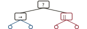

# Traditional Game AI *Primitives*

*A field guide to the first-class building blocks of game-AI design — the ones designers compose, not the algorithms hidden underneath — annotated for what ships in Unreal.*

**Legend:** `UE built-in` · `Classic` · `Modern`

---

## Decision & control structures

The primitives a designer reaches for to answer *"what should this agent do right now?"* They are the spine of any AI architecture; the world-knowledge and movement primitives in the later sections feed them.

### Finite State Machines (FSM) `Classic`

Discrete states with transitions on events or conditions. The original workhorse of game AI — Half-Life, Halo, F.E.A.R.'s squad-level coordination layer. Easy to author, easy to debug, but combinatorial explosion as states multiply.

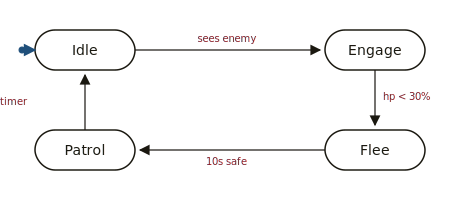
*Each circle is a discrete state; arrows are transitions labelled with the event or condition that fires them. The small filled dot is the default-entry arrow.*

**Good for:** simple enemies, animation state, weapon modes. **Falls down on:** agents with many overlapping concerns.

### Hierarchical State Machines / Statecharts (HSM) `Classic`

Harel's 1987 statecharts — states cluster into super-states (XOR), orthogonal regions run in parallel (AND), events broadcast across regions. Fixes the FSM combinatorial blow-up.

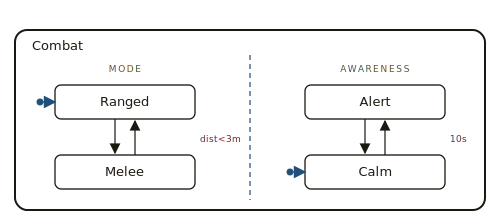
*A superstate **Combat** contains two orthogonal regions (separated by the dashed line) that run in parallel: **Mode** (Ranged XOR Melee) and **Awareness** (Alert XOR Calm). One event can affect both regions at once.*

**Good for:** agents with several concurrent concerns (movement × combat × awareness). **Common forms:** UML statecharts, Stateflow, SCXML.

### Behavior Trees (BT) `UE built-in` `Classic`

Tree of nodes evaluated top-down each tick: *composites* (Selector, Sequence, Parallel) drive control flow, *decorators* guard branches with conditions, *tasks* are leaves that do work. Popularized by Halo 2 (2004), now the default in commercial engines.

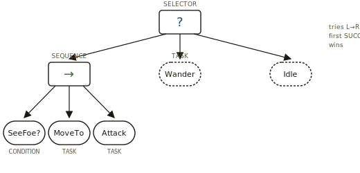
*A Selector tries each child until one succeeds. The Sequence here runs **SeeFoe?**, **MoveTo**, **Attack** in order, succeeding only if all do. Behavior trees scale by composing these few primitives.*

> **Unreal:** `UBehaviorTree` asset, edited in the Behavior Tree editor. Reads/writes a `Blackboard`. Standard nodes (`BTComposite_Selector`, `BTTask_MoveTo`, `BTDecorator_Blackboard`...) plus C++/Blueprint custom nodes. Owned by an `AAIController`.

**Good for:** reactive priority-based behavior with clear fallbacks. **Falls down on:** long-horizon plans, deep procedural decision-making (the tree can balloon).

### State Trees `UE built-in` `Modern`

UE5's newer hybrid: hierarchical states (like HSMs) where each state's selection is driven by an enter-condition evaluator (like a BT selector). Replaces the BT's tick-and-traverse model with event-driven state changes.

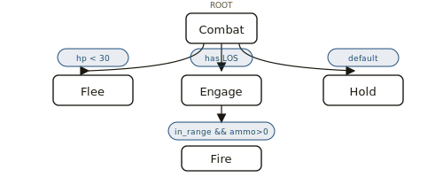
*State Trees graft BT-style enter-conditions (the blue pills) onto an HSM. The first branch whose pill evaluates true is the active substate — no constant tree-walking.*

> **Unreal:** `UStateTree` asset. Used standalone or wrapped by Mass AI. Pitched by Epic as a successor to Behavior Trees for new projects.

**Good for:** agents that "live in" states for a while (cover-fire, patrol-loop), with cheap condition evaluation per tick.

### Hierarchical Task Networks (HTN) `Classic`

Plans by recursive task decomposition: a high-level task ("AttackPlayer") expands into method choices, each expanding into subtasks, terminating in primitive actions. The planner picks a decomposition whose preconditions are satisfied. Used famously in *Killzone 2/3* and *Transformers: War for Cybertron*.

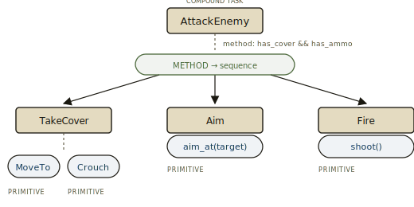
*Top compound task **AttackEnemy** is decomposed by a method (chosen because its preconditions hold) into three subtasks. Each subtask is either a further compound task or a primitive action the agent can directly execute.*

**Good for:** multi-step coordinated behavior with designer-authored "recipes." **Compared to GOAP:** more structured, more authorable, less emergent.

### Goal-Oriented Action Planning (GOAP) `Classic`

Each action has preconditions and effects expressed as world-state symbols. Agent picks a goal, planner runs A* through action-space to find a sequence satisfying the goal. Made famous by *F.E.A.R.* (2005) for emergent squad behavior.

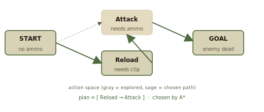
*Actions are graph edges connecting world-state nodes. The planner runs A\* from the current state to the goal state; the sage path is the cheapest chained sequence whose preconditions are satisfied.*

**Good for:** agents that should look "smart" by surprising the player with novel sequences. **Cost:** harder to debug and constrain than HTN; performance scales poorly with action count.

### Utility AI / Utility-Based AI `Classic`

Every candidate action is scored by a utility function (often a product of normalized response curves over inputs — health, distance, ammo, threat). Highest-scoring action wins, optionally with weighted-random sampling among the top candidates. *The Sims* series is the canonical example.

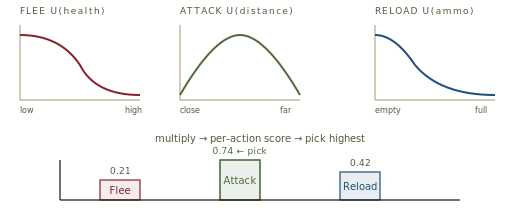
*Each action's utility is the product of its response curves over relevant inputs. Below, the bars show one tick's combined scores — **Attack** wins.*

**Good for:** agents that must continuously trade off many soft pressures. **Falls down on:** strict sequencing — utility AI has no native notion of "do A then B then C."

### Subsumption Architecture `Classic`

Brooks (1986). Behaviors stacked in priority layers; higher layers can *subsume* (override) lower ones. Less common in modern AAA but conceptually underlies a lot of layered behavior-blending in shipping titles.

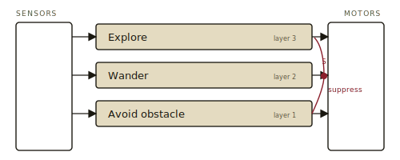
*Three behavioral layers run in parallel. The lower-priority **Avoid Obstacle** can intercept and suppress the output of **Wander** on the way to the motors (the dot marked **S**).*

### Rule-Based / Production Systems `Classic`

If-then rules over working memory, fired by a match-resolve-act loop (Rete, CLIPS, etc.). Rarely the central architecture in modern games but shows up inside other systems — e.g., trigger volumes, dialog selection, director AI (*Left 4 Dead*'s AI Director is essentially a rules-and-utility hybrid).

### Decision Trees & Fuzzy Logic `Classic`

Binary decision trees for cheap classification ("see player & have ammo & healthy ⇒ engage"). Fuzzy logic generalizes to membership grades for blending behaviors. Mostly absorbed into utility AI's response curves today, but still showed up explicitly in older titles.

### Scripted Sequences / Triggers `Classic`

Designer-placed scripted events: trigger volume + action sequence ("when player enters room, ambush spawns and runs to cover points 1–3"). Crude but indispensable — nearly every shipped game has a layer of these even when a fancier AI sits underneath.

## World-knowledge & memory primitives

Decision structures are useless without a structured view of the world. These are the standard ways to *represent* what the agent knows.

### Blackboards `UE built-in` `Classic`

A keyed, strongly-typed bag of facts ("EnemyActor", "LastKnownLocation", "TargetVisible") shared between perception, decision-making, and tasks. Decouples producers from consumers.

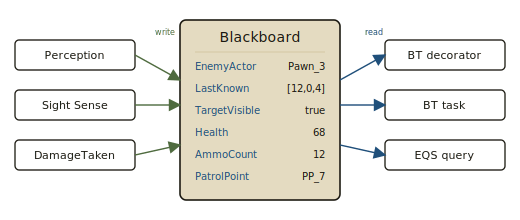
*The blackboard is the single shared keyspace. Producers (left) never know who reads their facts; consumers (right) never know who wrote them. That decoupling is what lets BT, EQS, and tasks compose cleanly.*

> **Unreal:** `UBlackboardData` asset defines keys; `UBlackboardComponent` holds runtime values. BT decorators and tasks read/write keys directly. Forms the contract between perception and BT.

### AI Perception `UE built-in`

Stimulus producers (the noisy gun, the visible pawn) and stimulus consumers (the AI senses) modeled as first-class components. Sight, hearing, damage, prediction, team affiliation.

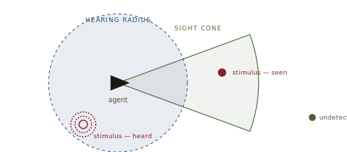
*Each sense has its own geometry. The sight cone fires only inside its angular bounds; the hearing radius is omnidirectional. Stimuli outside every sense's region are simply unseen and unheard.*

> **Unreal:** `UAIPerceptionComponent` on the controller, `UAISense_Sight` / `UAISense_Hearing` / `UAISense_Damage` / `UAISense_Touch` / `UAISense_Team` / `UAISense_Prediction`. Stimuli flow into the Blackboard via standard listeners.

### Influence Maps `Classic`

2D grids (or hex grids) recording per-cell scalar fields — threat, visibility, occupancy, scent. Decay and propagate across neighbours each tick. Used heavily in RTS AI (*StarCraft*, *Supreme Commander*) for tactical reasoning, and by squad AI for cover and flank scoring.

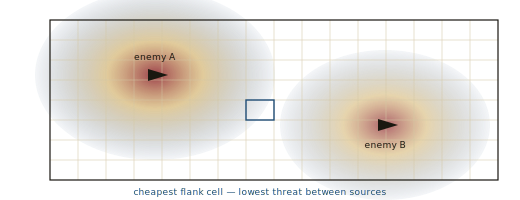
*Threat accumulates per cell from each enemy and bleeds into neighbours over time. The agent picks the cell with the desired score — here, the highlighted low-threat cell between the two threat sources.*

### Tactical Position / Cover Systems `Classic`

Designer-placed or procedurally-generated points annotated with metadata (cover direction, exposed angles, height). The AI queries the set for "best cover from *that* direction" each time it needs to reposition.

### Environment Query System (EQS) `UE built-in`

Spatial query language: generate candidate points (grid around the player, donut around the agent, nearby cover actors), then score and filter them with chained tests (distance, line-of-sight, dot-product to player facing). Returns the best item or a weighted ranking. EQS is Unreal's general answer to "where should the agent move/aim/look?"

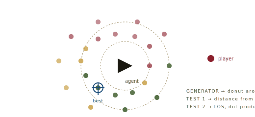
*The generator produces candidate points; each test scores them. Sage = high score (flank, line-of-sight to player); oxblood = low score (too close, exposed). The crosshair marks the winner.*

> **Unreal:** `UEnvQuery` asset. Composed of *generators* (`EnvQueryGenerator_OnCircle`, `EnvQueryGenerator_ActorsOfClass`, ...) and *tests* (`EnvQueryTest_Distance`, `EnvQueryTest_Trace`, `EnvQueryTest_Dot`, ...). Invoked from a BT via `BTTask_RunEQSQuery`.

### Smart Objects `UE built-in` `Modern`

Reverses the responsibility: instead of the AI knowing how to use a chair, the chair tells the AI ("I afford sit-down; here's the slot, the animation, the duration"). Origin in *The Sims*'s "advertisements." Now a first-class Unreal subsystem.

> **Unreal:** `USmartObjectComponent`, `USmartObjectSubsystem`, definitions data-driven. Pairs naturally with Mass AI and State Trees.

### Memory / Working-Memory Facts `Classic`

Time-stamped, decaying records of past events ("saw enemy at X 4 seconds ago"). Distinct from a blackboard's "current value" because facts have age and confidence. F.E.A.R.'s "WorkingMemoryFact" is the textbook example.

## Movement & navigation

### NavMesh / Navigation `UE built-in` `Classic`

Walkable surface represented as a polygon mesh, queried by A* (or similar) for paths. Hierarchical or "off-mesh link" extensions for jumps, ladders, doors.

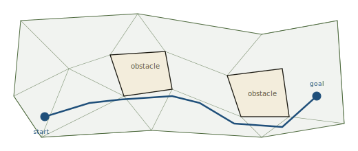
*The walkable area is triangulated; obstacles are cut out. A\* runs over the polygon graph (not the underlying world), then a string-pulling pass smooths the corridor into the final path.*

> **Unreal:** `ARecastNavMesh` (Recast/Detour under the hood), `UNavigationSystemV1`. Tasks like `BTTask_MoveTo` use it transparently.

### Steering Behaviors / Boids `Classic`

Reynolds (1987) — seek, flee, arrive, separation, alignment, cohesion, pursuit, evasion, wander, obstacle-avoidance — composed by weighted sum into a final acceleration. The substrate of flocking, crowd simulation, vehicle AI.

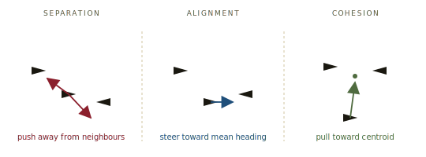
*Three of Reynolds' rules. Real flocking emerges from a weighted sum of all the rules — plus seek, avoid, wander — computed per agent per tick. No central choreographer.*

### Crowd Avoidance (RVO / ORCA) `UE built-in`

Reciprocal Velocity Obstacles: each agent computes a velocity that jointly avoids collisions assuming peers do the same. Cheap, smooth, decentralized.

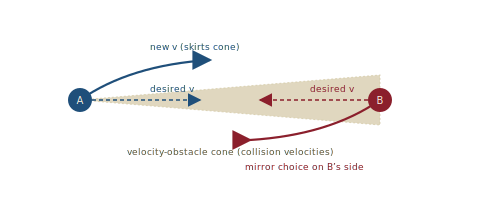
*Each agent computes the cone of velocities that would lead to a collision with the other, then picks the nearest velocity outside it. Because the cone is symmetric and each agent takes **half** the work, no central coordinator is needed.*

> **Unreal:** `UCrowdManager` + `UCrowdFollowingComponent`. Drop-in for any pawn using Detour-based navigation.

### ZoneGraph `UE built-in` `Modern`

Annotated lane graph for higher-level navigation than NavMesh: think sidewalks, traffic lanes, NPC patrol routes with directionality and tags. Feeds Mass AI for city-population behavior.

### Pathing Considerations `Classic`

Beyond the bare shortest path: weighted regions ("avoid the open street"), hierarchical pathfinding for large maps, theta-* / any-angle pathfinding for natural-looking traversal, jump-point search for grids.

## Coordination & multi-agent primitives

### Squad / Team Coordinators `Classic`

A higher-level agent that owns the squad as a unit, assigning roles (suppressor, flanker, breacher) and slots to individual AIs. F.E.A.R.'s squad layer sits above each agent's individual GOAP planner.

### Mass AI / ECS-Style Agents `UE built-in` `Modern`

Data-oriented, entity-component-system agents designed for crowds of thousands. Each agent is a thin row in arrays; processors run over batches rather than ticking individuals.

> **Unreal:** `MassEntity`, `MassAI`, `MassCrowd` plugins. Pairs with State Trees for per-entity behaviour and ZoneGraph for navigation. Used in *The Matrix Awakens* city demo.

### Auction / Market-Based Task Allocation `Classic`

Agents bid utility values for tasks; coordinator allocates. Cleaner than hard role-assignment when the set of agents and tasks is dynamic.

### AI Director / Drama Manager `Classic`

A non-embodied agent watching the overall experience and modulating pacing — spawn rates, enemy types, tension. *Left 4 Dead*'s Director is the canonical example; spiritual descendants in *Alien: Isolation*'s alien-director, *Vampire Survivors*'s wave scheduler, etc.

## Lower-level algorithms (substrate, not primitives)

These aren't "design primitives" in the sense above — designers don't author them directly — but every primitive on the page sits on at least one.

| Algorithm | Used by |
|---|---|
| A*, Dijkstra, JPS | NavMesh, GOAP, HTN planners |
| Recast / Detour | Unreal NavMesh generation & path queries |
| Min-max, MCTS, alpha-beta | Board / strategy game AI |
| Markov Decision Processes | Reinforcement-learning bots, some director AIs |
| Behavior cloning / imitation learning | Modern ML-driven NPCs |
| Neural nets / RL | OpenAI Five, AlphaStar, Forza Drivatars |

## Unreal at a glance

For quick reference — the AI primitives Unreal ships out of the box, roughly ordered from "default reach" to "newer / opt-in."

| Primitive | Asset / class | Role |
|---|---|---|
| AI Controller | `AAIController` | Possesses a pawn; owns the BT/StateTree, blackboard, perception |
| Behavior Tree | `UBehaviorTree` | Default decision-making asset |
| Blackboard | `UBlackboardData` | Shared keyed memory |
| AI Perception | `UAIPerceptionComponent` | Sight / hearing / damage / etc. |
| EQS | `UEnvQuery` | Spatial reasoning & positioning |
| NavMesh | `ARecastNavMesh` | Pathfinding surface |
| Crowd Manager | `UCrowdManager` | RVO-style collision avoidance |
| Gameplay Tasks | `UGameplayTask` | Async unit of work an AI/controller can run |
| State Tree | `UStateTree` | Newer BT alternative; hierarchical + condition-driven |
| Smart Objects | `USmartObjectComponent` | World objects advertise affordances to AIs |
| ZoneGraph | `UZoneGraphSubsystem` | Annotated lane graph for high-level routing |
| Mass AI | `MassAI` plugin | ECS-style crowd of thousands |

---

**References worth chasing.** *Programming Game AI by Example* (Buckland); *AI for Games* (Millington & Funge); *Game AI Pro* 1–3 (Steve Rabin, ed.); F.E.A.R. GDC postmortems (Jeff Orkin) for GOAP; Killzone 2/3 GDC talks (Tim Verweij, Arjen Beij) for HTN; Epic's "Mass AI / State Tree" documentation for the modern Unreal stack. All diagrams above are original SVGs drawn for this page.
