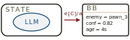
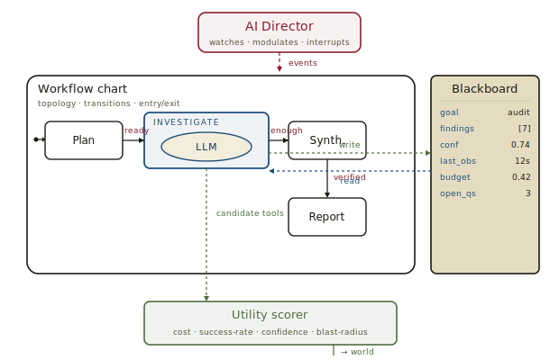
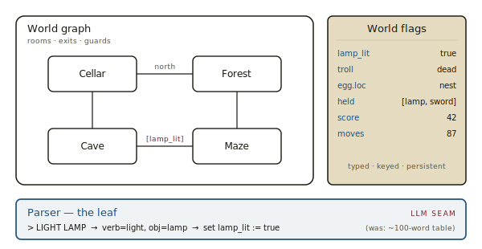
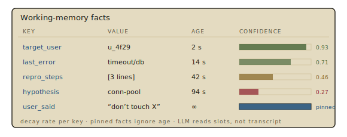
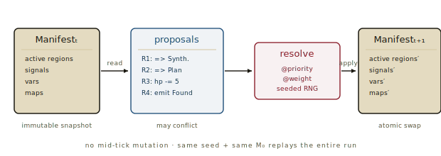
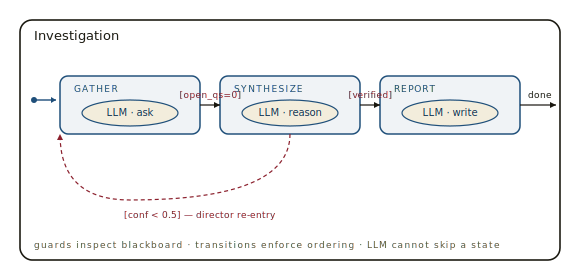
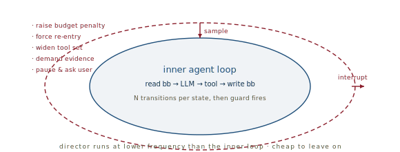
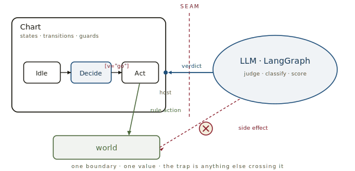
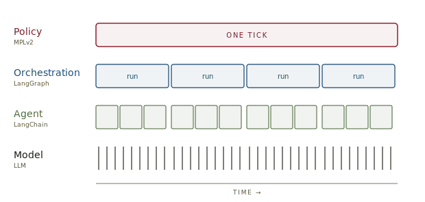

# Harebrain, *sketched*

*A note on where game-AI primitives, statecharts, and LLM agency meet — and which intersections actually pay back.*

---

## The thesis

The prior notes in this series circle a single bet. Harel's statecharts give reactive systems a humane diagram. MPLv2 makes that diagram executable. The field guide of game-AI primitives catalogs forty years of patterns for keeping autonomous agents on task. EDD asks how to keep an AI honest in the edits-not-authors loop. None of them, alone, addresses the long-running LLM problem. Together, they sketch one.

The bet, in one line:

> `harebrain = fast LLM brain × structured game-AI cage`

The cage is bounded state, hierarchical decomposition, typed shared memory, utility-scored choice, and a meta-loop that watches the inner loop. The brain is the LLM doing the rich, judgment-heavy work inside the leaves. Neither half does the long-horizon job alone. The combination has a chance.

> **Why the combination, and not either half.** An LLM without a cage drifts: forgets the goal, jumps a step, hallucinates an old fact as fresh, declares victory early. A cage without a brain is brittle: every leaf needs hand-authored logic, and the tree balloons the moment the world stops being predictable. The cage owns *where*; the brain owns *what*.

## The shape of the cage

Before zooming in on the payoffs, the architecture in one picture. A director sits outside, watching. A hierarchical statechart owns topology. A blackboard owns shared, typed, decaying memory. The LLM lives at the leaves — one rich call per state — and its choices route through a utility scorer before reaching the world.

*Director above, chart in the middle, blackboard on the right, utility scorer below. The LLM call is one component of the leaf, not the whole agent.*

Each piece corresponds to a primitive in the field guide. The chart is a hierarchical statechart (Harel; UE's State Trees). The blackboard is exactly the `UBlackboardData` pattern. The utility scorer is utility AI. The director is the AI-Director pattern from *Left 4 Dead*. The novelty isn't any single piece. The novelty is putting the LLM in the slot game AI usually fills with a hand-authored task.

## The cage, circa 1980

Before zooming in on what the cage gives the brain, a note on what it gave the genre that invented it. The cage half of harebrain — bounded state, typed shared memory, guarded transitions, scripted NPCs — was first deployed in the late 1970s, in a corner of computing most readers met as children. *Colossal Cave Adventure* (1976), *Zork* (1980), Infocom's catalogue, *The Hobbit* (1982), *Eamon*, and their multiplayer cousins *MUD1* (1978) and the MUDs that followed are, structurally, near-perfect instances of the architecture above — minus the brain.

*Room graph, world flags, parser slot. Everything but the parser was solved in 1980; the cage stays the same when the leaf becomes an LLM.*

In the field guide's vocabulary:

- **The world model is a blackboard.** Rooms, inventory, NPC dispositions, puzzle flags — typed, keyed, persistent. "The lantern is lit, the troll is dead, the egg is in the nest" is a `UBlackboardData` written in 1980.
- **Each room is a state; each puzzle a guarded transition.** You cannot enter the coal mine without the lamp. The guard reads the blackboard.
- **NPC behaviour is a small behaviour tree.** Gandalf wandering off in *The Hobbit*, Floyd in *Planetfall*, MUD mobs — sequence/selector logic over the same shared state.
- **The parser is the leaf.** And it is the slot where the genre bottlenecked. "GUESS THE VERB" was a meme because the cage was rich but the interpreter was a hundred-word lookup table. Players knew what they wanted; the system couldn't read intent.

That last point is exactly the seam harebrain proposes filling. Forty years ago the genre had the cage drawn correctly and the leaves nearly empty. An LLM in the parser slot — reading intent, choosing an action, mutating the world flags — is the harebrain pattern applied to interactive fiction.

> **The opposite mistake, in case the lesson sounds easy.** *AI Dungeon* and its descendants went the other way: an LLM authoring the world freely, with no cage at all. The failure mode is the predictable one — the model forgets the dragon you killed three rooms back, the troll resurrects mid-paragraph, the inventory dissolves into ambient hallucination. The 80s had the right division of labour. They were missing the second half, not the first.

## What the cage gives the brain

Four payoffs, in order of how much they pay back.

### Blackboard plus working-memory facts — context discipline

Long-running LLM agents lose the plot in two predictable ways. They forget important facts because the context window has rolled past them. Or they hallucinate from stale ones because old observations sit in context with no expiration. A typed, keyed blackboard fixes the first. F.E.A.R.'s working-memory-fact pattern — facts with timestamps and confidence — fixes the second. The agent doesn't read its rolling transcript; it reads named slots, and stale facts decay into "low confidence" rather than persisting as if fresh.

| Key | Value | Age | Confidence |
|---|---|---|---|
| `target_user` | `u_4f29` | 2 s | 0.93 |
| `last_error` | `timeout/db` | 14 s | 0.71 |
| `repro_steps` | `[3 lines]` | 42 s | 0.46 |
| `hypothesis` | `conn-pool` | 94 s | 0.27 |
| `user_said` | `"don't touch X"` | ∞ | pinned |

Each fact has a half-life. The agent prompt is built from the blackboard, not from a rolling transcript — so the model sees fresh evidence first and stale evidence flagged as such. Decay rate per key; pinned facts ignore age; the LLM reads slots, not transcript.

This is essentially the problem game AI solved twenty years ago for shooter NPCs that had to track "where is the player likely now?" through occlusion and noise. The solution is mature. We just haven't ported it.

The blackboard pattern also has a more rigorous sibling worth knowing about. MPLv2's **Manifest** generalizes the same idea: an immutable snapshot of the entire system — active regions, signals, variables, and regionmaps — recomputed atomically every tick. A blackboard tells you *what the agent knows*. The Manifest tells you *what the world is, this tick* — a strict superset.

| Axis | Blackboard (UE / F.E.A.R.) | Manifest (MPLv2) |
|---|---|---|
| Shape | Keyed, typed slots | Keyed typed slots *plus* active regions, signals, regionmaps |
| Scope | Per-agent (one BB per `AAIController`) | Whole simulation, one Manifest |
| Mutation | In-place, any time | Immutable per tick; atomic swap to next |
| Concurrent writes | Last-write-wins | Resolved by `@priority` → `@weight` → seeded RNG |
| Coupling | Producer / consumer decoupled by key | Same — plus declared `receives` / `emits` interfaces for signals |
| Role in execution | Side-data store the BT consults | The execution-model primitive itself |

*Each tick is a transaction: rules read Mₜ, propose changes, the engine resolves conflicts, Mₜ₊₁ lands atomically.*

The Manifest tightens four things the blackboard pattern leaves loose: it is global rather than per-agent, immutable per tick rather than mutated in place, conflict-resolved rather than last-write-wins, and central to the execution model rather than a side store. None of these matter for a single shooter NPC with a private blackboard. They start to matter the moment you have multiple cooperating LLM agents, want deterministic replay of an entire run, or need a guard that reads across sub-charts without racing its writers.

> **Upgrade path for the harebrain runtime.** Begin with a per-agent blackboard — cheap, familiar, enough for one workflow. Promote to a Manifest the moment you need any of: multi-agent coordination, replayability for diagnosis, or transactional guards that read across sub-charts. The two patterns share the same API surface (named typed slots), so the upgrade is mostly a runtime swap, not a rewrite of the chart or the prompts.

### HSM as workflow scaffold; LLM as the task leaf

The single biggest failure mode of long-horizon agents is premature conclusion — the model decides it's done before it actually is, or jumps from `gather` straight to `report` without `synthesize`. A hierarchical statechart enforces topology: you are *in* `Investigate.GatherEvidence`, not somewhere else, and the transition out requires a satisfied guard. The LLM is rich and creative inside the leaf. The chart owns "where am I, and what's next."

*Each leaf hosts a single LLM call shaped by its enclosing state. The model can be brilliant inside *Gather* without escaping to *Report* — the guard `[open_qs=0]` stands in the way.*

MPLv2's deterministic conflict resolution — `@priority` then `@weight` then a seeded RNG — maps directly onto "two sub-tools both want to fire." The LLM proposes; the chart resolves. EDD's expectations attach naturally to states: in `Synthesize`, the agent must produce evidence covering each open question. The expectation becomes the transition guard.

### Utility AI for tool and sub-agent selection

Today, an agent picks tools by prompt heuristic: the model reads its tool list and chooses. A utility-AI scoring layer — one normalized response curve per signal (cost, recent success rate, confidence in the relevant fact, blast radius) multiplied per candidate — makes the choice inspectable, tunable, and replayable. It also gives the director a handle when behavior degrades: *tool X has been winning every score for six consecutive ticks — raise its cost penalty.*

The construction is identical to the curve-and-bar diagram in *Traditional Game AI Primitives*. The novelty is the inputs: instead of `health` / `distance` / `ammo`, the curves run over `budget_remaining`, `fact_freshness`, `tool_success_rate_24h`. Same machinery. New tape.

### AI Director as the meta-prompt layer

*Left 4 Dead*'s director is the dramaturgical pattern for an outer loop watching an inner one. Same mechanic translated: a non-embodied agent watches the workflow, modulates verbosity, escalates scrutiny when confidence drops, injects "are you stuck?" interrupts, restarts a sub-state on detected loops. EDD's adversarial-review step *is* a director — called once at the end. There's no reason it has to be once.

*The director samples the blackboard and the chart's active state on its own clock. Its outputs are not actions; they're modulations of the inner loop.*

> **The four payoffs share one shape.** Each one moves something the LLM is bad at — durable memory, topology, comparable choice, self-supervision — into a structure the LLM doesn't own. The LLM gets to do what it's good at: rich, judgment-heavy work at the leaves. The cage handles the rest.

## What the brain gives the cage

The reverse direction is real but narrower. LLMs make game AI deeper in three specific places:

- **NPC dialogue and intent.** The obvious one, already shipping.
- **Fuzzy player-behaviour interpretation.** "The player keeps dying in the same spot — frustrated, or experimenting?" An LLM sitting beside the director gives it a reading the director can't produce on its own.
- **Offline authoring.** Generate behaviour-tree branches, HTN methods, or state-tree sub-charts as drafts that designers accept or reject. The LLM is a co-author, not a runtime.

> **The trap to avoid.** Putting an LLM in the per-tick decision loop. Too slow, too non-deterministic, too expensive. The right division is asymmetric: *LLM offline* as authoring assistant; *LLM online* only at leaves where latency and non-determinism are acceptable.

## The seam, and what it bounds

If the cage is the chart and the brain is the LLM, the seam between them is one boundary, one value, one direction. MPLv2 calls it a *host import*: the chart declares a typed contract, the embedder registers a Python function that satisfies it, and the chart calls into that function from inside a rule expression. One verdict comes back — a label, a score, a vector, a choice index. The chart routes on the value. That is the entire surface where the brain reaches the world the cage describes.

*The LLM answers; the chart decides whether to act. A side effect inside the host function is invisible to the chart — so the chart can't bound it.*

An `.mpl` source declares what it expects (`host import { decide(scene:string) -> string } from llm;`), the embedder hands over a `HostModule` whose `decide()` closes over a LangGraph or LangChain pipeline, and a rule reads the return value (`Investigate when decide(state()) == "report" => Report`). The cage calls; the brain answers; the cage decides whether to act on the answer.

### What the bound actually is

The chart bounds *what is expressible in MPL*. An LLM consulted through a host call cannot:

- Reach a state the chart doesn't define.
- Fire a transition that isn't declared.
- Invent an action outside the rule grammar.

It can only return a value, and the chart routes on it. This is the "no jailbreak" property in its strong form: not a guideline the model might violate under pressure, but topology — the unwanted state literally isn't reachable. The LLM cannot talk its way past geometry.

> **Where the bound dissolves.** A host function is Python. Its return value is bounded; its *side effects* are not. If `decide()` also sends an email or hits an API on the way to returning a string, the LLM has direct power over those effects regardless of what the chart permits. The chart can't constrain what it never saw. Hold the line: host functions return verdicts; *rules* act on verdicts.

### A gradient of structural latitude

Beyond the per-tick host call, MPL offers more — spawning new agent instances from pre-approved blueprints, overriding per-instance vars, even recompiling the chart from new source. The more latitude the LLM has, the less the cage can claim:

| Tier | What the LLM does | What stays bounded |
|---|---|---|
| 1 · oracle | Returns a verdict; chart routes on it | Action surface fixed by the chart |
| 2 · instantiator | Triggers `new Blueprint : Name` with override values | Kinds of agents fixed; count and parameters fluid |
| 3 · per-instance editor | Selects override blocks that add or remove specific rules | Override *menu* source-defined; scope per instance |
| 4 · author | Generates new `.mpl` text; recompile + state migration | Grammar — the artifact is still inspectable MPL |
| 5 · bare Python | Host function with arbitrary side effects | Nothing the chart can enforce |

Tier 1 is the trustworthy story in its strongest form. Tiers 2–3 are autonomy *inside* the cage: the agent can grow new cage, but only from pieces the author already approved. Tier 4 is the cage *editing itself* — still much better than free Python, because the artifact under revision is MPL and the diff is reviewable, but the audit trail must now include *which version of the chart was active at tick N*. Tier 5 is no cage at all; if you reach it, you've left the architecture.

### Two clocks

The pattern that keeps Tier-1 guarantees while still letting the system evolve is to split the loop in two:

- **Slow clock — compile-time, human-in-loop.** An LLM (reviewed) authors and edits the `.mpl` source. The chart is the legislation; this is where it's written and revised.
- **Fast clock — runtime, autonomous.** An LLM (unreviewed) selects among declared options and spawns pre-approved blueprints. This is the agent *executing* the legislation.

That maps to how humans already run trustworthy autonomous systems. Legislators write rules slowly and carefully; agents act quickly under them. A self-modifying agent in the strong sense — rewriting its own constitution mid-run — isn't impossible, but it should look like an amendment process, not a tick.

> `LLM advises · chart acts · tools route through the chart, not around it`

Hold that line and the cage's guarantees survive contact with an LLM. Break it — one host function that sends the email itself — and you've reintroduced exactly the unbounded surface the cage was meant to keep out.

## The stack, named

Step back from MPL and the seam, and a four-layer architecture is visible across what people are already building. Each layer wraps the one below it and adds something the lower layer structurally cannot provide. Conventional names exist for two of them, are coalescing for a third, and are still up for grabs for the fourth.

*One Policy tick contains many Orchestration runs; one run contains many Agent steps; one step contains many Model calls. The unit of work expands by roughly an order of magnitude per layer.*

| Layer | Canonical system | Unit of work | What it adds |
|---|---|---|---|
| **Policy** | MPLv2 | one tick · many regions | Bounded action surface, orthogonal concurrency, deterministic conflict resolution, broadcast events, replayable ledger |
| **Orchestration** | LangGraph | one workflow run | Explicit graph topology, state, conditional routing, loops, branching |
| **Agent** | LangChain | one agent step | Tools, retrieval, structured I/O, short-horizon memory |
| **Model** | LLM (Claude, GPT, …) | one inference | Raw judgment over arbitrary text |

### Each layer adds a different category

The instinct is to read the stack as "more capability" at each level — but that mis-states what's happening. **Agent adds capability**: tools, retrieval, structured output, short memory. **Orchestration adds structure**: explicit topology over a sequence of agent steps, with branching and loops the agent layer can't cleanly express. **Policy adds invariants**: things the layers below structurally cannot violate, no matter how clever they get. That's why Policy doesn't substitute for Orchestration the way Orchestration somewhat substitutes for "Agent with manual loops": it's a different *kind* of guarantee, one the lower layers cannot provide however they're composed.

### The tick rate slows as you climb

An LLM call takes a few hundred milliseconds. An Agent step is several model calls plus tool I/O — seconds. An Orchestration run is many Agent steps with explicit routing between them — tens of seconds, sometimes minutes. A Policy tick may run against a Manifest that updated only because *one* Orchestration run completed — minutes to hours of wall-clock between Policy ticks is reasonable, and longer when the system is largely idle. Each layer's clock is one to two orders of magnitude slower than the one below it.

That slowdown is not a defect; it's the right shape. *Structural guarantees belong in the slow layers; raw capability in the fast ones.* If your slow layer ticks too fast, you've inverted the cost curve — the model gets consulted faster than the constraint engine can constrain it, and the constraint engine ticks faster than a human could review what it's allowing through. The slowdown is what gives each upper layer room to do its job carefully.

### A menu, not a forced stack

Nothing requires all four layers in every system. The right composition is the lightest wrapper that earns the property you need at each level:

- **Policy → Orchestration → Agent → Model.** The deepest stack. Right for long-running agentic systems where bounding, structure, and capability are all paying off.
- **Policy → Agent → Model.** Skip Orchestration when each Policy state's task is small enough to handle in a single Agent step — the chart provides the structure LangGraph would otherwise have to.
- **Policy → Model.** Skip both middle layers when each leaf is a single classification, score, or vector. The host function is a thin wrapper around one inference.
- **Orchestration → Agent → Model.** The canonical agentic-workflow stack of 2024–25. Powerful but unbounded: the agent can drift, loop, hallucinate facts as fresh. This is precisely the stack the Policy layer is designed to wrap.

> **Why not let LangGraph *be* the cage?** A LangGraph graph looks like a state machine — nodes, edges, conditional routing — so the temptation is to skip Policy and let the graph itself be the bound. But a node is arbitrary Python and a conditional edge is another Python function returning the next node name. The topology is real; the nodes and routing decisions are unbounded code. You can *simulate* the discipline (nodes that only emit typed verdicts, dedicated act-nodes that read them), but at that point you've hand-rolled a weaker MPL without the orthogonal regions, the Manifest, the deterministic conflict resolution, or the inspectable grammar at rest. The graph is structure over what *runs*; the chart is structure over what's *allowed*.
>
> The pragmatic case piles on. LangGraph's unit of work is *one workflow run* — folding many workflows into a single graph turns it into spaghetti and dissolves the seam between tasks. Parallel branches that want to write the same state have no built-in resolution; you hand-roll a reducer per field. Non-determinism is unmanaged, where MPL makes it *deterministic given a seed* — same inputs, same seed, same trace, every time. The structural case says the cage *can't* be a LangGraph graph; the pragmatic case says it *shouldn't* be at scale, even where the structural argument doesn't bite.

> **Pick the lightest wrapper that earns its weight.** Every layer added is latency, cost, and design surface. The four-layer stack is justified only where each layer is doing work the others cannot. Most workflows want three; some want two; a few want all four. Choose by the property the layer above is asking for, not by the stack the literature happens to draw.

## The honest tradeoff

The whole bet hinges on whether the workflow is small enough in *state* to express as a chart, while large enough in *per-state intelligence* to need an LLM at all. The chart wins when those two measures pull in opposite directions.

| Workflow | State space | Per-state judgment | Verdict |
|---|---|---|---|
| Bug-fix on a known repo | Small — reproduce, locate, fix, verify | High — reading code, forming hypotheses | Good fit |
| Multi-stage research report | Small — gather, synthesize, draft, cite | High — judgment about what counts | Good fit |
| Runbook-driven incident response | Small — the runbook *is* the chart | High — reading logs, deciding severity | Good fit |
| Form-filling / data-entry workflow | Small | Low — shallow per step | Don't bother — a normal BT does fine |
| Open-ended creative collaboration | Large — ill-defined, evolving | High | Bad fit — chart becomes spaghetti |
| Per-tick game NPC behaviour | Small | Low | Bad fit — the LLM is dead weight |

The interesting territory is the top three rows: small named state space, rich judgment per state. Any time you can sketch the workflow on a napkin but the work inside each box would take a senior person an hour, you're probably in the right cell.

## What to build first

The pragmatic first cut, in five steps:

1. Pick one workflow with a small named state space and rich per-state judgment.
2. Wrap it in an MPLv2-style chart. States, transitions, guards.
3. Give it a typed blackboard with per-key decay and a few pinned slots for user constraints.
4. Put one LLM call per leaf. The prompt is built *from* the blackboard, not from a rolling transcript.
5. Add a director that runs an EDD-style adversarial check on each transition. Cheap to leave on; loud when it fires.

Then measure one thing: **does the agent finish the workflow without getting lost?**

> **Why this is a good first bet even if the thesis is wrong.** Every drift is locatable to a state. Every memory loss is locatable to a fact decay rate. Every wrong choice is locatable to a utility weight. The diagnostic surface is the structure itself. Compared to "the agent went sideways and we don't know where," that's already a better foundation.

If it works, the cage scales by adding more states, deeper sub-charts, sharper utility curves. If it doesn't, you'll have learned *which* piece — topology, memory, choice, supervision — the workflow refused. Either outcome moves the needle.

## Where this sits in the series

This note assembles the prior three.

| Source | What it contributes |
|---|---|
| [Statecharts, distilled](../harel/harel.md) | The vocabulary of the cage — depth, orthogonality, broadcast, history, default. |
| [MPLv2 vs. Harel](../mpl/mpl.md) | The cage made executable — the Manifest as transactional global state, ticks, deterministic conflict resolution, declared signal interfaces. |
| [Traditional Game AI Primitives](../game-ai/game-ai.md) | The catalogue the LLM era should be raiding: blackboard, working-memory facts, utility AI, EQS, smart objects, AI director. |
| [Expectation-Driven Development](../edd/edd.md) | The supervision protocol that becomes the director's job description. |
| [MEBN & PR-OWL, distilled](../mebn-prowl/mebn-prowl.md) | The formal upgrade path for the blackboard — first-order probabilistic knowledge over a variable number of entities. |

---

**Sources.** Harel, D., "Statecharts: A Visual Formalism for Complex Systems" (1987). MPLv2 — `github.com/lostinplace/mplv2`. Orkin, J., "Three States and a Plan: The AI of F.E.A.R." GDC 2006. Booth, M., "The AI Systems of Left 4 Dead," Valve, AIIDE 2009. Laforgia, A., "Expectation-Driven Development" (2025). Epic Games, *Mass AI / State Tree* documentation. Crowther, W. & Woods, D., *Colossal Cave Adventure* (1976); Lebling, Blank & Anderson, *Zork*, Infocom (1980); Bartle, R. & Trubshaw, R., *MUD1* (1978). All diagrams above are original SVGs drawn for this page.
