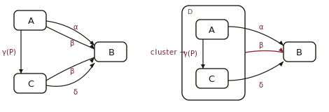
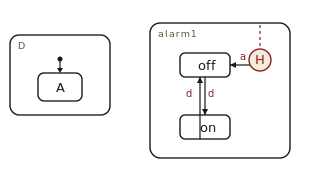
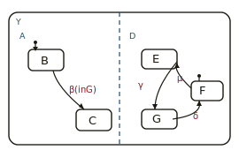
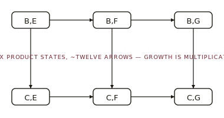
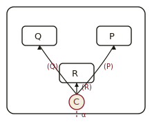
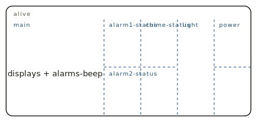

![Statechart glyph: XOR-decomposition box, transition arrow labeled e[C]/a, AND-decomposition box split by a dashed line](images/glyph.svg)

# Statecharts, *distilled*

*Cliff notes for Harel's 1987 paper, "Statecharts: A Visual Formalism for Complex Systems" — the 44-page article that gave reactive systems their first humane diagram.*

---

## The problem Harel set out to fix

Reactive systems — phones, watches, avionics, controllers — never stop. They wait, react, wait again. A transformational program runs once and finishes; a reactive system runs forever. Engineers therefore need a notation that scales with hierarchy and concurrency, not against them.

The flat state-transition diagram cannot. Add three independent on/off switches and the diagram needs eight states. Add a fourth switch and it needs sixteen. Every clarification multiplies the boxes.

> **Harel's thesis, in one line.** Take the conventional state diagram. Bolt on three things and you can specify a wristwatch, an avionics bay, or a missile guidance unit on a single page that a human can read.

> `statecharts = state-diagrams + depth + orthogonality + broadcast-communication`

## Vocabulary at a glance

The paper introduces a small lexicon and never leaves it. Learn these eight terms and the rest of the paper reads itself.

- **state** — A rounded box. The system sits in one at any instant of its life.
- **event** — Something that happens instantaneously — a button press, a tick, a timeout. Labels arrows.
- **condition** — A boolean predicate, written `[C]` after an event, that guards a transition.
- **action** — An output emitted when an arrow fires, written after a slash: `e[C]/a`.
- **cluster** — Wrap several states in one super-state. The super-state means "exactly one of these" (XOR).
- **refine** — The same move from the other direction — split a state into substates. Top-down clustering.
- **orthogonal** — A state split by a dashed line into independent components, all active at once (AND).
- **broadcast** — Any component sees every event. No subscriptions, no addresses, no routing.

> **Higraph — the underlying primitive.** Statecharts are drawn on a *higraph*: rounded boxes that nest (Euler-circle style) and split (Venn-diagram style). Area carries meaning; lines and points do not. Hierarchy and concurrency fall out of geometry, not syntax.

## Depth: clustering and refinement

Group three states into a fourth and the diagram shrinks. An arrow drawn out of the wrapper stands for an arrow out of every child. Harel calls the relationship *XOR*: in the super-state you are in exactly one of the children.

*Six arrows collapse to four. The single red β out of D replaces β from A and β from C.*

> **Two directions, one relationship.** **Clustering** works bottom-up: wrap related states into a super-state to economize on arrows. **Refinement** works top-down: zoom into a state and reveal its substates. Both produce the same XOR nesting; pick the direction that fits your design moment.

Because the super-state stands for every child, arrows may originate or terminate at any level. Harel calls these *inter-level transitions*, and they are the visual lever that keeps complex specifications readable.

## Default arrows and history

Entering a super-state from outside requires a rule. The *default arrow* — a small filled circle on a short stub — names the substate to enter. Harel treats it as the visual analog of an automaton's start state.

*Left: default arrow — on entering D, go to A. Right: enter `alarm1` by history (H) — resume whichever of `off` or `on` the watch last saw.*

> **H vs H★.** `H` applies only at the level on which it is drawn — one substate deep. `H★` (deep history) applies all the way down, restoring the entire substate stack. Action `clear-history(s)` erases that memory; `clear-history(s★)` erases it everywhere below.

## Orthogonality: concurrency without combinatorics

A dashed line splits a state into two or more *components*. Being in the parent means being in some substate of *every* component at once. The components share events and may guard on each other through `in (state)` conditions, but they hold their own substate independently.

*Y = A ⊗ D. Three substates on each side encode all six combinations — n + m boxes for n × m configurations.*

> `n × m` behaviours, drawn with `n + m` boxes

The flat equivalent looks like Harel's Fig. 20: six product states (B,E), (B,F), (B,G), (C,E), (C,F), (C,G), wired by every transition that fires in either side. Two components with a thousand states each produce a million product states — this is the explosion orthogonality avoids.

*Same behaviour as the orthogonal version above, drawn without the dashed split.*

> **Synchronization and independence, side by side.** One event can fire in *both* regions simultaneously (synchronization). Another event may touch only one (independence). The dashed line carries both meanings without ceremony.

## Transitions: events, conditions, actions

An arrow carries a label of the form `event[condition]/action`. Any part may be omitted. The action is Mealy-style — it fires on the transition, not in the state. Broadcast means the action is itself an event that any other component may react to in the same step.

| Notation | Reads as | Example |
|---|---|---|
| `e` | Take the transition when event *e* occurs. | `button-pressed` |
| `e[C]` | Take the transition when *e* occurs, provided condition *C* holds. | `tick [hour = 12]` |
| `e/a` | Take the transition on *e*; while taking it, emit event *a*. | `land/gear-down` |
| `e[C]/a` | The full form: conditioned, guarded, and side-effecting. | `T-hits-T1 [P1]/beep` |
| `in(s)` | Condition that holds while the system occupies state *s* (often in another region). | `e[in(alarms.on)]` |
| `k sec in s` | Timeout: condition holds when the system has spent *k* seconds in *s*. | `2 min in date` |

## Connectives: C and S

When many arrows share a source, a target, or an event, the diagram clutters fast. Harel offers two circled connectives that fold the clutter into a single glyph.

*Conditional connector. One event α routes to Q, P, or R depending on which guard holds.*

- **C connective** — One event fans out by guard. *"On α, go to Q if P, R if Q…"* collapses to a single arrow into a C-circle followed by guarded branches out.
- **S connective** — One event fans out by *value*. The event has a parameter, and the diagram picks the target by inspecting it. Handy for keyboards, menus, and selectors.

## The Citizen Quartz running example

Harel works the whole formalism out on a single artefact: a Citizen Quartz Multi-Alarm III wristwatch. The watch is small enough to fit on a page and ornery enough to stress every construct. By Fig. 31 the entire device lives on one foldout statechart.

At the top, the watch's *alive* state splits orthogonally into six concurrent regions:

*The watch's top level: six independent regions, all active together, each refined further inside.*

> **What orthogonality buys here.** Pressing button *b* in update mode turns on the light *and* exits update. That's two independent rules in two regions reacting to one broadcast event — the payoff of the dashed line.

## What can go wrong

The formalism is geometric, so it is forgiving but not bulletproof. Harel calls out four traps the modeler must dodge.

| Hazard | What it is | How to spot it |
|---|---|---|
| Default contradiction | An entered super-state has no consistent default, or two defaults compete. | Trace every entry arrow; verify each lands on exactly one leaf. |
| α-contradiction | The same event fires two outgoing arrows whose targets disagree. | Walk each event upward through ancestor peripheries. |
| Over-deep history | An `H` remembers a substate that was itself a transient artefact. | Combine `H` with `clear-history` on transitions that retire the memory. |
| Naming the dashed product | An orthogonal product has no natural geometry for its outer name. | Attach the name to the outside corner, or wrap the product in a labelled super-state. |

## Advanced features, listed

Section 4 of the paper sketches features that did not surface in the watch. Harel treats them as part of the core formalism, not extensions.

- **activities** — Continuous behaviours bound to a state — the "beep continuously" or "run timer" that the state diagram alone cannot express.
- **delays** — Transitions guarded by elapsed time. The watch's "2 min in date" is the canonical example.
- **compound transitions** — Multi-step arrows that pass through connectives without halting in any intermediate state.
- **parameters** — Events that carry values; the receiving condition or action may read them.
- **actions on states** — `entry` and `exit` actions distinct from arrow actions — the move modern statechart tools made standard.

> **What Harel deferred.** Section 6 floats two open questions: marry statecharts with **temporal logic** for verification, and admit **probabilistic** transitions for stochastic systems. Both arrived later — the first in STATEMATE's simulators, the second in Markov-decision and game-AI tooling.

## Why the paper still matters

Harel claimed that depth, orthogonality, and broadcast were enough to keep state diagrams readable as systems grow. The forty years since have agreed. STATEMATE shipped the first commercial implementation; UML adopted statecharts wholesale; Stateflow drives Simulink; SCXML is a W3C standard; XState ships them to web developers; embedded firmware ships them to microcontrollers. The vocabulary — super-state, default, history, orthogonal region, broadcast event — remains the one practitioners use.

> **Three ideas, one diagram per page.** That is the bargain Harel offered, and it is why a 1987 paper still describes the wristwatch on your wrist.

---

**Source.** Harel, D., "Statecharts: A Visual Formalism for Complex Systems," *Science of Computer Programming* 8 (1987), pp. 231–274. Communicated by A. Pnueli; received December 1984; revised July 1986. Department of Applied Mathematics, The Weizmann Institute of Science.
