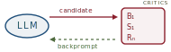
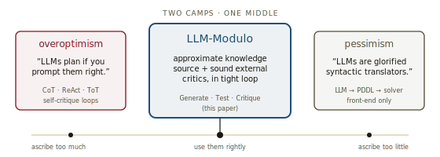
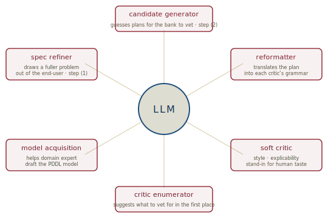
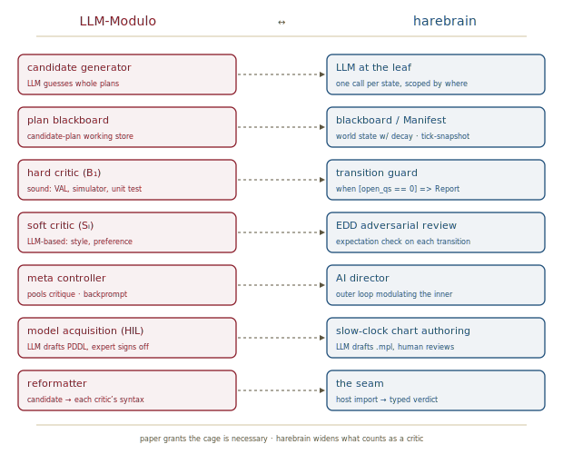

# LLM-Modulo, *redrawn*

*Cliff notes on Kambhampati et al., "Position: LLMs Can't Plan, But Can Help Planning in LLM-Modulo Frameworks" (ICML 2024) — and how the framework lines up with the harebrain hypothesis.*

---

## The position the paper takes

Two camps dominate the LLM-and-planning literature. One holds that LLMs can plan if you prompt them correctly — chain-of-thought, ReAct, Tree-of-Thoughts, self-critique. The other treats LLMs as glorified syntactic translators that should be wired front-of-house to a real solver. The paper argues both extremes are wrong, and stakes out a middle.

*Two camps, one middle. The paper takes the middle and earns it with evidence.*

> **The one-line claim.** Auto-regressive LLMs cannot, by themselves, plan or self-verify — but they can play several constructive roles inside a *Generate-Test-Critique* loop with external sound verifiers. That loop is the **LLM-Modulo framework** (named after SAT-Modulo theories).

The paper is doing three things at once: a *negative* empirical case (LLMs fail at planning even on Blocksworld), a *diagnostic* analysis of why the field disagrees, and a *positive* architectural proposal. The architecture is the part worth lifting.

## Why LLMs can't plan, in numbers

Five state-of-the-art LLMs were evaluated on the Blocksworld benchmark from the International Planning Competition. The numbers are the headline.

| Domain | Method | GPT-4o | GPT-4-Turbo | Claude-3-Opus | LLaMA-3 70B | Gemini Pro | GPT-4 |
|---|---|---|---|---|---|---|---|
| Blocksworld | one-shot | 28% | 23% | **48%** | 13% | 11% | 34% |
| Blocksworld | zero-shot | 36% | 40% | **59%** | 34% | 0.5% | 35% |
| Mystery BW (renamed objects) | one-shot | 0.8% | 0.8% | 1.3% | 2.5% | 0.4% | 4.3% |
| Mystery BW | zero-shot | 0% | 0.2% | 0% | 0% | 0% | 0.2% |

Two readings of this table matter.

First, even the best frontier model in 2024 (Claude-3-Opus, zero-shot) solves under 60% of a domain a first-year AI student writes a planner for. The numbers are not "promising results"; they are the floor.

Second — and this is the diagnostic blow — *renaming the actions and objects* in Blocksworld drops every model to near zero. The structure of the problem is unchanged. No symbolic planner cares what the blocks are called. An LLM solving the renamed problem at 1% while solving the unrenamed at 50% is doing *approximate retrieval of plans seen in training*, not *planning*. The renaming experiment is the cleanest evidence in the paper.

> **Why obfuscation is the right test.** A genuine reasoner is invariant to surface tokens; a memorizer is not. The 30-point gap between Blocksworld and Mystery-BW is the size of the part of "performance" that was actually retrieval all along.

## Why self-critique doesn't save it

A second line of work in the paper studies graph coloring — a canonical NP-complete problem with a cheap, sound verifier. Two findings:

- LLMs are bad at solving graph-coloring instances in direct mode.
- They are *worse* at verifying a candidate coloring than at producing one. Self-critique iterations *decreased* end-to-end accuracy in the studied setup: the model failed to recognize correct colorings and "corrected" them into wrong ones.

The implication generalizes. Asking an LLM to verify its own output presupposes verification is easier than generation — a classical computational-complexity intuition (`P` vs `NP`) — but only if the model is *reasoning*. If the underlying activity is approximate retrieval, the complexity asymmetry doesn't help: critique is just retrieval at a different prompt.

> **Two corollaries Kambhampati spells out.** (i) LLMs *cannot* self-improve from synthetic data they generate, critique, and re-train on — there is no signal beyond what they already encode. (ii) Tree-of-Thoughts is not search in any meaningful sense; the "tree" is a domain-specific prompt-diversification recipe, not a search-based agent. Both claims fall straight out of the verification result.

## Why the literature reads otherwise

If the position is correct, why do credible papers claim LLMs plan? The paper diagnoses three confusions.

1. **Approximate knowledge mistaken for executable plans.** LLMs *are* genuinely good at generating "what a wedding plan looks like." That artifact is approximate domain knowledge — useful as a draft for a human, or as a candidate for a verifier. It is not an executable plan, and the difference disappears when sub-goal interactions are absent (single-goal tasks) or when the world is ergodic enough that errors self-correct.
2. **Hidden external feedback.** Several "self-improvement" papers turn out, on close reading, to depend on either an external simulator returning ground truth (AlfWorld, Minecraft) or hand-crafted seed examples and filters. The improvement is real; the source is *not* the LLM.
3. **"Reasoning" terminology smuggled in.** Tree-of-Thoughts, ReAct, and Reflexion borrow the vocabulary of search-based agents (Russell & Norvig) without any of the structure. Calling a prompt-diversification strategy a "search tree" makes the result sound stronger than it is.

The three confusions share a shape: an LLM is *consulted* on something, the system *also* contains real machinery (a simulator, a human, hand-written examples), and credit flows to the LLM by default. The paper's contribution is to insist on the second-half of every such story.

## The architecture

The proposal is one diagram, redrawn here against the harebrain palette.

*The whole framework on one page. The LLM is the engine of candidates; correctness lives in the critic bank.*

The seven numbered arrows are the contract:

1. **End-user → Problem spec → LLM.** Specifications arrive complete, partial, or abstract; if incomplete, the LLM helps the end-user flesh them out before generation begins.
2. **LLM → Plan blackboard.** The LLM produces a candidate plan (concrete, hierarchical, or both). The blackboard is the shared artifact every downstream component reads.
3. **Plan blackboard → Critic bank.** Each critic reads the candidate, possibly after the LLM reformats it into the critic's native syntax.
4. **Critic bank → Meta controller (on disagreement).** Critics emit verdicts ranging from `"No, try again"` to `"Here are all the things wrong; here's a partial fix."` The meta controller pools them.
5. **Meta controller → LLM (backprompt).** A single consolidated critique returns to the LLM as the next prompt. Optionally, the controller diversifies prompts to widen search.
6. **Critic bank → Valid solution (on agreement).** When every critic in the bank signs off, the plan is returned.
7. **Valid solution → Synthetic data → LLM (offline).** Accepted plans plus the critic notes that produced them are a clean training corpus for fine-tuning the candidate generator.

The critic bank itself stratifies. **Hard critics** are model-based and sound — VAL for PDDL plans, a simulator for procedural tasks, unit tests for code. **Soft critics** evaluate style, explicability, or preference and may themselves be LLM-based. **Constructive critics** suggest fixes; **binary critics** only accept or reject.

> **The soundness story, exactly.** *The soundness of LLM-Modulo is inherited from the soundness of the hard critics.* Completeness — whether the system ever finds a valid plan — depends on the LLM covering the candidate space. The two properties are decoupled, which is the architectural point.

A second design choice worth marking: the LLM is the front-end to the *critics*, not to a solver. The literature's "neuro-symbolic" pipeline that runs `LLM → PDDL → planner → answer` is rejected here. The reason is composability: a bank of independently-developed critics is more naturally extensible than a monolithic solver, and the LLM can generate candidates that satisfy a wider mix of hard and soft constraints than a solver's expressivity admits.

## Six roles for the LLM

The framework asks the LLM to do six different jobs, of which "guess a plan" is only one. The paper is explicit about this multiplicity.

*The LLM is consulted six ways; the framework's payoff scales with how many of them are in use.*

| Role | What the LLM produces | Step in the diagram |
|---|---|---|
| Candidate generator | A draft plan | (2) |
| Reformatter | The same plan, rewritten in each critic's native syntax | between (3) and the critics |
| Specification refiner | A fuller problem statement teased out of the end-user | (1) |
| Model acquisition helper | A draft of the PDDL / world model the hard critic checks against | offline, model-side |
| Soft critic | A style or preference verdict — human proxy | inside the critic bank |
| Critic enumerator | A list of what to vet for at all | offline |

The pattern: in every job the LLM produces approximate output, and in every job a human, a verifier, or another critic vets that output before it lands. Nothing the LLM emits is trusted on its own.

## Polanyi's Revenge

The framework's deeper motivation is named in passing and worth pulling out. Classical knowledge-based AI hit a wall not because the architecture was wrong but because *eliciting tacit expert knowledge was too expensive*. Polanyi's tacit-knowledge problem killed the expert-systems boom.

> "How would you do robust planning if you have some doddering know-it-all ready to give you any kind of knowledge?"
> — the paper, paraphrased

LLMs make knowledge elicitation almost free — at the cost that the knowledge is approximate. The LLM-Modulo framework is what you build when you take that bargain seriously. You stop trying to make the LLM produce a *verified* plan and you stop trying to make a hand-coded planner cover *any* domain. You get cheap approximate knowledge from the LLM, you get correctness guarantees from external verifiers built (also, in part) with LLM help, and you wire them together in a loop.

That is the bet.

## Two case studies, in one paragraph

The paper reports two empirical adaptations of the framework. (i) **Classical Blocksworld with VAL as external verifier.** Pass rate climbs from roughly 35% one-shot to **82%** with up to 15 backprompt rounds. Mystery-BW remains hard (~10%) — the LLM can't generate plausible candidates even for VAL to filter. (ii) **Travel planning (Xie et al., 2024).** GPT-3.5-Turbo with Chain-of-Thought or ReAct manages **0.7%**; LLM-Modulo with hand-written hard critics for budget and common-sense constraints gives a **6× improvement** at the same model scale, and the LLM itself reliably plays the reformatter role. The pattern in both is the same: the cage compounds the brain.

Related precedents are worth flagging. FunSearch (DeepMind) is generate-test-critique with an external symbolic evaluator. AlphaGeometry pairs a fine-tuned LLM with a symbolic deduction engine. SayCan filters LLM-proposed robot actions through a value function. Voyager hand-rolls procedural critics in Minecraft. The LLM-Modulo paper is the explicit general framework these instances were already converging toward.

## Where this sits in the harebrain hypothesis

The harebrain thesis is `harebrain = fast LLM brain × structured game-AI cage`. LLM-Modulo arrives, from a planning-research starting point, at the same architectural shape. The mapping is direct.

*Same shape, different vocabulary. The disagreements are about which workflows can be cornered into the architecture.*

| LLM-Modulo | harebrain |
|---|---|
| LLM as candidate generator | LLM at the leaf — one call per state |
| Plan blackboard | Blackboard (per-agent) / Manifest (system-wide, tick-snapshot) |
| Hard critic (VAL, simulator, unit test) | Transition guard reading the blackboard |
| Soft critic (LLM-based, style) | EDD adversarial review on each transition |
| Meta (Backprompt) Controller | AI Director — outer loop modulating the inner |
| Model-based-critic acquisition (LLM-assisted HIL) | Slow-clock chart authoring (the "two clocks" pattern) |
| Reformatter at the critic interface | Reformatter at the chart's seam — host import return values |

### What the paper gives harebrain

Four things, each load-bearing.

- **A first-principles argument that the cage is *necessary*, not merely useful.** Harebrain framed the cage as a way to keep a drifting LLM on task. The paper goes further: LLMs *structurally cannot* plan or self-verify under standard auto-regressive training, so the cage isn't an optimization — it's the only sound architecture in town. That is the strongest possible version of harebrain's "brain × cage" framing.
- **A name for the soundness property.** *"Soundness of the framework is inherited from the soundness of the hard critics."* Harebrain implicitly relied on this; the paper articulates it. It means harebrain's transition guards must be classified — which ones are *sound* (block forward progress until satisfied) versus *advisory* (return a verdict the chart routes on). A workflow without sound guards has no soundness story to inherit.
- **The hard / soft critic distinction as guard vocabulary.** Harebrain talked about transition guards as a single category. The paper splits them: a unit-test guard is hard; an EDD expectation evaluated by an LLM is soft. The split is operationally useful — soft critics need a meta-controller and a backprompt loop, hard critics can fire deterministically.
- **The "LLM as reformatter" role at the seam.** Harebrain's seam-doc described host imports as returning a single verdict. LLM-Modulo names a slightly different LLM use at the same boundary: translating the *candidate* between the chart's vocabulary and each downstream tool's vocabulary. That role belongs in the harebrain seam taxonomy.

### What harebrain pushes that the paper doesn't

Two extensions. Both are bets, not yet defended at the paper's level of evidence.

- **Earlier scope: per-state, not per-plan.** The paper's unit of generation is a *whole plan* checked against a goal. Harebrain pushes the same loop inward — one LLM call per leaf state, guarded by the chart's transitions, with the blackboard persisting across many such calls. This widens the architecture to workflows that don't decompose into a global goal state (incident response, multi-stage research) at the cost of giving up the global validity check.
- **Broader scope: workflows without a sound verifier.** LLM-Modulo's case studies have hard critics — VAL for Blocksworld, constraint checks for travel planning. Most real workflows have nothing of the kind. Harebrain's bet is that the four payoffs (decaying blackboard, HSM topology, utility scoring, director) still compound even when every critic is soft. The price is that the soundness guarantee the paper claims does not transfer.

> **The trap to mark, in the paper's own vocabulary.** Do not read "we have critics" as "we have *sound* critics." The paper's headline result — Blocksworld climbing from 35% to 82% — leans on VAL being formally correct. A harebrain workflow whose critic bank is *entirely* LLM-based gives you a graded essay, not a verified plan. The vocabulary is the same; the guarantees are not.

### Two clocks, three clocks

Harebrain proposed a slow / fast split: LLMs author the chart slowly (with review), and execute it quickly (autonomously). LLM-Modulo refines that into three clocks. *Domain-model authoring* (once per domain, slow, expert-supervised) — this is the model the hard critic checks against. *Problem specification* (once per problem, medium, end-user-supervised). *Generate-test-critique* (per candidate, fast, autonomous). The harebrain runtime should expect this three-tier rhythm wherever a hard critic is in play.

## What's worth taking away

- The paper is the strongest available "the cage is necessary, not optional" argument grounded in empirical evidence about contemporary LLMs. It belongs in the harebrain bibliography as load-bearing, not adjacent.
- The Generate-Test-Critique loop is *one shape* of the harebrain pattern, optimized for whole-plan generation against a sound verifier. The harebrain pattern is a generalization to leaf-grained calls against mixed critics.
- The hard / soft critic distinction is the right vocabulary for transition guards. Harebrain should adopt it.
- The "LLM as reformatter" role belongs in the seam taxonomy — distinct from the verdict-returning host import already documented.
- Where a workflow *has* a sound verifier (PDDL, unit tests, type checker, formal constraint), the paper's strong claim transfers and harebrain inherits 82%-style numbers. Where it does not, harebrain is running a weaker version of the same architecture and should not market a stronger claim than it earns.

---

**Sources.** Kambhampati, S., Valmeekam, K., Guan, L., Verma, M., Stechly, K., Bhambri, S., Saldyt, L., & Murthy, A. "Position: LLMs Can't Plan, But Can Help Planning in LLM-Modulo Frameworks." *Proceedings of the 41st International Conference on Machine Learning*, PMLR 235, Vienna, 2024. arXiv:2402.01817 ([raw PDF in this folder](2402.01817.pdf)). Background empirical work: Valmeekam et al., PlanBench (NeurIPS 2023); Stechly, Valmeekam & Kambhampati, "GPT-4 Doesn't Know It's Wrong" (NeurIPS 2023 FM4DM Workshop); Guan, Valmeekam, Sreedharan & Kambhampati, "Leveraging Pre-trained LLMs to Construct and Utilize World Models" (NeurIPS 2023); Gundawar et al., "Robust Planning with LLM-Modulo Framework: Travel Planning Case Study" (arXiv:2405.20625, 2024). All diagrams above are original SVGs drawn for this page.
