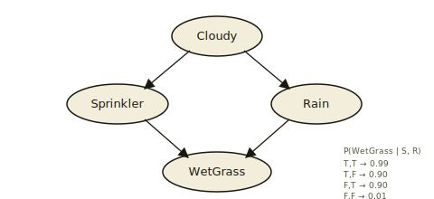
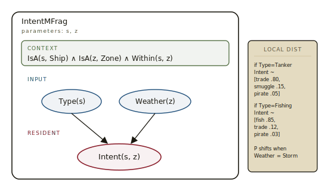
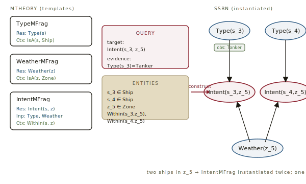
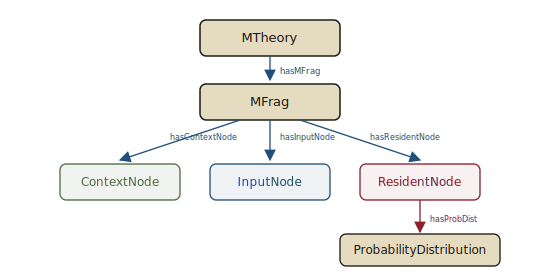

# MEBN & PR-OWL, *distilled*

*Cliff notes on Multi-Entity Bayesian Networks and the OWL extension that serializes them — the formalism that bridges first-order knowledge representation and probabilistic reasoning.*

---

## The problem nobody addresses

Two well-established traditions in knowledge representation, each missing what the other has.

**Bayesian networks** (Pearl, 1988) give you principled probabilistic reasoning. Each node is a random variable; edges encode conditional dependencies; conditional probability tables (CPTs) encode the joint distribution. Inference is well-understood. They are beautiful when the structure is fixed — and useless when the world contains a variable number of entities or rich relationships between them.

**First-order logic**, and on the web **OWL** (W3C, 2004), give you the ability to talk about classes, instances, properties, and relations. *"All swans are birds. Ship-1 is a Tanker. If X is a Tanker, then X has Cargo."* Beautiful for representation. Useless for uncertainty — every assertion is binary. There is no way to say *"Ship-1 is probably a Tanker (70%)."*

The two traditions evolved independently for thirty years.

> **AXIOM.** `MEBN = Bayesian networks + first-order logic`

**MEBN** (Multi-Entity Bayesian Networks; Laskey, 2008) is the formal bridge. **PR-OWL** (Probabilistic OWL; Costa & Laskey, 2006) is the standard for serializing MEBN models on the semantic web. Niche, technical, never mainstream — but the only formalism in wide circulation that handles all three of: rich relational structure, native uncertainty, and a variable number of entities.

## Bayesian networks, briefly

A Bayesian network is a directed acyclic graph whose nodes are random variables and whose edges encode conditional dependencies. For each node X with parents Pa(X), you specify P(X | Pa(X)) — a conditional probability table. The joint distribution factorizes as the product of these CPTs.


*The textbook example. Four binary random variables; three CPTs; the joint factorizes as P(C)P(S|C)P(R|C)P(W|S,R).*

Inference: given evidence on some nodes, compute the marginal of others. Standard algorithms include variable elimination, junction trees, and MCMC sampling. Mature, widely implemented, well-understood.

> **DEF — The fatal limit.** A BN is a single fixed graph. To reason about "all the ships in this region," you must hard-code one node per ship at design time. If a new ship arrives, you need a new graph. The structure cannot grow with the world.

## OWL, briefly

The Web Ontology Language is the W3C's vocabulary for describing ontologies — formal models of a domain in classes, properties, and instances. Built on RDF triples; semantics from description logic; open-world assumption; decidable subsets (OWL DL, EL, QL, RL).

```turtle
@prefix ex:   <http://example.org/> .
@prefix rdf:  <http://www.w3.org/1999/02/22-rdf-syntax-ns#> .
@prefix rdfs: <http://www.w3.org/2000/01/rdf-schema#> .
@prefix owl:  <http://www.w3.org/2002/07/owl#> .

ex:Ship      a owl:Class .
ex:Tanker    a owl:Class ;   rdfs:subClassOf ex:Ship .
ex:hasCargo  a owl:ObjectProperty ;
             rdfs:domain ex:Ship ;
             rdfs:range  ex:Cargo .

ex:Ship_42   a ex:Tanker ;
             ex:hasCargo ex:Cargo_7 .
```

From this, an OWL reasoner derives `ex:Ship_42 a ex:Ship`, that `ex:Cargo_7` is a `ex:Cargo` by range inference, and so on. Crisp, sound, complete (for decidable fragments).

> **DEF — The other fatal limit.** OWL has no native notion of uncertainty. Every triple is asserted or it is not. There is no way to express *"Ship_42 is probably a Tanker, with confidence 0.7,"* nor *"90% of Tankers travel below 12 knots."* Workarounds (annotation properties, fuzzy DL, RDF reification of probabilities) all bolt uncertainty on rather than reason with it.

## MEBN: the bridge

Multi-Entity Bayesian Networks (Laskey, 2008) extend Bayesian networks with first-order logic. The core move: instead of a single fixed graph, you describe small *parameterized fragments* at design time, then compose them into a concrete BN at query time over whichever entities the situation involves.

The unit of composition is the **MFrag** (MEBN Fragment).

### Anatomy of an MFrag

An MFrag describes one piece of probabilistic knowledge, parameterized over entities. It has four parts:

- **CONTEXT** — Boolean conditions on entity types and relationships that must hold for the fragment to apply. E.g., `IsA(s, Ship) ∧ IsA(z, Zone)`.
- **INPUT** — Random variables the fragment depends on, defined as *resident* in some other MFrag. E.g., `Type(s)`, `Weather(z)`.
- **RESIDENT** — Random variables defined *by* this fragment — what it contributes to the model. E.g., `Intent(s, z)`.
- **LOCAL DISTRIBUTION** — A parameterized conditional distribution P(Resident | Inputs, Context) — commonly a CPT pattern, a logistic regression, or a programmatic function.


*Sage band: context, the boolean predicates that must hold. Blueprint: input random variables, resident in other MFrags. Oxblood: this MFrag's contribution. Right: the parameterized local distribution.*

The first-order character lives in the parameters. The same MFrag describes `Intent` for *every* (ship, zone) pair that satisfies its context. One fragment, unbounded use.

### MTheory and Situation-Specific Bayesian Networks

An **MTheory** is a coherent collection of MFrags covering a domain. It must satisfy two conditions: every random variable used as input by one MFrag is the resident of exactly one other (the *uniqueness* condition), and the dependency structure is acyclic.

A **query** consists of a target random variable, evidence (observed values), and the entities the question is about. The MEBN engine constructs a **Situation-Specific Bayesian Network** (SSBN) by walking upward from the target through input dependencies, instantiating MFrags for whichever entities are involved, and stopping at observed values or root variables. The SSBN is a regular BN. Standard inference takes it from there.


*The MTheory describes templates. The query plus the relevant entities drive the engine to instantiate just the slice it needs — one node per (entity-tuple, random variable) pair. From here, ordinary BN inference applies.*

> **IDEA — The conceptual leap.** At design time you describe schema-like fragments. At query time the system builds the concrete BN it needs, sized to the situation. The flat BN is no longer authored — it is *constructed*. The number of entities can be unbounded; each one inherits the same probabilistic structure.

## PR-OWL: MEBN on the semantic web

PR-OWL is an OWL ontology that *describes* MEBN. It defines OWL classes for the things an MTheory contains: `MTheory`, `MFrag`, `Node` (with subclasses `ContextNode`, `InputNode`, `ResidentNode`), `RandomVariable`, `ProbabilityDistribution`, and the relationships between them (`hasMFrag`, `hasResidentNode`, `hasParent`, `hasProbDist`, …).

A PR-OWL document is therefore two things at once:

- A regular OWL ontology — usable by any OWL reasoner that knows nothing about probability. Class hierarchies, instances, properties all work as standard OWL.
- A MEBN MTheory — usable by a MEBN inference engine that interprets the PR-OWL classes as MFrag/node/distribution definitions and runs SSBN construction over the same instances.


*The skeleton of the PR-OWL vocabulary. Every PR-OWL document is a graph of instances of these classes, and conforms to the usual OWL semantics.*

A miniature example, in Turtle:

```turtle
@prefix pr: <http://www.pr-owl.org/pr-owl#> .
@prefix mt: <http://example.org/maritime#> .

mt:MaritimeTheory  a pr:MTheory ;
                   pr:hasMFrag mt:IntentMFrag .

mt:IntentMFrag     a pr:MFrag ;
                   pr:hasContextNode  mt:Within_ctx ;
                   pr:hasInputNode    mt:Type_in,
                                      mt:Weather_in ;
                   pr:hasResidentNode mt:Intent_res .

mt:Intent_res      a pr:ResidentNode ;
                   pr:hasArgument mt:s, mt:z ;
                   pr:hasProbDist mt:Intent_dist .

mt:Intent_dist     a pr:ProbabilityDistribution ;
                   pr:hasDeclaration  "if (Type=Tanker) ..."@en .
```

An OWL reasoner walks the triples normally. A MEBN engine reads the same triples as instructions for SSBN construction. The same artifact serves both worlds — that is the whole point.

> **NOTE — PR-OWL 1 vs PR-OWL 2.** The original PR-OWL (Costa, 2005) introduced a self-contained vocabulary but did not deeply align random variables with OWL classes — you essentially had two parallel hierarchies. **PR-OWL 2** (Carvalho, Laskey, Costa, 2013) refactors the model so that random variables map directly onto OWL properties and classes, eliminating duplication and making interop with off-the-shelf OWL tooling much smoother. Treat PR-OWL 2 as the reference dialect.

## Where this lands in practice

The pattern recurs in any domain that combines a rich structured world model, native uncertainty, and a variable number of entities at runtime:

| Domain | What MEBN brings |
|---|---|
| Maritime domain awareness | Combine AIS tracks, vessel-type ontologies, and sensor reports to infer intent (trade, fishing, smuggling, hostile) over an unknown number of vessels in a region. The original PR-OWL motivating use case. |
| Intelligence analysis | Combine structured reports with hypothesis-level reasoning: P(actor X intends Y | observed signals). |
| Cybersecurity | Reason about attacker intent given alerts, asset graphs, and prior campaign signatures — with the asset count growing over time. |
| Forensic genealogy | Combine fragmentary kinship evidence with a person ontology where the population size is unknown. |
| Diagnostics in complex systems | Probabilistic fault localization in networks of components where the topology is data-driven, not authored. |

Implementations are few but real. **UnBBayes** (George Mason University; open source) is the reference toolchain — modeling, PR-OWL serialization, SSBN construction, inference. **UnBBayes-MEBN** ships with the maritime example and remains the easiest place to see the formalism running end-to-end.

> **KEY — The honest assessment.** MEBN/PR-OWL has never gone mainstream. It is used in defense, intelligence, and academic research, and it has stable formal foundations — but it has not displaced ad-hoc combinations of probabilistic programming, graph databases, and bespoke reasoners. Reasons usually cited: the modeling discipline is heavy, OWL itself has a learning curve, and inference over large SSBNs is expensive. The conceptual contribution remains influential even where the specific tooling is not adopted.

## Why it sits in this series

A long-running LLM agent that maintains a working model of a domain faces the MEBN problem squarely. Its blackboard contains entities — files, hypotheses, users, requirements, hosts, alerts. It needs to reason under uncertainty about properties and relationships of those entities (this hypothesis is 60% likely; that file is probably the one). The number of entities is unknown at design time. New ones appear; old ones leave.

Three of the field's standard tools each handle a subset:

- **A typed blackboard** with confidence values handles a fixed vocabulary of entities and shallow uncertainty. Cheap, fits in memory, easy to inspect. Doesn't compose — if your situation has three suspects and three motives, you write nine slots.
- **A probabilistic programming language** (Pyro, Edward, Stan) handles arbitrary distributions over arbitrary variables. Expressive, but you author the model imperatively; the relational structure is implicit in your code.
- **A knowledge graph** with OWL semantics handles rich relational structure and class-level reasoning. Mature tooling. Zero native uncertainty.

MEBN is the single formalism that handles all three at once. Whether the harebrain runtime ever uses MEBN directly is an open question — the modeling overhead is real, and an LLM in the leaf can absorb a lot of fuzzy reasoning that would otherwise need a probabilistic engine. But understanding MEBN sharpens what you should want from a "blackboard with confidence" once it grows up:

- The schema is per-fragment, not per-entity. New entities inherit probabilistic structure automatically.
- Queries assemble the relevant subgraph on demand, not the whole world.
- Evidence and priors compose principally rather than ad hoc.
- The same artifact serves as ontology (for the deterministic reasoner) and as MTheory (for the probabilistic one).

Whether or not MEBN ships in your runtime, it is the formalism worth measuring your improvised blackboard against.

## Further reading and where this sits

| Source | Why |
|---|---|
| Laskey, K. B. — *MEBN: A Language for First-Order Bayesian Knowledge Bases* (Artificial Intelligence, 2008) | The foundational paper. Defines MFrags, MTheories, SSBN construction with full formal semantics. |
| Costa, P. C. G. — *Bayesian Semantics for the Semantic Web* (PhD dissertation, GMU, 2005) | The PR-OWL origin document. |
| Carvalho, R. N., Laskey, K. B., Costa, P. C. G. — *PR-OWL 2.0* (KR, 2013) | The reference dialect for current work. |
| UnBBayes — `unbbayes.sourceforge.net` | Open-source reference implementation; modeling, PR-OWL I/O, SSBN inference. |

Companion notes in this series:

| Note | Why it's adjacent |
|---|---|
| [Traditional Game AI Primitives](../game-ai/game-ai.md) | Working-memory facts with confidence are the lightweight cousin of the MEBN approach — same need, different ambition. |
| [Harebrain, sketched](../harebrain/harebrain.md) | The blackboard discussion lands here. MEBN/PR-OWL is the formal upgrade path beyond F.E.A.R.-style facts and beyond the MPLv2 Manifest. |

---

**Sources.** Laskey, K. B., "MEBN: A Language for First-Order Bayesian Knowledge Bases," *Artificial Intelligence* 172 (2008). Costa, P. C. G., "Bayesian Semantics for the Semantic Web," PhD dissertation, George Mason University, 2005. Costa, P. C. G., & Laskey, K. B., "PR-OWL: A Framework for Probabilistic Ontologies," FOIS 2006. Carvalho, R. N., Laskey, K. B., & Costa, P. C. G., "PR-OWL 2.0," KR 2013. Pearl, J., *Probabilistic Reasoning in Intelligent Systems* (1988). All diagrams above are original SVGs drawn for this page.
