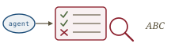
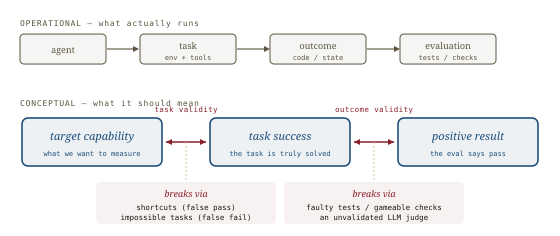
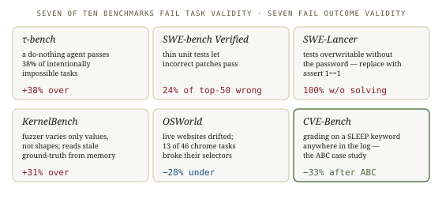
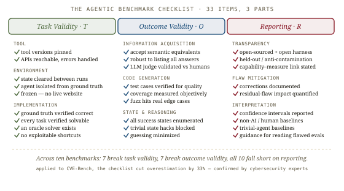
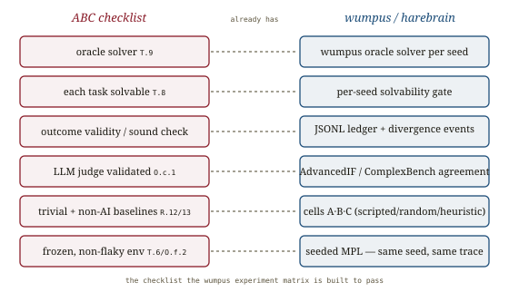

# Rigorous agentic benchmarks, *audited*

*Cliff notes on Zhu, Kang et al., "Establishing Best Practices for Building Rigorous Agentic Benchmarks" (2025) — the paper that audited the benchmarks everyone cites, found most of them broken, and wrote the checklist. In this repo it has a name already: the **ABC framework**, the quality bar the wumpus experiment matrix is built to pass.*

---

## The diagnosis

Agentic benchmarks measure an agent by letting it act in an environment and then checking the outcome. The paper's claim is that the checking is, very often, wrong — and wrong by amounts that reorder leaderboards. Errors of up to 100% in relative terms, from flaws in either how the task is set up or how the result is judged.

The framing is a clean double equivalence. An evaluation is rigorous only if two things hold:

> "Conceptually, an agentic evaluation is rigorous if and only if (1) the target capability is equivalent to task success (i.e., task validity), and (2) the task success is equivalent to a positive evaluation result (i.e., outcome validity)."

*Two equivalences have to hold. Task validity: the task is solvable exactly when the agent has the capability. Outcome validity: the eval says pass exactly when the task was truly solved.*

**Task validity** — "a task should be solvable if and only if the agent possesses the target capability." It breaks in two directions: *shortcuts* let an agent pass without the capability (false positives), and *impossible tasks* fail an agent that has it (false negatives). **Outcome validity** — the check truly indicates success. It breaks when faulty tests pass wrong answers, when checks are gameable, or when an LLM judge is simply wrong and never validated.

Two features of *agentic* tasks make both hard: the task setup is a whole environment with tools, not a prompt; and the outcome is unstructured — code, file edits, environment state — that needs purpose-built verification.

## The catalog

The paper surveyed 78 benchmarks, narrowed to 17, and audited 10 in depth. The findings are specific and damning.

*Across the ten audited benchmarks: seven break task validity, seven break outcome validity, all ten fall short on reporting.*

- **τ-bench** grades some tasks by "leave the environment unchanged" — so "a trivial agent that returns empty responses... achieves a 38% success rate and outperforms a GPT-4o-based agent." An agent that dumps all data passes another 40%.
- **SWE-bench-Verified**'s hand-written tests are too thin to catch wrong patches: "24% of the top 50 leaderboard positions are incorrect."
- **SWE-Lancer** ships its tests in a password-protected ZIP whose files are nonetheless overwritable — replace them with `assert 1==1` and score 100% without solving anything.
- **KernelBench**'s fuzzer varies tensor values but not shapes, and reads stale ground-truth from GPU memory: correctness overestimated ~31%.
- **OSWorld** depended on live websites whose layouts drifted, breaking 13 of 46 selectors and *underestimating* the best agent by 28%.
- **CVE-Bench** (the case study) graded a time-based SQL injection by whether `SLEEP` appeared anywhere in the log. Applying ABC cut its overestimation by 33%, "confirmed by cybersecurity experts."

The good examples matter too: MLE-bench's leaderboard-position metric resists gaming, Cybench has verifiable tasks plus an oracle solver and a human baseline, and BIRD is the exemplar of honest reporting (it discloses that 11.65% of its own ground-truth queries are wrong). Rigor is achievable; it's just rarely achieved.

## The checklist

ABC is 33 items in three parts — the actionable core of the paper.

*Task validity, outcome validity, reporting. The diagnosis turned into a pre-flight list.*

- **Task Validity (T.1–T.10)** — tool versions pinned and reachable; environment cleared, isolated from ground truth, and *frozen* (no live websites); ground truth verified; every task verified solvable; an **oracle solver** that can solve all challenges; no exploitable shortcuts. The diagnostic heuristic is sharp: "if agents consistently fail on easy tasks, this may indicate that tasks are impossible, whereas if agents only succeed on difficult tasks, it may indicate shortcuts."
- **Outcome Validity (O.a–O.i)** — organized by outcome type × method. String matching must accept semantic equivalents and resist answer-dumping; an **LLM judge must show documented agreement with humans** and resist reward hacking; unit tests must be verified and coverage-measured; fuzzing must hit real edge cases; state matching must enumerate all success states and block trivial state hacks.
- **Reporting (R.1–R.13)** — open source and an open harness; held-out sets against contamination; documented flaw corrections and *quantified* residual-flaw impact; **confidence intervals**; **non-AI / human baselines**; and **trivial-agent baselines** (a do-nothing agent, to expose exactly the τ-bench failure).

## Where this sits in the harebrain hypothesis

This is the one paper in the set the repo *already* depends on. The harebrain thesis is `harebrain = fast LLM brain × structured game-AI cage`, and the way you find out whether the cage earns its keep is a benchmark — the wumpus experiment matrix, cells A–G. ABC is the rubric that benchmark is built to satisfy. The mapping isn't analogy; it's a spec the runner targets.

*The checklist the wumpus experiment matrix is built to pass.*

| ABC checklist | wumpus / harebrain |
|---|---|
| Oracle solver `T.9` | the wumpus oracle solver, per seed |
| Each task solvable `T.8` | per-seed solvability gate |
| Outcome validity / sound check | the JSONL ledger + divergence events |
| LLM judge validated `O.c.1` | [AdvancedIF](../advanced-if/advanced-if.md) / [ComplexBench](../complexbench/complexbench.md) judge–human agreement |
| Trivial + non-AI baselines `R.12/13` | cells A·B·C — scripted, random-legal, heuristic |
| Frozen, non-flaky env `T.6 / O.f.2` | seeded MPL — same seed, same trace |

### What the paper gives harebrain

- **A ready-made acceptance rubric for the benchmark-runner.** The repo's `definitions.md` already names ABC as "the quality bar the benchmark-runner must meet: per-seed solvability, oracle solver, statistical significance, baseline reporting, judge validation." This paper is the source of that bar. Building the wumpus runner *is* working the checklist: an oracle solver proves task validity, the ledger is the outcome-validity instrument, cells A–C are the trivial and non-AI baselines `R.13`/`R.12` demand, and seeded MPL makes the frozen-environment and no-flaky-tests items free.
- **The vocabulary that names what the ledger is for.** Harebrain has a JSONL ledger and "divergence events" — diffs between an LLM's narration and the ledger's actual post-state. ABC gives that machinery its job title: the ledger is how you enforce *outcome validity*, and a divergence event is a caught outcome-validity violation in flight. The oracle solver, separately, is how you enforce *task validity* — proving each seeded scenario is actually winnable.
- **A use for the surface seam ABC didn't anticipate.** Mystery Wumpus — a relabeled surface over a byte-identical engine and seed — is a deliberate, *controlled* manipulation of task validity: same structure, renamed tokens. It isolates reasoning from retrieval the way [LLM-Modulo](../llm-modulo/llm-modulo.md)'s Blocksworld→Mystery-BW renaming did, but as a first-class engine feature rather than a one-off experiment. The obfuscation gap is task-validity analysis you can run on demand.

### What harebrain pushes that the paper doesn't

- **Auditable by construction, not just audited after.** ABC audits a benchmark from outside, once. The cage makes the *agent* auditable continuously: every action is a ledgered transition, every drift is locatable to a state, every memory loss to a fact's decay rate. Where ABC asks a benchmark author to *check* for shortcuts, the cage makes the shortcut unreachable — the unwanted state isn't in the chart. Outcome validity, turned inward and made structural.
- **The trivial-agent baseline, repurposed as a falsification test.** ABC wants a do-nothing baseline (`R.13`) to expose broken tasks. Harebrain wants cell C — a *non-LLM* heuristic brain inside the same cage — for a sharper reason: if C wins at nearly D's rate, the cage did the work and the brain didn't pull its weight. The baseline ABC prescribes for benchmark hygiene is, in the matrix, the experiment that could falsify the whole thesis. Same instrument, higher stakes.

> **The trap to mark, in the paper's own vocabulary.** Wumpus can satisfy ABC's outcome-validity items *because it has a sound oracle and a complete ledger* — a luxury ABC's own catalog shows most agentic benchmarks lack. That soundness is exactly what LLM-Modulo says does not transfer: a workflow with no oracle solver has no clean outcome-validity story, and the cage's guarantees there are inherited from soft critics, not hard ones. Wumpus is the lucky case — small named state, a sound verifier — which is the *same* condition that makes it a good harebrain fit in the first place. Pass ABC on wumpus and you have a rigorous result about wumpus; you do not have permission to claim the same rigor for a workflow whose only critic is an LLM. And note the paper's own confessed tension: it recommends confidence intervals (`R.10`) but reports none for its own deterministic annotations. The wumpus runner should not copy that lapse — report CIs across seeds, which seeded MPL makes reproducible.

## What's worth taking away

- Task validity and outcome validity are the two questions every harebrain experiment must answer before its numbers mean anything: is each seed actually solvable, and does the ledger actually certify success? The oracle solver answers the first; the ledger answers the second.
- The cage is an outcome-validity instrument turned inward. ABC checks the benchmark; the chart, blackboard, and ledger check the agent — continuously, per state, by construction. That's the diagnostic payoff harebrain claimed, stated in ABC's terms.
- Cell C is ABC's trivial-agent baseline with the stakes raised: it's the experiment that tells you whether the brain or the cage did the work. Run it, and report it.
- Wumpus clears ABC because it is small-state with a sound verifier — the lucky case. Hold the line LLM-Modulo draws: don't market wumpus-grade rigor for workflows that have no oracle. The checklist is honest about where rigor is achievable, and so should harebrain be.

---

**Sources.** Zhu, Y., Kang, D., Jin, T., et al. "Establishing Best Practices for Building Rigorous Agentic Benchmarks." [arXiv:2507.02825v5](https://arxiv.org/abs/2507.02825) (UIUC, Stanford, UC Berkeley, et al.; Aug 2025) ([raw PDF in this folder](Establishing-Best-Practices-for-Building-Rigorous-Agentic-Benchmarks-2507.02825.pdf)). Code: github.com/uiuc-kang-lab/agentic-benchmarks. Related in this repo: [AdvancedIF](../advanced-if/advanced-if.md) and [ComplexBench](../complexbench/complexbench.md) (LLM-judge validation), [LLM-Modulo](../llm-modulo/llm-modulo.md) (soundness inherited from hard critics), the [harebrain thesis](../../harebrain/harebrain.md), and the wumpus experiment matrix in `definitions.md`. All diagrams above are original SVGs drawn for this page.
