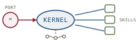

# AgentOS, *envisioning*

*Cliff notes on Liu et al., "AgentOS: From Application Silos to a Natural Language-Driven Data Ecosystem" (arXiv:2603.08938, March 2026) — a position paper that re-imagines the operating system as an agent kernel, and what its constructs borrow from (and owe to) the harebrain cage.*

---

## The position the paper takes

The paper's premise is an observation about where local agents have landed. Systems like **OpenClaw** — described as "Claude with hands," a "continuously running agent interacting directly with the operating system" — have shown that an LLM agent can drive a real machine: open apps, click buttons, read the screen, chain tools. But it does this *as an application on top of an OS built for humans pointing at pixels*. The agent has hands, but the house was built for a different tenant.

That mismatch is the paper's whole motivation. It names the failure mode **"Shadow AI"** and the mechanism **"Screen-as-Interface"**: lacking any semantic model of the machine, today's agents fall back on screenshotting the desktop, OCR-ing pixels back into text, and simulating mouse clicks. The authors are blunt about the costs.

> **The Screen-as-Interface tax, in three lines.** Semantic information is lost on the way through the pixel buffer. Execution paths are fragile — a UI layout change breaks the agent. Security goes runaway — once an agent has clicked through a permission grant, it cannot tell a legitimate action from a malicious one.

The proposed alternative is a clean-slate redesign: a **Personal Agent Operating System (AgentOS)** where the desktop is gone, the kernel speaks intent rather than syscalls, and applications dissolve into composable natural-language *skills*. The move that makes this more than a manifesto — and the reason it landed in a KDD venue rather than a systems one — is the paper's central reframe:

> **The one-line claim.** "Realizing AgentOS fundamentally becomes a Knowledge Discovery and Data Mining (KDD) problem." The OS is not a scheduler of processes; it is a *continuous data-mining pipeline* — intent mining, skill recommendation, sequential-pattern mining — running over the user's whole interaction stream.

Be clear about genre up front. **This is a vision/position paper, not an empirical one.** There are no experiments, no benchmark numbers, no implemented system. What it offers is an architecture, a research agenda, and a vocabulary. That is worth reading on its own terms — but the reader should not mistake the diagrams for measurements.

## The paradigm shift, layer by layer

The spine of the paper is a single comparison: peel the legacy OS apart layer by layer, and propose what replaces each layer when the primary user is an agent acting on a human's behalf.

*Five layers, swapped one for one. The legacy kernel does not disappear — it is demoted to "invisible infrastructure" the agent kernel drives through MCP.*

| Architecture layer | Legacy OS | AgentOS |
|---|---|---|
| Human–Computer Interface | GUI / desktop window manager | Single natural-language port (voice / text) |
| Application layer | Isolated third-party applications | User-defined skill modules |
| Core management engine | Process scheduling, memory management | Intent parser, multi-agent coordinator, LLM resource scheduler |
| Underlying interaction | System calls (syscalls), POSIX | Model Context Protocol (MCP), semantic API |
| Hardware abstraction | Physical hardware drivers | Legacy OS kernel (invisible infrastructure) |

The bottom row is the cleverest part of the proposal and the most honest. AgentOS does not throw away Linux; it *wraps* it. The legacy kernel keeps managing memory pages and disk blocks, but it sits beneath the agent kernel as plumbing the user never sees. That keeps the proposal grounded — nobody is rewriting a filesystem — and it is also the seam where MCP earns its place as the "southbound" interface.

### The Single Port — the death of the desktop

The top layer is the most visible bet. The desktop metaphor — windows, icons, a taskbar — is replaced by one multimodal gateway that takes voice, text, and contextual signals. By default the system sits in a "minimalist standby mode," rendering visual output only when it has something to show. The argued payoff is reduced cognitive overhead: "By centralizing interaction into a single semantic interface, AgentOS significantly reduces the cognitive overhead associated with navigating across multiple applications and interface contexts."

This is the weakest-supported claim in the paper and the one most worth interrogating. A single port is a single point of ambiguity. The desktop's much-maligned affordances — visible state, direct manipulation, the ability to *see* what an app is about to do — are exactly the things a natural-language port removes. The paper treats this purely as a win; harebrain's reading is that it relocates the problem to disambiguation rather than dissolving it.

### The Agent Kernel — from process scheduling to intent orchestration

The kernel is the heart of the design. It exposes two faces:

- **Northbound** — transforms ambiguous human input into "structured machine-executable intents." This is the disambiguation surface: the place where "pay that invoice" becomes a typed, decomposable task.
- **Southbound** — orchestrates a multi-agent system through MCP to act on the legacy infrastructure underneath.

Between the two, the kernel does something the paper calls **LLM resource scheduling**: multiplexing limited context windows and token budgets across concurrent agent threads. This is the right instinct — context windows *are* the new scarce resource, the way RAM was — but it is named, not designed. There is no scheduling algorithm, no admission policy, no eviction strategy. It is a placeholder for a hard problem.

*Two faces and a scheduler. Northbound parses intent; southbound drives the legacy kernel through MCP; the middle multiplexes the scarce resource — context.*

### Skills as user-defined software

Applications become **Skills-as-Modules** — "composable microservices" the user assembles in natural language. The paper's running example is the load-bearing illustration of the whole vision:

> *"Whenever I receive an email from the finance director containing a PDF invoice, extract the total amount, verify the corresponding item in my budget spreadsheet, and if correct, draft a payment authorization."*

Read that carefully, because it is doing a lot of quiet work. It is an event-triggered, multi-step, multi-tool workflow with a guard (`if correct`) and a typed payload (the total amount). It is, in other words, *exactly the shape of a small statechart* — `On(email) → Extract → Verify → [correct?] → Draft`. The paper presents this as a natural-language rule the kernel interprets at runtime. Harebrain would observe that the rule's reliability depends entirely on whether that guard (`verify the corresponding item`) is a *sound check* or a *vibe*. The paper does not ask the question.

## Why the future OS is a data-mining problem

Section 3 is where the paper makes its KDD case, and it is the most substantive part. Three mining problems, each mapped to a known technique.

| KDD problem | Technique proposed | What it serves |
|---|---|---|
| Intent mining & context awareness | NLP + relation extraction → real-time **Personal Knowledge Graph** | Disambiguating the northbound interface |
| Skill retrieval & recommendation | **Two-Tower recommender** (User Tower × Skill Tower, cosine similarity + RL feedback) | Choosing which skill answers a query |
| Action-sequence mining | **Sequential Pattern Mining** over UI/system logs → macro synthesis | Automating recurring workflows |

The **Personal Knowledge Graph (PKG)** is the persistent substrate: built continuously from multimodal interaction streams — voice logs, screen context, geolocation — and queried for context-aware reasoning. The paper leans on a "Zero-shot-to-head-shot hyperpersonalization" framework that sorts user data into *explicit, implicit, passive, and derivative* modalities, with the system evolving "from cold-start prompts toward personalized interaction." (The four modalities are named but not individually defined — note that gap.)

The **skill recommender** is framed as a hyperscale retrieval problem: a User Tower encoding the natural-language query plus PKG context, a Skill Tower embedding each skill's functional metadata, cosine similarity to retrieve, reinforcement learning to close the loop. This is a clean reuse of the dominant industrial recommender pattern — and also the place where the paper's optimism is most exposed. Recommending a *song* and recommending a piece of *executable logic that will move money* are not the same risk class. A wrong song is a skip; a wrong skill is the invoice paid to the wrong vendor. The paper formulates skill selection as ranking without confronting that the top-1 result *acts*.

The **sequential pattern mining** angle is the most concrete and, to harebrain's eye, the most credible. SPM over logs discovers frequently recurring subsequences; detected patterns trigger "automatic macro synthesis," collapsing a multi-step workflow into a single direct execution. This is genuinely an OS-as-data-pipeline idea, and it has a clean evolution story: the system observes you, finds the pattern, and proposes the shortcut. It is also the one place the paper draws on a mature, well-understood algorithmic family.

> **The load-bearing reframe, stated fairly.** The paper's real contribution is *not* the architecture diagram — every box in it appears in a dozen agent papers. It is the insistence that the agent kernel's hard problems are *mining* problems: intent is mined from streams, skills are retrieved by a recommender, automations are discovered by SPM. That lens is sharp and it is new in the OS framing.

## Governing a probabilistic OS

Section 4 is where a careful reader's attention should sharpen, because it is where the paper admits what it is building.

The security model is the **Semantic Firewall**. Legacy OS permissions are coarse and application-scoped ("this app may access the camera"); AgentOS shifts to evaluating *intent*. The firewall monitors information flows, sanitizes inputs, detects adversarial prompts, prevents "tainted data from triggering high-privilege operations," and runs real-time Data Loss Prevention. The taint-tracking framing is the right one — prompt injection *is* a taint problem — but again it is a goal, not a mechanism.

> **The honest tension the paper names but does not resolve.** A "probabilistic OS" is a contradiction held in tension. The thing users trust an OS for is determinism: the same action does the same thing every time. The thing an LLM kernel offers is judgment, which is non-deterministic by construction. The paper's fault-tolerance answer — ZFS/Btrfs snapshot rollback when the agent does something wrong — is a tacit admission: you cannot prevent the bad action, so you make it undoable. That is a reasonable engineering stance and a striking concession about how much the kernel can be trusted.

On hallucination control and disambiguation, the paper points at evaluation frameworks rather than solutions: a **Tri-Agent evaluation** (clarification agent, response agent, LLM-as-judge evaluator), the **Agentic Benchmark Checklist (ABC)**, an **Intent Alignment (IA)** metric defined as "the semantic gap between a user's latent goal and the actions executed by the agent," plus simulation environments (AndroidArena, MIRA). Two of these — tri-agent clarification and the ABC checklist — already have research summaries in this very series; the paper is, in effect, citing harebrain's adjacent reading list as its own evaluation agenda.

The KPI shift is summarized in the paper's second table, and it is a tidy encapsulation of the whole genre's reorientation.

| Dimension | Legacy OS | AgentOS |
|---|---|---|
| Primary objective | System stability and resource utilization | User intent fulfillment and complex workflow automation |
| Key KPIs | CPU load, memory faults, disk I/O | Intent Alignment (IA), task completion rate, tool-invocation accuracy |
| Fault measurement | Crash logs, kernel panics, exception traces | Hallucination rate, context drift, disambiguation failure rate |
| Benchmarking | Unit / integration / stress testing | Tri-Agent evaluation, AndroidArena, ABC |
| Evolution mechanism | Static; manual developer patches | Dynamic; self-evolving via SPM and MIRA |

The "context drift" and "disambiguation failure rate" entries are quietly the most interesting cells in either table — they are the exact failure modes the harebrain cage is built to bound, now proposed as first-class OS metrics.

## Where this sits in the harebrain hypothesis

The harebrain thesis is `harebrain = fast LLM brain × structured game-AI cage`. AgentOS is an unusually clean test of that hypothesis, because it proposes putting an LLM brain at the *most* privileged seat in computing — the kernel — and is admirably explicit about the resulting failure modes (Shadow AI, context drift, hallucination, the need for rollback). It names every problem the cage exists to solve, and then largely leaves them as open research. That is precisely the gap harebrain claims to fill.

*Same ambition, opposite emphasis. AgentOS specifies the boxes and trusts the LLM inside them; harebrain specifies the geometry between the boxes and distrusts the LLM by default.*

| AgentOS construct | harebrain primitive |
|---|---|
| Agent Kernel (intent orchestration) | The cage — the chart that owns *where am I, what's next* |
| Natural-language Single Port | Specification refinement at the seam (the disambiguation surface) |
| Skill-as-Module (NL workflow rule) | A guarded sub-chart — states, transitions, a guard per step |
| Personal Knowledge Graph | The Manifest / blackboard — persistent typed memory with decay |
| Semantic Firewall (taint, DLP) | Sound transition guards + the seam's bounded action surface |
| Sequential Pattern Mining → macro synthesis | Slow-clock chart authoring — the "two clocks" pattern, automated |
| MCP southbound interface | The seam / host import — typed verdict crosses into the chart |

### What the paper gives harebrain

Three things, each genuinely additive.

- **The OS framing makes "context is the scarce resource" explicit.** Harebrain treated the blackboard as a memory-discipline tool. AgentOS reframes the same scarcity as a *scheduling* problem: the kernel multiplexes context windows and token budgets across concurrent agent threads the way a classic kernel multiplexes RAM and CPU. That is a useful lens — the harebrain runtime's blackboard and the AgentOS kernel's scheduler are two views of the same constraint, and the scheduling view suggests admission control and eviction policies harebrain has not specified.
- **Sequential Pattern Mining is a concrete mechanism for the slow clock.** Harebrain's "two clocks" pattern said the LLM authors the chart slowly (with review) and executes it quickly. It never said *where the chart comes from*. SPM over interaction logs is a real answer: observe the user, mine the recurring subsequence, propose it as a new sub-chart for human approval. That is the slow clock with a discovery engine bolted on, and harebrain should adopt it.
- **The PKG is the blackboard at OS scope.** A personal knowledge graph built continuously from multimodal streams is exactly the harebrain Manifest promoted from per-workflow to per-user, persistent across sessions. The paper's "explicit / implicit / passive / derivative" modality taxonomy is a sharper provenance model than harebrain's flat typed slots, and worth importing.

### What harebrain pushes that the paper doesn't

This is the larger column, because the paper's omissions are exactly harebrain's content.

- **The skill rule needs a chart, not a sentence.** The invoice example is a statechart written in prose — and the paper interprets it at runtime with an LLM and hopes. Harebrain's answer is to *compile* that sentence into an inspectable chart with declared states and a guard per step, so `verify the corresponding item` is a typed check the kernel cannot route past. A natural-language rule the kernel re-parses on every fire has no fixed topology; the same sentence can mean different workflows on different days. The cage exists precisely to remove that latitude.
- **"Semantic Firewall" is harebrain's seam, under-built.** The firewall wants to stop tainted data from triggering high-privilege operations. Harebrain's seam gives that property *structurally*: the LLM returns a verdict, and only a *rule* — not the host function — acts on it. The unwanted action isn't blocked at runtime by a firewall classifier; it is simply not reachable in the chart's topology. The paper reaches for a probabilistic filter where harebrain offers geometry. The firewall is sound only if its taint classifier is sound — and an LLM-based classifier inherits exactly the hallucination problem it is meant to police.
- **The rollback admission is the tell.** ZFS snapshots as the fault-tolerance story concede that the kernel will take wrong actions and the best defense is undo. Harebrain's stance is the inverse: bound the action surface so the catastrophic action is never reachable, and reserve rollback for the recoverable middle. An OS that pays invoices should not be relying on snapshots to unwind a misdirected payment that already cleared.

> **The trap to mark, in the paper's own vocabulary.** AgentOS lists "hallucination rate" and "disambiguation failure rate" as KPIs — *measurements of a problem it does not solve*. Harebrain's bet is that you do not measure your way out of an unbounded action surface; you bound it. Put differently: the paper's entire Section 4 (Challenges and Risks) is the harebrain cage described as a list of unsolved problems. The constructs AgentOS needs to make its probabilistic kernel trustworthy are the constructs harebrain is building.

### A probabilistic kernel wants a deterministic cage

The deepest synthesis is this. AgentOS argues, correctly, that the next OS has an LLM at its core and that this makes it probabilistic. Harebrain argues that a probabilistic core is only trustworthy when wrapped in a deterministic-given-a-seed cage: bounded states, typed memory, sound guards, replayable ticks. The two papers agree on the brain and disagree on whether the cage is *optional polish* (AgentOS treats it as future work in Section 4) or *the load-bearing structure* (harebrain's whole thesis). An OS is the highest-stakes possible venue for that disagreement — which is exactly why it is the right one to test it in.

## What's worth taking away

- AgentOS is a position paper: an architecture, a KDD research agenda, and a vocabulary — no implementation, no experiments. Read it for the framing, not for evidence.
- Its genuinely sharp move is reframing the agent kernel's hard problems as *mining* problems — intent mining, skill recommendation, sequential-pattern mining. That lens is new in the OS context and worth keeping.
- Sequential Pattern Mining → macro synthesis is the most concrete idea in the paper and a real mechanism for harebrain's slow clock: mine recurring workflows from logs, propose them as sub-charts for review.
- The Personal Knowledge Graph is the harebrain blackboard at OS scope, and its provenance taxonomy (explicit / implicit / passive / derivative) is worth importing.
- Section 4 (Challenges and Risks) is, almost line for line, the harebrain cage described as a list of unsolved problems — Shadow AI, context drift, hallucination, the need for rollback, a semantic firewall. The paper names the disease; harebrain proposes the structure.
- The skill-as-natural-language-rule is a statechart written in prose. Compiling it into an inspectable chart with sound guards — rather than re-parsing it with an LLM on every fire — is exactly the difference between the two proposals.

---

**Sources.** Liu, R., Zhe, T., Wang, D., Yao, Z., Liu, K., Fu, Y., Liu, H., & Pei, J. "AgentOS: From Application Silos to a Natural Language-Driven Data Ecosystem." [arXiv:2603.08938](https://arxiv.org/abs/2603.08938) [cs.AI], v2, 11 March 2026 ([raw PDF in this folder](AgentOS-Natural-Language-Driven-Data-Ecosystem-2603.08938.pdf)). Related reading already in this series: the [Tri-Agent clarification](../tri-agent-clarification/tri-agent-clarification.md) framework and the [Agentic Benchmark Checklist](../agentic-benchmarks/agentic-benchmarks.md), both of which the paper cites as part of its evaluation agenda. All diagrams above are original SVGs drawn for this page in the harebrain visual language.
