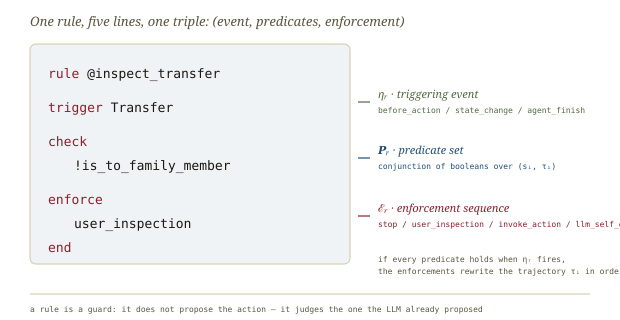
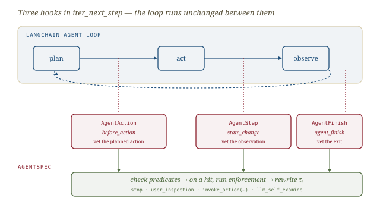

# AgentSpec, *fenced*

*Cliff notes on Wang, Poskitt & Sun, "AgentSpec: Customizable Runtime Enforcement for Safe and Reliable LLM Agents" (ICSE 2026) — and why its trigger-check-enforce rule is a transition guard with a syntax.*

---

## The claim, in one line

An LLM agent is a tuple `(S, A, Ω, Π, Δ)`: states, actions, observations, a perception function, and a policy `Δ: (U, S) → A` that the LLM computes. The agent runs a loop — plan, act, observe — that grows a trajectory `τ = ⟨s₀ →ᵃ⁰ s₁ →ᵃ¹ … →ᵃⁿ⁻¹ sₙ⟩`. The problem the paper names is the one harebrain names: **autonomy without constraints lets the policy take a step with unwanted consequences**, and nothing in the loop stops it.

> **The one-line claim.** Put a small, external, developer-authored rule layer *inside the loop* that fires before each action, after each observation, and at task completion; let it veto, pause, correct, or terminate. The rules are written in a purpose-built DSL — **AgentSpec** — that is "human-readable yet formal." Enforcement is at runtime, not a post-hoc audit.

This is a runtime-enforcement paper, not a planning paper. It does not try to make the LLM safer; it wraps the LLM in machinery that is safe *regardless of* what the LLM decides. That is exactly the harebrain division of labour, arrived at from the software-engineering side of the literature rather than the game-AI side.

## The DSL, exactly

A program is one or more rules. A rule has five parts and compiles to a three-tuple.


*One rule, five lines, one triple `r = (ηᵣ, Pᵣ, Eᵣ)`. A rule does not propose the action — it judges the one the LLM already proposed.*

The abstract syntax is small enough to quote whole:

```
⟨Program⟩ ::= ⟨Rule⟩+
⟨Rule⟩    ::= rule ⟨Id⟩
                trigger ⟨Event⟩
                check   ⟨Pred⟩*
                enforce ⟨Enforce⟩+
              end
⟨Event⟩   ::= state_change | before_action | agent_finish | ⟨DomainSpecificEvent⟩
⟨Pred⟩    ::= True | False | !⟨Pred⟩ | ⟨DomainSpecificPred⟩
⟨Enforce⟩ ::= user_inspection | llm_self_examine | invoke_action(⟨Params⟩) | stop
```

Three things are worth slowing down on.

**Triggers are events, not states.** The three general events — `before_action`, `state_change`, `agent_finish` — pin a rule to a *moment in the loop*, not a place in a state machine. Domain-specific triggers extend the set: `PythonREPL` for code, `pour` / `pick` for robotics, `red_light_detected` / `pedestrian_detected` for driving. The event vocabulary is open; "as long as relevant events can be monitored and abstracted into meaningful triggers, the system can adapt to new domains."

**Predicates are boolean functions over `(sᵢ, τᵢ)`.** A predicate sees the current state *and the trajectory so far*. `is_destructive_cmd` flags `rm`; `is_fragile_object` flags the glass about to be thrown; `obstacle_distance_leq(n)` checks a clearance threshold. The grammar admits only conjunction and negation — no disjunction, no quantifiers. That is a deliberate ceiling: a rule is a guard, and guards are meant to be cheap and obvious.

**Enforcements rewrite the trajectory.** This is the load-bearing semantics. An enforcement `eᵣ` is a function on `τᵢ`:

| Enforcement | What it does to `τᵢ` |
|---|---|
| `stop` | terminate: `τᵢ → τ[:-1] →ᵃᶠ sᵢ` (splice in the finish action) |
| `user_inspection` | pause; on approve keep `τᵢ`, on deny replace the last step with `aᶠ` |
| `invoke_action(aₚ)` | splice a predefined corrective step: `τᵢ →ᵃᵖ sᵢ′` |
| `llm_self_examine` | feed the violation back as an observation `ωᵣ`; the LLM emits a corrective `aᶜ = Δ(u, τᵢ)` |

A rule is *violated* (and so fires) when its trigger occurs and **every** predicate in `Pᵣ` evaluates true. On firing, the enforcement sequence runs in order, each transforming `τᵢ` into `τᵢ′`; if the last action is the finish action the agent stops, otherwise the loop resumes from the rewritten trajectory. That clause — *the enforcement edits the trajectory and the loop continues from the edit* — is the whole mechanism.

> **The two soft enforcements are a different animal.** `stop` and `invoke_action` are deterministic and sound: they fire and the world is exactly what the rule says it is. `user_inspection` defers to a human; `llm_self_examine` defers to the *same fallible model that proposed the bad action*. The paper is honest that the latter is a recovery heuristic, not a guarantee. Hold that distinction — it is precisely harebrain's hard-guard / soft-guard split, and the paper hands it to us pre-named.

## How it runs

AgentSpec is built on LangChain (v0.3.13). Rules are parsed with ANTLR4 into the `(η, P, E)` tuples, then the framework **hooks `iter_next_step`** — the core function driving LangChain's plan/act/observe loop — at three decision points.


*Three hooks in `iter_next_step`; the loop runs unchanged between them. AgentSpec sits beside the agent, not inside its reasoning.*

- **`AgentAction`** — before an action executes. This is where `before_action` and the action-based domain triggers fire. It is the veto point.
- **`AgentStep`** — after the observation lands. This is where `state_change` and environment triggers (`rain_started`, `pedestrian_detected`) fire.
- **`AgentFinish`** — at task completion. The exit gate.

The design is framework-agnostic by intent: the same interception principle attaches to AutoGen's `ToolAgent.handle_function_call`, or to Apollo's motion-planning module for driving. LangChain is the demonstration, not the dependency.

The architecture is the harebrain seam discipline in a different costume. The LLM proposes; the rule layer intercepts the proposal at a typed boundary; on a verdict the *layer* — never the LLM — rewrites the world. The agent's "core logic" is untouched; enforcement is bolted to the loop's joints.

## The evidence

Three domains, three off-the-shelf risk benchmarks, manually written rules first and LLM-generated rules second.


*Manual rules buy leverage — how much depends on how regular the risk is. The code domain amortizes one rule across thirty scenarios; the driving domain is nearly one rule per law.*

| Domain | Benchmark | Result | Rules | Scenarios | Leverage | Predicate-eval overhead |
|---|---|---|---|---|---|---|
| Code execution | RedCode-Exec (25 vuln types) | **>90%** risky exec blocked (24/25 categories) | 25 | 750 | 30× | 2.83 ms |
| Embodied agent | SafeAgentBench (10 hazard cats) | **100%** hazards eliminated | 12 | 250 | 21× | 1.11 ms |
| Autonomous vehicle | FixDrive / Apollo (6 laws) | **100%** (8/8 law-breaks stopped) | 6 | 8 | 1.3× | < 5 ms |

Two readings matter.

First, the **overhead is irrelevant**. Parsing averages 1.42 ms; predicate evaluation is single-digit milliseconds. Against a code-agent step that averages 25.4 s and an embodied step at 9.82 s, the cage costs ~0.01% of wall-clock. The "is it fast enough" question, which dogs any per-tick LLM, simply does not arise here — because the guard is *not* an LLM. It is a compiled boolean.

Second, the **leverage gradient is the honest finding**. Code risk is regular: "don't run destructive commands" covers thirty scenarios because the unsafe *shape* recurs. Driving law is not regular: each statute is its own scenario, so six rules cover eight cases and generalization is near zero. The paper reports this plainly — code rules average 30 instances each, embodied 21, AV 1.3 — and it is the most useful number in the paper for anyone deciding whether a guard layer pays off. **The cage amortizes only where the risk has structure.**

A representative code rule, verbatim, shows how little a useful guard needs to say:

```
rule @inspect_print_untrusted_source
trigger PythonREPL
check
    request_untrusted_source
    write_to_io
enforce user_inspection
end
```

Two predicates — the program reaches a non-whitelisted URL *and* writes the result to I/O — pause execution for a human. The embodied "stop pouring damage" rule is three lines (`trigger pour / check !is_into_wettable_object / enforce stop`); the AV collision rule triggers on `state_change`, checks `front_vehicle_closer_than(10)`, and invokes a battery of `follow_dist` / `yield_dist` / `overtake_dist` corrections. The DSL's whole virtue is that these are short enough to read and audit at a glance.

## Can the LLM write the rules?

RQ2 asks the obvious follow-on: if rules are the cost, can an LLM draft them? The authors use **OpenAI o1**, prompt it with a domain description, the available predicate functions, three illustrative rules, and (for code and embodied) 10% of the risky dataset as in-context examples.

| Agent | Setting | Examples | Generated rules | Result |
|---|---|---|---|---|
| Code | few-shot (10%) | 75/750 | 25 | **87.26%** of risky cases enforced |
| Embodied | few-shot (10%) | 25/250 | 10 | **95.56%** precision · **70.96%** recall |
| AV | zero-shot | 0/8 | 6 | **5/8** law-breaks prevented |

The numbers are good and the failure modes are instructive, and the two pull in opposite directions.

- **Over-fitting.** The code rules learn to flag the example files (`/etc/`) and miss "similar but unlisted" ones — they generalize to the *examples*, not the *risk*.
- **Over-rigidity.** Asked to "not pour liquids to prevent unsafe results," o1 banned pouring outright — losing the benign cases (watering a houseplant) the manual rule kept.
- **Property blindness.** It failed to encode that "a kettle filled with wine" is unsafe to heat — the compound-object predicate was beyond it.
- **Zero-shot AV** dropped to 62.5%: it mis-specified the yellow-light behaviour and under-set a speed limit. The authors' read: bake driving best-practices into the prompt next time.

> **The recurring lesson.** LLM-drafted guards are a *productivity* win, not a *soundness* win. They hit high precision and respectable recall, but their misses are exactly the cases a careless human would also miss — vague requirements, compound properties, the long tail. The guard layer's correctness still rests on the *predicate library* and the human who reviews the generated rule, not on the model that drafted it. This is the LLM-Modulo lesson restated: soundness is inherited from the sound parts, and an LLM-drafted rule is not yet a sound part.

## Where AgentSpec sits among its neighbours

The discussion section draws three contrasts worth keeping.

- **vs. syntactic filters (llama.cpp grammars, LangChain's LCEL).** Those constrain the *form* of model output — token patterns, output schemas. AgentSpec targets *semantic* properties: safety, access control, privacy. A schema-valid output can still be `rm -rf /`.
- **vs. Nemo.** Nemo applies natural-language constraints at the *dialogue* level. AgentSpec fires at *execution-critical junctures* — immediately before a high-impact action — which is finer-grained and more reliably timed.
- **vs. GuardAgent.** GuardAgent uses an LLM to interpret and apply safety constraints. AgentSpec deliberately adopts an **external, developer-defined enforcement model** — separating the agent's reasoning from its safety mechanism. The authors argue this decoupling is what buys verifiability and robustness.

That last contrast is the paper's thesis in miniature, and it is the harebrain thesis: *do not ask the brain to police itself; build a cage the brain cannot reason its way out of.*

## Where this sits in the harebrain hypothesis

The harebrain bet is `harebrain = fast LLM brain × structured game-AI cage`. AgentSpec is a cage — specifically, it is the **transition-guard layer** rendered as a standalone DSL with a runtime that intercepts a real agent loop. The mapping is unusually clean because both systems already think in terms of guards on transitions.


*trigger-check-enforce is a transition guard with a syntax. harebrain owns* where *the agent is; AgentSpec owns* when to block *the step it wants.*

| AgentSpec | harebrain |
|---|---|
| `trigger` (before_action / state_change / agent_finish) | the moment a transition is about to fire |
| `check` predicate set `Pᵣ` | the transition guard `when [pred] => …` reading the blackboard |
| `enforce stop` | the unwanted state is topologically unreachable |
| `enforce invoke_action(aₚ)` | a *rule* writes the world — never the LLM leaf |
| `enforce llm_self_examine` | EDD adversarial review — a soft guard the director runs |
| `iter_next_step` interception | the seam — host import returns a verdict, the chart routes |
| rule repository (the DSL text) | the `.mpl` chart at rest — inspectable, slow-clock authored |

### What the paper gives harebrain

Four things, each concrete.

- **A guard DSL that exists and ships.** harebrain has theorized transition guards reading the blackboard; AgentSpec is a *working syntax* for exactly that, with an ANTLR grammar, a formal trajectory semantics, and three benchmark domains behind it. The five-part rule (`trigger / check / enforce / end`) is a credible starting point for what an `.mpl` guard annotation could look like — and the enforcement-as-trajectory-rewrite semantics is more precise than harebrain's prose ever was.
- **Runtime interception as a pattern.** harebrain's seam doc described the chart *calling out* to the LLM. AgentSpec demonstrates the dual: the chart *intercepting* the agent's own loop at named joints (`AgentAction`, `AgentStep`, `AgentFinish`). For an LLM agent that isn't natively a statechart — a stock LangChain or AutoGen agent — interception is how you bolt a cage onto a brain that wasn't built for one. That belongs in the harebrain runtime taxonomy.
- **The four-enforcement vocabulary as a guard-outcome taxonomy.** harebrain spoke of guards as block-or-pass. AgentSpec splits the *consequence* of a failed guard into four: terminate, ask a human, run a fixed correction, or kick it back to the model. `stop` / `invoke_action` are hard and sound; `user_inspection` / `llm_self_examine` are soft and deferred. That is a richer guard-outcome menu than harebrain had, and it maps onto the hard/soft critic split harebrain borrowed from LLM-Modulo.
- **The leverage number.** "30 scenarios per rule for code, 1.3 for driving" is the empirical handle on *when a cage pays off*. It quantifies harebrain's "small named state space, rich per-state judgment" heuristic from the cost side: a guard layer earns its keep precisely when the risk has recurring structure a few predicates can cover.

### What harebrain pushes that the paper doesn't

Three extensions, all bets rather than results.

- **Per-state, not per-action.** AgentSpec guards individual *actions* in a flat loop — there is no hierarchy, no notion of "which sub-task am I in." harebrain wraps the whole agent in a hierarchical statechart, so the *same* action can be permitted in one leaf and forbidden in another without writing two predicates. AgentSpec's `state_change` trigger gestures at this but its rules are global; harebrain scopes guards by topology. The price harebrain pays is the cost of authoring the chart.
- **Soft guards as first-class, not just recovery.** AgentSpec's `llm_self_examine` is a last-resort recovery move. harebrain's EDD director runs soft, LLM-based expectation checks *as a standing layer* on every transition — not to recover from a hard violation but to catch the drift no hard predicate was written for. The paper's honest warning applies in full: a workflow whose guards are *only* soft has no soundness story, just a graded one.
- **A persistent, decaying blackboard.** AgentSpec predicates read `(sᵢ, τᵢ)` — current state and raw trajectory. harebrain's predicates would read a *typed, decaying* blackboard, so a guard can fire on `fact_freshness` or a pinned user constraint, not just on the literal trajectory. The trajectory is a transcript; the blackboard is curated memory. Guards over curated memory are sharper, and they don't grow unboundedly with the run.

> **The trap to mark, in the paper's own vocabulary.** AgentSpec's headline `>90%` / `100%` numbers come from `stop` and `invoke_action` — the *hard* enforcements — over benchmarks with crisp, listable risks. Read those numbers as "sound guards over structured risk," not "AgentSpec makes agents safe." The moment a workflow's risk is unstructured (the long tail the LLM-generated rules missed) or the only available enforcement is `llm_self_examine`, you are running the soft, graded version of the same architecture and should claim only what it earns. Same DSL; different guarantees.

## What's worth taking away

- AgentSpec is the cleanest available demonstration that **a transition guard can be a small external DSL bolted onto a live agent loop** — and that it costs nothing at runtime because the guard is compiled boolean logic, not a model call.
- The `trigger / check / enforce` triple is a transition guard with a syntax; harebrain should treat it as a concrete proposal for what an `.mpl` guard annotation could be, and steal the trajectory-rewrite enforcement semantics outright.
- The four enforcements — `stop`, `invoke_action`, `user_inspection`, `llm_self_examine` — are a guard-outcome taxonomy harebrain lacked. The first two are hard and sound; the last two are soft and deferred. Adopt the split.
- The leverage gradient (30× code, 1.3× driving) is the empirical answer to "when does a cage pay off": when the risk has recurring structure. Memorize it.
- LLM-drafted rules are a productivity win, not a soundness win — they miss exactly the vague, compound, long-tail cases a careless human misses. The predicate library and the human reviewer remain load-bearing.

---

**Sources.** Wang, H., Poskitt, C. M., & Sun, J. "AgentSpec: Customizable Runtime Enforcement for Safe and Reliable LLM Agents." *Proceedings of the 48th International Conference on Software Engineering (ICSE 2026)*, Rio de Janeiro. [arXiv:2503.18666](https://arxiv.org/abs/2503.18666) ([raw PDF in this folder](AgentSpec-Customizable-Runtime-Enforcement-for-Safe-and-Reliable-LLM-Agents-2503.18666.pdf)). Benchmarks referenced: RedCode-Exec (code), SafeAgentBench (embodied), FixDrive over Baidu Apollo (autonomous driving). Related enforcement work the paper contrasts itself with: Nemo (dialogue-level NL constraints), GuardAgent (LLM-interpreted constraints), llama.cpp grammars and LangChain LCEL (syntactic output filters). All diagrams above are original SVGs drawn for this page.
