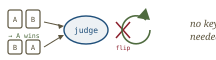
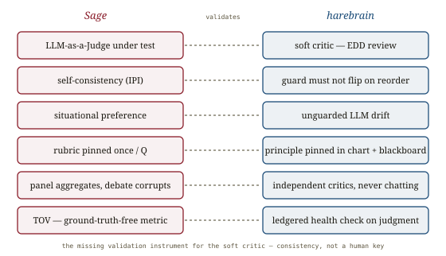

# Assessing LLM-as-a-Judge, *cross-examined*

*Cliff notes on Feng, Wang, Cheng, Wan & Chen, "Are We on the Right Way to Assessing LLM-as-a-Judge?" (HUST & U. Maryland, Dec 2025) — the paper that grades the judge without a ground-truth key, by catching it contradicting itself. For harebrain it answers the question the [ABC checklist](../agentic-benchmarks/agentic-benchmarks.md) left open: how do you validate the soft critic when there is no oracle and no trustworthy human label?*

---

## The judge needs a judge — and the usual one is broken

LLM-as-a-Judge is everywhere: it scores leaderboards, it is the reward signal in RLHF, it filters candidates in rejection sampling and test-time search. So the judge's reliability is load-bearing. The standard way to check a judge is to compare its verdicts against **human-annotated ground truth** — and that is exactly the foundation this paper kicks out.

> **The bitter lesson, applied to evaluation.** Human "gold" labels are noisy and biased: inter-annotator agreement runs **66% on AlpacaFarm, 63% on MT-Bench**; annotators miss subtle errors in long answers and fall for cognitive biases (favoring text that confirms a false belief). Worse, the paper runs its own metrics *on the human annotators* and finds them inconsistent too — **IPI 0.332, TOV 6.523** on hard cases. The gold standard is fool's gold, especially where it matters most: subjective, high-quality, nuanced comparisons.

If human labels can't anchor the judge, what can? The paper's answer is to stop asking *"does the judge agree with the truth?"* and start asking *"does the judge agree with itself?"* — a question you can answer with no key at all.

## Two axioms, no answer key

Sage (Self-Assessing Gauge for Evaluators) borrows from rational-choice theory. A coherent decision-maker must be *consistent*. Two failure modes, two metrics, both ground-truth-free.

*Consistency is checkable without knowing the right answer. A judge that flips on order, or that prefers A>B>C>A, is incoherent on its face.*

- **Intra-Pair Instability (IPI)** — *local* self-consistency. Under a **symmetrized protocol** (ask the judge both `J(Q,A,B)` and `J(Q,B,A)`), a sound judge gives opposite verdicts. IPI is the fraction of pairs where it doesn't. It catches positional bias and raw stochasticity. (Llama-3-8B flips **76.2%** of the time; even Gemini-2.5-Flash-Lite flips 25.3%.)
- **Weak Total Order Violation (TOV)** — *global* logical coherence. Run a full round-robin over `n=6` candidate answers; a rational judge's preferences should form a transitive weak total order. TOV is the **minimum number of pairwise verdicts you'd have to flip** to remove all the cycles. It is a feedback-arc-set count for the judge's own contradictions.

Both are cheap, stable, and — the paper proves via a conformal-prediction argument — have aggregate variance on the order of `10⁻⁵`. And they aren't just internally tidy: IPI/TOV correlate **0.80/0.79 with LLMBar** and **0.89/0.88 with RewardBench2**, the human-labelled benchmarks. Crucially, **TOV lower-bounds the error rate** — logical coherence is a *prerequisite* for correctness, so the minimum edits to fix the contradictions is a floor on the number of wrong judgments. A full Sage run costs **under $7 and an hour**; the human equivalent is estimated at **~$82,000 and 100 days**.

## Situational preference — the judge that re-improvises its ruler

Why do even Gemini-2.5-Pro and GPT-5 fail a *quarter* of hard cases, and why does every model degrade ~200% when the candidate answers are close in quality (Sage-Easy → Sage-Hard)? The paper names the cause: **situational preference**.

> **The phenomenon, exactly.** A judge "fails to maintain a stable internal gauging principle across different contexts" — it silently adopts *different evaluation criteria for different answer pairs under the same question*. It is not that the judge is dumb; it is that it never fixed a ruler, so it measures each comparison with a freshly-improvised one. Incoherence follows mechanically.

And the fix is the tell:

*Generate the rubric once, freeze it, apply it to every comparison. Pinning the standard outside the per-call improvisation is what makes the judge coherent — and it is exactly what a cage does.*

Prompting the judge to **write its rubric once per question and reuse it across all pairs** cuts IPI by **16.1%** and TOV by **11.0%**. The standard is lifted out of the per-comparison improvisation and pinned in a fixed artifact. Two more findings sharpen the design space:

- **Panels help, debate hurts.** A *panel* of diverse independent judges (PoLL) aggregating verdicts gains up to ~15%. A *debate* among judges (ChatEval) makes things **worse** — the paper's case studies catalogue **persuasive hallucination** (the most rhetorically forceful agent wins, not the most correct), **anchoring** (the first confident claim becomes the group's truth), and **information redundancy** (agents rephrase each other into an echo chamber). Independence is the active ingredient; conversation dilutes it.
- **Reasoning is a sanity check.** Removing the judge's explanation-before-verdict degrades consistency for most models — explicit reasoning is a necessary guardrail, not decoration.

## Where this sits in the harebrain hypothesis

The harebrain thesis is `harebrain = fast LLM brain × structured game-AI cage`. The cage runs two kinds of transition guard: **hard critics** (sound, deterministic — a unit test, an oracle) and **soft critics** (an LLM-as-judge — the EDD adversarial review on a transition). [LLM-Modulo](../llm-modulo/llm-modulo.md) gave the hard critic a soundness story; the [ABC checklist](../agentic-benchmarks/agentic-benchmarks.md) demanded the soft critic show "documented agreement with humans." This paper is the one that says: human agreement is shaky *and unnecessary* — you can validate the soft critic from the inside, with consistency.

*The missing validation instrument for the soft critic — the no-oracle case ABC and LLM-Modulo both flagged as hard.*

| Sage | harebrain |
|---|---|
| LLM-as-a-Judge under test | the soft critic — EDD review on a transition |
| Local self-consistency (IPI) | a guard that must not flip when candidates are reordered |
| Global coherence (TOV) | the soft critic's verdicts must form a coherent order |
| Situational preference | an unguarded LLM re-improvising the standard per call |
| Rubric generated once, applied to all pairs | the gauging principle pinned in the chart + blackboard |
| Panel aggregates, debate corrupts | independent multi-critic, never peer-chatting critics |
| TOV as a ledgered, ground-truth-free metric | a standing health check on the cage's judgment layer |

### What the paper gives harebrain

- **A way to validate the soft critic with no oracle and no human label.** This is the gap the repo's eval story had. The hard critic inherits soundness from a verifier; the soft critic had only "agreement with humans," which the paper shows is an unreliable anchor. Sage supplies the substitute: gate the EDD reviewer on IPI/TOV. If it flips verdicts when you swap the order of two candidate transitions, or is intransitive over a set of them, it is not a usable critic — *independent of whether any human would agree with it*. Consistency is the soft-critic analogue of the oracle's task-validity check.
- **"Situational preference" is the soft critic's drift, named and measured.** Harebrain's whole reason for a cage is that an unguarded LLM drifts. Here is that drift quantified at the judgment layer: the model silently changes its ruler between comparisons. The fix — write the rubric *once* and freeze it across all pairs — is the cage move stated in miniature: pin the gauging principle in a stable structure so the LLM at the leaf can't re-derive it each call. It is the **two-clocks pattern** ([LLM-Modulo](../llm-modulo/llm-modulo.md)) applied to critique: author the standard slowly/once, apply it fast/many times.
- **A concrete multi-critic design constraint.** If harebrain ever runs more than one soft critic on a transition, the paper is unambiguous: **aggregate independent verdicts (panel), do not let the critics debate.** Debate imports persuasive hallucination, anchoring, and echo-chamber redundancy — the exact failure the [ABC checklist's](../agentic-benchmarks/agentic-benchmarks.md) "genuinely independent, rubric-anchored reviewers" warning was pointing at, now with a mechanism.
- **A ground-truth-free metric for the experiment matrix.** TOV lower-bounds error and costs cents. Harebrain already emits a JSONL ledger of every transition; each soft-critic verdict is a logged judgment. Computing IPI/TOV over those verdicts gives a continuous, oracle-free health gauge on the cage's judgment layer — wired into the matrix the same way the [obfuscation gap](../benchmark-contamination/benchmark-contamination.md) is.

### What harebrain pushes that the paper doesn't

- **From a one-off audit to an in-flight check.** Sage evaluates a judge in isolation, on a fixed 650-question set, once. Harebrain embeds the same check *inside the running cage*: every soft-critic transition is a judgment the ledger already records, so IPI/TOV become live drift detectors the AI Director can watch — a stuck-pattern signal, not a quarterly report. The instrument Sage built for benchmarking becomes runtime telemetry.
- **The cage answers situational preference structurally, not by prompt.** Sage mitigates drift by *asking* the model to write a rubric. Harebrain removes the choice: the state defines the single typed query and the guard criteria, so the gauging principle is fixed by the chart's topology, not re-improvised per call. The rubric-once-per-question result is empirical evidence that harebrain's structural pin is the right move — the paper recovers, by prompt, what the cage enforces by construction.

> **The trap to mark, in the paper's own vocabulary.** Sage measures *consistency*, not *correctness* — and the paper is honest that TOV is a **lower bound** on error, not error itself. A judge can be perfectly self-consistent and consistently wrong. So passing IPI/TOV gates a harebrain soft critic as *usable* (it doesn't contradict itself) but never promotes it to *sound*. Soundness still comes only from a hard critic or an oracle, per [LLM-Modulo](../llm-modulo/llm-modulo.md)'s line. Consistency is necessary, not sufficient: do not market a coherence-passing EDD reviewer as a correctness guarantee. It earns the right to be trusted as a *soft* critic — nothing more.

## What's worth taking away

- You can validate a judge without a ground-truth key. Order-invariance (IPI) and transitivity (TOV) are visible from the inside, correlate strongly with human-labelled benchmarks, and cost cents instead of $80k.
- The human gold standard is itself inconsistent (IPI 0.332 on hard cases). Harebrain should stop treating "agreement with a human" as the soft critic's validation story and adopt consistency as the oracle-free substitute.
- "Situational preference" is the soft critic drifting — re-improvising its ruler per comparison. The fix is the cage move: pin the standard in structure, generated once, applied many times.
- Aggregate independent critics; never let them debate. Debate produces persuasive hallucination and anchoring — a measured failure, not a hypothetical one.
- Consistency ≠ correctness. IPI/TOV make a soft critic *usable*, not *sound*. Hold LLM-Modulo's line: soundness still requires a hard critic, and the wumpus oracle is the lucky case where you have one.

---

**Sources.** Feng, Y., Wang, S., Cheng, Z., Wan, Y., & Chen, D. "Are We on the Right Way to Assessing LLM-as-a-Judge?" Huazhong University of Science and Technology & University of Maryland, Dec 2025. arXiv:2512.16041 ([raw PDF in this folder](Are-We-on-the-Right-Way-to-Assessing-LLM-as-a-Judge-2512.16041.pdf)). Code & data: github.com/plafle/LLMasaJudgeAssessment. Builds on Zheng et al., "Judging LLM-as-a-Judge with MT-Bench and Chatbot Arena" (NeurIPS 2023); panel/debate baselines PoLL (Verga et al., 2024) and ChatEval (Chan et al., 2023). Related in this repo: [Rigorous agentic benchmarks (ABC)](../agentic-benchmarks/agentic-benchmarks.md) (the judge-validation pillar this paper fills), [Benchmark Data Contamination](../benchmark-contamination/benchmark-contamination.md) (the contaminable judge — consistency is one defense), [LLM-Modulo](../llm-modulo/llm-modulo.md) (hard vs soft critics; soundness inherited only from hard ones), [AdvancedIF](../advanced-if/advanced-if.md) and [ComplexBench](../complexbench/complexbench.md) (rubric-anchored judging), the [harebrain thesis](../../harebrain/harebrain.md), and the wumpus experiment matrix in `definitions.md`. All diagrams above are original SVGs drawn for this page.
