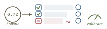
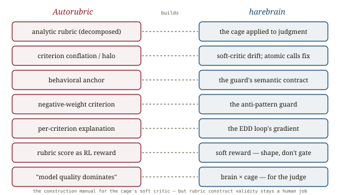

# Autorubric, *calibrated*

*Cliff notes on Rao & Callison-Burch, "Autorubric: Unifying Rubric-based LLM Evaluation" (UPenn, Feb 2026; DARPA SciFy) — the framework that takes "a rubric is just a prompt" apart and rebuilds it as an engineered instrument: analytic criteria, bias mitigations, psychometric reliability, and per-criterion scores that double as an optimization signal. For harebrain it is the construction manual for the soft critic — and the clearest operationalization yet of the repo's EDD loop.*

---

## "A rubric is just a prompt" is the mistake

The repo already has benchmarks that *use* rubrics ([AdvancedIF](../advanced-if/advanced-if.md), [ComplexBench](../complexbench/complexbench.md)) and a paper on whether a judge is self-consistent ([Sage](../assessing-judges/assessing-judges.md)). Autorubric asks the constructive question those leave open: *how do you build a rubric judge that is reliable in the first place?* Its answer starts by rejecting the folk view that a rubric is a paragraph of prompt.

> **The reframing.** A rubric is a *scoring instrument* — criteria plus performance-level descriptions — with decades of educational-measurement and psychometric methodology behind it, and a stack of LLM-specific design choices (analytic vs holistic, criterion type, weighting, ensemble, calibration, bias mitigation) each consequential to the result. Autorubric unifies these "scattered across papers" techniques into one framework with opinionated defaults.

The load-bearing choice is **analytic over holistic**. A holistic rubric emits one score over many criteria; an analytic rubric decomposes evaluation into *independent criteria scored separately*. That decomposition buys three things — and they are exactly why harebrain decomposes anything.

*Holistic collapses the signal; analytic preserves it. Independent, unidimensional, atomically-scored criteria are the cage applied to judgment.*

The three advantages, verbatim in spirit: (1) per-criterion evaluation prevents **criterion conflation** and halo effects; (2) independent scores let you *measure reliability* per criterion (Cohen's κ) and find which criteria are unreliable; (3) per-criterion verdicts and explanations are an **optimization signal** — "a system that knows which criteria it fails can target those dimensions," which a holistic score cannot provide.

## The engineering: criterion design, failure modes, and what actually moves the needle

Autorubric's defaults encode hard-won rules. **Criterion types**: binary (MET/UNMET, highest reliability), ordinal (narrow 3–5-level Likert with *behavioral anchors*, because judges show central-tendency bias on broad scales), nominal — and continuous criteria are *deliberately excluded* (LLMs are poorly calibrated on unbounded scales). **Behavioral anchors** are the criterion-design discipline: "cites at least three peer-reviewed sources" (observable, checkable) beats "demonstrates excellent research" (evaluative, drifts). **Negative-weight criteria** act as penalties for anti-patterns (hallucinated citations, contradicting facts), counteracting documented LLM leniency.

Five failure modes, five mitigations:

| Failure mode | Mitigation |
|---|---|
| Position bias | option shuffling + value-based scoring |
| Low reliability | ensemble judging (multi-judge) |
| Criterion conflation | atomic decomposition (independent per-criterion calls) |
| Uncertainty | explicit abstention (`CANNOT_ASSESS`) |
| Opacity | mandatory per-criterion explanation |

And the psychometric transplant: **unidimensionality** (one construct per criterion), behavioral anchors, construct alignment, plus reliability metrics (Cohen's κ, quadratic-weighted κ, ICC). The sharpest line from that literature — and the one this whole repo keeps rediscovering — is:

> **Reliability is necessary but not sufficient.** A measure can be reliable but not valid. Content, criterion, and construct validity are separate questions from agreement.

The ablations deliver a blunt result harebrain should internalize: **model quality dominates every mitigation.** The κ gap between a strong judge (Gemini, κ = 0.679) and a weak one (LLaMA, κ ≈ 0) exceeds *any* within-model mitigation gain by an order of magnitude — "the framework's mitigations cannot compensate for a fundamentally weak judge." Few-shot calibration is the most impactful single lever; same-model ensembles only reduce variance (no accuracy gain for strong judges), while cross-family ensembles add real diversity at real cost.

## The payoff: one representation, measurement *and* optimization

The central finding is that per-criterion analytic scores serve two purposes with a single structure — and the second is the one that matters for a cage-builder.

![A loop diagram: a vague artifact (skill, score 0.47) is graded by the analytic rubric, producing per-criterion pass rates; failing criteria are formatted as targeted feedback to a revision LLM, which rewrites the artifact; re-grading yields 0.85, above the expert-curated baseline (0.82). A side branch shows the same per-criterion scores feeding an RL reward signal (+0.039 on AdvancedIF, Wilcoxon p=0.032, no reward hacking). A caption: 'the per-criterion explanation is the gradient a holistic score can't give'.](images/fig-02-optimization-loop.svg)
*Measure where the judge agrees and disagrees; then use the same per-criterion verdicts as feedback to improve the thing being judged. A holistic score has no gradient.*

- **As optimization signal**: grade an agent skill against the rubric, format the *failing criteria* as feedback, let a revision LLM rewrite the skill, re-grade. A vague one-line skill (0.47) becomes 0.85 — above the expert-curated baseline (0.82) — in a single revision, robust across judge swaps.
- **As RL reward**: the normalized rubric score is a continuous reward. On AdvancedIF, +0.039 (Wilcoxon p = 0.032) with positive transfer to IFEval and *no reward hacking* (response length down, KL bounded). The caveat the paper flags: rubric rewards are "interpretable but not deterministically verifiable," unlike RLVR's programmatic checks.

## Where this sits in the harebrain hypothesis

The harebrain thesis is `harebrain = fast LLM brain × structured game-AI cage`. The cage's transition guards split into hard critics (sound, deterministic) and **soft critics** — an LLM-as-judge, the EDD review on a transition ([LLM-Modulo](../llm-modulo/llm-modulo.md)). Autorubric is the engineering manual for that soft critic: how to make it reliable, how to keep it from conflating constructs, and how to turn its verdicts into an improvement signal. It is the constructive counterpart to [Sage](../assessing-judges/assessing-judges.md) (which only *measures* a judge's consistency).

*The construction manual for the cage's soft critic — and the EDD loop, operationalized.*

| Autorubric | harebrain |
|---|---|
| Analytic rubric (decomposed criteria) | the cage applied to judgment — atomic per-criterion guards |
| Criterion conflation / halo | the soft critic's drift; atomic calls are the fix |
| Behavioral anchor (observable, not adjectival) | the semantic seam contract for a guard criterion |
| Negative-weight penalty criterion | the anti-pattern guard — dock the unwanted state |
| Per-criterion explanation as optimization signal | the **EDD** loop — the gradient for improving the chart |
| Rubric score as RL reward | a soft, non-verifiable reward (shape, don't gate) |
| "Model quality dominates mitigations" | brain × cage — the cage can't rescue a weak brain |

### What the paper gives harebrain

- **The analytic rubric *is* the cage, applied to evaluation.** Decompose a holistic "is this transition good?" into independent, unidimensional, atomically-scored criteria — the same move harebrain makes with hierarchical states and one typed query per leaf. A holistic verdict is the unguarded LLM with its halo effect; an analytic rubric is the cage. Criterion conflation is the soft critic's drift, and atomic per-criterion calls are the structural cure — not a prompt tweak.
- **It operationalizes the repo's EDD note.** Harebrain's Expectation-Driven Development is adversarial review on transitions; it had no concrete loop. Autorubric supplies one: per-criterion verdicts + explanations → format failing criteria as feedback → revise the artifact → re-grade (0.47 → 0.85). This says EDD's "expectations" should be **analytic rubric criteria**, and the per-criterion failure explanations are the gradient. The same scores double as an RL reward — the slow/fast two-clock pattern again: author the rubric once, apply it many times to drive improvement.
- **Behavioral anchors are the soft critic's seam contract.** "Cites three sources" vs "excellent research" is precisely the [eval-engineering](../evaluation-engineering/evaluation-engineering.md) semantic-contract point and the [Sage](../assessing-judges/assessing-judges.md) situational-preference fix, stated at the criterion level: a guard criterion phrased as an evaluative adjective gets re-improvised per call; phrased as an observable behavior, it is stable. The three summaries converge on one rule — pin the criterion in observable structure.
- **Negative criteria make "the unwanted state isn't in the chart" a score.** Harebrain keeps drift out by topology; Autorubric keeps it out by penalty — enumerate the anti-patterns as negative-weight criteria so the soft critic actively docks them rather than leniently ignoring them.
- **"Model quality dominates mitigations" is brain × cage, restated for the judge.** No amount of rubric structure rescues a κ ≈ 0 judge. The cage multiplies a capable brain; it cannot substitute for one — the same lesson as cell-C-vs-cell-D and the consistency-≠-correctness trap.

### What harebrain pushes that the paper doesn't

- **From offline study to live guard.** Autorubric grades against a fixed human-authored rubric on a static dataset. Harebrain runs the analytic rubric as a *live transition guard*: the per-criterion verdict routes the chart in flight, the explanation feeds the AI Director's improvement loop continuously, and every criterion verdict lands in the JSONL ledger. The measurement-and-optimization duality becomes runtime, not a paper.
- **Soft criteria compose with the oracle.** Where wumpus has a sound oracle, the hard criteria carry soundness; where it doesn't, the analytic rubric (validated for consistency by Sage, designed by Autorubric's rules) carries the soft criteria. Together they are the full guard taxonomy [LLM-Modulo](../llm-modulo/llm-modulo.md) prescribes — and harebrain is the substrate that runs both in one chart.

> **The trap to mark, in the paper's own vocabulary.** Autorubric's own conclusion names the unsolved problem: *"rubric quality assessment at scale remains the primary open problem: consistency is necessary but not sufficient, as judges can agree on scores from a poorly written rubric."* An analytic rubric makes the soft critic reliable and interpretable — but a well-structured rubric measuring the *wrong construct* is confidently, consistently, auditably wrong. Construct validity (does the criterion measure what it claims?) is a human responsibility the framework cannot enforce. This is the same orthogonality the whole eval cluster keeps hitting: [reliability ≠ validity](../evaluation-engineering/evaluation-engineering.md), [consistency ≠ correctness](../assessing-judges/assessing-judges.md), now at the rubric-design layer. And rubric rewards are not deterministically verifiable — fine for shaping a policy, dangerous as a hard gate. Don't let high κ and clean decomposition lull you; the rubric's construct still has to be right, and only a human or a hard oracle can certify that.

## What's worth taking away

- A rubric is an engineered instrument, not a prompt. Analytic decomposition — independent, unidimensional, atomically-scored criteria — is the cage applied to judgment, and it is what makes a soft critic reliable and interpretable.
- Per-criterion verdicts + explanations are the optimization signal harebrain's EDD note needed: the gradient that turns a 0.47 artifact into 0.85, and the reward that nudges a policy. Holistic scores have no gradient.
- Behavioral anchors are the soft critic's semantic contract; negative criteria are its anti-pattern guard. Both are criterion-design rules harebrain should adopt for its EDD expectations.
- Model quality dominates every mitigation — the cage multiplies a capable brain but cannot rescue a weak one. Brain × cage, for the judge.
- Reliability ≠ validity. The open problem is rubric quality: a consistent judge on a wrong rubric is consistently wrong. Validate the construct; never let a soft rubric reward serve as a hard gate.

---

**Sources.** Rao, D., & Callison-Burch, C. "Autorubric: Unifying Rubric-based LLM Evaluation." University of Pennsylvania, Feb 2026 (v2 Apr 2026); DARPA SciFy. arXiv:2603.00077 ([raw PDF in this folder](Autorubric-Unifying-Rubric-based-LLM-Evaluation-2603.00077.pdf)); autorubric.org (MIT-licensed). Validated on RiceChem, ResearcherBench, and the new CHARM-100; downstream apps draw on Rubrics-as-Rewards (Gunjal et al., 2025) and prompt-induction (GEPA, TextGrad). Related in this repo: [AdvancedIF](../advanced-if/advanced-if.md) and [ComplexBench](../complexbench/complexbench.md) (rubric benchmarks Autorubric runs against — AdvancedIF is its RL testbed), [Assessing LLM-as-a-Judge](../assessing-judges/assessing-judges.md) (measures judge consistency; Autorubric builds the reliable judge), [Evaluation Engineering](../evaluation-engineering/evaluation-engineering.md) (reliability ≠ validity, semantic contracts), [LLM-Modulo](../llm-modulo/llm-modulo.md) (hard vs soft critics), the [EDD note](../../edd/edd.md), the [harebrain thesis](../../harebrain/harebrain.md), and the wumpus experiment matrix in `definitions.md`. All diagrams above are original SVGs drawn for this page.
