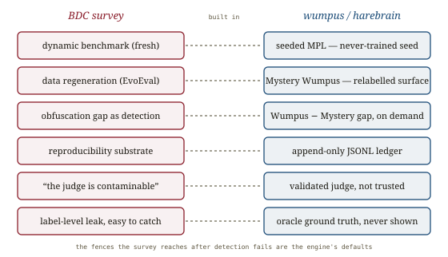

# Benchmark Data Contamination, *quarantined*

*Cliff notes on Xu, Guan, Greene & Kechadi, "Benchmark Data Contamination of Large Language Models: A Survey" (UCD, June 2024) — the survey that names, grades, and tries to fence off the leak that makes most leaderboard numbers suspect. In this repo it has a shorter name already: the **obfuscation gap**, and the reason the wumpus engine generates its problems instead of shipping them.*

---

## The leak, defined

A benchmark number is a claim about a *capability*. Benchmark Data Contamination (BDC) is the event that voids the claim: the model saw the test — or something close enough to it — during training, so the score measures retrieval, not the thing the benchmark was built to measure.

> **Definition 1, verbatim.** *"Exposure of a large language model to benchmark data during the training process leads to distorted evaluation results."*

The survey's first contribution is to stop treating "contamination" as one thing. It is four things, stacked by severity:

*Four levels of leak. Severity climbs toward the label rung; detectability climbs the other way. The dangerous rung is the bottom one — the leak that wears the costume of general knowledge.*

| Level | What leaked | Why it bites |
|---|---|---|
| **Semantic** | Same-topic / same-source content, no test items | Biases the model toward the benchmark's worldview; **hardest to detect** |
| **Information** | Metadata, label distributions, time stamps, reviews | Tilts priors before a question is even read |
| **Data** | The test inputs, labels stripped | Familiarity with the items themselves |
| **Label** | The full test, answers included | Direct memorisation; **most severe, but easiest to catch** |

That inversion is the load-bearing idea. Label-level leakage is a disaster *and* a gift — a 13-gram match flags it. Semantic-level leakage is subtle, ubiquitous, and effectively undetectable, because "the model has read a lot about this topic" is indistinguishable from "the model is knowledgeable." The contamination you can catch is the contamination that matters least.

## Detecting it — two families, one losing arms race

The survey sorts every detection method into two bins.

**Matching-based** methods hunt for direct overlap: *dataset inspection* (n-gram overlap — GPT-3 flagged a 13-gram match, GPT-4 a 50-character match), *membership inference* (prompt the model and check whether it reproduces test items), and *example generation*. Sharp instances: Deng et al.'s **TS-Guessing** masks an answer option and asks the model to fill it — a contaminated model guesses the held-out option too well; Chang et al.'s **name-cloze** strips proper names from a passage and finds that a model's ability to restore them tracks the passage's web frequency. Memorisation, measured.

**Comparison-based** methods need no access to training data: compare *content* (similarity, output distribution, **perplexity** — contaminated text is unusually un-surprising), *sequence order* (Oren et al. prove contamination by testing a benchmark's canonical ordering against a shuffle), or *chronology* (Li & Flanigan: models do better on datasets released *before* their training cutoff — the cleanest natural experiment in the field).

*Two ways to catch the leak, three ways to fence it — and the result that breaks the left half of the page.*

> **The blow that ends the detection game.** Dekoninck et al.'s **Evasive Augmentation Learning** rephrases benchmark samples during fine-tuning and lifts benchmark scores ~15% **while evading every contamination detector surveyed.** Yang et al. and Ippolito et al. show the same for n-gram matching: a paraphrase walks straight through it, and a 13B model so trained rivals GPT-4 on the leaked benchmark. Detection is a cat-and-mouse game the mouse wins. The survey's quiet verdict: you cannot *audit* your way to a clean number. You have to build the benchmark so the leak can't happen.

## Fencing it off — three families of mitigation

If detection loses, mitigation has to carry the weight. Three strategies:

- **Data curation — make the data unseeable.** *Private benchmarks* (Chandran et al., Jacovi et al.) hold the test set behind encryption or confidential computing so it never enters a crawl. *Dynamic benchmarks* (LatestEval, LiveCodeBench, NPHardEval) draw only on post-cutoff material and refresh continuously. Both work; both cost — privacy buys opacity, freshness buys non-reproducibility.
- **Data refactoring — transform what you have.** *Data regeneration* rewrites existing items so the surface differs while the structure holds. **EvoEval** evolves HumanEval along five axes (Difficult, Creative, Subtle, Combine, Tool-use) and watches scores fall **39.4% on average across 51 models**. **DyVal 2 / Meta Probing Agents** apply five surface principles — paraphrase the question, paraphrase the choices, permute the choices, add context, add a distractor option — to manufacture fresh instances on demand. *Content filtering* (Dodge et al.'s C4 audit) scrubs known leakage out.
- **Benchmark-free evaluation — drop the fixed test.** *LLM-as-judge* (TreeEval runs an irreproducible, generated evaluation session) and *human participation* (Chatbot Arena, 240K+ pairwise votes) sidestep the static benchmark entirely.

> **The caveat that closes the loop.** The survey is blunt that benchmark-free evaluation is not contamination-free: *"even LLMs acting as evaluators draw on the knowledge of their training data."* A contaminated judge launders a contaminated answer. This is the exact crack the companion summary [Assessing LLM-as-a-Judge](../assessing-judges/assessing-judges.md) pries open, and the reason the [ABC checklist](../agentic-benchmarks/agentic-benchmarks.md) demands a *validated* judge rather than a trusted one.

The honest conclusion of Section 5: BDC cannot be eliminated. Large-scale pre-training *requires* swallowing the open web, which *contains* the benchmarks; and AIGC makes the corpus recursively self-contaminating. Semantic-level leakage is here to stay. The best you can do is generate fresh, or generate private, or generate on demand — and report what you couldn't rule out.

## The obfuscation gap, in numbers

The single idea this repo already took from the contamination literature is the one EvoEval quantifies. Hold a problem's structure fixed; change only its surface. A reasoner is invariant to the change; a memoriser collapses.

*The drop is the measurement. Whatever performance evaporates when you relabel the surface was retrieval wearing the costume of reasoning.*

This is the same instrument three times over: EvoEval's 39.4% HumanEval drop, DyVal 2's surface-principle transforms, and — from the planning literature — [LLM-Modulo](../llm-modulo/llm-modulo.md)'s Blocksworld→Mystery-BW renaming, where every model fell from ~50% to ~1%. The survey gives the technique its proper home: it is **data regeneration as a detection method**. Relabel, re-run, and read the gap.

## Where this sits in the harebrain hypothesis

The harebrain thesis is `harebrain = fast LLM brain × structured game-AI cage`, and the way you find out whether the cage earns its keep is the wumpus experiment matrix. A benchmark only means something if its numbers aren't contaminated — and this survey is the catalogue of every way they get contaminated, plus every fence that holds. The good news for harebrain: the wumpus engine was already built on the fences this paper recommends, not the audits it shows failing.

*The mitigations the survey arrives at after detection fails are the wumpus engine's defaults.*

| BDC survey | wumpus / harebrain |
|---|---|
| Dynamic benchmark (fresh, post-cutoff) | seeded MPL generation — every seed a never-trained instance |
| Data regeneration (EvoEval / DyVal2 surface transforms) | **Mystery Wumpus** — relabelled surface, byte-identical engine + seed |
| Obfuscation gap as detection method | the gap between Wumpus and Mystery Wumpus, run on demand |
| Chronological / reproducibility substrate | the append-only JSONL ledger — same seed, same trace |
| "The judge is contaminable too" | the soft-critic warning — [validated judge](../assessing-judges/assessing-judges.md), not trusted |
| Label-level leak, easy to catch | the oracle solver's ground truth, never shown to the brain |

### What the paper gives harebrain

- **A reason the wumpus engine *generates* rather than *ships* its problems.** A fixed wumpus benchmark posted to GitHub would be label-level contaminated within one crawl. A seeded engine that synthesises a fresh, solvable map per run is the survey's "dynamic benchmark" mitigation made native — contamination-immune by construction, not by audit. The design choice the briefing records was the right one, and this paper is why.
- **The vocabulary that names what Mystery Wumpus *is*.** Harebrain framed the relabelled surface as an obfuscation-gap probe. The survey classifies it precisely: Mystery Wumpus is *data regeneration* (a surface transform over a held structure) deployed as *contamination detection* (the performance gap is the measurement). Same construct the field calls EvoEval and DyVal2 — but as a first-class engine feature rather than a one-off dataset.
- **The four-level ladder as a spec for what the surface seam must scrub.** To make Mystery Wumpus a clean reasoning test, the relabelling has to remove *semantic* and *information* leakage (room names, lore, any token that co-occurs with wumpus strategy on the web), not just *label* leakage (the answer). The ladder tells you which rungs the seam is responsible for.
- **Proof that detection-after-the-fact is the wrong posture.** EAL evades every detector. The cage's answer is structural: don't detect the leak, make it unreachable — generate the instance fresh. This is the same move harebrain makes against drift (the unwanted state isn't in the chart) applied to contamination (the test item isn't in the corpus).

### What harebrain pushes that the paper doesn't

- **Procedural generation as a *stronger* dynamic benchmark.** The survey's dynamic benchmarks (LatestEval, LiveCodeBench) still harvest *real* post-cutoff text, which ages into contamination the moment it's crawled and may itself be AIGC. A seeded game engine has no such half-life: seed `N+1` is as fresh as seed `N`, forever, and provably never in any corpus because it didn't exist until the RNG produced it. Wumpus sidesteps the survey's own confessed limit ("new data is only uncontaminated until it is incorporated into a future LLM").
- **The obfuscation gap as a continuous gauge, not a one-shot study.** EvoEval and DyVal2 are papers — run once, reported once. Harebrain wires the Wumpus↔Mystery-Wumpus gap into the experiment matrix as a standing metric: a regression eval you re-run every change, the way [eval-engineering](../evaluation-engineering/evaluation-engineering.md) prescribes. Contamination resistance becomes a number you watch, not a study you cite.

> **The trap to mark, in the survey's own vocabulary.** The wumpus engine defeats *data*- and *label*-level contamination by construction — but the survey's hardest rung is *semantic*, and an LLM that has read the strategy ("when you smell a stench, an adjacent room holds the wumpus") carries that knowledge into a freshly-seeded map. Procedural generation refreshes the *instance*, not the *domain knowledge*. Mystery Wumpus is the only lever against semantic leakage, and only to the degree its relabelling is total. Claim contamination-immunity for the map; do not claim it for the rules.

## What's worth taking away

- Contamination is four leaks, not one, and they run opposite to intuition: the severe ones are catchable, the catchable ones aren't severe, and the unfixable one (semantic) is the one that looks exactly like competence.
- Detection is a losing arms race — EAL walks through every detector. The survey's real recommendation, read between the lines, is harebrain's: don't audit the leak, architect it out. Generate fresh, generate private, generate on demand.
- The obfuscation gap is *data regeneration used as detection*. EvoEval's 39.4%, DyVal2's surface transforms, and Mystery Wumpus are the same instrument; the gap they expose is the share of "performance" that was retrieval.
- Wumpus is the survey's dynamic-benchmark mitigation taken to its limit: a seeded engine has no contamination half-life. That is the lucky structural property — small named state, a sound oracle, procedural freshness — that makes it a good harebrain substrate in the first place.
- Hold the line on semantic leakage. Procedural generation buys a fresh *instance*, not a fresh *domain*; only a total surface relabelling touches the rung the survey says is uncatchable.

---

**Sources.** Xu, C., Guan, S., Greene, D., & Kechadi, M-T. "Benchmark Data Contamination of Large Language Models: A Survey." University College Dublin, June 2024. arXiv:2406.04244 ([raw PDF in this folder](Benchmark-Data-Contamination-of-LLMs-A-Survey-2406.04244.pdf)). Key works it catalogues: Dekoninck et al., "Evading Data Contamination Detection… is (too) Easy" (arXiv:2402.02823); Oren et al., "Proving Test Set Contamination for Black-Box Language Models" (ICLR 2024); Xia et al., "EvoEval" (arXiv:2403.19114); Zhu et al., "DyVal 2 / Meta Probing Agents" (arXiv:2402.14865); Li & Flanigan, "Task Contamination" (AAAI 2024). Related in this repo: [Rigorous agentic benchmarks (ABC)](../agentic-benchmarks/agentic-benchmarks.md) and its judge-validation pillar, [Assessing LLM-as-a-Judge](../assessing-judges/assessing-judges.md) (the contaminable judge), [Towards Evaluation Engineering](../evaluation-engineering/evaluation-engineering.md) (the regression-eval home), [LLM-Modulo](../llm-modulo/llm-modulo.md) (Blocksworld→Mystery-BW, the planning-side obfuscation gap), the [harebrain thesis](../../harebrain/harebrain.md), and the wumpus experiment matrix in `definitions.md`. All diagrams above are original SVGs drawn for this page.
