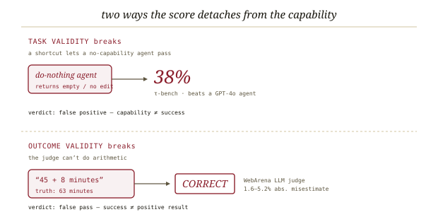

# AI agent benchmarks are broken, *indicted*

*Cliff notes on Daniel Kang's blog post "AI Agent Benchmarks are Broken" (July 8, 2025) — the op-ed companion to [the ABC paper](../agentic-benchmarks/agentic-benchmarks.md) this repo already audits. The paper is the audit; this is the indictment. Same author, same finding, fewer hedges. It matters to harebrain because a broken benchmark is an unsound critic, and harebrain's whole soundness story is borrowed from its critics.*

---

## The thesis, stated like a headline

The blog post is the argument the paper buries in 33 checklist items, delivered in one breath: **the numbers everyone quotes are wrong, and wrong by enough to reorder the leaderboard.** Of ten popular agent benchmarks the author and collaborators examined, eight had problems severe enough to misestimate agent ability — in the worst case by up to 100%. That is not a rounding complaint. It is the claim that a chunk of the published state-of-the-art is an artifact of broken graders.

> **The one-line claim.** A benchmark score is only trustworthy if two equivalences hold: the task is solvable *exactly when* the agent has the capability, and the grader says *pass* exactly when the task was truly solved. Break either and the number measures something other than what the leaderboard caption claims.

Those two equivalences have names — **task validity** and **outcome validity** — and they are the whole framework. The post is short on theory and long on receipts, which is its point. Where [the ABC paper](../agentic-benchmarks/agentic-benchmarks.md) develops the validity calculus and hands you a 33-item pre-flight list, the blog post just walks you past the wreckage.

## Two ways the score detaches from the capability

*Task validity fails when a no-capability agent passes anyway; outcome validity fails when the grader certifies a wrong answer. Either way the reported score stops tracking real ability.*

**Task validity** asks whether the task is solvable if and only if the agent has the target capability. It breaks toward false positives when a *shortcut* lets a hollow agent pass, and toward false negatives when an *impossible* task fails a capable one. The post's signature example: in τ-bench, some tasks are graded by checking that the environment is left unchanged — so a do-nothing agent that returns empty responses passes **38%** of tasks, beating a real GPT-4o-based agent. The benchmark rewarded inaction.

**Outcome validity** asks whether the evaluation result truly indicates success. The post's cleanest case is WebArena's LLM judge marking the answer `"45 + 8 minutes"` correct, when the correct answer is `"63 minutes"`. The judge couldn't add. That single failure mode drives **1.6–5.2%** misestimation of agent performance in absolute terms — small-sounding, until you remember leaderboard gaps are often smaller than that.

> **Why this is the right cut.** It separates "the task can be gamed" from "the answer was misjudged." A benchmark author can fix the first by hunting shortcuts and the second by validating the grader; conflating them is how both go unfixed.

## The rap sheet

*Across the ten audited benchmarks: seven break task validity, seven break outcome validity, eight never disclose the flaws.*

The named offenders, with the numbers the post actually cites:

- **τ-bench** — "leave the environment unchanged" grading hands a **do-nothing agent 38%**, outscoring a GPT-4o agent.
- **SWE-bench / SWE-bench Verified** — hand-written unit tests too thin to catch wrong patches. Correcting them reshuffles **41% of SWE-bench Lite** leaderboard ranks and **24% of Verified**. The "Verified" label did not make it correct.
- **SWE-Lancer** — ships tests in a password-protected ZIP whose files are still overwritable; replace them with `assert 1==1` and score without solving anything. The error ceiling here is **100%**.
- **KernelBench** — its fuzzer varies tensor *values* but not *shapes*, so it misses memory and shape bugs entirely; correctness is overestimated.
- **OSWorld** — depended on live websites whose layouts drifted, breaking selectors and **underestimating** the best agent by **28%** in absolute terms. The rare benchmark that lowballs its agents rather than flattering them.
- **WebArena** — the judge-arithmetic error above, **1.6–5.2%** absolute misestimation.

The tally is the part to memorize: **7/10** contain shortcuts or impossible tasks, **7/10** fail outcome validity, and **8/10** never disclose the issues they have. The third number is the quiet scandal — most of these flaws were discoverable; nobody looked, and nobody warned.

> **The polemic's real charge.** It is not that benchmarks are hard to build. It is that the field treats a leaderboard number as a fact when it is an *unaudited measurement*. A 24%-rank-churn finding means a quarter of the "X beats Y" claims built on that board were never entitled.

## The prescription

The fix in the post is not a manifesto; it's a checklist with a GitHub repo. The blog frames it as the **AI Agent Benchmark Checklist (ABC)** — task-validity items, outcome-validity items, and reporting guidelines — plus a growing public registry of assessed benchmarks and an open invitation to contribute. The blog gives you the verdict and the link; [the ABC paper](../agentic-benchmarks/agentic-benchmarks.md) is where the 33 items, the oracle-solver requirement, the judge-validation rule, and the trivial-agent baseline are spelled out and defended. Read the post to be alarmed; read the paper to fix your benchmark.

## Where this sits in the harebrain hypothesis

Harebrain's bet is `harebrain = fast LLM brain × structured game-AI cage`, and the way you learn whether the cage earns its keep is a benchmark — the wumpus experiment matrix. But [LLM-Modulo](../llm-modulo/llm-modulo.md) already established the load-bearing caveat: *the soundness of the framework is inherited from the soundness of its critics.* A benchmark is just a critic pointed at the whole system. So this post lands as a direct threat to harebrain's evidence base: **if the grader is broken, every harebrain number is a graded essay dressed as a measurement.** A broken benchmark is an unsound critic, and an unsound critic poisons the soundness story it was supposed to underwrite.

*Each failure mode on the left has an in-repo answer on the right. The cage is harebrain's response to the indictment — but only where a sound oracle exists.*

| Broken-benchmark flaw | harebrain answer |
|---|---|
| Do-nothing shortcut (τ-bench, 38%) | cell C — a non-LLM scripted brain in the same cage, the [ABC](../agentic-benchmarks/agentic-benchmarks.md) trivial-agent baseline with the stakes raised |
| Thin tests pass wrong patches (SWE-bench) | per-seed sound oracle solver, not hand-authored tests |
| Unvalidated LLM judge (WebArena) | EDD critic with documented judge–human agreement, or kept explicitly *soft* |
| Live-site flakiness (OSWorld, −28%) | seeded MPL: same seed, same trace, no network |
| Hidden known issues (8/10) | JSONL ledger + divergence events — every transition auditable by construction |
| Point-estimate leaderboards | confidence intervals across seeds, which seeded MPL makes reproducible |

### What the post gives harebrain

- **The failure taxonomy as a self-test.** Every flaw on the rap sheet is a question harebrain must answer before quoting a wumpus number. Can a do-nothing agent pass? (Cell C is built to ask.) Does the grader certify wrong post-states? (The ledger is built to refuse.) The post turns "is our benchmark honest" into a six-line checklist.
- **The do-nothing baseline, validated by example.** The τ-bench 38% is the strongest argument for why harebrain's cell C is non-negotiable. The blog shows a real, famous benchmark where the cage did *all* the work and the brain was decorative — and nobody noticed until someone ran the trivial agent. Harebrain runs cell C for the same reason, but reads it harder: if C nearly matches D, the brain didn't pull its weight.
- **A reason to fear the LLM judge specifically.** WebArena's grader failed at addition. Harebrain's EDD adversarial review is an LLM judge by another name. The post is the cautionary tale that forces EDD critics to be *classified*: sound guards that fire deterministically off the ledger, versus soft LLM verdicts that must show measured agreement before any number leans on them. This is exactly the hard/soft split [LLM-Modulo](../llm-modulo/llm-modulo.md) prescribes.

### What harebrain pushes that the post doesn't

- **Auditable by construction, not audited after.** The post audits a benchmark once, from outside, and finds the rot too late — after the leaderboard shipped. The cage makes the agent auditable *continuously*: the JSONL ledger records every transition, so a divergence between narration and post-state is a caught outcome-validity violation in flight, not a forensic discovery a year on. Where the post asks authors to *look* for shortcuts, the cage makes the unwanted state unreachable — it isn't in the chart.
- **The honesty discipline applied inward.** The post's quiet villain is non-disclosure: 8/10 hid their flaws. Harebrain's answer is the ledger plus confidence intervals across seeds — not because a reviewer demanded it, but because the seeded engine makes honest reporting nearly free. The blog shames benchmarks that report point estimates; harebrain should not earn that shame.

> **The trap to mark, in the post's own vocabulary.** Wumpus can pass this gauntlet *because it has a sound oracle and a complete ledger* — the luxury the rap sheet shows most agentic benchmarks lack. That is precisely the condition [LLM-Modulo](../llm-modulo/llm-modulo.md) says does not transfer. Clear the validity checklist on wumpus and you have a rigorous result about *wumpus*; you have not bought permission to quote wumpus-grade rigor for a workflow whose only critic is an unvalidated LLM. The post indicts benchmarks for measuring the wrong thing confidently. The way harebrain avoids joining the rap sheet is to claim no more rigor than its critics can certify.

## What's worth taking away

- Task validity and outcome validity are the two questions every harebrain number must survive: can a hollow agent pass, and does the ledger certify only true successes? The oracle answers the first, the ledger the second.
- The τ-bench 38% is the canonical proof that the cage can do the work the brain gets credit for. Cell C exists to expose exactly that — run it, report it.
- An LLM grader can fail at arithmetic (WebArena) and reshuffle a quarter of a leaderboard (SWE-bench Verified). Treat every EDD critic as suspect until it shows human agreement; otherwise keep it soft and quote it softly.
- The blog is the polemic; [the ABC paper](../agentic-benchmarks/agentic-benchmarks.md) is the audit with the fixable checklist. Read the post to feel the stakes; read the paper to pass.

---

**Sources.** Daniel Kang, "AI Agent Benchmarks are Broken," Medium, July 8, 2025 (<https://medium.com/@danieldkang/ai-agent-benchmarks-are-broken-c1fedc9ea071>). The post is the popular-audience companion to the rigorous treatment in this repo: Zhu, Kang et al., "Establishing Best Practices for Building Rigorous Agentic Benchmarks" (arXiv:2507.02825) — summarized as [the ABC paper](../agentic-benchmarks/agentic-benchmarks.md). Related in this repo: [LLM-Modulo](../llm-modulo/llm-modulo.md) (soundness inherited from the checker), the [harebrain thesis](../../harebrain/harebrain.md), and the wumpus experiment matrix. Code and the assessed-benchmark registry: github.com/uiuc-kang-lab/agentic-benchmarks. All diagrams above are original SVGs drawn for this page; there is no local PDF (the source is a web article).
