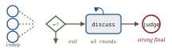
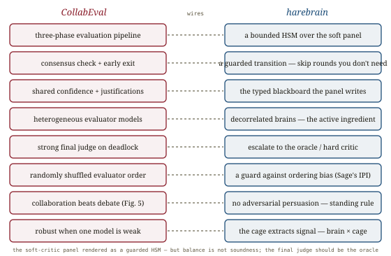

# CollabEval, *convened*

*Cliff notes on Qian, Zhang, Zhou, Ding, Socolinsky & Zhang (Amazon AWS Generative AI Innovation Center & Bedrock, AAAI 2026), "CollabEval: Enhancing LLM-as-a-Judge via Multi-Agent Collaboration" — the paper that writes down the assembly instructions for a soft-critic panel: independent verdicts, a consensus gate with early exit, a bounded discussion loop, and a strong-judge tiebreaker. It is the operational state machine for the panel that [Sage](../assessing-judges/assessing-judges.md) and [Multi-Agent Debate](../judge-debate/judge-debate.md) both told you to prefer over debate.*

---

## The recipe, not the theorem

[Multi-Agent Debate](../judge-debate/judge-debate.md) proved *why* a collaborative panel beats majority voting (Bayesian amplification of a correct seed) and [Sage](../assessing-judges/assessing-judges.md) proved *that* you should aggregate independent critics rather than let them adversarially debate. Neither tells you the wiring. CollabEval is the wiring — a three-phase pipeline with guarded transitions, built and benchmarked at AWS, deliberately framed as **collaboration, not competitive debate.**

![A three-phase state machine. Phase 1, Initial Evaluation: three heterogeneous evaluators (Mistral Large, Claude Haiku/Sonnet, Llama-3-70b) independently emit a verdict plus a confidence score plus a justification; a consensus-check diamond gates the flow — if they agree, the verdict exits early. Phase 2, Multi-Round Discussion: on disagreement, evaluators see each other's verdicts, confidences, agreements/disagreements and justifications and re-judge, with order randomly shuffled each round; after each round a consensus check, a max-rounds check (cap 3) and an unchanged-results check decide whether to loop or exit. Phase 3, Final Judgment: a deadlock escalates to a single strong model (Claude Sonnet 3.5) that reads the whole discussion history and rules. Below, a callout: every transition is gated; cheap cases exit in one round, hard cases pay for discussion.](images/fig-01-three-phase.svg)
*The whole framework is a bounded state machine over soft critics. **Phase 1** — heterogeneous evaluators judge independently, each emitting a verdict + **confidence** + **justification**; a consensus check exits early if they already agree. **Phase 2** — on disagreement, evaluators exchange their structured assessments and re-judge for up to 3 rounds, shuffled each round to defeat ordering bias; each round is gated by three checks (consensus reached / max rounds / results stopped changing). **Phase 3** — a persistent deadlock escalates to a single strong final judge that rules on the full history. Cheap cases cost one round (avg ~1.5–2.3 across tasks); only genuinely contested cases pay for the discussion.*

The numbers are honest about what this buys: on SummEval criteria scoring CollabEval edges single-LLM judges across coherence/consistency/fluency/relevance (e.g. relevance 49.5% vs Sonnet 47.7%), and on the Arena pairwise sets it leads (60.2% vs 57.7% round-table on Chatbot Arena). The gains are *modest* — these are hard, subjective tasks where even the best single judge sits near 50% — but two non-accuracy findings are the ones worth stealing.

## Orchestration, not averaging — the robustness result

The load-bearing claim is that a heterogeneous panel is **robust to a weak member**. When Llama-3-70b collapses to **22.8%** accuracy on relevance on its own, CollabEval still scores **49.4%** with a single discussion round. The paper is careful to say this is *not* an averaging effect — averaging a 22.8% model with a 47% model gets you neither number. It is an **orchestration** effect: the discussion lets stronger models cross-validate and correct the weaker one's biases.

![Two panels showing orchestration beats averaging. Left: Llama-3-70b on the relevance dimension exhibits a pathological 100% over-evaluation ratio (it always scores high); a naive average would inherit that pull. CollabEval's discussion drags the panel's over-evaluation ratio down to a balanced 31.9%, because the other evaluators contest the inflated scores. Right: a bar pair — Llama-3 alone at 22.8% accuracy on relevance versus the CollabEval panel containing that same weak Llama-3 at 49.4%; the panel does not sink to the weak member, it pulls the weak member up. A caption: the cage extracts signal from weak brains — but only because the brains are decorrelated.](images/fig-02-orchestration.svg)
*The orchestration mechanism. **Left:** Llama-3 alone shows a pathological **100% over-evaluation** bias on relevance (it always inflates); CollabEval's discussion contests those scores and rebalances the panel to a **31.9%** over-evaluation ratio. **Right:** the same weak Llama-3 (22.8% solo) sits inside a panel that scores **49.4%** — the panel doesn't regress to the weak member, it corrects it. The active ingredient is **model heterogeneity**: decorrelated errors are what let stronger critics overrule a weaker one's bias. A panel of identical models would have correlated biases and nothing to cross-validate.*

The second finding lands exactly where [Sage](../assessing-judges/assessing-judges.md) and [Multi-Agent Debate](../judge-debate/judge-debate.md) did. The authors run their own ablation — **collaboration mechanism vs. debate mechanism on the same panel** (their Figure 5) — and collaboration wins across *every* dimension. Three independent papers now converge on the same rule: **share insights and build consensus; do not stage an adversarial debate.** CollabEval adds the engineering corollary that the others left implicit — *bound the collaboration with consensus-gated early termination*, because the marginal round saturates fast (even one round captures most of the gain; past two, returns vanish to information saturation).

## Where this sits in the harebrain hypothesis

The harebrain thesis is `harebrain = fast LLM brain × structured game-AI cage`. The cage guards transitions with **hard critics** (sound, deterministic) and **soft critics** (LLM-as-judge — the EDD review). [LLM-Modulo](../llm-modulo/llm-modulo.md) gave the hard critic its soundness; [Sage](../assessing-judges/assessing-judges.md) gave a single soft critic an oracle-free validation; [Multi-Agent Debate](../judge-debate/judge-debate.md) gave the *theory* of a soft-critic panel. CollabEval gives the **HSM** — a concrete, bounded, guarded state machine for running that panel, which is exactly the shape the cage already speaks.

*CollabEval is the soft-critic panel rendered as a guarded HSM — the cage's native idiom applied to judgment.*

| CollabEval | harebrain |
|---|---|
| Three-phase evaluation pipeline | a bounded HSM over the soft-critic panel |
| Consensus check + early termination | a guarded transition — don't spend rounds you don't need |
| Shared confidence scores + justifications | the typed blackboard the panel reads and writes |
| Heterogeneous evaluator models | decorrelated brains — independence is the active ingredient |
| Strong final judge on deadlock | escalation to a higher-authority critic when the panel can't rule |
| Randomly shuffled evaluator order | a guard against positional/ordering bias (Sage's IPI, structurally) |
| Collaboration beats debate (Fig. 5) | no adversarial persuasion among critics — the standing rule |
| Robust when one model is weak (orchestration) | the cage extracts signal from weak brains — `brain × cage` |

### What the paper gives harebrain

- **The soft-critic panel as a guarded HSM — the cage's native shape.** CollabEval's three phases *are* a statechart: independent-eval state → consensus guard → bounded discussion state (with max-rounds and unchanged-results guards) → strong-judge terminal state. Harebrain doesn't have to invent the panel topology; it can lift this one wholesale and wire it as the EDD review on a contested transition. The consensus-gated early exit is the part single-shot designs miss: **most transitions don't need a panel at all**, and the guard lets the cheap path stay cheap.
- **Heterogeneity is the active ingredient, named and measured.** The robustness result only works because the evaluators are *different models* with *decorrelated* biases — that is what lets a strong critic overrule a weak one's 100%-over-evaluation pathology. This sharpens [Sage's](../assessing-judges/assessing-judges.md) "independence" and [ABC's](../agentic-benchmarks/agentic-benchmarks.md) "genuinely independent reviewers" into a build constraint: **if harebrain runs a soft-critic panel, the panelists must be distinct models, not the same model sampled `n` times.** A homogeneous panel has correlated errors and nothing to cross-validate — it is [Multi-Agent Debate's](../judge-debate/judge-debate.md) bimodal-collapse failure waiting to happen.
- **A strong-judge escalation tier the cage should generalize to a hard critic.** CollabEval's Phase 3 is the right *structural* move — when the soft panel deadlocks, escalate — but it escalates to *another LLM* (Sonnet 3.5). Harebrain has a better terminal: where a hard critic or oracle exists (the wumpus oracle, a sound verifier), the deadlock should escalate to *that*, not to a stronger soft judge. CollabEval supplies the escalation slot; the cage fills it with soundness.

### What harebrain pushes that the paper doesn't

- **The final judge should be the oracle, not a bigger model.** CollabEval's terminal authority is the most capable *soft* critic available, which inherits all the biases the panel was trying to escape — it is the [two-clocks pattern](../llm-modulo/llm-modulo.md) with two fast clocks and no slow one. Harebrain routes the deadlock to the hard side wherever it can, so the tiebreaker is *sound*, not merely *strong*. CollabEval's pipeline is the right scaffold; harebrain replaces its weakest joint.
- **Consensus is a ledger event, not just a stopping rule.** CollabEval uses consensus to terminate; harebrain already emits a JSONL ledger, so each panel's round count, confidence trajectory, and final-judge-escalation flag become logged telemetry the AI Director can watch. A transition whose panel *routinely* escalates to the final judge is a flagged hot spot — a place the soft critics genuinely disagree, which is exactly where a human or a hard critic should be invested.

> **The trap to mark.** CollabEval's headline virtue is **balance** — it mitigates the extreme over/under-evaluation biases of any single model. But *balanced bias is not correctness*. The panel's accuracy tops out near 50% on these hard subjective tasks, and consensus among biased-but-decorrelated models can still converge on a shared error — the same risk [Multi-Agent Debate](../judge-debate/judge-debate.md) made precise with its bimodal collapse. Worse, the Phase-3 final judge is just another LLM, so a deadlock is resolved by an *unsound* authority. CollabEval makes a soft-critic panel **robust and usable**; it does not make it **sound**. Hold [LLM-Modulo's](../llm-modulo/llm-modulo.md) line: a consensus-passing, bias-balanced panel earns trust as a *soft* critic only — soundness still requires a hard one.

## What's worth taking away

- CollabEval is the soft-critic panel written as a guarded state machine: independent eval → consensus gate → bounded discussion → strong-judge fallback. Harebrain can lift the topology directly.
- The consensus gate with early termination is the design lesson: most cases exit in one round, so a panel needn't be expensive — let the cheap path stay cheap.
- Robustness comes from **orchestration, not averaging**, and only works with **heterogeneous** models — decorrelated errors are what let strong critics correct a weak one's bias. Same model × `n` doesn't count.
- Collaboration beats debate, again — the third independent confirmation. Aggregate and build consensus; never adversarially persuade.
- Balanced bias ≠ correctness, and the LLM final judge is unsound. Route harebrain's deadlock escalation to the oracle/hard critic where one exists; the panel stays a *soft* critic.

---

**Sources.** Qian, Y., Zhang, S., Zhou, Y., Ding, H., Socolinsky, D., & Zhang, Y. "CollabEval: Enhancing LLM-as-a-Judge via Multi-Agent Collaboration." Amazon AWS Generative AI Innovation Center & AWS Bedrock. *Proceedings of the AAAI Conference on Artificial Intelligence, 2026.* [arXiv:2603.00993](https://arxiv.org/abs/2603.00993) ([raw PDF in this folder](CollabEval-LLM-as-a-Judge-via-Multi-Agent-Collaboration-2603.00993.pdf)). Benchmarks: SummEval (Fabbri et al., 2021), Chatbot Arena Conversations & lmsys human-preference 55k (Chiang et al., 2024). Baselines: ChatEval debate (Chan et al., ICLR 2024), ReConcile round-table (Chen, Saha & Bansal, 2023), and the "panel of diverse models" motivation (Verga et al., 2024). Related in this repo: [Multi-Agent Debate for LLM Judges](../judge-debate/judge-debate.md) (the theory of the collaborative panel + adaptive stopping), [Assessing LLM-as-a-Judge (Sage)](../assessing-judges/assessing-judges.md) ("panels help, debate hurts"; the independence rule), [Autorubric](../autorubric/autorubric.md) (the rubric each panelist applies), [Rigorous agentic benchmarks (ABC)](../agentic-benchmarks/agentic-benchmarks.md) (independent reviewers), [LLM-Modulo](../llm-modulo/llm-modulo.md) (hard vs soft critics; soundness only from hard ones), the [harebrain thesis](../../harebrain/harebrain.md), and the wumpus experiment matrix in `definitions.md`. All diagrams above are original SVGs drawn for this page.
