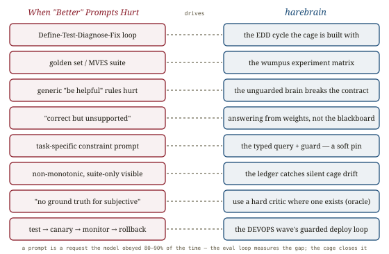

# When "Better" Prompts Hurt, *iterated*

*Cliff notes on Daniel Commey, "When 'Better' Prompts Hurt: Evaluation-Driven Iteration for LLM Applications" (Jan 2026) — a practitioner framework (Define-Test-Diagnose-Fix + the Minimum Viable Evaluation Suite) wrapped around one sharp, reproducible result: a generic "be helpful" prompt silently broke grounding on structured tasks, and only the eval harness caught it. For harebrain this is the empirical case **for** the cage — the unguarded brain optimized one virtue and quietly violated another, and structure plus measurement is what surfaced it. It is the operational companion to the repo's [EDD](../../edd/edd.md) loop.*

---

## The loop, and the result that justifies it

The framework is a four-phase development cycle — **Define** quality in testable terms, **Test** against a curated golden set, **Diagnose** failures into systematic categories, **Fix** the prompt/retrieval/model, repeat — backed by the **Minimum Viable Evaluation Suite (MVES)**: a tiered, version-controlled golden set (50–200 cases, ~20% edge/adversarial) with a Core tier for all apps, a RAG tier (retrieval quality + groundedness), and an Agentic tier (trajectory + per-tool success). All standard, all sensible. The reason to read it is the experiment in §12.

The author ran two prompt strategies on three structured suites (extraction, RAG, instruction-following) across two local models. The "baseline" used *task-specific* prompts ("Output VALID JSON ONLY with keys…"; "Answer using ONLY the sources, say I don't know"). The "improved" prompt added the conventional-wisdom **generic** system wrapper: "be a helpful assistant, provide comprehensive answers, follow these rules…". The result inverts the folklore that more guidance is better.

![A grouped result. For Llama-3-8B, swapping the task-specific baseline for the generic 'improved' prompt moves three suites in different directions: extraction pass rate drops 100 to 90 percent, RAG citation compliance drops 93.3 to 80 percent, but instruction-following rises 53.3 to 66.7 percent. Below, a four-condition ablation: A baseline, B add system wrapper (no change), C add generic rules (extraction breaks, 100 to 90), D full improved (RAG breaks, instruction helped). A banner reads: the wrapper is benign; the generic RULES conflict with task-specific constraints. The 'be helpful' pressure made the model answer beyond its sources.](images/fig-01-nonmonotonic.svg)
*The finding: generic prompt "improvements" are **not monotonic**. The same generic wrapper that lifted instruction-following (+13pp) *degraded* extraction (−10pp) and RAG grounding (−13pp) on Llama-3. The four-condition ablation isolates the mechanism cleanly: the system wrapper alone is **benign** (A→B, no change); the damage comes from **generic rules conflicting with task-specific constraints** (B→C breaks extraction; the full prompt breaks RAG). The "be helpful / be comprehensive" pressure made the model answer **beyond its retrieved sources** — the "correct but unsupported" failure — abandoning the grounding the task-specific prompt had pinned.*

Two things make this more than a prompt-engineering anecdote. First, **it was invisible without the suite**: the change improved one suite, so vibes-based iteration would have shipped it, silently regressing two others on the subset of cases that fail. Second, the **mechanism is diagnostic, not mysterious**: a generic virtue ("be helpful") was optimized at the expense of a task-specific contract ("only cite what's retrieved"), and the two genuinely conflict. That is the harebrain thesis stated as an experiment.

## The "correct but unsupported" failure — the brain leaving the cage

The paper's most harebrain-resonant artifact is the RAG failure mode it keeps returning to. A model asked "Is SSO in the Business plan?" with a context that lists only *shared workspaces, priority support* will confidently answer **"Yes, SSO is included"** — using its parametric memory instead of the retrieved documents. The answer may even be correct in the world; it is **unsupported by the contract**. The fix is a task-specific constraint — *"Answer using ONLY the sources. Cite every claim. If the answer isn't in the sources, say I don't know"* — which flips the model to a correct, ledgered refusal.

> **The pattern, named.** A generic "be helpful" instruction pulls the model *off* its grounding and *into* its weights. The model stops consulting the provided state and starts improvising from parametric memory. That is precisely the unguarded brain breaking the cage's contract — and the only reliable repair is a structural constraint that pins the behavior, plus a check that catches the violation when the pin slips.

## Where this sits in the harebrain hypothesis

The harebrain thesis is `harebrain = fast LLM brain × structured game-AI cage`. The cage's whole reason to exist is that an unguarded brain drifts; this paper is a *controlled measurement of that drift* and of the loop you use to catch it. It is the operational [EDD](../../edd/edd.md) cycle — the development process by which the cage's guards and prompts get built, tested, and hardened.

*The eval-driven loop is how the cage is built and kept honest — and the non-monotonic result is the evidence that the cage's constraints are load-bearing, not decoration.*

| When "Better" Prompts Hurt | harebrain |
|---|---|
| Define-Test-Diagnose-Fix loop | the EDD cycle the cage is built and refined with |
| Golden set / MVES regression suite | the wumpus experiment matrix — seeded cells that catch regressions |
| Generic "be helpful" rules degrade structured tasks | the unguarded brain breaks the cage's contract |
| "Correct but unsupported" RAG answer | the brain answering from weights, not the blackboard/oracle |
| Task-specific constraint prompt fixes it | the typed query + guard pins behavior — but only softly |
| Ablation: wrapper benign, generic rules conflict | structure isn't free; the *wrong* constraint actively harms |
| Non-monotonicity only visible via the suite | you cannot eyeball cage changes — the ledger catches silent drift |
| "No ground truth for subjective dims" | why harebrain needs hard critics where it can get them (the oracle) |
| test → canary → monitor → rollback | the DEVOPS wave's guarded deployment loop |

### What the paper gives harebrain

- **A reproducible measurement of why the cage exists.** Harebrain asserts that an unguarded brain drifts and that structure is what keeps it honest. This paper *measures* it: a generic helpfulness instruction cost 10–13 percentage points on structured guarantees (JSON format, source grounding) while helping a different dimension. The cage is not over-engineering — it is the response to a quantified failure. "Better" prompts hurt precisely when a generic virtue overrides a task-specific contract, which is the exact thing the cage's guards prevent.
- **The development loop the cage is built with.** Define-Test-Diagnose-Fix is the [EDD](../../edd/edd.md) cycle operationalized for prompts and guards. Every guard, every soft-critic prompt, every state transition in the cage is a change that can regress something else non-monotonically. The paper's discipline — *validate every change against a task-specific suite, diagnose by failure category, never trust a change because conventional wisdom blesses it* — is exactly how harebrain should evolve the wumpus engine's prompts and guards. The experiment matrix is the golden set; the JSONL ledger is the diagnostic log.
- **"Correct but unsupported" as the canonical grounding-guard violation.** This failure mode — the model answering from parametric memory instead of provided state — is the soft-critic and tool-use failure harebrain most needs to guard. The paper's fix (a hard "only cite the sources / else refuse" constraint) is the prompt-level analogue of the cage's guard: the difference is that harebrain can make the refusal *structural* (reject the transition) rather than *requested* (hope the model complies).

### What harebrain pushes that the paper doesn't

- **A prompt constraint is a request; the cage's guard is a guarantee.** The paper's "fix" is still a prompt — and even the best task-specific prompt left Llama-3 at **90% / 80%**, not 100%. The brain defied the explicit instruction 1-in-10 and 1-in-5 times. That residual is the whole argument for harebrain: where correctness is load-bearing, you cannot ship a soft pin and call it fixed. Promote the constraint from a prompt the model *may* follow to a guard that *rejects* the violating transition, backed by a hard critic (the wumpus oracle) where one exists. **The eval loop measures the 10–20% gap; the cage closes it.**
- **The loop should run continuously inside the cage, not just at dev time.** The paper's test→canary→monitor→rollback is a deployment ritual. Harebrain already emits a per-transition ledger, so the same checks (format validity, grounding, constraint pass) run *live* on every transition — the offline golden set becomes runtime telemetry, and the AI Director watches for the non-monotonic drift the paper had to run a batch job to find. Prompt drift becomes a logged event, not a quarterly surprise.

> **The trap to mark, in the paper's own words.** The author is explicit that "there is no ground truth for subjective dimensions" and that "formal verification… is not applicable to LLM outputs." That is the boundary harebrain lives on: where a hard critic or oracle exists (the wumpus solver), promote the soft pin to a hard guard and inherit soundness ([LLM-Modulo](../llm-modulo/llm-modulo.md)). Where it doesn't, the eval loop and a validated soft critic ([Sage](../assessing-judges/assessing-judges.md), [Autorubric](../autorubric/autorubric.md)) are the *best available* — usable, not sound. The non-monotonic result is the reminder that even a careful, well-intentioned change can silently regress a guarantee. Measurement is mandatory; structure is what makes the measurement pass reliably.

## What's worth taking away

- "Better" prompts are not monotonic: a generic "be helpful" rule lifted one dimension and silently broke two others (−10pp extraction, −13pp RAG grounding). Only a task-specific eval suite caught it.
- The mechanism is the harebrain thesis as an experiment: a generic virtue overrode a task-specific contract. The system wrapper was benign; the *conflicting rules* did the damage.
- "Correct but unsupported" is the brain answering from its weights instead of the provided state — the canonical grounding-guard violation, and the one harebrain most needs to make structural.
- Define-Test-Diagnose-Fix is the [EDD](../../edd/edd.md) loop the cage is built with; the experiment matrix is its golden set and the ledger is its diagnostic log.
- A prompt constraint is a request the model obeyed only 80–90% of the time. Where correctness is load-bearing, promote the soft pin to a hard guard. The eval loop measures the gap; the cage closes it.

---

**Sources.** Commey, D. "When 'Better' Prompts Hurt: Evaluation-Driven Iteration for LLM Applications — A Framework with Reproducible Local Experiments." January 2026. [arXiv:2601.22025](https://arxiv.org/abs/2601.22025) ([raw PDF in this folder](When-Better-Prompts-Hurt-Evaluation-Driven-Iteration-2601.22025.pdf)). Code & data: github.com/dcommey/llm-eval-benchmarking (Ollama; Llama-3-8B-Instruct, Qwen-2.5-7B-Instruct; temperature 0). Builds on RAGAS (Es et al., 2023), FActScore (Min et al., 2023), MT-Bench LLM-as-judge (Zheng et al., 2023), and the judge-bias literature (Wang et al., 2023; Panickssery et al., 2024). Related in this repo: [Benchmark Data Contamination](../benchmark-contamination/benchmark-contamination.md) (the data-contamination concern this paper echoes), [Assessing LLM-as-a-Judge (Sage)](../assessing-judges/assessing-judges.md), [Autorubric](../autorubric/autorubric.md), [Multi-Agent Debate](../judge-debate/judge-debate.md) and [CollabEval](../collabeval/collabeval.md) (the soft-critic stack this loop validates), [Evaluation Engineering](../evaluation-engineering/evaluation-engineering.md) (the harness-as-product companion), [LLM-Modulo](../llm-modulo/llm-modulo.md) (hard vs soft critics; soundness only from hard ones), the harebrain [EDD](../../edd/edd.md) note, the [harebrain thesis](../../harebrain/harebrain.md), and the wumpus experiment matrix in `definitions.md`. All diagrams above are original SVGs drawn for this page.
