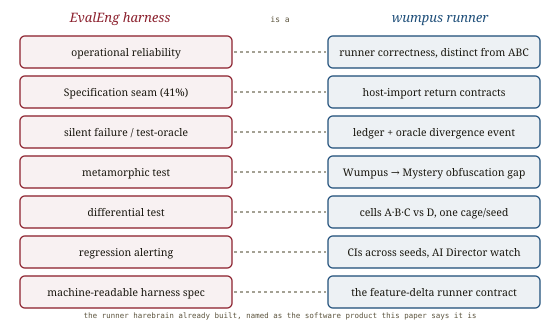

# Evaluation Engineering, *instrumented*

*Cliff notes on Zhao, Wang, Bangash, Adams & Hassan, "Towards Evaluation Engineering: An Empirical Study of ML Evaluation Harnesses in the Wild" (Queen's SAIL et al., May 2026) — the first paper to study the **software that runs the benchmark** as an engineered product, mining 16,560 issues across 57 harnesses. For harebrain it names the axis the other eval summaries don't touch: not "is the measurement valid?" but "does the runner execute it correctly?" — and the wumpus runner is a harness.*

---

## The axis nobody was measuring

Every other evaluation paper in this repo asks whether the *measurement* is sound: [is the benchmark contaminated](../benchmark-contamination/benchmark-contamination.md), [is the judge consistent](../assessing-judges/assessing-judges.md), [does the task validity hold](../agentic-benchmarks/agentic-benchmarks.md). This paper asks an orthogonal question: even with a perfect metric, does the *software that runs it* execute correctly? The two are independent — and both have to hold.

> **The distinction, exactly.** *Benchmarks* define the **what**: tasks, datasets, ground-truth references, scoring metrics. *Evaluation harnesses* define the **how**: model invocation, resource management, error handling, aggregation, reporting. "Benchmark validity (whether a metric captures the intended construct) and operational reliability (whether infrastructure executes measurement correctly) are orthogonal engineering challenges. A theoretically sound metric implemented in fragile infrastructure yields unreliable results."

*Validity and reliability are independent. A sound metric in a buggy runner produces confident, wrong numbers — and the repo had only been measuring the horizontal axis.*

The literature, the authors note, treats the harness as "a transparent medium." It is not. It is software, with failure modes, and nobody had catalogued them. **Evaluation engineering** (EvalEng) is the name they give to the SE discipline of building runners that don't corrupt the measurement.

## Five stages, and the seam where it breaks

From open-card-sorting 57 harnesses, the authors derive a five-stage workflow — the anatomy of any runner.

![A five-stage horizontal pipeline: Provisioning (install + credentials), Specification (SUT + inputs + references/judge — flagged '41.4% of all issues, the integration seam'), Execution (run the SUT), Assessment (scoring — flagged 'silent failures live here'), Reporting (flagged 'least supported: regression alerting 8.8%, uncertainty quant 22.8%'). Below, an arc shows root causes shifting from 'environment / dependency' in early stages to 'scoring / validation correctness' in late stages, with 'validation gap' spanning all five.](images/fig-02-five-stages.svg)
*Provisioning → Specification → Execution → Assessment → Reporting. Failures cluster where the runner integrates external parts (the Specification seam) and where it computes scores (silent, in Assessment). Validation gap is the only root cause present in every stage.*

The findings are specific and, for a cage-builder, pointed:

- **The seam is where it breaks.** The **Specification** stage — where the harness wires together the model, the dataset, and the scoring judge — accounts for **41.4%** of all issues. Integration with remote model APIs causes 48.5% of model-prep issues; loading offline data causes 76.4% of input-prep issues. The joints leak, not the pipes.
- **The burden is operationalization, not metric math.** The top three root causes are **unimplemented feature gap (24.3%)**, **documentation deficiency (20.3%)**, and **validation gap (17.2%)** — 61.7% of everything. Actual scoring errors are only 8.3%. The hard part isn't computing the metric; it's everything around it.
- **Validation gap is cross-cutting.** It is the *only* root cause above 10% in all five stages, peaking at Assessment (22.7%). Data passes between stages syntactically valid but semantically wrong, and nothing checks it.
- **Production-grade capabilities are mostly absent.** Only **22.8%** of harnesses quantify uncertainty around scores; only **8.8%** alert on regression between runs; only 7.0% handle production traffic. Most runners can't tell you whether a score difference is real or noise.

## The silent failure — and the test-oracle problem

Here is the insight that should make every harness-builder nervous. In ordinary software, a bug throws an exception. In an evaluation runner, ML metrics are *continuous and aggregate*, so a bug surfaces as a **plausible wrong number** — no crash, no stack trace, just a score that's quietly off.

![Left: a buggy scorer produces a plausible-looking number (e.g. ROUGE-L ≈ 1.0, or mean_iou silently computing recall) with no exception — labelled 'the harness's own output becomes the implicit ground truth: the test-oracle problem'. Right: an independent reference (a sound oracle + a complete ledger) sits beside the scorer; the mismatch lights up as a caught 'divergence event'. Below, two SE techniques: metamorphic testing (relabel the input → score must be invariant) and differential testing (two independent implementations must agree).](images/fig-03-silent-failure.svg)
*Without an independent reference, the runner grades its own homework. A sound oracle and a complete ledger turn the silent miss loud.*

The paper's catalogue of caught-by-luck bugs is the argument:

- Hugging Face Evaluate's `mean_iou` computed **recall**, not Intersection-over-Union — wrong denominator, plausible scores, caught only when a user checked against a reference implementation.
- LM Eval reported **ROUGE-L ≈ 1.0** for Llama-3.1 across all LongBench tasks — a metric bug found only by cross-referencing published paper results.
- The same model scored **0.615 vs 0.070** on TriviaQA across two backends (vllm vs hf) — an interface contract mismatch in tokenization.
- COMET's `layer_transformation: sparsemax` silently defaulted to **softmax** — type-valid, semantically wrong, no error.

The authors name it the **test-oracle problem**: "without an independent reference, the harness's own output becomes the implicit ground truth." Their prescribed fixes are pure SE: **semantic API contracts** at stage boundaries (design-by-contract, not just schema checks); **metamorphic testing** (encode input→output invariants — "a perfect candidate must not decrease a similarity score"); **differential testing** (cross-run two independent implementations as a release gate); and a **machine-readable harness spec** (à la model cards) declaring stage coverage, pinned dependencies, and known failure patterns.

## Where this sits in the harebrain hypothesis

The harebrain thesis is `harebrain = fast LLM brain × structured game-AI cage`, and the way you find out whether the cage earns its keep is the wumpus experiment matrix. But a matrix is run by software — the **wumpus runner**: the seeded MPL engine, the oracle solver, the append-only JSONL ledger, the cells A–G. That runner *is* an evaluation harness, and this paper is the first to say a harness has its own correctness that is orthogonal to the benchmark's validity. The repo had three summaries on whether the *measurement* is sound; this is the one on whether the *instrument* is.

*The runner harebrain already built, named as the software product this paper says it is.*

| EvalEng harness | wumpus runner / harebrain |
|---|---|
| Operational reliability (orthogonal to validity) | the runner's correctness, distinct from ABC validity |
| Specification stage — the integration seam (41%) | the chart's seam: host-import return contracts |
| Validation gap (semantic, cross-cutting) | typed-but-wrong host-import returns |
| Silent scoring failure / test-oracle problem | a divergence event the **ledger + oracle** catch |
| Metamorphic test (relabel → invariant) | the Wumpus → Mystery-Wumpus obfuscation gap |
| Differential test (two impls must agree) | cells A·B·C vs D through the same cage, same seed |
| Regression alerting on score distributions | CIs across seeds, watched by the AI Director |
| Machine-readable harness spec | the `feature-delta.md` runner contract |

### What the paper gives harebrain

- **It names the axis the repo was missing.** ABC, contamination, and judge-consistency all answer *is the measurement valid?* This paper answers *does the runner execute it correctly?* — and proves they're independent. A wumpus result is only as trustworthy as the runner that produced it, so harebrain must treat the runner as software under test, not a transparent medium. The project already half-knows this: mplv2 ships 700+ tests and a CI. The paper says: that discipline is not incidental, it is the second axis of a trustworthy result.
- **The ledger is harebrain's answer to the test-oracle problem.** The paper's scariest finding is silent scoring failure — continuous metrics hide infra bugs as small shifts, and `mean_iou`/`ROUGE-L`-class defects survive because there's no independent reference. Wumpus has two: a **sound oracle** (the right answer, computed independently) and a **complete JSONL ledger** (every post-state, recorded). A divergence event — the LLM's narration disagreeing with the ledger's actual state — *is* the oracle-independent verification the paper prescribes, running continuously instead of caught by luck. Where the surveyed harnesses must bolt on metamorphic and differential testing after the fact, harebrain's substrate has the independent reference built in.
- **Validation gap → the seam needs *semantic* contracts.** The only cross-cutting root cause is data that's type-valid but semantically wrong at a stage boundary — the COMET `sparsemax → softmax` bug is exactly a host-import that passed type-checking and did the wrong thing. This sharpens [LLM-Modulo](../llm-modulo/llm-modulo.md)'s "reformatter at the seam": harebrain's host-import contracts must encode semantic compatibility (what the verdict *means*), not just the return type. Design-by-contract at the chart's seam.
- **Two tests harebrain can already run.** *Metamorphic*: the obfuscation gap is one — relabel the surface (Mystery Wumpus), the score should be invariant for a reasoner; a runner bug shows up as an unexpected shift the relabelling shouldn't cause. *Differential*: run cell C (heuristic brain) and cell D (LLM brain) through the *same cage on the same seed* — divergence beyond what the brains' difference predicts flags a runner fault, not a capability gap. The matrix is already shaped for both.

### What harebrain pushes that the paper doesn't

- **Auditable runner by construction, not audited after.** The paper studies harnesses where reliability is bolted on (8.8% have regression alerting at all) and silent failures are caught by chance. Harebrain's seeded engine + oracle + ledger make the runner's own faults *locatable per state and per seed* — the same "auditable by construction" move the [ABC summary](../agentic-benchmarks/agentic-benchmarks.md) makes for the agent, turned on the runner itself. Regression alerting becomes watching score *distributions across seeds* (the CIs ABC demands, which seeded MPL makes reproducible), a job the AI Director can own.
- **The orthogonal-reliability axis closes the eval-summary set.** With this paper, the repo's evaluation cluster spans both axes: validity (ABC, contamination, judges) and operational reliability (this). A harebrain result earns trust only when both are green — and the runner is the part the project controls most directly.

> **The trap to mark, in the paper's own vocabulary.** Operational reliability is **orthogonal** to benchmark validity — that is the whole thesis. So passing ABC, Sage-consistency, and the obfuscation-gap does *not* certify the runner. A bug in the wumpus runner's scoring or seam can corrupt a perfectly-valid, uncontaminated benchmark *silently*, and no amount of validity work catches it — only testing the runner as software does. Don't let a clean benchmark design lull you into trusting the instrument. And heed the paper's own honest caveat: it counts issue *frequency*, not *severity* — harebrain should weight runner risks by impact, not just tally them. The wumpus runner is the lucky case (sound oracle + ledger make silent failures loud); a workflow with no oracle inherits the paper's silent-failure problem in full.

## What's worth taking away

- Benchmark validity and operational reliability are orthogonal axes. The repo measured the first three times; this is the first look at the second. Both must hold for a result to mean anything.
- Runners break at the seams (Specification = 41% of issues) and in silent scoring (continuous metrics hide bugs as plausible numbers). The hard part is operationalization, not metric math.
- The test-oracle problem is the silent-failure root: without an independent reference the runner grades itself. Wumpus's sound oracle + JSONL ledger are that reference, and a divergence event is the catch — built in, not bolted on.
- Harebrain can run the paper's two prescribed tests today: the obfuscation gap is a metamorphic test, and cell-C-vs-cell-D on one seed is a differential test. The seam needs semantic contracts, not just typed ones.
- Orthogonality is the discipline: a clean benchmark does not certify the runner. Test the runner as software (mplv2 already does), weight by severity, and remember the oracle is the luxury that makes silent failures loud.

---

**Sources.** Zhao, Z., Wang, Z., Bangash, A. A., Adams, B., & Hassan, A. E. "Towards Evaluation Engineering: An Empirical Study of ML Evaluation Harnesses in the Wild." *ACM Trans. Softw. Eng. Methodol.*, May 2026. [arXiv:2605.24213](https://arxiv.org/abs/2605.24213) ([raw PDF in this folder](Towards-Evaluation-Engineering-ML-Evaluation-Harnesses-in-the-Wild-2605.24213.pdf)). Builds on Sculley et al. "Hidden Technical Debt in ML Systems" (NeurIPS 2015), Meyer "Design by Contract" (1992), the test-oracle survey (Barr et al., 2015), and metamorphic/differential testing (Chen et al., 2018; McKeeman, 1998). Related in this repo: [Rigorous agentic benchmarks (ABC)](../agentic-benchmarks/agentic-benchmarks.md), [Benchmark Data Contamination](../benchmark-contamination/benchmark-contamination.md), and [Assessing LLM-as-a-Judge](../assessing-judges/assessing-judges.md) (the three benchmark-validity summaries this one is orthogonal to); [LLM-Modulo](../llm-modulo/llm-modulo.md) (the seam reformatter, now needing semantic contracts); the [harness-engineering](../harness-engineering/harness-engineering.md), [meta-harness](../meta-harness/meta-harness.md), and [NLAH](../nlah/nlah.md) summaries (the agent-harness series this joins); the [harebrain thesis](../../harebrain/harebrain.md); and the wumpus experiment matrix in `definitions.md`. All diagrams above are original SVGs drawn for this page.
