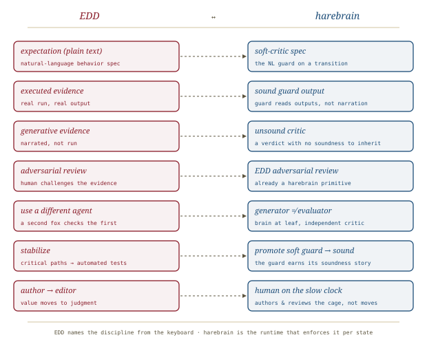

# Expectation-Driven Development, *audited*

*Cliff notes on Andrea Laforgia's "Expectation-Driven Development" (2026) — a practitioner's proposal for validating AI-written code, and the concept harebrain already borrowed the name for.*

---

## The problem the piece refuses to soften

The essay opens on an admission most teams paper over: **we cannot review AI-generated code.** Not "choose not to" — *cannot*, not meaningfully. An agent emits hundreds of working lines in seconds; a human reading them line-by-line needs minutes or hours, and the gap widens every model release. So teams glance at the diff, run the existing tests, squint at the architecture, and merge. In Laforgia's phrase, we have replaced *"trust but verify"* with *"trust and hope the CI is green."*

The proposed answer is not "write more tests." It is a validation *protocol* built for the human-AI pair: **Expectation-Driven Development (EDD).**

> **The one-line claim.** Specify intent in plain natural language, make the agent *prove* each expectation with concrete executed scenarios, then review that evidence adversarially — iterating until you have justified confidence that the implementation matches the intent.

## Where TDD and BDD leave a gap

The piece is careful not to bury TDD — it calls it one of software's most important ideas and notes "make these tests pass" works well with agents. But it names two gaps:

- **Scope.** TDD excels at deterministic input→output. It is unnatural for the *relational* ("discount applies to subtotal, before tax"), the *qualitative* ("the error message should be helpful, not cryptic"), and the *systemic* ("this must hold under high load"). Those requirements are real and tend to live unwritten in a developer's head.
- **Phase.** Before you can write a test you must know *what* to test. That design-time exploration happens informally — in Slack, in a meeting — and is rarely captured.

BDD's Given/When/Then gets closer and is genuinely executable via step definitions — but that formalism is also a constraint: some expectations don't fit a three-line template. EDD's bet is to keep BDD's *intent* (specify behavior, then verify it) while trading the framework ceremony for the flexibility of prose.

## The protocol, redrawn

*Five moves. The human owns the two ends — specifying and judging; the AI owns the middle — implementing and proving.*

1. **Formulate expectations in plain text** — the same language you'd use to explain the feature to a colleague. A cart-total expectation captures the discount/tax *ordering* and the empty-cart edge case ("zero, not an error") that a two-item fixture never would.
2. **Hand them to the agent** — which implements with full context of the codebase and the expectations.
3. **Ask it to prove it** — *"Show me specific scenarios with concrete inputs and the outputs the system produces."* Not "did you implement it?" — **prove it.**
4. **Evaluate, challenge, iterate** — read the evidence critically. Did it dodge the hard part? Do the numbers add up? Push back: *"you never showed what happens with two discount codes."*
5. **The evidence becomes the documentation** — a set of expectations paired with concrete proof; a living record of what the system does and why.

## The load-bearing distinction: executed vs. generative evidence

This is the part worth lifting whole, because it is the same idea harebrain inherited from planning research — arrived at here from the keyboard.

When an agent "produces evidence," one of two very different things happened:

*"I tested it and here are the results" is not the same sentence as "I'm pretty sure it would work like this."*

> **EDD requires executed evidence.** If the agent can't run the code and show real outputs, you don't have verification — you have *a shared hallucination dressed up in scenario format.* Generative evidence is "a second assertion by the same entity that made the first assertion."

The corollary is honest about scope. Not all code is executable in an agent loop: **directly executable** (functions, APIs, scripts — the gold standard), **partially verifiable** (a `terraform plan`, a dry run, a test-DB migration — weaker but real), and **not executable in the loop** (UI rendering, production-only behavior, rate-limited third parties — back to generative evidence whether you like it or not). The further right you sit, the lower your confidence, and the more you must invest in the *Stabilize* step.

## The honest part: why it might not work

Laforgia confronts the weaknesses head-on rather than in a footnote, which is what makes the piece worth summarizing.

- **The fox guarding the henhouse (two layers).** *Bias:* the same AI that wrote the code produces its own verification, with every structural incentive to generate confirming scenarios — the same reasoning flaw that caused a bug will cause it to overlook the bug in its evidence. *Execution vs. narration:* the deeper layer, above — generative evidence is not evidence. Mitigations: be an **adversarial reviewer**; **demand execution receipts** (the raw command and raw output, not a summary); **use a different agent to audit** (a different fox checks the first fox's work); **spot-check one scenario yourself**.
- **Reproducibility.** Are the expectations rerunnable? If you re-ask an LLM each time, interpretation is non-deterministic. If they're *not* rerunnable, what you have is a snapshot, not a safety net — documentation, not regression protection. EDD evidence goes *silent* when it becomes stale; automated tests fail loudly. Hence Stabilize.
- **Natural-language ambiguity.** "Handle large uploads efficiently" — what's *large*? what's *efficiently*? BDD's rigidity prevents hand-waving; prose freedom permits it. The fix is discipline: "a 500MB upload should complete without timeout and without consuming more than 2× the file size in memory" is still natural language, but precise.
- **Evidence scalability.** 5 expectations you review carefully; 50 you skim; 200 you rubber-stamp. Human attention is finite, so **prioritize by risk**.

> **Not a replacement — a layer.** TDD speaks to developers in code (executable, strong regression protection, limited nuance). BDD speaks to the team in structured language. EDD is the **conversation layer** between human intent and AI implementation — where you say what you mean in all its messy, edge-case-laden glory — after which TDD or BDD takes over for the parts that must be deterministic and repeatable. "If you read this and think 'great, I can stop writing tests,' you've missed the point."

## The lineage, acknowledged

EDD doesn't claim novelty of idea, only of *execution context*. It stands on Specification by Example (Adzic, 2011), FIT/FitNesse (Cunningham, ~2002), Concordion, Design by Contract (Meyer), and property-based testing (QuickCheck) — all sharing the insight that concrete human-readable examples are the best way to specify and verify behavior. What's new: **the LLM *is* the glue code.** In Specification by Example a developer writes step definitions to make examples executable; that glue is the bottleneck. EDD's LLM interprets natural-language expectations directly, no step definitions, no framework — and the verification loop is *conversational* rather than pass/fail binary. The author is candid that this is evolutionary, not revolutionary. (One open question he flags and doesn't resolve: *who writes the expectations?* Solo authorship concentrates a single point of failure in one person's understanding; collaborative authorship risks contradictory assumptions.)

## The deeper point: author → editor

The disclaimer is upfront — EDD has *not* been battle-tested; it's a proposed framework, not a field report. But it points at a role shift. In the pre-AI world we were **authors**: we wrote the code, the tests, the docs; our value was in production. In the agent world we're becoming **editors**: we specify intent, evaluate output, challenge evidence; our value is in judgment. "TDD is an author's tool. EDD is an attempt at an editor's tool."

## Where this sits in the harebrain hypothesis

The harebrain thesis is `harebrain = fast LLM brain × structured game-AI cage`. EDD is already *inside* harebrain's vocabulary — the [[llm-modulo]] mapping lists **"EDD adversarial review on each transition"** as harebrain's blueprint-side answer to LLM-Modulo's *soft critic*. This summary is the source document for that primitive. The mapping is direct, and it's the same insight the planning paper reached from theory.

*EDD names the discipline from the keyboard; harebrain is the runtime that enforces it — per state, not per project.*

| EDD | harebrain |
|---|---|
| Expectation (plain text) | Soft-critic spec — the natural-language guard on a transition |
| Executed evidence | Sound guard output — a guard reading real outputs, not narration |
| Generative evidence | Unsound critic — a verdict with no soundness to inherit |
| Adversarial review | EDD adversarial review on each transition (already a primitive) |
| "Use a different agent to audit" | `generator ≠ evaluator` — brain at the leaf, independent critic bank |
| Stabilize (→ automated tests) | Promoting a soft guard to a *sound* one |
| Author → editor | Human on the slow clock — authors & reviews the cage, not the moves |

### What the piece gives harebrain

- **A practitioner's derivation of the soundness rule.** LLM-Modulo says *"soundness of the framework is inherited from the soundness of the hard critics."* EDD reaches the same wall from the keyboard: *executed* evidence is sound; *generative* evidence inherits nothing. The two documents describe one law in two dialects — and having both, from theory and from practice, is what makes it load-bearing rather than a stylistic preference.
- **The executability spectrum as a guard-classification tool.** EDD's three bands (directly executable / partially verifiable / not executable) are exactly the axis along which a harebrain transition guard is *sound*, *advisory*, or *narrated*. A workflow whose guards all sit in the third band has no soundness story — and should not market one.
- **"Stabilize" as the promotion path.** Harebrain's [[llm-modulo]] notes drew a hard line between sound and advisory guards but not the *migration* between them. EDD supplies it: a soft, LLM-evaluated expectation that proves load-bearing gets converted into an automated test — a soft guard promoted to sound. That is the two-clocks pattern applied to a single guard's lifecycle.
- **The bias argument for `generator ≠ evaluator`.** "The fox guarding the henhouse" is EDD's name for why the agent that wrote the code cannot be trusted to grade it — the structural reason harebrain keeps the critic bank independent of the brain at the leaf.

### What harebrain pushes that the piece doesn't

- **Per-state, not per-feature.** EDD's unit is a *feature* whose expectations a human reviews at merge time. Harebrain pushes the same protocol inward — an expectation evaluated at *each transition*, autonomously, while the workflow runs. The price is that the human is no longer in the loop for every judgment, which raises the stakes on the *Stabilize* step: an unreviewed soft guard running per-tick is exactly EDD's "rubber-stamping at scale" failure, automated.
- **Reproducibility by construction.** EDD frets that re-asking an LLM is non-deterministic. Harebrain's answer is the chart: the guard is *authored once* on the slow clock and *fired deterministically* on the fast one, so the "same expectation, different evidence" drift EDD warns about is designed out for any guard that has been stabilized.

> **The trap to mark, in the piece's own words.** *"For subjective qualities like 'helpful' or 'graceful,' the LLM will tend to judge its own output favorably — don't outsource taste."* A harebrain workflow whose critic bank is entirely LLM-evaluated soft guards is running EDD with the henhouse unguarded on every tick. The evidence looks the same; the confidence is not.

## What's worth taking away

- EDD is the strongest available *practitioner-side* statement of harebrain's soundness rule: only executed evidence verifies; narration is a second assertion by the same author.
- The executed/generative split maps one-to-one onto harebrain's sound/advisory guard distinction — and the three-band executability spectrum is the right way to *classify* a guard's soundness.
- "Stabilize" is the missing promotion path: a soft guard that earns its keep becomes a sound one. Harebrain should adopt the term.
- "The fox guarding the henhouse" is the practitioner's argument for `generator ≠ evaluator` — the same structural separation the [[loop-engineering]] playbook and [[llm-modulo]] both insist on.
- The framework is explicitly *untested* — a bet, not a field report. Harebrain should cite it as the origin of the *adversarial-review* primitive, not as evidence that the primitive works at scale.

---

**Sources.** Laforgia, A. "Expectation-Driven Development." *Andrea's Substack*, 21 March 2026. [substack.com/p/expectation-driven-development-a](https://a4al6a.substack.com/p/expectation-driven-development-a). Lineage cited within: Adzic, *Specification by Example* (2011); Cunningham, FIT/FitNesse (~2002); Meyer, *Design by Contract* (Eiffel); QuickCheck and property-based testing. Companion harebrain summaries: [[llm-modulo]] (the theory-side derivation of the same soundness rule) and [[loop-engineering]] (the generator/evaluator separation at loop scale). All diagrams above are original SVGs drawn for this page.
