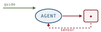

# Harness Engineering, *practised*

*Cliff notes on Birgitta Böckeler, "Harness Engineering for Coding Agents" (martinfowler.com, April 2026) — the harness named from the software-engineering-practice side, and why its cybernetic-governor framing is the cage harebrain keeps drawing.*

---

## What kind of document this is

Start with the genre, because it sets how much weight each claim carries. This is a Thoughtworks practitioner essay, not a paper. There are no benchmark tables, no held-out evals, no ablations — the sibling summaries [NLAH](../nlah/nlah.md) and [Meta-Harness](../meta-harness/meta-harness.md) supply those. What Böckeler supplies instead is *vocabulary*: a clean, opinionated taxonomy of the thing teams are actually building around coding agents right now, named carefully enough to argue about. The value is in the names, the 2×2, and the cybernetic framing — not in evidence. Read it the way you'd read a good architecture-pattern catalogue: the patterns are real and observed, the boundaries are sharp, and nothing is proven.

> **The definition, taken as given.** "The term *harness* has emerged as a shorthand to mean everything in an AI agent except the model itself — **Agent = Model + Harness**." For coding agents the harness splits into what the tool-builder ships and the *outer harness* a team builds for its own codebase. "Building this outer harness is emerging as an ongoing engineering practice, not a one-time configuration." That outer-harness-as-practice is the essay's subject and its thesis in one phrase.

## The thesis: externalising the implicit

The argument's spine is an observation about what a *human* developer brings to a change that an agent does not. Experience, organisational alignment, taste, the memory of the last three times this module broke — all of it implicit, all of it absent from the model. Harness engineering is the work of making those implicit controls explicit: "a coherent system of guides and sensors and self-correction loops" that surrounds the agent and raises the odds it gets a change right the first time, then catches it when it doesn't.

The payoff is framed as a redirection of human attention, not its removal — the line worth pinning:

> "A good harness should not necessarily aim to fully eliminate human input, but to direct it to where our input is most important."

This is the same move harebrain makes about the chart, said in the language of code review instead of state machines. The cage does not replace judgment; it routes judgment to the places that need it and automates the places that don't.

## Feedforward and feedback — the two directions

The first cut is temporal: a control either fires *before* the agent acts or *after*.

- **Feedforward controls ("guides")** "anticipate the agent's behaviour and aim to steer it *before* it acts. Guides increase the probability that the agent creates good results in the first attempt." Architectural docs, coding conventions, bootstrap scripts, code-modification tools.
- **Feedback controls ("sensors")** "observe *after* the agent acts and help it self-correct. Particularly powerful when they produce signals that are optimised for LLM consumption." Linters, test results, structural analysis, review agents.

The essay's sharpest single sentence is about needing both. Lean only on one and "you get either an agent that keeps repeating the same mistakes (feedback-only) or an agent that encodes rules but never finds out whether they worked (feed-forward-only)." That is a genuinely useful diagnostic, and it generalises past coding agents.

*Two controls and two loops. The inner loop is the agent self-correcting against sensor signal; the outer "steering loop" is a human revising the controls themselves. The cybernetic-governor metaphor is doing real work here.*

The framing the essay reaches for is Stafford-Beer-flavoured cybernetics: "The harness acts like a **cybernetic governor**, combining feed-forward and feedback to regulate the codebase towards its desired state." A governor is a controller that holds a system near a setpoint. Calling the harness a governor is the claim that the codebase has a *desired state* and the harness's job is regulation toward it — which is exactly a control-systems reading of what a statechart's guards do per tick.

## Computational and inferential — the two executors

The second cut is orthogonal to the first, and it is the one that matters most for the harebrain mapping: *what runs the check.*

- **Computational controls** are "deterministic and fast, run by the CPU. Tests, linters, type checkers, structural analysis. Run in milliseconds to seconds; results are reliable."
- **Inferential controls** are "semantic analysis, AI code review, 'LLM as judge'. Typically run by a GPU or NPU. Slower and more expensive; results are more non-deterministic." Their upside: they "can particularly increase our trust when used with a strong model."

Cross the two cuts and you get the essay's organising matrix.

![A two-by-two matrix of harness controls: direction (feedforward guides versus feedback sensors) on the vertical axis, execution type (computational/deterministic/CPU versus inferential/semantic/model) on the horizontal. Cells: feedforward-computational holds code mods (OpenRewrite recipes, bootstrap scripts); feedforward-inferential holds coding conventions (AGENTS.md, skills); feedback-computational holds structural tests (ArchUnit pre-commit hooks, linters, mutation testing); feedback-inferential holds review instructions (LLM-as-judge skills).](images/fig-02-control-matrix.svg)
*The same control type changes character entirely depending on the cell. A convention in AGENTS.md and an ArchUnit pre-commit hook both encode "follow the architecture" — but one is advisory prose the model may ignore and the other is a sound check it cannot.*

| Control | Direction | Execution | Example |
|---|---|---|---|
| Coding conventions | feedforward | inferential | `AGENTS.md`, skills |
| Bootstrap instructions | feedforward | both | skill + bootstrap script |
| Code mods | feedforward | computational | OpenRewrite recipes |
| Structural tests | feedback | computational | ArchUnit pre-commit hooks |
| Review instructions | feedback | inferential | review skills |

The computational/inferential split is the load-bearing idea in the whole essay, and the essay does not fully cash it out — so this summary will. **Computational equals sound; inferential equals advisory.** A type checker that goes green has *proven* something; an LLM reviewer that says "looks good" has *estimated* something. That distinction is precisely [LLM-Modulo](../llm-modulo/llm-modulo.md)'s hard-critic / soft-critic line arriving under different names, and it is the single place this practitioner essay touches the same bedrock the empirical papers stand on. Hold it; the mapping section turns on it.

## The three harnesses — what gets regulated

Direction and execution describe individual controls. The *categories* describe what a bundle of controls regulates. Böckeler names three.

| Harness | Regulates | Computational controls | Inferential controls |
|---|---|---|---|
| **Maintainability** | internal code quality | duplicate detection, cyclomatic complexity, coverage, style, architectural-drift checks | "is this readable / idiomatic?" review |
| **Architecture fitness** | the application's `-ilities` | Fitness Functions: performance tests, ArchUnit boundary tests | "does this honour the observability convention?" review |
| **Behaviour** | functional correctness | the AI-generated test suite going green | semantic spec-conformance review |

The first two are mature. "Computational sensors catch the structural stuff reliably: duplicate code, cyclomatic complexity, missing test coverage, architectural drift, style violations." Architecture fitness is "basically: Fitness Functions" — the Building Evolutionary Architectures vocabulary, pointed at an agent.

The third is where the essay is most honest, and most worth reading. The standard behaviour harness is: write a functional spec, let the agent generate a test suite, accept the change when the suite is green. The problem is circular and the essay says so plainly:

> "This approach puts a lot of faith into the AI-generated tests, that's not good enough yet."

This is the candid centre of the piece. The behaviour harness is the one that *matters most* — functional correctness is the point of the change — and it is the one with the weakest sound control available, because the verifier (the test suite) was written by the same untrusted process whose output it's meant to verify. Mutation testing and the **approved-fixtures pattern** are offered as partial answers — pre-curated, human-blessed fixtures the agent validates against rather than tests it wrote itself — but the essay is careful: it's "applied selectively where it fits, it's not a wholesale answer to the test quality problem." That hedge is correct, and it is the gap a sound behaviour critic would fill.

> **The trap this summary marks, because the essay doesn't quite.** A behaviour harness whose only sensor is an AI-generated test suite is *inferential dressed as computational*. The suite runs on the CPU and returns a deterministic green — so it *looks* like a sound check — but its authority is only as good as the LLM that wrote it. The determinism is real; the soundness is borrowed from a process that doesn't have it. This is the exact failure LLM-Modulo names: do not read "we have a passing test suite" as "we have a sound verifier" when the suite is itself a model artifact.

## Harnessability, affordances, and Ashby

Three supporting ideas tie the taxonomy to the codebase it runs against.

**Harnessability** is "the degree to which a codebase permits effective control implementation." "A codebase written in a strongly typed language naturally has type-checking as a sensor; clearly definable module boundaries afford architectural constraint rules." Not every codebase is equally cageable — some hand you sound sensors for free, others give you nothing but prose conventions.

**Ambient affordances** (credited to Ned Letcher) are "structural properties of the environment itself that make it legible, navigable, and tractable to agents operating within it." The environment, not the harness, doing some of the regulating.

**Ashby's Law of Requisite Variety** supplies the deepest principle in the essay: "a regulator must have at least as much variety as the system it governs, and it can only regulate what it has a model of." The application is service-topology templates: an agent "can produce almost anything, but committing to a topology narrows that space, making a comprehensive harness more achievable. Defining topologies is a **variety-reduction move**." Constrain what the agent *can* build and you make the harness's job tractable — which is the cybernetic restatement of "bound the action surface."

> **Where the checks should live.** The essay closes the loop on timing: "You want to have checks as far left in the path to production as possible, since the earlier you find issues, the cheaper they are to fix." Fast linters and basic suites pre-integration; mutation testing and broad semantic review post-integration; drift detection and runtime monitoring continuously. Cheap-and-sound runs every change; expensive-and-semantic runs less often. That is a sensible cost gradient, and it pre-figures harebrain's two-clocks rhythm.

## Where this sits in the harebrain hypothesis

The harebrain thesis is `harebrain = fast LLM brain × structured game-AI cage`. This essay is the cage **named from the software-engineering-practice side**. Where harebrain reasons from Harel and *Left 4 Dead*, Böckeler reasons from fitness functions and cybernetics — and lands on the same object: a coherent system of controls surrounding a model, regulating it toward a desired state, with humans authoring the controls and the model confined to the work inside them.

That convergence is the headline. The sibling summaries make it a pattern, not a coincidence. [NLAH](../nlah/nlah.md) derives the cage from agent scaffolding and writes it as an editable document. [Meta-Harness](../meta-harness/meta-harness.md) makes the cage a search target and proves it is the 6× lever. **"Harness" is the shared word across all three** — and Böckeler's essay is the one that treats it as a *craft* rather than an artifact or an optimisation target. Three derivations from three starting points (game AI, ML systems, SE practice) name the same thing. The object is real.

![Two-column mapping: Harness Engineering concepts on the left in oxblood, harebrain primitives on the right in blueprint, dashed arrows between matched pairs. The harness ↔ the cage; feedforward guides ↔ chart topology plus pinned blackboard facts; feedback sensors ↔ transition guards; computational sensor ↔ hard guard; inferential sensor ↔ EDD adversarial review; the steering loop ↔ the AI director on the slow clock; harnessability ↔ a small named state space; topology templates ↔ pre-approved chart blueprints.](images/fig-03-mapping.svg)
*Same cage, two vocabularies. The disagreement is only about medium — Böckeler's harness is conventions-plus-CI; harebrain's is a formal chart with a typed seam.*

| Harness Engineering | harebrain |
|---|---|
| The harness (everything but the model) | The cage — chart + blackboard + guards |
| Feedforward guide | Chart topology + pinned blackboard facts (the *where*, set before the call) |
| Feedback sensor | Transition guard reading the blackboard after the leaf runs |
| Computational sensor (sound) | Hard guard — fires deterministically, no model in the loop |
| Inferential sensor (advisory) | Soft guard / EDD adversarial review — a verdict the chart routes on |
| The steering loop | AI director on the slow clock — revising the cage from recurring drift |
| Harnessability | Whether the workflow has a small named state space (the honest-tradeoff test) |
| Topology template (variety reduction) | Pre-approved blueprint — `new Blueprint : Name`, Tier 2 latitude |

### What the essay gives harebrain

Four things, each load-bearing.

- **The feedforward / feedback split as a guard-timing vocabulary.** Harebrain talked about guards as one category that fires on transition — *after* the leaf. Böckeler's split says half the cage's job happens *before*: the chart topology and the pinned blackboard facts are feedforward, steering what the leaf even attempts. Naming the before/after axis separately from the hard/soft axis is genuinely clarifying. A pinned constraint (`user_said: "don't touch X"`) is a *feedforward inferential* guide; a transition guard checking the test suite is a *feedback computational* sensor. Two axes, four kinds of control — harebrain should adopt the cross-product.
- **The "checks as far left as possible" cost gradient.** This is harebrain's two-clocks idea reached from the cost side. Cheap-sound-computational checks run every tick (fast clock); expensive-semantic-inferential checks run on a slower cadence (the director's clock); human review of the controls themselves runs slowest (the steering loop, harebrain's slow-clock chart authoring). The essay gives the *economic* argument for the rhythm harebrain argued *structurally*.
- **Ashby's Law as the formal statement of "bound the action surface."** Harebrain's strongest claim is topological — the unwanted state is unreachable by geometry, not discouraged by prompt. Ashby gives the cybernetic version: a regulator can only regulate what it has a model of, so reducing the agent's output variety is what makes a comprehensive harness *possible at all*. "Variety reduction" is the practitioner's name for harebrain's bounded action surface, and it's a better elevator pitch.
- **The behaviour-harness gap, stated by a practitioner.** Harebrain's whole bet is shakiest exactly where the essay is most candid: workflows with no sound verifier. Böckeler admits the behaviour harness — functional correctness — has no good computational sensor yet, only AI-written tests you "put a lot of faith into." That is harebrain's "workflows without a sound critic" caveat, observed in the wild by someone shipping it. It is corroboration that the gap is real, not a theoretical worry.

### What harebrain pushes that the essay doesn't

Two extensions. Both are harebrain bets, not claims the essay makes.

- **The seam, not just the convention.** The essay's feedforward guides are mostly *prose* — `AGENTS.md`, skills, conventions the model reads and may ignore. Harebrain's strongest feedforward control isn't prose at all; it's *topology*: the leaf is *in* `GatherEvidence` and the transition out requires a satisfied guard, so the unwanted next step is unreachable rather than discouraged. Böckeler's harness steers; harebrain's cage *bounds*. A convention in `AGENTS.md` is a guide the agent can talk its way past under pressure; a state the chart doesn't define is not. The essay never reaches for that hard floor — it stays in the "increase the probability" register throughout, which is the right register for advisory controls and the wrong one for invariants.
- **Determinism as a property to protect, not just a property of fast checks.** The essay treats determinism as a *feature of computational controls* — they're "reliable" because the CPU is deterministic. Harebrain treats determinism as a *property of the whole run* worth engineering for: same inputs, same seed, same trace, so every drift is replayable to a state. That's a stronger and separate claim. The essay's checks are deterministic individually; harebrain wants the orchestration between them deterministic too. (Meta-Harness's summary makes the same point sharper: a search over harnesses will quietly trade determinism away unless you encode it into the objective.)

> **The cleanest one-line translation.** Böckeler: *guides steer before, sensors observe after, and the human improves both from recurring failures.* harebrain: *the chart sets where before the leaf runs, the guards check after, and the director rewrites the chart from recurring drift.* These are the same loop. One is written in CI pipelines and conventions; the other in a formal statechart with a typed seam. The essay proves the loop is already how good teams work; harebrain's bet is that writing it as geometry instead of convention is what buys the no-jailbreak guarantee the essay's prose guides can't.

### Two clocks, three controls

Harebrain's slow/fast split maps onto the essay's timing model almost exactly, but the essay refines it into a *gradient* rather than a binary. Computational sensors run on the fastest clock (every change, milliseconds). Inferential sensors run slower (post-integration, the director's cadence). The steering loop — humans revising the controls — runs slowest of all, and is precisely harebrain's slow-clock, human-in-the-loop chart authoring. The essay's contribution is to put a *cost curve* under the rhythm: the clock slows as the check gets more expensive and less sound, which is the same shape harebrain argued from the layer-stack side.

## What's worth taking away

- The essay is the harness named from the SE-practice side, and it converges with [NLAH](../nlah/nlah.md) (harness-as-document) and [Meta-Harness](../meta-harness/meta-harness.md) (harness-as-search-target) on the same object harebrain calls the cage. Three derivations, one architecture.
- The **feedforward/feedback × computational/inferential** matrix is the right two-axis vocabulary for transition guards. Harebrain should adopt the cross-product: timing (before/after) is orthogonal to soundness (hard/soft).
- **Computational = sound, inferential = advisory** is [LLM-Modulo](../llm-modulo/llm-modulo.md)'s hard/soft-critic line in practitioner clothing. The single most transferable idea in the essay.
- The **behaviour-harness gap** — no sound verifier for functional correctness, only AI-written tests — is harebrain's "workflows without a sound critic" caveat confirmed by someone shipping it. Treat it as corroboration, not coincidence.
- **Ashby's Law / variety reduction** is the cybernetic name for "bound the action surface," and a cleaner pitch for it than harebrain's topology argument alone.
- The essay steers; harebrain bounds. Böckeler stays in the "increase the probability" register appropriate to advisory controls. Harebrain's distinct contribution is the hard floor — topology that makes the unwanted state unreachable — which prose guides structurally cannot provide.

---

**Sources.** Böckeler, Birgitta. "Harness Engineering for Coding Agents." martinfowler.com, 2 April 2026. <https://martinfowler.com/articles/harness-engineering.html> (web article; no local PDF — practitioner essays cite the URL). Concepts referenced from the article: feedforward/feedback controls, computational/inferential execution, the maintainability / architecture-fitness / behaviour harness categories, harnessability, ambient affordances (credited to Ned Letcher), the approved-fixtures pattern, Ashby's Law of Requisite Variety, and the steering loop / cybernetic-governor framing. Companion summaries in this series: [NLAH](../nlah/nlah.md) (the harness as an editable document), [Meta-Harness](../meta-harness/meta-harness.md) (the harness as a search target), and [LLM-Modulo](../llm-modulo/llm-modulo.md) (the hard-critic / soft-critic soundness argument the computational/inferential split rests on); the harebrain hypothesis ([Harebrain, sketched](../../harebrain/harebrain.md)) for the cage / two-clocks / latitude-tier vocabulary. All diagrams above are original SVGs drawn for this page.
