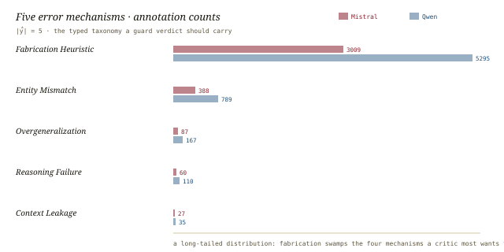
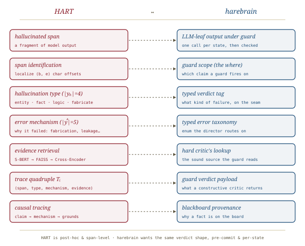

# HART, *traced*

*Cliff notes on Liang & Wang, "HART: Data-Driven Hallucination Attribution and Evidence-Based Tracing for Large Language Models" (arXiv:2603.05828) — and why HART is exactly the verdict payload a harebrain transition guard should return.*

---

## The move the paper makes

Hallucination work, the paper argues, has stalled at two superficial levels. **Detection** tells you *that* an output is wrong — a binary flag, usually from uncertainty estimates or a semantic-similarity check against retrieved text. **Internal-mechanism** work tells you *why*, but only in the model's latent space (hidden states, attention drift) — explanations that never touch a verifiable real-world fact. Neither establishes a *structured, span-level, causal* correspondence between the bad text, the mechanism that produced it, and the evidence that refutes it.

> **The one-line claim.** Reframe hallucination analysis as a four-stage *tracing* task — span identification → mechanism attribution → evidence retrieval → causal tracing — so that each hallucinated fragment resolves to a typed, evidence-grounded **trace quadruple** rather than a similarity score. That reframing, plus the dataset to support it, is HART.

This is the cluster's finest-grained instance. Where [[hallucination-recitations]] asks whether the model is reciting and [[llm-attribution-survey]] / [[rag-attribution-survey]] survey how to attach citations, HART insists the verdict be *constructive*: localize the offending span, name the error **mechanism**, retrieve the **contradicting evidence**, and trace the chain between them. That is not a flag. That is a structured object a downstream controller can route on — which is precisely why it is interesting to harebrain.

## The four-stage pipeline

The whole method is a function `Trace(R, S, f, B, J, C, w, k)` (their Algorithm 1) that walks each hallucination span through four stages and emits one quadruple per span.

*The whole method on one page. The unit of work is a span; the unit of output is a four-field verdict.*

The four stages, with the paper's actual machinery:

1. **Span identification.** Each hallucinated fragment is a triple `s = (b, e, h)` — start offset, end offset, and a `{0,1}` hallucination flag — carved out of the model's response `R`. Granularity is *characters*, not sentences.
2. **Mechanism attribution.** Two **decoupled, parameter-independent** BERT classifiers, run by MAP, predict over two label spaces deliberately kept separate to avoid coupling the surface label to the cause: a *hallucination type* `f_h : S → y_h` with `|y_h| = 4`, and an *error mechanism* `f_e : S × y_h → y_e` with `|y_e| = 5`. A span is tagged both for *what kind* of falsehood it is and *why* the model produced it.
3. **Evidence retrieval.** For each span a multi-query set `Q_i = {q_i1, …, q_ik}` is built (e.g. *"Is Sydney the capital of Australia?"*, *"What is the capital of Australia?"*), each query is embedded and run through a two-stage retriever, and the highest-scoring evidence becomes the attribution set `E_i`.
4. **Causal tracing.** The stages compose into the output quadruple `T_i = (s_i, ŷ_i^h, ŷ_i^e, E_i)` — span, type, mechanism, evidence — a structured, inspectable record of *where* the error is, *what* it is, *why* it happened, and *what contradicts it*.

> **Why span-level matters.** A sentence-level flag tells a back-prompt loop "this paragraph is suspect." A character-offset span plus a mechanism tag tells it "this nine-word clause is a *fabrication heuristic*, and here is the Wikipedia line that refutes it." The second is actionable; the first is a shrug. HART is buying *actionability*, and it pays for it in annotation cost.

## The two label spaces

The decoupling in stage 2 is the design choice worth lifting. Surface manifestation and underlying cause are modelled as **independent** classifications — "to avoid semantic coupling and interference between label spaces," as the paper puts it.

| Layer | Label space | Members |
|---|---|---|
| Hallucination **type** (surface) | `|y_h| = 4` | Entity · Fact · Logic · Fabricate |
| Error **mechanism** (cause) | `|y_e| = 5` | Entity Mismatch · Overgeneralization · Reasoning Failure · Context Leakage · Fabrication Heuristic |

The mechanism taxonomy is the real contribution — a typed enum naming *why* the brain drifted, not just *that* it did. And the empirical distribution of that enum is lopsided in a way that should worry anyone building critics.

*The mechanism distribution across two source models. Fabrication swamps everything; the interesting mechanisms live in the tail.*

The annotated counts (Mistral / Qwen): **Fabrication Heuristic 3009 / 5295**, Entity Mismatch 388 / 789, Overgeneralization 87 / 167, Reasoning Failure 60 / 110, Context Leakage 27 / 35. Read as proportions of error mechanism, Fabrication Heuristic is **0.8436 (Mistral) / 0.8426 (Qwen)** — the model, when it hallucinates, is overwhelmingly *making something up out of distributional habit* rather than mis-binding an entity or breaking a chain of reasoning. The same lopsidedness shows in the *type* layer: Fact errors dominate at **0.8309 / 0.7263**; Logic errors are vanishingly rare (0.0087 / 0.0033).

> **The uncomfortable reading.** If 84% of mechanisms are "fabrication heuristic," then most hallucinations aren't subtle reasoning slips a clever critic could repair — they're confident inventions. A critic's job here is less *diagnosis* and more *catching the brain bluffing*. That maps cleanly onto harebrain's framing of the cage as a leash on a fluent liar.

## The dataset, and how it was built

HART's other deliverable is the first span-level, structured tracing dataset. The construction loop is itself a brain-×-cage pattern worth marking:

- **Source of facts:** `LongFact++`, an expansion of the LongFact long-text entity dataset (≈20,000 top-focused queries plus citation, biography, and legal prompts).
- **Generation under search:** `Claude Sonnet 4.5` with web-search capability generates candidate text, maximizing semantic-deviation diversity while preserving the real model's hallucination distribution.
- **Annotation = LLM draft + human refinement.** Initial annotation `A_0` is LLM-produced; the final structured annotation `A` comes from a *human-refinement function*. Crucially, they define a batch **annotation noise rate** `ε_w = (1/w) Σ 1(A_i^LLM ≠ A_i^human)` and **constrain `ε_w ≤ τ`, re-labelling when the gate trips.** That is a soft critic with a hard threshold guarding a slow authoring loop — the same two-clock rhythm [[llm-modulo]] describes for model acquisition.
- **Evidence corpus:** per-span counterfactual evidence sets are pulled together into one consolidated corpus of **34,943 documents** drawn from Wikipedia and authoritative sites (assembled with `ChatGPT 5.1` web retrieval), indexed independently so evidence is reusable across spans.

Source-model outputs come from `Qwen2.5-7B-Instruct` and `Mistral-Small-24B-Instruct`; the split is 70% train / 10% selection / 20% held-out test.

## The retriever, and the numbers

Stage 3 is a textbook two-stage retriever, and the ablation earns each stage. Spans and evidence are embedded with **Sentence-BERT (`all-mpnet-base-v2`)**, L2-normalized, indexed in **FAISS** with inner-product (cosine) similarity over the 34,943-doc corpus; the Top-`k` candidates are then **re-ranked by a Cross-Encoder (`ms-marco-MiniLM-L-6-v2`)** that scores query–document pairs jointly. A *multi-query* set per span widens recall, and a "semantic-equivalence" hit criterion (similarity ≥ τ against the gold evidence) replaces brittle exact-string matching — so retrieving a *different but equivalent* fact still counts.

The ablation (Table 1, Recall@1) shows the stack compounding:

| Configuration | R@1 | R@5 | MRR | nDCG@10 |
|---|---|---|---|---|
| Dense embedding only | 0.4133 | 0.6387 | 0.5092 | 0.5586 |
| + Cross-Encoder | 0.5172 | 0.6868 | 0.5887 | 0.6196 |
| + Multi-Query | 0.6244 | 0.8058 | 0.7016 | 0.7389 |
| **Ours (HART, full)** | **0.7068** | **0.8360** | **0.7619** | **0.7850** |

Against retrieval baselines on the held-out test, HART is not close — it is a different regime. The two classifiers, meanwhile, land at **79.13%** (hallucination type) and **83.32%** (error mechanism) validation accuracy.

| Dataset · k=1 | BM25 | DPR | Sentence-BERT | Cross-Encoder | **HART** |
|---|---|---|---|---|---|
| Qwen — Recall@1 | 0.1074 | 0.0349 | 0.0859 | 0.0906 | **0.8024** |
| Qwen — Joint SR@1 | 0.0032 | 0.0014 | 0.0020 | 0.0025 | **0.6265** |
| Mistral — Recall@1 | 0.0958 | 0.0330 | 0.0811 | 0.1042 | **0.7522** |
| Mistral — Joint SR@1 | 0.0025 | 0.0011 | 0.0017 | 0.0031 | **0.5352** |

> **What the gap is, and isn't.** BM25 at Recall@1 ≈ 0.10 is the lower bound for "term-matching with no semantic model." DPR (a dual-tower dense retriever) does *worse* than BM25 here — off-the-shelf dense retrieval is mistuned for the counterfactual-evidence task. HART's 0.80 is a *task-specific* system: a corpus built for the job, a multi-query expansion, and a reranker. The honest reading is that HART shows the *tracing formulation is retrievable*, not that generic retrieval solves it. Joint SR@k — the end-to-end success rate where type, mechanism, *and* evidence all land — is the metric that matters, and at 0.63 / 0.54 it is the real headline: roughly six in ten spans get a fully-correct structured verdict.

## Where this sits in the harebrain hypothesis

The harebrain thesis is `harebrain = fast LLM brain × structured game-AI cage`. The shared throughline across this four-paper cluster is that **attribution / evidence-tracing is the mechanism that binds the fast, ungrounded brain to verifiable sources — a species of the cage's hard critic, applied to claims rather than plans.** HART is the cluster's most structured instance, and it answers a question harebrain had left open: *what should a critic actually return?*

*HART is a critic's verdict object, drawn out in full. harebrain wants this exact shape — moved earlier and inward.*

| HART | harebrain |
|---|---|
| Hallucinated span | LLM-leaf output under guard |
| Span identification `(b, e, h)` | Guard scope — *which* claim the guard fires on |
| Hallucination type (`|y_h|=4`) | Typed verdict tag on the seam |
| Error mechanism (`|y_e|=5`) | Typed error taxonomy the AI Director routes on |
| Evidence retrieval (S-BERT → FAISS → Cross-Encoder) | The hard critic's evidence lookup |
| Trace quadruple `T_i` | The guard verdict *payload* |
| Causal tracing | Provenance the blackboard should carry |

### What the paper gives harebrain

Three things, each load-bearing.

- **A concrete schema for the verdict payload.** [[llm-modulo]] split critics into *constructive* (suggest a fix) and *binary* (accept / reject) but never said what a constructive verdict *contains*. HART answers in four fields: **span, type, mechanism, evidence.** That is the canonical shape for a harebrain transition guard's return value. A guard that returns a bare `false` is binary and nearly useless to the Director; a guard that returns `(span, type, mechanism, evidence)` is constructive and *back-promptable* — the Director can route on the mechanism enum and re-prompt the leaf with the contradicting evidence inlined.
- **A typed error taxonomy for the seam.** harebrain's host-import → typed-verdict seam needed a vocabulary for *what went wrong*. HART's five-member mechanism enum (Entity Mismatch / Overgeneralization / Reasoning Failure / Context Leakage / Fabrication Heuristic) is a ready-made starting taxonomy — and its lopsided distribution tells the cage where to spend its attention: catch fabrication first.
- **Provenance as a first-class blackboard field.** Causal tracing — the chain from claim back to grounding evidence — is exactly the *why-is-this-fact-here* metadata the decaying blackboard should carry alongside each asserted fact. Without it, a fact on the board is unfalsifiable; with it, any downstream guard can re-check the grounding and let stale provenance decay.

### What harebrain pushes that the paper doesn't

Two extensions, both bets.

- **Pre-commit, not post-hoc.** HART traces text that has *already been emitted* — it is forensics on a finished response. harebrain wants the same verdict produced *before* the leaf's output is committed to the blackboard, as a transition guard that gates forward progress. The schema transfers wholesale; the timing flips from autopsy to gate. The price: you must run the four-stage machinery on a candidate, every state, on the fast clock — far more expensive than one post-hoc pass.
- **Per-state, not per-document.** HART's unit is a span inside a long generated document. harebrain's unit is a single leaf call inside a chart tick. Narrowing the scope makes the retrieval cheaper (the candidate is small) but loses HART's document-level context windows (`φ_ctx(R[b−w : e+w])`), which the paper shows matter for both classifiers. The harebrain analogue of that context window is the blackboard snapshot — the per-state Manifest is what supplies the surrounding facts a span-level guard needs.

> **The trap to mark.** HART's evidence retriever is *sound only because its corpus was built for the task.* The 0.80 Recall@1 leans on a 34,943-doc corpus of pre-curated counterfactual evidence, assembled offline with LLM help and human refinement. A harebrain guard that wires a generic web search into the seam and calls it a "hard critic" inherits **none** of HART's soundness — it inherits DPR's 0.03. The lesson from [[llm-modulo]] repeats here in a new key: *soundness is inherited from the evidence source, and HART's source was hand-built.* The verdict schema is free to borrow; the retrieval guarantee is not.

## What's worth taking away

- HART is the right answer to "what shape is a constructive critic's verdict?" — **(span, type, mechanism, evidence).** Adopt the schema as the canonical harebrain transition-guard return type.
- The five-member error-mechanism enum is a usable seed taxonomy for the seam's typed-verdict vocabulary; its 84%-fabrication skew tells the cage to prioritize catching invention over diagnosing subtle reasoning faults.
- Causal tracing belongs on the blackboard as per-fact provenance — the metadata that lets facts be re-checked and lets stale grounding decay.
- The numbers (Joint SR@1 ≈ 0.6, Recall@1 ≈ 0.8) demonstrate the *formulation* is tractable, not that the *retrieval* is solved in general. Where harebrain has a hand-built evidence source, the schema and the guarantees both transfer; where it has only generic search, only the schema does.
- HART is post-hoc and document-scoped; harebrain's bet is the same verdict, moved to pre-commit and per-state. That is a strictly more expensive architecture, justified only when the cost of a committed hallucination exceeds the cost of guarding every leaf.

---

**Sources.** Liang, S., & Wang, H. "HART: Data-Driven Hallucination Attribution and Evidence-Based Tracing for Large Language Models." Faculty of Computing, Harbin Institute of Technology, 2026. [arXiv:2603.05828](https://arxiv.org/abs/2603.05828) ([raw PDF in this folder](hart-hallucination-attribution-tracing-2603.05828.pdf)). Numbers cited are from the paper's Tables 1–3 and §3–4 (Recall@1 / Joint SR@1 on the Qwen and Mistral test splits; ablation on evidence retrieval; classifier validation accuracies 79.13% / 83.32%; mechanism counts from Figure 1 / Table 2). Built on the LongFact / LongFact++ entity datasets; baselines BM25, DPR, Sentence-BERT, and Cross-Encoder-only. All diagrams above are original SVGs drawn for this page in the harebrain visual language.
