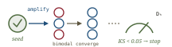
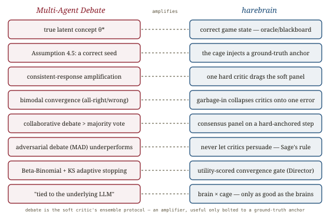

# Multi-Agent Debate for LLM Judges, *deliberated*

*Cliff notes on Hu, Tan, Wang, Qu & Chen, "Multi-Agent Debate for LLM Judges with Adaptive Stability Detection" (ASU / UCF / UNC Chapel Hill, NeurIPS 2025) — the paper that proves collaborative debate beats majority voting, but only when a correct reasoning seed already exists, and knows when to stop spending tokens. It is the productive counterweight to [Sage](../assessing-judges/assessing-judges.md), which found that "debate hurts." Both are right; this page reconciles them for the soft critic.*

---

## The setup: majority voting throws away correct minorities

The judge-ensemble baseline is **simple majority voting** (SoM): run `n` LLM judges independently, return the mode. It is cheap and it is robust to a single bad agent — but it has a structural blind spot the paper names precisely: *it can be wrong even when the right answer is present.* If four agents share a correlated bias and three are individually correct, the mode is wrong and the three correct verdicts are discarded. Majority voting cannot let a correct minority *persuade* the majority, because the agents never talk.

The proposal is to let them talk — but collaboratively, not adversarially. Each of `n` agents emits an initial verdict; in each subsequent round it sees the others' verdicts-with-reasoning and re-judges; the process stops when the agents reach unanimity (or at a round cap, falling back to majority vote). The whole contribution rests on a question Sage would make you suspicious of: *does talking actually help, or does it just import persuasive hallucination?* The answer turns out to be **"it depends entirely on the interaction protocol and on whether a correct seed is in the room"** — and that conditional is the whole story for harebrain.

## The mechanism: debate is Bayesian amplification, not generation

The paper's formal model is the part worth stealing. Each task `x` is generated from a **latent concept** `θ` — the correct way to frame the problem (the right scientific principle, the right reading of the instruction). There is a unique **true concept** `θ*` that maximises the probability of the correct answer. Agents don't observe `θ`; they infer a posterior over it and answer accordingly. Debate is then literally **Bayesian belief updating**: each round, an agent treats the other agents' responses as evidence and shifts its posterior over `θ`.

![Left: a latent-concept space with one true concept theta-star highlighted; an odd ensemble of agents each holding a posterior, one agent seeded on theta-star (the 'initial seed of correct reasoning', Assumption 4.5). Center: a Bayesian update arrow — the seed's strongly-consistent response pulls every other agent's posterior toward theta-star round by round (Theorem 4.1, consistent response amplification). Right: the round-by-round distribution of correct-agent counts collapsing from a broad spread at round 0 to a bimodal spike at 0 or 7 by round 2 — agents either all converge on the truth or all fail together. A banner reads: debate amplifies whatever seed exists; it does not manufacture a seed.](images/fig-01-belief-refinement.svg)
*The two load-bearing results. **Theorem 4.1 (Consistent Response Amplification):** if at least one response in a round is strongly consistent with `θ*`, expected correctness rises next round — a single correct reasoning path drags the ensemble toward truth. **Theorem 4.2:** the debated outcome beats the initial majority vote. But both lean on **Assumption 4.5 (Initial Seed of Correct Reasoning):** there must already exist one agent reasoning from `θ*`. Debate is an amplifier with no input of its own.*

The empirical signature of this is the most important picture in the paper. Across rounds, the distribution of "how many of the 7 agents are correct" starts broad and **collapses to bimodal** — by round 2 the mass piles up at either **0 correct** or **7 correct**. The ensemble either aligns on the truth or *collectively fails*. There is almost no stable middle. That is exactly what you'd expect of an amplifier: feed it a correct seed and it convergence-locks everyone onto `θ*`; feed it no seed and it convergence-locks everyone onto a shared error with high confidence. **Debate makes a correct ensemble more correct and a wrong ensemble more wrong.**

## Knowing when to stop: a Beta-Binomial consensus clock

Iterative debate is expensive, and fixed-round debate is wasteful in both directions — it either stops before consensus or keeps paying after it. The paper's second contribution is an **adaptive stopping mechanism** that detects convergence and halts.

![A consensus clock. Top: the per-round count of correct agents is modeled as a time-varying mixture of two Beta-Binomial distributions — one component for an 'attentive' regime, one for 'inattentive' — fit each round by EM. Middle: between consecutive rounds, the Kolmogorov–Smirnov statistic D_t measures how much the fitted CDF moved. Bottom: a control line — when D_t stays below 0.05 for two consecutive rounds, the debate halts. A small table shows the KS threshold trading rounds for stability: 0.01 never stops (10 rounds), 0.05 stops at 6, 0.20 stops too early at 4.](images/fig-02-adaptive-stopping.svg)
*Model the correct-agent count each round as a **two-component Beta-Binomial mixture** (attentive vs. inattentive judge regimes), fit by EM. Track the **Kolmogorov–Smirnov distance** between consecutive rounds' fitted distributions. When `D_t < 0.05` for two consecutive rounds, the consensus distribution has stopped moving — stop debating. It is a convergence gate with a tunable knob: tighter thresholds buy stability with more rounds; looser ones stop early and risk a not-yet-settled distribution.*

This is a token-budget governor that watches a *statistic of the ensemble's agreement* rather than a fixed counter. The payoff is modest accuracy retention (within ~0.6% of the full 10-round run) at a fraction of the rounds (4–8, usually 5–6). For harebrain the mechanism matters more than the numbers: it is a **guarded transition keyed to a convergence measure** — precisely the kind of utility-scored stop a cage's AI Director should own.

## The result that reconciles this paper with Sage

Sage's headline was blunt: **"panels help, debate hurts"** — debate among judges (ChatEval-style) imports persuasive hallucination, anchoring, and echo-chamber redundancy. This paper's headline is **"debate beats majority voting."** Taken at face value they contradict. They don't — and the reconciliation is the single most useful thing here.

![Two debate protocols compared on the same judgment tasks with the same models. Left, oxblood: adversarial debate (MAD) — debaters argue for and against a position, a judge decides; it underperforms even a single model because the incorrect side is given equal footing to persuade. Right, blueprint: collaborative belief refinement (this paper) — agents share reasoning and update toward consensus; it beats both single-model and majority voting. A ranking strip at the bottom orders the methods on judgment tasks: MAD < Single < SoM (majority) < collaborative Debate. The caption: the protocol is the variable, not the act of talking.](images/fig-03-collab-vs-adversarial.svg)
*The decisive control experiment (the paper's Table 9). On the **same** tasks and models, **adversarial** debate (MAD — opposing debaters + a deciding judge) **underperforms even a single model**, because balanced exposure gives the incorrect side equal opportunity to persuade. **Collaborative** belief-refinement — agents pooling reasoning and updating toward `θ*` — beats both single judges and majority voting. Sage's "debate hurts" was measured on adversarial/persuasion-structured debate; this paper's "debate helps" is measured on collaborative, seed-anchored refinement. **Both findings are correct, and together they pin the design rule: aggregate or collaboratively refine; never let critics adversarially persuade.***

## Where this sits in the harebrain hypothesis

The harebrain thesis is `harebrain = fast LLM brain × structured game-AI cage`. The cage guards transitions with **hard critics** (sound, deterministic — an oracle, a unit test) and **soft critics** (LLM-as-judge — the EDD review on a transition). [LLM-Modulo](../llm-modulo/llm-modulo.md) gave the hard critic its soundness story; the [ABC checklist](../agentic-benchmarks/agentic-benchmarks.md) demanded soft critics be "genuinely independent, rubric-anchored reviewers"; [Sage](../assessing-judges/assessing-judges.md) supplied an oracle-free way to validate one soft critic. This paper is about what happens when you run **several** soft critics on the same transition — and its answer sharpens, rather than overturns, Sage's.

*Debate is the soft critic's ensemble protocol — useful only as an amplifier bolted to a ground-truth anchor the cage already owns.*

| Multi-Agent Debate | harebrain |
|---|---|
| True latent concept `θ*` | the correct game state — what the oracle/blackboard already knows |
| Assumption 4.5: an initial correct seed must exist | the cage must inject a ground-truth anchor — debate can't bootstrap truth |
| Theorem 4.1: consistent-response amplification | one sound (hard) critic drags the soft panel toward truth |
| Bimodal convergence (all-right or all-wrong) | debate amplifies the seed; garbage-in collapses every critic onto one error |
| Collaborative refinement beats majority vote | a consensus-checking soft panel on a hard-anchored transition |
| Adversarial debate (MAD) underperforms a single model | never let soft critics adversarially persuade — Sage's rule, mechanised |
| Beta-Binomial + KS adaptive stopping | a utility-scored convergence gate the AI Director owns |
| "Performance is tied to the underlying LLM" | `brain × cage` — the panel is only as good as the brains in it |

### What the paper gives harebrain

- **A precise model of when a soft-critic panel is worth running.** Debate is *amplification*, formalised: it raises ensemble accuracy **only if Assumption 4.5 holds** — a correct seed is already in the room. Harebrain almost always has that seed available from the hard side (the wumpus oracle, a sound verifier, the typed blackboard's known state). So the design rule is sharp: **run a collaborative soft-critic panel only on transitions where a hard anchor can seed it.** On transitions with no anchor, debate is not neutral — by the bimodal-convergence result it is *dangerous*, because it manufactures high-confidence agreement on whatever shared error the brains import.
- **The Sage tension, resolved into one rule.** Sage said debate hurts; this paper says debate helps. The control experiment (MAD < Single < SoM < collaborative Debate) shows the variable is the **protocol**, not the act of talking. Both papers agree on the actionable half: **adversarial persuasion among critics corrupts judgment.** Harebrain takes the union — *collaborative, seed-anchored consensus refinement is allowed; adversarial debate is banned* — which is strictly more permissive than Sage's "panels only" while still excluding the failure mode Sage measured.
- **A convergence-gated stop for any iterative soft-critic loop.** The Beta-Binomial-mixture + KS stopping rule is a drop-in governor for the EDD review loop: keep refining while the panel's agreement distribution is still moving, halt the moment it stabilises. It turns "how many review rounds?" from a magic constant into a measured property of the ensemble — exactly the kind of utility-scored guarded transition the cage prefers over a fixed counter.

### What harebrain pushes that the paper doesn't

- **The seed should come from the hard critic, not luck.** The paper *assumes* a correct seed exists (Assumption 4.5) and treats its absence as a limitation. Harebrain can *guarantee* the seed on anchored transitions: inject the oracle's verdict or a sound verifier's output as one of the debating "agents," so the panel is provably amplifying truth rather than hoping one brain got it right. This converts Theorem 4.1 from a hopeful precondition into a structural property of the cage — the [two-clocks pattern](../llm-modulo/llm-modulo.md) applied to a panel: a slow sound anchor steering a fast brain chorus.
- **Bimodal convergence is a ledger signal, not just a plot.** The all-right/all-wrong collapse is observable at runtime: harebrain already emits a JSONL ledger of every transition and every critic verdict. A panel that convergence-locks with *no* hard anchor present is a logged red flag — high agreement with no ground-truth seed is the exact configuration the paper shows produces confident collective error. The AI Director can watch for it directly.

> **The trap to mark.** Theorem 4.2 guarantees debate beats majority vote *under its assumptions* — chief among them that a correct seed exists and that agents are conditionally independent given `θ`. Both can fail in a cage: the brains are often the *same* model (correlated, violating independence), and on a genuinely novel transition there may be **no** correct seed. When neither holds, the result inverts — debate amplifies a shared error into unanimous, well-calibrated-looking confidence. So a collaborative soft-critic panel earns trust as a *soft* critic **only when hard-anchored**; it never becomes *sound*. Soundness still comes only from the hard critic, per [LLM-Modulo](../llm-modulo/llm-modulo.md). Consensus is not correctness — it is correctness *amplified or error amplified*, and the cage decides which by whether it supplied the seed.

## What's worth taking away

- Majority voting discards correct minorities; collaborative debate lets a correct seed persuade the ensemble. But the persuasion is Bayesian amplification — it needs a seed to amplify.
- Debate's empirical signature is bimodal convergence: agents end up **all right or all wrong**. It magnifies whatever reasoning seed is present, for better or worse.
- "Debate helps" (this paper) and "debate hurts" (Sage) are both true. The reconciling variable is the protocol: **collaborative refinement helps; adversarial persuasion hurts.** Harebrain bans the latter and allows the former only on hard-anchored transitions.
- The Beta-Binomial + KS adaptive-stopping rule is a reusable convergence gate for the EDD loop — stop when the panel's agreement distribution stops moving.
- Hold the line from [LLM-Modulo](../llm-modulo/llm-modulo.md) and [Sage](../assessing-judges/assessing-judges.md): a consensus-passing panel is *usable*, not *sound*. On an unanchored or correlated-brain transition, unanimity is a warning, not a guarantee.

---

**Sources.** Hu, T., Tan, Z., Wang, S., Qu, H., & Chen, T. "Multi-Agent Debate for LLM Judges with Adaptive Stability Detection." Arizona State University, University of Central Florida & UNC Chapel Hill. *39th Conference on Neural Information Processing Systems (NeurIPS 2025).* [arXiv:2510.12697](https://arxiv.org/abs/2510.12697) ([raw PDF in this folder](Multi-Agent-Debate-for-LLM-Judges-Adaptive-Stability-Detection-2510.12697.pdf)). Builds on Du et al., "Improving Factuality and Reasoning through Multiagent Debate" (ICML 2024); Estornell & Liu, "Multi-LLM Debate: Framework, Principals, and Interventions" (NeurIPS 2024); Qu et al., "Efficient MAP Estimation of LLM Judgment Performance with Prior Transfer" (2025, the Beta-Binomial-mixture prior); Liang et al.'s MAD adversarial-debate baseline (EMNLP 2024). Related in this repo: [Assessing LLM-as-a-Judge (Sage)](../assessing-judges/assessing-judges.md) (the "debate hurts" counterweight this page reconciles), [Autorubric](../autorubric/autorubric.md) (how to build the soft critic each panelist applies), [Rigorous agentic benchmarks (ABC)](../agentic-benchmarks/agentic-benchmarks.md) (the independent-reviewer pillar), [LLM-Modulo](../llm-modulo/llm-modulo.md) (hard vs soft critics; soundness inherited only from hard ones), the [harebrain thesis](../../harebrain/harebrain.md), and the wumpus experiment matrix in `definitions.md`. All diagrams above are original SVGs drawn for this page.
