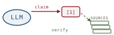

# A Survey of LLM Attribution, *charted*

*Cliff notes on Li, Sun, Hu, Liu, Chen, Hu, Wu & Zhang, "A Survey of Large Language Models Attribution" (arXiv:2311.03731, 2023) — and how its taxonomy of citing-your-sources becomes guard vocabulary for the harebrain cage.*

---

## Why this paper is the map of the cluster

This is a survey, not a result. Where [[llm-modulo]] argues *that* the cage is necessary, where [[hallucination-recitations]] explains *why* the brain drifts, and where [[hart]] hardens one tracing mechanism, this paper does the dull, load-bearing work of *cataloguing* — it lays out every kind of attribution anyone has tried, every dataset they tried it on, every way they measured it, and every way it breaks. It is the legend for the rest of the cluster.

The throughline across all four papers is the same: *attribution — attaching verifiable evidence to a generated claim — is the mechanism that binds the fast, ungrounded LLM brain to real sources.* In harebrain terms that is a **species of the cage's hard critic, pointed at claims instead of plans.** The survey's contribution is that it gives us a *vocabulary* for which class of critic a given guard is, and a checklist of the failure modes any such guard must catch.

> **The one-line claim.** Attribution sidesteps the impossible task of judging a statement's raw "truthfulness" and replaces it with a tractable one: *is this statement backed by an identifiable source?* That substitution — verifiability for veracity — is the whole reason attribution is buildable when a truth-oracle is not.

## What the paper means by "attribution"

The task definition (§2) is precise enough to lift directly. Given a query `q` and a corpus of text passages `D`, a system produces an output `S` that is a set of `n` statements `s₁, …, sₙ`. Each statement `sᵢ` carries a citation set `Cᵢ = {c_{i,1}, c_{i,2}, …}`, where each `c_{i,j}` is a passage drawn from `D`. Attribution is the discipline of making that `Cᵢ` *correct*.

"Correct" splits into two requirements the paper inherits from Liu et al. (2023), and they are exactly precision and recall wearing different hats:

| Requirement | Plain reading | Failure if absent |
|---|---|---|
| **Comprehensive attribution** (high recall) | Every claim that *could* be cited *is* cited | Uncited assertions slip through — the reader can't check them |
| **Sufficiency attribution** (high precision) | Every citation actually *supports* its claim | Decorative citations — a source is named but doesn't back the statement |

This is the cleanest idea in the paper, and harebrain should adopt it wholesale: **recall is a soft-critic concern, precision is a hard-critic concern.** "Did we cite everything?" is a coverage judgment an EDD reviewer can flag. "Does this source entail this claim?" is an entailment check a sound guard can decide. They are *different critics* with different soundness stories, and the survey's two-requirement split is the seam between them.

The paper anchors the whole frame in a triangle: **Correctness** and **Groundedness** are the two checks; together they yield **Factuality**, the property a user actually cares about. Attribution is the bridge — it is how *Verifiability* turns into *Factuality* without anyone having to adjudicate truth in the abstract.

## The taxonomy, redrawn

The survey's Figure 2 is a five-branch tree. Redrawn against the harebrain palette:

*The whole field on one page. The branch worth memorizing is Approaches — it is a taxonomy of* when *attribution happens relative to generation.*

The branches:

- **Sources (§3)** — *where the evidence comes from.* Two kinds. **Pre-training data**: tracing a claim back to the slice of the training corpus that produced it (ORCA, ROOTS, QUIP-Score). **Out-of-model knowledge**: evidence fetched at inference time from the web or a knowledge base — retrieval-augmented generation, Retro, FiD. This is the [[rag-attribution-survey]] half of the world.
- **Datasets (§4)** — *what we test on.* Mostly repurposed QA and summarization benchmarks: WebGPT, WebCPM, HAGRID, ALCE, ExpertQA, BioKaLMA. The paper notes two axes that matter: *question domain* (open vs specialized — ExpertQA's 32 high-stakes domains) and *attribution granularity* (entity-level vs sentence-level).
- **Approaches (§5)** — *the part that earns the survey its keep.* Three timings plus the deployed systems. Detailed below.
- **Evaluation (§6)** — *how we score it.* Human, categorization-based, and quantitative metrics. Detailed below.

### The three timings of attribution

The Approaches branch is really a taxonomy of *when the citation is attached relative to when the answer is generated*. This is the distinction harebrain should internalize, because each timing maps to a different guard placement.

| Approach | When the citation happens | Representative work | The catch |
|---|---|---|---|
| **Direct generated** (§5.1) | The model cites from its own parametric memory, inline | RECITE, Blueprint, 1-PAGER | The citations themselves can be hallucinated — ChatGPT gives correct answers ~50.6% of the time but the suggested reference is actually present only ~14% of the time |
| **Post-retrieval answering** (§5.2) | Retrieve first, then answer over what was retrieved | Self-RAG, SearChain, LLatrieval | Retrieval ≠ attribution — the boundary between the model's internal knowledge and the retrieved text blurs, inviting knowledge conflicts |
| **Post-generation** (§5.3) | Answer first, then search and post-edit to attach (and fix) citations | RARR, CCVER | Only 51.5% of content from four generative search engines was fully supported by its cited sources |

The numbers in the right column are the ones to keep. They are the survey quietly admitting that *every* timing leaks — the brain produces a fluent claim and the citation is the part that lies.

> **The reframe for harebrain.** These three timings are three *guard placements*. Direct-generated is a guard that fires on the LLM's raw output (cheapest, least sound — the model graded itself). Post-retrieval is a guard placed *before* generation (the retrieved set bounds what can be claimed). Post-generation is a guard on the transition *exit* — verify-before-Report, route on the verdict. Harebrain's seam naturally supports the third and is strongest there: a `retrieve()` host import returning a typed verdict the chart routes on is exactly post-generation attribution with a sound boundary.

## How the field grades attribution

Evaluation (§6) comes in three flavors, and the trajectory is the usual one — from expensive humans toward cheap-but-approximate automation.

- **Human evaluation.** Still the default. ~$1 to annotate a single (query, answer, reference) triple (Liu et al., 2023). In deployment the burden falls on the *user* to manually verify — which the paper flags as an unfair tax to push onto readers.
- **Categorization-based.** Early work was binary (attributable or not) by repurposing NLI. Yue et al. (2023) refine it into three verdicts worth stealing as a guard's return type: **attributable** (source fully backs the claim), **extrapolatory** (source gives insufficient backing), **contradictory** (statement opposes the cited source). That is a clean three-valued verdict, not a boolean — and a chart can route on all three.
- **Quantitative.** Correctness, Precision, Recall, F1 (Li et al., 2023b); QUIP-Score, an n-gram overlap measuring how much of an answer is verbatim membership in the corpus; citation accuracy (Thoppilan et al., 2022).

> **The AIS lineage.** The foundational framework is *Attributable to Identified Sources* (Rashkin et al., 2021): is the produced statement *entirely* backed by the referenced source? Every later metric is a softening or sharpening of that one question. When harebrain writes an entailment guard, AIS is the predicate it is computing.

## Where attribution breaks

This is the section the harebrain cage actually needs, because every named pathology is a verdict a sound critic on the seam must be able to return. The survey splits its failures across §7.1 (error types) and §7.2–7.3 (limitations and challenges).

*Six ways the citation lies. The first three are errors in a produced citation; the last three are structural limits on when attribution is even possible.*

The error types (§7.1):

1. **Granularity error.** The answer is complex and hybrid — assembled from several documents — so a single citation can't cover it, and the result is *insufficient* citation. This is a recall failure at the structural level.
2. **Mistaken synthesis.** The model mixes up relationships between entities and events drawn from multiple documents; the citation is then unfaithful to the text it claims to support. A precision failure.
3. **Hallucinated generation.** The reference is irrelevant to the question, *or* the model's parametric knowledge clashes with the external document — and the answer plus its citation are both wrong. This is the [[hallucination-recitations]] failure leaking into the citation layer.

The limitations and challenges (§7.2–7.3) are deeper, because they are about when attribution is *possible at all*:

- **Ambiguous knowledge reservoir.** The headline pathology. Knowing *when* to attribute is itself unsolved — the line between general knowledge (needs no citation) and specialized knowledge (must be cited) is a gray area. Worse: **LLMs cannot attribute their own parametric knowledge.** The model cannot say which training source produced a given claim. For harebrain this is the load-bearing limitation, addressed below.
- **Over-attribution.** Cite too much and you overwhelm the user, burying the important reference among trivial ones — *and* you risk leaking private information. The paper treats over-citation as a real harm, not just noise.
- **Misattribution.** Linking a claim to an irrelevant or incorrect source — e.g. a medical LLM associating faulty guidance with a trustworthy reference, steering a user toward harm.
- **Source bias.** The model leans toward some sources and ignores others; the fix is varied training data and better crediting methods (Gunasekar et al., 2023).
- **Knowledge fluidity / decay.** A correct citation goes stale as the world changes — acute in fast-moving fields like CS and clinical medicine. Citations have a half-life.

> **The trap, in the paper's own vocabulary.** "We have a citation" is not "we have a *sufficient* citation." The generative-search-engine number — 51.5% of content actually supported — is the size of the gap between *cited* and *backed*. A harebrain workflow that records a `source` field on a blackboard claim and calls it done has built the appearance of provenance, not the guarantee. The guarantee requires an entailment check, and that check is a separate, sound critic.

## Where this sits in the harebrain hypothesis

The harebrain thesis is `harebrain = fast LLM brain × structured game-AI cage`. The survey is not an architecture, so the mapping is not box-for-box like [[llm-modulo]]'s. Instead it is a *vocabulary import*: the survey's constructs become the names for *which kind of guard* a given seam check is, and its pathologies become the *test suite* every claim-guard must pass.

![Two-column mapping: attribution-survey constructs on the left in oxblood, harebrain primitives on the right in blueprint, dashed arrows between matched pairs. Citation set maps to provenance metadata on a blackboard claim; sufficiency to a hard transition guard; comprehensiveness to EDD soft-critic review; post-generation attribution to a guard on the transition exit; over-attribution to an AI Director throttle; attribution systems to the seam; and the ambiguous reservoir to the gap neither side has solved.](images/fig-03-mapping.svg)
*Attribution is the hard critic applied to claims. The bottom row is the one neither the survey nor harebrain has solved.*

| Attribution survey | harebrain |
|---|---|
| Citation set `Cᵢ` on statement `sᵢ` | Provenance metadata on a blackboard claim — `{fact, source, span}`, decaying |
| Sufficiency (high precision) | Hard transition guard — `when [entailed(claim, src)] => Commit` |
| Comprehensiveness (high recall) | EDD adversarial review — soft critic flags any uncited claim |
| Post-generation attribution | Guard on the transition exit — verify-before-Report, route on verdict |
| Over-attribution | AI Director throttle — outer loop tunes the citation budget |
| Attribution systems (WebGPT, GopherCite) | The seam — `retrieve()` host import → typed verdict |
| Ambiguous knowledge reservoir | The unsolved gap — no source means no guard can fire |

### What the paper gives harebrain

Three things, each load-bearing.

- **The precision/recall split as a *two-critic* design.** Harebrain treated transition guards as one category. The survey's comprehensiveness/sufficiency split says: a claim-guard is really *two* critics. The recall critic ("is everything cited?") is soft — an EDD expectation, LLM-evaluable, advisory. The precision critic ("does the source back this?") is hard — an entailment predicate (AIS), deterministic where you have a checker. Harebrain should *never collapse them*: they have different soundness stories, exactly the [[llm-modulo]] hard/soft distinction reappearing one level down at the claim grain.
- **A three-valued verdict for the guard's return type.** Yue et al.'s *attributable / extrapolatory / contradictory* is better than a boolean. A chart that routes on three outcomes — commit, gather-more-evidence, retract — is strictly more expressive than one that only accepts or rejects. Harebrain's seam should return this verdict, not a bool.
- **A failure test-suite for the seam.** The six pathologies are six tests every claim-guard must pass before harebrain markets a provenance guarantee: does it catch granularity gaps (recall), mistaken synthesis (faithfulness), hallucinated references (precision), over-citation (the Director's budget), staleness (blackboard decay), and bias (source diversity)? The survey wrote harebrain's acceptance criteria.

### What harebrain pushes that the paper doesn't

Two extensions. Both are bets.

- **Provenance as *first-class, decaying blackboard state* — not a post-hoc citation.** The survey treats attribution as a property of the *final output* `S`. Harebrain pushes it inward: every claim *enters the blackboard* with its provenance attached, and that provenance **decays** like any other blackboard fact. A cited source that was sound three ticks ago is exactly the survey's "knowledge fluidity" problem — and harebrain already has the mechanism (decay) to model it, where the survey only names it as an open challenge. Attribution-with-decay is a harebrain primitive the field hasn't built.
- **A standing answer to the ambiguous reservoir.** The survey's deepest limitation — the model can't cite its own parametric memory — is, for an agentic cage, *not a limitation but a routing rule*. If a claim has no external source, **no guard can fire on it**, so the chart must refuse to Commit and instead transition to a `retrieve()` state that forces the claim through the out-of-model path. The cage converts "the brain can't attribute itself" from an unsolvable epistemics problem into a transition the chart simply takes. The brain never has to introspect; the cage routes around the blind spot.

> **Where harebrain must not overclaim.** The survey's strong verdicts (AIS, entailment) need a *real source* to check against. A harebrain workflow whose claims are ungrounded — no corpus, no retrieval, pure parametric generation — has nothing for a hard precision-guard to read, and therefore inherits *none* of the survey's guarantees. In that regime harebrain is running recall-only soft critics: it can flag *that* a claim is uncited, but it cannot verify *whether* a citation is sufficient. Same vocabulary; weaker guarantee. Mark the difference.

## What's worth taking away

- The survey's precision/recall (sufficiency/comprehensiveness) split is the right decomposition for any claim-guard, and it maps cleanly onto harebrain's hard/soft critic distinction one level below the plan grain.
- The three timings of attribution — direct, post-retrieval, post-generation — are three guard *placements*. Harebrain's seam is strongest at post-generation: `retrieve()` returning a typed verdict the chart routes on.
- Yue et al.'s three-valued verdict (attributable / extrapolatory / contradictory) is the return type the seam should adopt — strictly better than a boolean.
- The six failure modes are harebrain's acceptance criteria for a provenance guarantee. Do not ship a `source` field and call it attribution; ship the entailment check and the test suite.
- The ambiguous-knowledge-reservoir problem — the brain can't cite itself — is, in an agentic cage, a *routing rule*, not a wall: no source means no Commit; transition to retrieval instead. That is the one place harebrain has a cleaner answer than the survey.

---

**Sources.** Li, D., Sun, Z., Hu, X., Liu, Z., Chen, Z., Hu, B., Wu, A., & Zhang, M. "A Survey of Large Language Models Attribution." 2023. [arXiv:2311.03731](https://arxiv.org/abs/2311.03731) ([raw PDF in this folder](a-survey-of-llm-attribution-2311.03731.pdf)). Repository of ongoing work maintained by the authors at HITsz-TMG/awesome-llm-attributions. Foundational frameworks referenced above: Rashkin et al., "Measuring Attribution in Natural Language Generation Models" (AIS, 2021); Bohnet et al., "Attributed Question Answering" (2022); Liu, Zhang & Liang, "Evaluating Verifiability in Generative Search Engines" (2023); Yue et al., "Automatic Evaluation of Attribution by Large Language Models" (AttrScore, 2023). All diagrams above are original SVGs drawn for this page.
