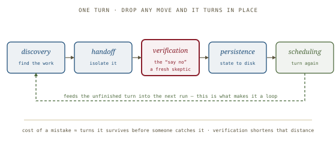
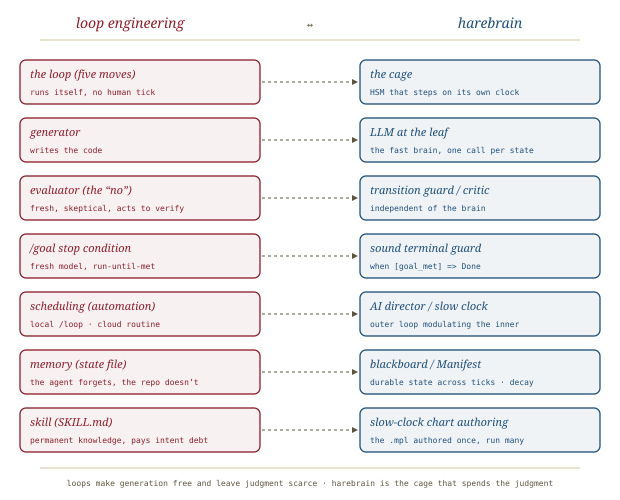

# Loop Engineering, *staged*

*Cliff notes on HuaShu's working note "Loop Engineering: The Anthropic Playbook for Designing Systems That Prompt Your Agents" (2026) — a field study of loops that run themselves, and how the generator/evaluator split is the harebrain cage under another name.*

---

## The position the note takes

A string of "*XX* Engineering" terms has tracked the pace of model releases — prompt, context, harness. **Loop engineering** is the newest, surfaced in a single week of June 2026 by Peter Steinberger (author of [[openclaw-emails|OpenClaw]]), Boris Cherny (Claude Code lead at Anthropic), and named in writing by Addy Osmani. The note argues this one is different in kind, not degree.

> **The one-line claim.** The earlier layers all teach the practitioner to do the work better while still seated at the keyboard. Loop engineering removes the practitioner from doing the work at all: *"replacing oneself as the person who prompts the agent, and designing the system that does it instead."* You stop being the engine and become the person who designs the engine.

Why now? Not a model release — a threshold. Coding agents became reliable enough to finish a non-trivial task unattended; scheduling primitives appeared in the major harnesses; and a single run got cheap enough that running it on a timer stopped looking wasteful. When the parts are all present, the composition becomes obvious to everyone at once. *Practice first, name second* — the note's tell for where the next term will come from.

## One floor above the harness

*The three lower layers assume a human at the keyboard. The loop deletes that assumption.*

The layers stack; each minds something one size larger — one sentence, one window, one run, and finally a loop that runs itself. What the top floor adds reduces to three verbs: it **runs on a timer** (wakes on schedule, no button-press), **spawns helpers** (sub-agents for parallel work), and **feeds itself** (this round's output is next round's input, written to a file that survives). That memory-across-conversations is what makes it a loop rather than one task run many times.

> **The single most important intuition.** *The cost of a mistake scales with the number of turns it survives before someone catches it — and a loop is, by construction, a machine for maximizing the number of turns.* The same bug that costs one wrong answer at the prompt layer becomes load-bearing after a night of turns at the loop layer. Everything downstream — the evaluator, the human checkpoint, the budget caps — exists to shorten the distance between a mistake and its discovery.

## The five moves of one turn

*Drop any one move and the loop won't turn, or turns in place. Verification is the move that can say "no."*

- **Discovery** — the loop finds its own work (read CI failures, open issues, recent commits) rather than being handed a list. It sets the ceiling: surface work of no value and the other four moves serve nothing. Crucially it triggers a *skill*, not a wall of instructions pasted into a cron job nobody updates.
- **Handoff** — each finding gets its own isolated git worktree, so parallel agents don't step on each other.
- **Verification** — the easiest move to cut corners on and the least affordable to skip. A *second* sub-agent reviews the first's work. This is "the thing that can say no"; a loop without a real check is just an agent nodding at itself.
- **Persistence** — the result lands somewhere that survives the conversation (a PR, a ticket, a state file). *The agent forgets; the repo does not.*
- **Scheduling** — an automation makes one turn into a loop; the state file lets unfinished work carry to the next run.

Six *parts* realize the five moves: **automations** (scheduling), **worktrees** (handoff), **sub-agents** (verification), **memory** (persistence), plus **skills** (permanent knowledge that pays off *intent debt* — re-explaining the project every turn) and **connectors** (MCP hookups that set the loop's radius of vision). "With all six a loop has a skeleton — but the same set of parts, built by two people, can come out completely opposite."

## Generator and evaluator: the hard part

The note's technical center, and the part worth lifting whole.

*A loop's floor is its evaluator. The generator decides what a loop can produce; the evaluator decides what it won't produce.*

- **It always praises itself.** Ask an agent to grade what it just produced and it praises it confidently (observed by Anthropic's Prithvi Rajasekaran building long-running apps). Not a smarts problem — grading one's own homework. The context the code was written in is *stuffed with the reasons it was written that way*, so the agent sees the chain of self-persuasion, not the result. Inside a loop the flaw amplifies: each round it nods at itself and drifts.
- **Tune a skeptic, don't fix a modest author.** Making the generator self-critical works poorly. Tuning a *standalone* evaluator to be skeptical is far more tractable — the difference is structural, not wording. Borrowed from GANs: one network builds, one picks faults.
- **The evaluator should act, not just read.** If it only reads code it judges "does this *look* right," not "does it *run* right." Hooked to Playwright MCP it opens the page, clicks, screenshots, inspects the DOM — "I clicked the button, the page navigated, here is the screenshot." Swap the underlying model too; the same model with new instructions keeps its blind spots. Default stance: *assume the code is broken until proven otherwise.*
- **In a product: `/goal`.** Claude Code turns the stop condition into a primitive — run until a condition is met, with a *fresh small model* judging whether it holds after each turn. This is the decades-old banking **maker/checker** principle (the person entering a transfer and the person reviewing it must differ) applied to the stop condition. (Not to be confused with `/loop`, which merely reruns on an interval.)

## Five ways a loop goes wrong

Each anti-pattern is exactly one move skipped:

| Failure | Move skipped | Symptom |
|---|---|---|
| **Nodding loop** | verification | never once said "no" across hundreds of turns |
| **Amnesiac loop** | persistence | each morning it starts from the same place |
| **Manual loop** | scheduling | last run was the day it was demoed |
| **Blind loop** | discovery | a human still spends the morning deciding the work |
| **Tangled loop** | handoff | fine with one agent; collides the first morning five run at once |

They cluster: the hasty loop installs only discovery and handoff — the two that produce *visible output* — and skips the three that produce *safety*.

## Three loops in the wild

- **One engineer's morning.** Osmani's triage loop runs automatically each morning: a skill reads yesterday's CI failures, open issues, and commits; each finding opens a worktree; one sub-agent drafts, a second reviews; a connector opens the PR; anything uncertain lands in an inbox for a human; a state file survives to tomorrow.
- **Stripe's Minions — 1,300 PRs a week.** Not one line hand-written (per Stripe's Steve Kaliski). The trigger is light (`@` the bot in Slack). The reliability lives *before* the model wakes: a **deterministic orchestrator** assembles context (scans links, pulls Jira, uses Sourcegraph + MCP to find code) — because letting the LLM find its own context is the least controllable part, so that work is taken out of the model's hands. The counterintuitive core: Minions is a fork of the open-source *Goose*, not a stronger model. *Reliability comes from the quality of the constraints, not the size of the model.* Deterministic gates (linter, commit) interlock with creative LLM steps; the 1,300 PRs are still human-reviewed — "the human did not leave, but changed desks, from writing to reviewing."
- **What "while you sleep" relies on.** Local `/loop` and desktop tasks need the machine on (frequent, sees local files); cloud routines run untethered (true autonomy, but ≥1h interval and a clean clone each run). No single scheduler does it all; a mature loop uses both.

## The four costs that don't clear themselves

A loop that runs itself is a loop that errs by itself, and none of these sounds an alarm while it runs:

- **Verification debt** — saved time turns into unverified output waiting to be paid back, hiding in the gap between "runs" and "right."
- **Comprehension rot** — the codebase grows while the map in your head stalls; the faster the loop ships code you didn't write, the wider the gap.
- **Cognitive surrender** — the more reliable the loop, the easier it is to stop having an opinion and take whatever it hands back.
- **Token blowout** — the one that hits the bill; a single bug can spin idle all night.

They are not four independent risks but *one failure wearing four faces*, reinforcing each other: more unverified output → less understanding → more surrender → longer unwatched runs → bigger bill → more unverified output. The guard against all four is the same: **keep a human capable of saying "no," and install a check the human doesn't have to be awake to run.**

## The economics, and the posture

The deeper claim: loops make generation nearly free — code, plans, PRs — and leave **judgment** as the scarce resource. As generation approaches free, the engineer's entire value concentrates into the gap between "looks reasonable" and "is right," which is exactly where engineering lives. The loop is *a faithful multiplier of its builder*: bring understanding and it amplifies understanding; bring laziness and it amplifies laziness. The same loop, built by two people, ends in opposite places — separated by one or two checkpoints.

> **The sentence to carry away.** *Stop prompting the agent, and design the system that prompts it — but design it like someone who intends to stay the engineer, not just the one who presses go.* The operational discipline: **read a sample every day** (and force yourself to explain each sampled change), **cap before you ship** (per-run, daily, max-retries — circuit breakers, not budgets), and **keep one door open** (a checkpoint that pauses for a human, so you stay *able* to intervene).

## Where this sits in the harebrain hypothesis

The harebrain thesis is `harebrain = fast LLM brain × structured game-AI cage`. Loop engineering is that hypothesis restated from the ops side: **generation is cheap (the brain), the "no" is scarce (the cage).** The five moves are the cage's control structure; the generator/evaluator split is `brain ≠ critic`; and the whole note is an argument that the loop's value is bounded by the quality of its constraints — harebrain's exact bet.

*Loops make generation free and leave judgment scarce; harebrain is the cage that spends the judgment.*

| Loop engineering | harebrain |
|---|---|
| The loop (five moves) | The cage — an HSM that steps on its own clock |
| Generator | LLM at the leaf — the fast brain, one call per state |
| Evaluator (the "no") | Transition guard / critic — independent of the brain |
| `/goal` stop condition (fresh model) | Sound terminal guard — `when [goal_met] => Done` |
| Scheduling / automation | AI Director on the slow clock — outer loop modulating the inner |
| Memory (state file) | Blackboard / Manifest — durable state across ticks, with decay |
| Skill (`SKILL.md`) | Slow-clock chart authoring — the `.mpl` authored once, run many |

### What the note gives harebrain

- **The ops-side proof of `brain ≠ critic`.** [[llm-modulo]] argues from theory that an LLM cannot soundly self-verify; [[expectation-driven-development|EDD]] argues it from the keyboard ("the fox guarding the henhouse"). Loop engineering supplies the *field evidence*: at Anthropic scale, tuning an independent skeptic is tractable and making a generator self-critical is not. Three independent derivations of one law — the strongest form of harebrain's brain-and-cage separation.
- **A failure taxonomy for missing guards.** The five anti-patterns are what a harebrain workflow looks like with a move deleted — the *Nodding Loop* is precisely a critic bank made entirely of advisory (self-graded) guards. Harebrain should adopt the "one skipped move = one named failure" framing for chart review.
- **"Reliability from constraints, not model size."** Stripe's Minions is the empirical statement of harebrain's whole reason to exist: a fork of a *weaker* open tool, made reliable by deterministic gates around the LLM. The line between "deterministic logic can solve it" and "goes to the probabilistic model" is exactly where harebrain draws its transition guards.
- **The maker/checker stop condition.** `/goal` judged by a *fresh* model is the runtime shape of a sound terminal guard — completion decided by something that is not the thing doing the work. Harebrain's terminal transitions should be classified this way.

### What harebrain pushes that the note doesn't

- **Per-state guards, not per-turn review.** The note's verification fires once per turn (a second sub-agent reviews the drafted change). Harebrain pushes the check inward to *every transition* of the chart, so the "distance between a mistake and its discovery" the note worries about is bounded by one state, not one turn.
- **The chart as the discovery structure.** Loop engineering's *discovery* is an LLM skill that "finds its own work." Harebrain replaces open-ended discovery with an authored HSM topology — the work the loop may do is the set of states the chart admits. This trades the note's flexibility for a hard bound on where the loop can go, which is the point of a cage.

> **The trap to mark, in the note's own vocabulary.** *"A loop that has never once said 'no' to itself across hundreds of turns is proof that no real check exists."* A harebrain workflow whose guards are all LLM-evaluated soft critics is a Nodding Loop with a state diagram drawn around it. The topology looks disciplined; without at least one *sound* guard it accumulates plausible mistakes at machine speed, exactly as the note describes.

## What's worth taking away

- Loop engineering is the harebrain hypothesis in practitioner dress: generation cheap, judgment scarce, and the loop a faithful multiplier of whatever discipline its builder brings.
- The generator/evaluator split is `brain ≠ critic` with field evidence at Anthropic/Stripe scale — the third independent derivation alongside [[llm-modulo]] (theory) and [[expectation-driven-development|EDD]] (practice).
- The five anti-patterns are a ready-made review checklist for harebrain charts: each names the failure of one missing guard-role.
- "Reliability from the quality of the constraints, not the size of the model" is the sentence harebrain should quote when defending the cage.
- The note is honest that the loop is only as good as its checkpoints — harebrain should cite it as the operational argument for sound guards, not as evidence any particular guard is sound.

---

**Sources.** HuaShu (华数). "Loop Engineering: The Anthropic Playbook for Designing Systems That Prompt Your Agents — A Field Study of Designing Loops That Run Themselves." Working note, 2026 — an independent conference-style reformatting of the author's open guide *Loop Engineering: Stop Asking Me What It Is* (Orange Books, v260615, June 2026), freely available at huasheng.ai/orange-books ([local PDF in this folder](loop-engineering-working-note-2026.pdf)). Underlying framework and quoted formulations due to Addy Osmani ("Loop Engineering," personal blog and Substack, June 2026); generator/evaluator findings to Prithvi Rajasekaran (Anthropic engineering blog, 2026); enterprise case to Steve Kaliski ("Stripe's Minions," *How I AI* podcast, 2026). Companion harebrain summaries: [[llm-modulo]] (theory) and [[expectation-driven-development]] (practice) — the two other derivations of `brain ≠ critic`. All diagrams above are original SVGs drawn for this page.
