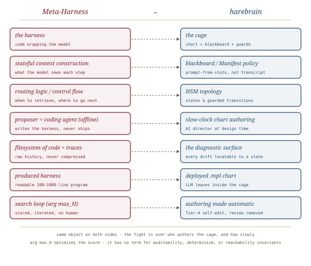

# Meta-Harness, *searched*

*Cliff notes on Lee, Nair, Zhang, Lee, Khattab & Finn, "Meta-Harness: End-to-End Optimization of Model Harnesses" (arXiv:2603.28052, March 2026) — and the awkward question it puts to the harebrain hypothesis: if the cage is just code, can a machine search for it?*

---

## The object the paper makes first-class

Most of the LLM-systems literature optimizes one of two things: the *weights* (fine-tuning, RL) or the *prompt* (few-shot selection, instruction tuning, prompt evolution). Meta-Harness optimizes a third thing, and the contribution is mostly in naming it crisply and then treating it as the search target.

> **The definition, verbatim.** A harness is *"the code that determines what information to store, retrieve, and present to the model"* — *"a stateful program that wraps a language model and determines what context the model sees at each step."* Harness engineering is *"refining the code around an LLM to improve the overall system's performance."*

That definition should sound familiar to anyone holding the harebrain thesis. The harness is the *cage*. It is the routing logic, the retrieval policy, the state updates, the control flow — everything around the model that decides what the model sees and when. Harebrain calls this the chart plus the blackboard plus the guards. Meta-Harness calls it the harness. Same object.

The paper's opening provocation is the size of the lever:

> **The headline lever.** *"Changing the harness around a fixed large language model can produce a 6× performance gap on the same benchmark."* Same weights, same prompt-level instructions — 6× from the code around the model. And yet *"harness engineering remains largely manual: practitioners inspect failures, adjust heuristics, and iterate on a small number of designs."*

So the gap is: the cage is the biggest available lever, and we pull it by hand, slowly, a few designs at a time. Meta-Harness asks whether we can pull it automatically.

## Why not prompt optimization (the distinction that matters)

The natural objection is that this is just prompt/context optimization rebranded — ACE, GEPA, memory-evolution methods already "optimize the context." The paper is careful, and correct, to draw the line.

Prompt and context optimizers tune *what context to construct* inside a **fixed control-flow template**. They evolve example sets, instruction wording, retrieved-passage selection. The scaffolding — the routing, the decision of *when* to retrieve, the state-update rules, the loop structure — is held constant. Meta-Harness searches over the *entire executable structure*, control flow included.

> **The mechanism objection, in the paper's words.** Existing text optimizers are *"poorly matched to this setting because they compress feedback too aggressively: they are memoryless, condition only on scalar scores, or restrict feedback to short templates or summaries."* A harness operates over long horizons, where *"a single choice about what to store, when to retrieve it, or how to present it can affect behavior many reasoning steps later."* A scalar reward cannot tell you *which* earlier design choice caused the late failure.

This is the load-bearing argument. The reason you search *code* and not *prompts* is that code is where the long-horizon control decisions live, and the diagnostic signal you need — *why did this run fail, and which earlier line caused it* — is legible in code and execution traces but destroyed by scalar-score feedback.

## The search method

The optimizer is almost embarrassingly direct, and the paper is honest that the simplicity is the point.


*The loop is a coding agent with a filesystem for memory. No compressed feedback, no scalar bottleneck — the proposer greps the raw history of everything it has tried.*

The objective is the obvious one — find the harness that maximizes expected reward over the task distribution:

```
H* = arg max_H  E_{x~X, τ~p_M(H,x)}  r(τ, x)
```

The optimizer is a coding agent (Claude Code driving Opus-4.6) used as the *proposer*. Each iteration:

1. The proposer **inspects a filesystem** holding the source code, scores, and execution traces of every prior candidate, using ordinary terminal tools (`grep`, `cat`).
2. It **proposes `k` new harness variants** — edits or rewrites of the task-specific harness.
3. An evaluator **runs them on the search set**.
4. Code, scores, and traces are **written back to the filesystem**.
5. Repeat for `N` iterations.

The one genuinely novel design choice is the refusal to compress. Rather than handing the proposer a summary or a scalar, Meta-Harness exposes *"full history through a filesystem, enabling selective diagnosis of raw prior code and execution traces."* The proposer reads a *median of 82 files per iteration* and *references over 20 prior candidates per step*. Because it can *"inspect execution traces, the proposer can often infer why a harness failed and which earlier design choices likely contributed."*

> **The two-level structure, named.** There is a proposer LLM (the coding agent that *writes* harnesses) and a produced harness (itself an LLM-calling program that wraps a *task* model). The proposer never runs in production. It is a design-time author. What ships is the harness it converges on — a readable Python program, 100–1000 lines, that you can inspect and edit.

That two-level split is exactly the "two clocks" pattern from the harebrain note, arriving from the opposite direction. Hold that thought for the mapping section.

## The evidence

Three domains. The pattern across all three is the same: a strong general coding agent, given access to the search space and the raw history, beats hand-engineered and prior-automated baselines — often at a fraction of the evaluation budget.

| Domain | Metric | Meta-Harness | Best baseline | Delta | Efficiency note |
|---|---|---|---|---|---|
| Online text classification | accuracy | **48.6%** | ACE 40.9% / MCE 40.0% | **+7.7 / +8.6 pts** | 11.4K context tokens vs ACE 50.8K (**~4×** fewer) |
| Text classification (OOD) | avg acc, 9 unseen sets | **73.1%** | ACE 70.2% | +2.9 pts | strategy transfers, not memorized |
| RAG math (IMO-level) | pass@1, mean over 5 held-out models | — | — | **+4.7 pts** | *one* harness, five unseen task-models |
| TerminalBench-2 (Opus 4.6) | resolve rate | **76.4%** | Capy 75.3% / Terminus-KIRA 74.7% | beats both | #2 on leaderboard (behind ForgeCode 81.8%) |
| TerminalBench-2 (Haiku 4.5) | resolve rate | **37.6%** | Goose 35.5% / Terminus-KIRA 33.7% | beats both | #1 among Haiku agents |

Two findings deserve more than a table row.

**Sample efficiency.** On text classification, Meta-Harness *"reaches the final accuracy of OpenEvolve and TTT-Discover within the first 4 evaluations"* — matching the best prior optimizers in roughly *0.1× the evaluations*. The catch, made explicit in their Table 1, is that each iteration consumes about *10 Mtok of context* against 0.002–0.026 Mtok for the prior methods. Meta-Harness buys fewer-but-fatter iterations: orders of magnitude more context per step, far fewer steps. Whether that is a win depends entirely on the relative price of evaluation rollouts versus proposer context.


*Two efficiencies, not one. The deployed harness uses ~4× fewer context tokens at inference (the Pareto frontier), and the search reaches the baselines' final accuracy in ~4 evaluations (the inset). The cost is hidden in the proposer's 10 Mtok/iteration.*

**Transfer.** The math result is the most interesting for the harebrain question. A *single* discovered retrieval harness, searched once, *"improves accuracy by +4.7 points on average across five held-out models"* it never saw during search (GPT-5.4-nano +8.7, Gemini-3.1-Flash-Lite +6.3, Gemini-3-Flash +3.7, GPT-OSS-20B +3.0, GPT-5.4-mini +1.6). The harness encodes a *retrieval strategy*, not a model-specific trick, and the strategy ports across model families. That is the strongest evidence in the paper that code-space search finds reusable structure rather than brittle memorization.

## What's load-bearing, and what's weak

The strong claims first. The harness-as-first-class-object framing is correct and useful, the no-compression filesystem-memory design is a real and well-motivated mechanism, and the cross-model transfer of the math harness is genuine evidence that the search finds structure.

Now the weak joints, which the paper is mostly — though not entirely — candid about.

- **It is one proposer.** Every result is *"one particularly strong coding-agent proposer (Claude Code); a broader study of how the effect varies across proposer agents remains for future work."* The method is "use the best coding agent you have as a search operator." If the proposer is the source of the lift, this is less a new optimizer than a new application of a frontier coding agent — and it will track frontier-agent capability, not stand on its own.
- **TerminalBench-2 searches and evaluates on the same tasks.** This is a *discovery* benchmark, not held-out generalization. The paper defends it by arguing code-space overfitting is *visible*: *"brittle if-chains or hard-coded class mappings are visible on inspection in a way that weight-space overfitting is not,"* and they ran manual and regex-based audits. That is an honest mitigation, not a guarantee — the audit is human labor that scales with the harness and re-introduces exactly the manual inspection the method was meant to remove.
- **The bitter lesson cuts both ways.** The discussion invokes Sutton explicitly: *"once a search space becomes accessible, stronger general-purpose agents can outperform hand-engineered solutions."* True — and it is also the argument that *next year's* proposer makes *this year's* discovered harness obsolete. A searched artifact inherits the shelf-life of the search operator.

> **The cost the table doesn't show.** A run *"completes in a few hours of wall-clock time"* and evaluates *"roughly 60 harnesses over 20 iterations"* — but at ~10 Mtok of proposer context per iteration. Cheap in wall-clock, expensive in frontier-model tokens. The right framing is not "fast search" but "trading a senior engineer's week of harness iteration for a few hours of a frontier agent's API spend." Whether that trade clears depends on how much that engineer costs you and how stable the resulting harness needs to be.

## Where this sits in the harebrain hypothesis

The harebrain thesis is `harebrain = fast LLM brain × structured game-AI cage`. Meta-Harness optimizes the cage. That is not a soft analogy — the paper's harness *is* harebrain's cage under a different name. Which makes this the most direct and most uncomfortable paper in the bibliography, because it asks the question harebrain has been quietly avoiding: **if the cage is just code, why are humans hand-authoring it?**


*Same object on both sides — the code around the model. The disagreement is entirely about who authors it, and how slowly.*

| Meta-Harness | harebrain |
|---|---|
| Harness (the wrapping code) | The cage — chart + blackboard + guards |
| Stateful context construction | Blackboard / Manifest policy (what the model sees) |
| Routing logic / control flow | HSM topology — states and transitions |
| Retrieval / store / present policy | Blackboard write + decay + prompt-from-slots |
| Proposer = coding agent (offline) | Slow-clock chart authoring — the AI director at design time |
| Filesystem of prior code + traces | The diagnostic surface — every drift locatable to a state |
| Produced harness (LLM-calling program) | The deployed `.mpl` chart with LLM leaves |
| Search loop (`arg max_H`) | Hand-authoring with human review, made automatic |

### The collision: who authors the cage

Harebrain's "two clocks" pattern says: an LLM authors the `.mpl` chart *slowly, with human review* (slow clock), then executes it *quickly, autonomously* (fast clock). Tier 4 of the harebrain latitude table — "the cage editing itself" — is allowed only as *an amendment process, not a tick*, with a reviewable MPL diff and an audit trail of which chart version was live.

Meta-Harness is precisely Tier-4 authoring with the human review *removed* and the editing *automated*. The proposer is the slow-clock author. The filesystem of traces is the diagnostic surface. The `arg max_H` loop is what harebrain calls "LLM authors the chart" — but run end-to-end, scored, and iterated without a human in the loop. Meta-Harness is harebrain's slow clock, optimized.

So the question lands squarely: **could harebrain's cage be Meta-Harness-optimized?** Mechanically, yes — an `.mpl` chart is exactly the kind of readable, executable artifact the paper searches over, and the deterministic-replay property gives you a *cleaner* trace surface than arbitrary Python harnesses do. You could run `arg max` over chart variants against a task distribution and let a coding agent evolve the topology, the guards, the decay rates.

### What is lost if you do

Three things, and they are the three properties harebrain exists to protect.

- **Auditability of authorship, not just artifact.** The paper's defense of code-space search is that the *artifact* is inspectable. True. But harebrain's stronger claim is about the *authoring process*: a human read and approved every transition. Meta-Harness gives you a readable cage that *no human vetted line by line* — the audit becomes a post-hoc regex sweep over a machine-written program, which is the manual-inspection cost re-entering through the back door. A reviewed 200-line chart and an unreviewed-but-readable 800-line searched harness are not the same trust object.
- **Determinism the search will quietly erode.** Harebrain's cage buys *deterministic given a seed* — same inputs, same seed, same trace. Nothing in `arg max_H` preserves that property; the optimizer maximizes the score, and a non-deterministic harness that scores higher will win. Determinism is a constraint you must *encode into the objective*, or the search will trade it away for a fraction of a point. The paper never optimizes for it because its benchmarks never reward it.
- **The "no-jailbreak-by-geometry" guarantee.** Harebrain's strongest property is topological: the unwanted state is *unreachable*, not merely discouraged. A searched harness optimizes resolve-rate, not reachability invariants. There is no term in `r(τ, x)` that says "this transition must never fire." You would have to make the invariants *part of the evaluator* — verified after every candidate — for the search to respect them, which means the cage's guarantees have to be re-expressed as a sound critic the optimizer cannot route around. (Which is the LLM-Modulo lesson, restated: soundness is inherited from a sound checker, never from the search.)

> **The synthesis, stated plainly.** Meta-Harness proves the cage is *searchable*. Harebrain's bet is that for the workflows it targets, the cage must also be *trustworthy* — auditable, deterministic, invariant-respecting — and those properties are not in Meta-Harness's objective. The two are not opposed; they compose. Use the proposer to *draft* the cage fast (the slow clock made faster), and keep the human review and the invariant-checking evaluator that turn a high-scoring artifact into a trusted one. Search proposes; review disposes; the chart still acts.

### What the paper gives harebrain regardless

Even if you never let an optimizer near your chart, three takeaways are load-bearing.

- **Quantified proof the cage is the lever.** *6× on a fixed model from the harness alone.* Harebrain asserted the cage matters; this is the number. It belongs in the harebrain bibliography as the empirical floor under "the cage owns *where*."
- **The no-compression diagnostic principle.** Meta-Harness's central design choice — give the author the *raw* history of code and traces, never a scalar summary — is a direct argument for harebrain's "every drift is locatable to a state" claim. The diagnostic surface should be the structure itself, uncompressed. Harebrain's chart-plus-trace *is* that surface; the paper validates building on it rather than on rolled-up rewards.
- **Transfer as the test of a real cage.** The math harness transferring across five unseen models is the right success criterion. A cage worth keeping encodes a *strategy*, not a model-specific trick. Harebrain charts should be held to the same bar: a good chart should survive a model swap.

## What's worth taking away

- The harness *is* the cage. This paper is harebrain's architecture viewed from machine-learning systems, and the vocabulary maps one-to-one.
- The biggest single result is a *number on the lever*: 6× from the code around a fixed model. That retires any debate about whether the cage matters.
- Meta-Harness automates harebrain's slow clock. It is Tier-4 self-authoring with the human review removed — which is the feature for the paper's benchmarks and the danger for harebrain's workflows.
- Searching the cage is mechanically possible and probably worth doing as a *drafting* step. But auditability-of-authorship, determinism, and topological invariants are not in `arg max_H` — keep the human review and the invariant-checking evaluator, or the search will trade them away for a fraction of a point.
- Transfer across models is the right test for any cage, hand-authored or searched. If a chart dies on a model swap, it encoded retrieval of a trick, not a strategy.

---

**Sources.** Lee, Y., Nair, R., Zhang, Q., Lee, K., Khattab, O., & Finn, C. "Meta-Harness: End-to-End Optimization of Model Harnesses." [arXiv:2603.28052v1](https://arxiv.org/abs/2603.28052) [cs.AI], March 2026 ([raw PDF in this folder](Meta-Harness-End-to-End-Optimization-of-Model-Harnesses-2603.28052.pdf)). Affiliations: Stanford (Lee, Nair, Zhang, Finn), KRAFTON (Lee), MIT (Khattab). Comparison methods referenced: Agentic Context Engineering (ACE), Meta Context Engineering (MCE), OpenEvolve, TTT-Discover; benchmark TerminalBench-2. Related framing in this series: [LLM-Modulo, *redrawn*](../llm-modulo/llm-modulo.md) for the soundness-from-a-checker argument, and the [harebrain hypothesis](../../harebrain/harebrain.md) for the two-clocks / latitude-tier vocabulary used above. All diagrams above are original SVGs drawn for this page.
