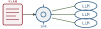

# Natural-Language Agent Harnesses, *interpreted*

*Cliff notes on Pan, Zou, Guo, Ni & Zheng, "Natural-Language Agent Harnesses" (arXiv:2603.25723, March 2026) — and why the paper is, almost line-for-line, the MPL bet arrived at from the agent-scaffolding side.*

---

## The problem the paper names

An LLM agent is never just a model. Wrapped around the model is a *harness*: the loop that decides what the model sees, where state is stored, when validation runs, how failures recover, when to stop, and how work is delegated to child agents. The paper's opening observation is that this harness — the genuinely reusable part of most agent systems — is almost always written as code, and as code it is **buried**. A controller bundle mixes prompts, tool adapters, parser rules, validation scripts, artifact paths, retry logic, and benchmark-specific assumptions in one file. A one-line change to that bundle can silently move call boundaries, state carriers, or stopping semantics.

> **The one-line claim.** A harness pattern — the part worth reusing — can be lifted out of controller code and written as an *editable natural-language document*, then executed by a shared runtime, with comparable task outcomes and a policy that is 90-plus percent shorter.

That is the whole paper: take the policy out of the code, write it as prose, and let a runtime interpret the prose into agent operations.

## The control spectrum

The paper situates its design on a one-dimensional spectrum of *who controls the run*.

*Three ways to control an agent run. NLAH+IHR is the deliberate middle: the policy is soft, readable text, but a runtime — not the model — enforces it.*

- **Hard code control (left).** The classic code harness: a `while not done:` loop in `harness.py` that builds the prompt, calls the model, parses the action, runs it, checks a verifier, retries on failure. Maximally controlled, maximally opaque.
- **NLAH + IHR (middle).** The harness policy is moved into a readable natural-language document; a shared runtime executes that policy through child-agent calls. The model is steered, but by an interpretable artifact a human can read and edit.
- **Self-harnessing (right).** A controller model directly harnesses other models with no external harness at all. Maximally flexible, no external control — the failure mode harebrain already names as *no cage*.

The middle point is the bet. It is not "let the LLM run free with a better prompt" and it is not "hand-author every branch in Python." It is *a declarative policy plus a runtime that interprets it* — which is exactly the architectural posture MPL takes toward statecharts.

## What an NLAH actually is

A **Natural-Language Agent Harness** is an editable document — in practice a markdown file in an NLAH package — that describes run-level harness policy. It externalizes the logic usually trapped in controller code by stating, in prose:

- the task input/output contract (inputs, outputs, allowed tools, completion conditions);
- the execution *stages* and *roles*;
- state-management rules (where state is stored, what is reusable, what counts as auditable evidence);
- validation and verification gates;
- recovery and retry policies;
- multi-agent delegation boundaries (parent/child);
- stopping conditions.

The paper is firm that the NLAH carries *policy*, not *mechanism*. Exact operations — running tests, parsing results, calling a benchmark evaluator — stay in deterministic code, reached through hooks. The document names a stage; a script does the stage's precise work.

> **The lineage the authors claim.** NLAHs are pitched as the next rung above `AGENTS.md`, `CLAUDE.md`, and `SKILL.md` — reusable natural-language carriers that today describe tools and workflows. The paper's move is to push the same carrier *up*, from local instructions to whole harness-level strategy. (This repo's own `CLAUDE.md` is, by that taxonomy, a proto-NLAH.)

## The runtime: four layers

The document does nothing on its own. The **Intelligent Harness Runtime (IHR)** interprets it into agent calls, handoffs, state updates, validation gates, and artifact contracts. The architecture is a clean four-layer stack.

*The base agent and adapters are the machine interface; the runtime policy is the fixed interpreter; the NLAH is the only piece that changes per task family.*

| Layer | Medium | What it owns |
|---|---|---|
| **Base agent** | code | A minimal LLM loop whose only external tool is a terminal — read/write files, run processes, record events, and launch child agents (a fresh instance of itself, handed a task packet). |
| **Runtime policy** | fixed natural language | The shared interpretation semantics: how *any* NLAH is read and executed, and where parent/child boundaries sit. Written once. |
| **NLAH** | replaceable natural language | The per-harness policy: concrete stages, roles, state rules, validation, recovery, stopping. The only layer that varies per task family. |
| **Scripts / adapters** | code hooks | Deterministic exact operations: tests, validators, parsers, benchmark wrappers, post-processing. |

The separation is the contribution. *Native code harnesses mix policy and mechanism inside one controller; NLAH+IHR splits them along the natural-language / code seam.* The base agent launches children not through a separate tool but by using the terminal to start a new instance of itself and passing it a child task packet — handoffs are terminal operations, not special machinery.

## The evidence

Three benchmark families, GPT-5.4-mini at reasoning effort `xhigh`, Docker-isolated tasks. For each family the authors compare three realizations of the *same* harness pattern: a **code** harness, the same policy delivered as a one-shot **prompt**, and the policy delivered as an **IHR-executed NLAH**.

| Benchmark | Realization | Performance | LLM calls | Tool calls |
|---|---|---|---|---|
| SWE-bench Verified | code | 67.0% | 23.3 | 17.7 |
| SWE-bench Verified | prompted NLAH | 77.0% | 36.4 | 48.0 |
| SWE-bench Verified | **IHR-executed NLAH** | **73.0%** | 41.0 | 63.4 |
| Terminal-Bench 2.0 (MHTBA) | code | 36.0% | 223.2 | 122.9 |
| Terminal-Bench 2.0 (MHTBA) | prompted NLAH | 57.3% | 41.5 | 48.0 |
| Terminal-Bench 2.0 (MHTBA) | **IHR-executed NLAH** | **53.9%** | 56.4 | 78.0 |
| OSWorld | code | 47.1% | 23.3 | 47.8 |
| OSWorld | prompted NLAH | 47.9% | 35.3 | 39.2 |
| OSWorld | **IHR-executed NLAH** | **46.3%** | 40.9 | 48.6 |

Two readings matter.

First, the **executability** claim holds: IHR-executed NLAHs land within roughly 4–7 points of the best realization on every benchmark, and on terminal-use they *beat* the code harness outright (53.9% vs. 36.0%) while spending a quarter of the LLM calls (56 vs. 223). The prose harness is not a toy.

Second — the headline — is **conciseness**. The static policy a human must read shrinks dramatically when it is the NLAH rather than the code bundle:

| Family | Code policy | NLAH policy | Reduction |
|---|---|---|---|
| Live-SWE | 60.1k tokens | 2.9k tokens | **95%** |
| MHTBA (terminal) | 10.5k tokens | 0.8k tokens | **92%** |
| OSWorld | 47.5k tokens | 1.4k tokens | **97%** |

> **What the conciseness number is actually measuring.** Not "shorter prompts at runtime" — IHR-executed NLAHs spend *more* LLM and tool calls than the code harness. It is the *static* policy: the artifact a human inspects, diffs, ports, and ablates. A 60k-token controller becomes a 2.9k-token document for the same task outcome. That is the inspectability win, and it is the real product.

### Mechanism, not mimicry

The paper anticipates the obvious objection — that an NLAH might just be a prompt that *sounds* like a harness without behaving like one — and answers it with workflow-trace metrics (RQ2). IHR-executed NLAHs show high artifact-contract compliance (0.96–1.00), tool-call success (0.93), and failed-tool continuation/recovery (0.99–1.00); the intended stages actually fire in the intended order (Live-SWE ordered-workflow 0.78, stage coverage 0.82). The mechanisms materialize.

> **The honest weakness the authors flag.** *Information-handoff recall collapses under parent/child execution* — 0.32 on SWE, 0.55 on terminal — versus 1.00 in the prompted (single-context) baseline. When the runtime spawns a child agent and hands it a packet, information is lost across the boundary. The delegation seam is the leak. For a project betting on multi-agent coordination, this is the load-bearing caveat, not a footnote.

### Modules are analyzable

Because the policy is now explicit, individual harness *modules* can be ablated by editing prose. RQ3 removes one at a time on SWE Verified:

| Module | Δ performance | Δ agent calls |
|---|---|---|
| Self-evolution | **+5.8** → 78.8% | +0.1 |
| Evidence-backed answering | +2.8 → 75.8% | +0.1 |
| File-backed state | +2.6 → 75.6% | +0.0 |
| Verifier | +0.2 → 73.2% | +1.2 |
| Multi-candidate search | **−1.6** → 71.4% | +4.6 |
| Context compression | −1.0 → 72.0% | +1.1 |
| Markdown memory | −2.8 → 70.2% | +0.2 |

The pattern is sharp: *the modules that help tighten state and acceptance discipline* (self-evolution, evidence-backed answering, file-backed state). Multi-candidate search produced the clearest topology change and a **negative** result — more branching is not more control. That finding only became *visible* because the policy was an editable object you could remove a paragraph from and re-run. The same ablation against a 60k-token controller would have been a refactor.

## Harnesses as scientific objects

The framing the paper closes on is the one worth lifting. Today a harness is *incidental glue*: written once, coupled to a benchmark, rarely compared across systems. The paper argues that once the harness policy is a short, explicit, editable document, the harness becomes a **scientific representation object** — something you can inspect, diff, port between models, compare across labs, and ablate module-by-module. The contribution is less an artifact than a *unit of study*: it proposes the harness, not the model, as a thing to do controlled experiments on.

That is a research-methodology claim, and it is the deepest part of the paper. It is also exactly the claim harebrain makes about the chart.

## Where this sits in the harebrain hypothesis

The harebrain thesis is `harebrain = fast LLM brain × structured game-AI cage`. NLAH+IHR is that architecture authored from the agent-scaffolding direction — and it lands on the MPL bet specifically. MPL's entire premise is *a declarative artifact (the `.mpl` statechart) interpreted by a host runtime, with the model reachable only through a typed seam*. NLAH's premise is *a declarative artifact (the NLAH document) interpreted by the IHR, with child agents reachable only through the runtime's handoffs*. Same shape, two vocabularies.

*Same skeleton, different ink. NLAH writes the cage in prose and interprets it; MPL writes the cage in a formal manifest and ticks it.*

| NLAH + IHR | harebrain / MPL |
|---|---|
| NLAH document (editable policy) | The `.mpl` chart — the legislation, written and revised |
| Intelligent Harness Runtime (IHR) | The MPL runtime / tick engine that interprets the chart |
| Runtime policy (fixed interpretation semantics) | The engine's evaluation rules — fixed, not per-feature |
| Stages and roles | States / sub-charts (XOR and AND decomposition) |
| Validation gates · stopping conditions | Transition guards (`when [open_qs == 0] => Report`) |
| Recovery / retry policy | Deterministic conflict resolution (`@priority → @weight → seed`) |
| Parent/child delegation boundary | Runtime instantiation (`new Blueprint : Name`) — Tier 2 |
| Scripts / adapters (code hooks) | Host imports at the seam — typed verdict back to the chart |
| Base agent (LLM loop at the leaf) | The LLM at the leaf — one rich call per state |

### What the paper gives harebrain

Three things, each load-bearing.

- **Independent convergence on the core bet, from the other end.** Harebrain reasons *down* from statecharts and game AI toward LLM agents. NLAH reasons *up* from agent scaffolds toward a declarative cage. They meet at the same point: a readable declarative artifact, a runtime that enforces it, the model confined to the leaves. When two derivations from opposite premises land on one architecture, the architecture is probably real.
- **A measured executability number for the declarative-cage bet.** Harebrain asserts that a chart-interpreted-by-a-runtime can match a hand-coded controller. NLAH *measures* it: within 4–7 points across three benchmark families, and a 92–97% reduction in the static policy a human must read. That is the closest thing in the literature to a benchmark for "does moving the policy out of code into a declarative artifact cost you task performance?" The answer is approximately no.
- **The handoff-recall failure, as a warning shot for the Manifest.** NLAH's worst metric is information-handoff recall across the parent/child boundary (0.32). This is precisely the problem harebrain's **Manifest** upgrade is designed to solve: NLAH passes information by an ad-hoc "task packet" handed to a child, and it leaks. MPL's answer is a *global, immutable, per-tick* Manifest that every region reads from the same snapshot — there is no packet to drop, because there is no private hand-off. The paper's failure mode is the empirical case for the architectural choice harebrain already made.

### The tension, named precisely

The mapping is tight but not free. The difference is the medium of the cage, and it is a real trade.

> **Prose vs. manifest.** NLAH writes the cage in *natural language*; MPL writes it in a *formal, typed manifest*. NLAH buys authoring ease — anyone can write and edit a markdown harness, no grammar to learn — at the cost of determinism and static analyzability. A prose stopping condition is interpreted by an LLM at runtime, so the same NLAH can behave differently on two runs, and you cannot statically prove a state is unreachable. MPL buys exactly the opposite: a formal `.mpl` is harder to author but the runtime is *deterministic given a seed*, the action surface is provably bounded, and unreachable states are unreachable as a matter of geometry, not interpretation.

This maps directly onto harebrain's **gradient of structural latitude**. An NLAH is roughly a *Tier-4* artifact — the cage authored as editable text — but interpreted by an LLM rather than compiled to a formal grammar, which arguably makes it *softer than Tier 4*: the IHR's reading of "stopping condition: the patch passes all tests" is itself a model call, not a guard the engine can evaluate without consulting the brain. MPL's host-import seam (Tier 1) is the hard floor NLAH never reaches: in MPL the *guard* is formal even when the *verdict feeding it* comes from an LLM. NLAH's handoff-recall collapse is the price of an interpreter that is itself fallible.

> **The synthesis harebrain should want.** Author the cage like an NLAH — prose, editable, inspectable, 3k tokens not 60k. Execute it like MPL — a deterministic runtime, a typed seam, provably bounded states, a global Manifest instead of a droppable packet. NLAH proves the *authoring* half is cheap and performant; MPL supplies the *guarantees* the prose interpreter cannot. The two papers are two halves of one runtime.

### Two clocks, again

NLAH validates harebrain's slow/fast split almost verbatim. The NLAH document is authored and edited *slowly* by humans (the slow clock — and the paper's whole inspectability/ablation argument depends on a human reading and revising it). The IHR executes it *fast* and autonomously, spawning children per task. The paper's "self-evolution" module — the strongest ablation gain, +5.8 — is the agent editing its *own* policy mid-run, which is precisely harebrain's Tier-4 "cage editing itself" and the same caution applies: it works, but the audit trail must now record which version of the NLAH was active when.

## What's worth taking away

- NLAH+IHR is the MPL bet — *declarative cage, interpreted by a runtime, model at the leaves* — derived from the agent-scaffolding side and, crucially, **measured**. It belongs in the harebrain bibliography as load-bearing, alongside LLM-Modulo.
- The executability result (within 4–7 points, 92–97% smaller policy) is the empirical backing harebrain's "author the chart, execute it fast" claim has so far lacked.
- The medium differs: NLAH's cage is *prose interpreted by an LLM*; MPL's is a *formal manifest run by a deterministic engine*. NLAH wins authoring ease; MPL wins determinism, bounded action surface, and static analysis. They are complementary, not competing.
- NLAH's worst metric — handoff recall across parent/child (0.32) — is the empirical case *for* MPL's global Manifest over ad-hoc task packets. Harebrain should read it as vindication of the Manifest upgrade path.
- "Self-evolution" being the top ablation gain is harebrain's two-clocks pattern in the wild: the agent editing its own legislation helps, but only with a version-stamped audit trail.

---

**Sources.** Pan, L., Zou, L., Guo, S., Ni, J., & Zheng, H.-T. "Natural-Language Agent Harnesses." Preprint, arXiv:2603.25723v2 [cs.CL], 18 May 2026 ([raw PDF in this folder](Natural-Language-Agent-Harnesses-2603.25723.pdf)). Benchmarks referenced: SWE-bench Verified (Jimenez et al., 2024; Xia et al., 2025, "Live-SWE"); Terminal-Bench 2.0 / MHTBA (Merrill et al., 2026; Lee et al., 2026); OSWorld (Xie et al., 2024; Zheng et al., 2024). Related natural-language carriers: `AGENTS.md`, `CLAUDE.md`, `SKILL.md`. Companion summaries in this series: [LLM-Modulo, redrawn](../llm-modulo/llm-modulo.md); the harebrain hypothesis ([Harebrain, sketched](../../harebrain/harebrain.md)) and [MPLv2 vs. Harel](../../mpl/mpl.md). All diagrams above are original SVGs drawn for this page.
