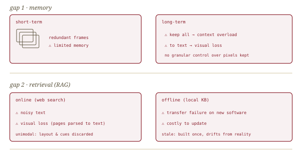
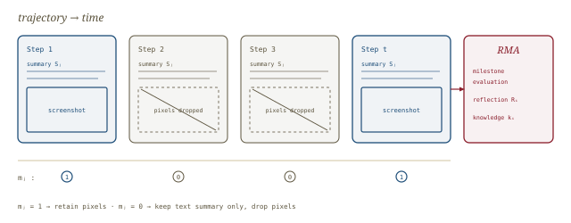
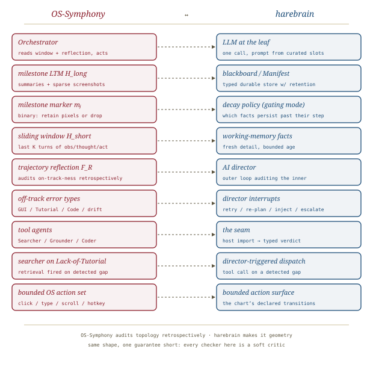

# OS-Symphony, *conducted*

*Cliff notes on Yang, Jin, Wu et al., "OS-Symphony: A Holistic Framework for Robust and Generalist Computer-Using Agent" (arXiv 2601.07779, Jan 2026) — a computer-using-agent harness whose milestone-driven memory and trajectory-level self-correction read, almost line for line, as the harebrain cage built for the desktop.*

---

## The problem it picks

A computer-using agent (CUA) drives a real OS the way a person does: it looks at a screenshot, decides on a click or a keystroke, and acts. The frontier failure mode is not single-step grounding — modern VLMs click the right button most of the time. It is *long-horizon drift*. Over fifty or a hundred steps the agent forgets the goal, loops on a dead UI affordance, hallucinates that a stale screenshot is current, or wanders into a state no one anticipated and never recovers. The paper names the two structural causes cleanly.

*The two gaps OS-Symphony targets. Left: memory that either keeps every redundant frame or compresses the pixels away. Right: retrieval that is either noisy web text or a stale local knowledge base.*

> **The diagnosis, in one line.** Current CUAs lack *granular control over historical visual context* (so memory either overflows or loses the pixels that matter) and lack *visual-aware tutorial retrieval* (so when they hit an unfamiliar app they have nowhere to look it up). OS-Symphony is two innovations bolted onto a modular orchestrator to close exactly those two gaps.

This is a harness paper, not a model paper. Every result is obtained by wrapping an *off-the-shelf* VLM — GPT-5, GPT-5-Mini, or open Qwen3-VL — in structure. That is the harebrain bet stated in a different vocabulary: the brain is rented; the cage is the contribution.

## The framework

Three components, one conductor. The **Orchestrator** is the decision-making brain: it reads the instruction, the current screenshot, the short-term history, any retrieved tutorial, and — crucially — the reflection handed back by the memory agent, then emits a thought plus an action. The **Tool Agents** are specialized executors it can dispatch to. The **Reflection-Memory Agent (RMA)** is a retrospective auditor that compresses the trajectory and tells the Orchestrator whether it is on track.

*The conductor and the staves. The Orchestrator owns* where am I, what next*; the tool agents own execution; the RMA owns* are we still on track*. The action surface into the OS is a fixed primitive set.*

The Orchestrator's decision is modeled as `tᵢ, aᵢ = F_O(I, Rᵢ, oᵢ, T, H_short)` — instruction, RMA reflection, current observation, retrieved tutorial, and a sliding window of the last `K` turns. The sliding window is deliberate: the paper assumes the significance of historical interactions *decays with time*, so the Orchestrator's working context is the last `K` turns of `{observation, thought, action}` and nothing older. Older context does not vanish — it is the RMA's job, not the Orchestrator's.

> **Note the division of labor.** The Orchestrator never reads the raw rolling transcript. It reads a *bounded window* plus a *distilled reflection*. That split — fresh detail in a short window, durable structure in a separate memory agent — is the whole game. It is also exactly the harebrain blackboard story: the agent reads named, curated slots, not its own scrollback.

## The Reflection-Memory Agent, and milestone-driven memory

This is the load-bearing innovation. The RMA exists because screenshots are *temporally redundant*: dozens of near-identical frames, a few that actually mark progress. Keeping them all overflows context; summarizing them to text loses the visual semantics that downstream decisions need. The RMA threads the needle with a **binary milestone marker**.

Long-term memory is `H_long = {(Sⱼ, oⱼ, mⱼ)}` — for each step `j`, an execution summary `Sⱼ`, the observation `oⱼ`, and a binary milestone marker `mⱼ`. The marker is the gate: **the RMA retains the screenshot `oⱼ` only when `mⱼ` is active.** Non-milestone steps keep their text summary and drop the pixels. The result is a memory that is mostly cheap text with a sparse spine of the handful of screenshots that actually meant something.

*Granular visual curation. A binary marker per step decides whether the pixels survive. The trajectory keeps a dense text summary and a sparse visual spine — the frames where progress actually happened.*

The RMA runs in two stages.

**Step-level summary.** An auxiliary VLM compares the pre-action and post-action screenshots (plus a localized zoom-in of the action area) and produces both a summary `Sᵢ` and a binary success flag `sᵢ`: `Sᵢ, sᵢ = F_S(O_{i-1}, o_{i-1}, oᵢ, õ_{i-1})`. The success flag is the cheap heuristic that feeds error classification downstream — did the GUI actually change the way the action intended?

**Trajectory-level reflection.** Over `H_long`, the RMA performs three functions in one call — milestone identification, reflection generation, and relevant-knowledge extraction: `Rᵢ, mᵢ, kᵢ = F_R(O_{i-1}, oᵢ, H_long)`, where `kᵢ` is extracted knowledge (e.g., a restaurant detail read off a page) or empty. The reflection follows a structured message protocol that classifies the execution state into four classes:

| Class | Meaning | What the Orchestrator does |
|---|---|---|
| **On-track** | normal progress | continue |
| **Completed** | task finished | terminate, success |
| **Infeasible** | task cannot be done | terminate, give up honestly |
| **Off-track** | something is wrong | correct, per the error type below |

Off-track is split into four diagnosable error types, which is where the self-correction earns its keep:

- **GUI Error** — step-level action failed to change the UI as intended (derived from the `sᵢ` flag).
- **Lack of Tutorial** — random or repetitive actions detected, signalling the agent is in unfamiliar territory and should *search* for guidance. A dedicated rule-based loop-detection algorithm assists the RMA here.
- **Code Error** — a mismatch between the Coder agent's claimed execution and the actual GUI state.
- **Other Error** — intent drift, the catch-all.

> **Why this is trajectory-level self-correction, not step-level.** A step-level checker asks "did that click work?" The RMA asks "given everything that has happened, are we still doing the right task, and if not, what *kind* of wrong are we?" The four error types route to four different repairs — a GUI Error retries, a Lack-of-Tutorial *invokes the Searcher*, a Code Error falls back to GUI actions, intent drift re-plans. The reflection is a typed verdict the Orchestrator routes on.

The paper's headline qualitative case closes this loop: the agent repeatedly clicks the wrong menu trying to create a desktop shortcut, the RMA detects the repetitive loop, classifies it Off-track / Lack-of-Tutorial, the Orchestrator invokes the Searcher, a tutorial comes back, and the task completes. A closed-loop self-improvement cycle driven entirely by the memory agent's diagnosis.

## The tool agents, and visual-aware search

The Orchestrator dispatches to three (really four) specialists. The novel one is the **Multimodal Searcher**, the paper's answer to the second gap.

**Multimodal Searcher.** When the agent hits an out-of-distribution app it doesn't know how to drive, the Searcher goes and *reads the web like a person*. It adopts a VLM-driven SeeAct paradigm inside an isolated browser sandbox, formulates a "How-to" query paired with the current environment observation, and navigates rendered pages with a strictly bounded action space `A_search = {click, type, scroll}` plus terminals `{done, fail}`. It is encouraged to cross-check across multiple pages, then distills what it read into a structured step-by-step tutorial `T` that is permanently appended to the Orchestrator's context.

> **Why "multimodal" is the whole point.** Conventional RAG parses pages to text and loses the screenshots, layouts, and spatial cues that a GUI tutorial actually needs. The Searcher keeps the *visual* tutorial. And retrieval is genuinely on-demand — it fires only when the RMA's Lack-of-Tutorial signal reveals a knowledge gap, not pre-emptively on every task. Retrieval is event-driven by the audit loop.

**Grounders, two of them.** A **General Grounder** fuses low-level visual cues (position, appearance) with high-level semantics (functionality, relevance) for ordinary UI localization. An **OCR-based Grounder** handles text-intensive apps (PowerPoint, Word): word-level OCR builds a structured `{text, id, bbox}` table, and a VLM picks the id for precise coordinate lookup.

**Coder.** For file editing and configuration, the Coder runs a strict internal workflow — file localization → inspection → in-place modification → verification — and *falls back to GUI actions* if it fails or validation detects a mismatch. The fallback is the safety net the Code-Error reflection class watches over.

## The evidence

OS-Symphony sets a new state of the art on three desktop benchmarks, all by wrapping an unmodified VLM. The primary benchmark is OSWorld-Verified (361 real tasks, Ubuntu, five domains).

| Method | Step | OS | Office | Daily | Prof. | Work. | **Avg.** |
|---|---|---|---|---|---|---|---|
| OpenCUA-72B | 100 | 61.13 | 44.73 | 49.95 | 72.58 | 22.16 | 44.91 |
| Claude-Sonnet-4.5 (native) | 100 | 70.83 | **72.59** | 61.35 | 63.27 | 49.54 | 62.84 |
| GTA1 w/ GPT-5 | 100 | **79.17** | 63.91 | 62.56 | 79.59 | 50.91 | 63.41 |
| CoAct-1 w/ GPT-5 | 150 | 75.00 | 62.93 | 61.78 | 71.43 | 47.87 | 60.76 |
| Agent S3 w/ GPT-5 (prior SOTA) | 100 | 77.50 | 66.46 | 61.23 | 69.80 | 51.37 | 62.63 |
| **OS-Symphony w/ GPT-5** | 50 | 75.00 | 64.85 | 61.19 | 69.23 | 54.86 | 63.61 |
| **OS-Symphony w/ GPT-5** | 100 | 79.17 | 65.73 | 67.76 | 69.23 | **57.98** | **65.84** |
| OS-Symphony w/ GPT-5-Mini | 50 | 73.68 | 58.17 | 61.39 | 75.00 | 47.37 | 58.05 |
| OS-Symphony w/ Qwen3-VL-32B-Instruct | 50 | 58.33 | 40.94 | 53.54 | 51.70 | 31.24 | 46.86 |

Three readings matter.

First, **65.84% on OSWorld** is roughly a 3-point lift over the prior best agentic framework (Agent S3 at 62.63%), and it is achieved at *fewer or equal* steps with the same backbone. The harness, not the model, moved the number.

Second, the gain concentrates in the **Workflow** domain — tasks that span multiple applications, the longest-horizon and most drift-prone category. OS-Symphony hits 57.98% there versus Agent S3's 51.37%, a ~7-point swing the authors attribute directly to the RMA. The structure pays back most exactly where long-horizon drift is the killer.

Third, cross-platform generalization holds: **63.5% on WindowsAgentArena** (+6.9 over Agent S3) and **46.0% on MacOSArena** (+38% relative), both with the same framework and no per-OS retraining. A cage that ports across operating systems is a cage that bounds *behavior*, not surface.

### The ablations are the real argument

The harness's two innovations are each isolated, and the result is a clean validation of the design — including one finding that cuts the other way for naive approaches.

| Ablation (GPT-5-Mini, 50-step) | Score |
|---|---|
| w/o Search + w/o Reflection (baseline) | 49.60 |
| **Full OS-Symphony** | **58.05** |
| Search ablation (Daily): w/o Search | 50.65 |
| Search ablation (Daily): unimodal search | 54.81 |
| Search ablation (Daily): **multimodal search (ours)** | **61.86** |
| Reflection ablation (Workflow): w/o reflection | 60.20 |
| Reflection ablation (Workflow): reflection w/ short-term (Last-K) | 56.10 |
| Reflection ablation (Workflow): **milestone long-term (ours)** | **61.86** |

> **The finding worth pinning.** Naive Last-K reflection *hurt* — 56.10 versus 60.20 for no reflection at all. Reflecting over a short window of raw recent frames is worse than not reflecting; only reflection over *milestone-curated* long-term memory helps. The memory curation is not a nice-to-have wrapper around reflection; it is the thing that makes reflection net-positive. The paper also reports the RMA saves ~3.3 steps per task by catching errors early — a token-efficiency win on top of the accuracy win.

## What's load-bearing vs. weak

**Load-bearing:** the milestone marker. A single binary per step that decides whether pixels survive is a tiny mechanism with an outsized effect — it is what lets the reflection see a long trajectory without drowning. The four-class / four-error-type message protocol is the other load-bearing piece: it makes "off-track" *actionable* by routing each error kind to a different repair.

**Weaker, by the paper's own framing:** the RMA is explicitly a *retrospective auditor*, not a forward planner — there is no plan to verify against, only a running judgment of on-track-ness. The Searcher's tutorials are distilled by a VLM from web pages and are never formally verified; a wrong tutorial confidently followed is an unguarded failure surface. And every "milestone" / error classification is itself an LLM judgment — the audit loop has no *sound* checker anywhere in it. This is a harness of soft critics, and it should be read as one.

## Where this sits in the harebrain hypothesis

The harebrain thesis is `harebrain = fast LLM brain × structured game-AI cage`. OS-Symphony is, almost component-for-component, that cage instantiated for the desktop — and it independently rediscovers three of harebrain's four payoffs.

*Same architecture, different starting point. OS-Symphony arrives from CUA engineering at the shape harebrain argues for from first principles.*

| OS-Symphony | harebrain |
|---|---|
| Orchestrator (reads window + reflection, emits thought+action) | The leaf LLM — one rich call per state, prompt built from curated slots |
| Milestone-driven long-term memory `H_long` | Blackboard / Manifest — typed durable store with a decay/retention policy |
| Binary milestone marker `mⱼ` gating screenshot retention | Per-key decay rule — *which* facts (here, pixels) persist past their step |
| Sliding window `H_short` (last `K` turns) | Working-memory facts — fresh detail with bounded age |
| RMA trajectory-level reflection (4 classes) | AI Director — outer loop auditing the inner loop |
| Off-track error types routing to repairs | Director interrupts — escalate, re-plan, inject "are you stuck?" |
| Tool Agents (Searcher / Grounder / Coder) | The seam — host imports returning typed verdicts |
| Multimodal Searcher fired on Lack-of-Tutorial | Director-triggered tool dispatch on a detected gap |
| Bounded OS action set (click/type/scroll/hotkey) | The bounded action surface — the chart's declared transitions |

### What OS-Symphony gives harebrain

Three concrete contributions, each load-bearing.

- **A blackboard decay policy that is a *learned binary gate*, not a half-life.** Harebrain's working-memory model decays facts on a per-key clock. OS-Symphony shows a sharper variant for *expensive* facts: a per-step binary marker that decides retain-or-drop. For screenshots — the costly, redundant fact — a milestone gate beats a smooth decay curve. Harebrain's decay-policy vocabulary should add "milestone gating" as a retention mode alongside half-life and pinning, specifically for high-cost slots.
- **A typed error taxonomy for the director.** Harebrain's director was described as a single adversarial-review pass emitting interrupts. OS-Symphony hands it a vocabulary: On-track / Completed / Infeasible / Off-track{GUI, Lack-of-Tutorial, Code, intent-drift}. Each class is a *different* director action. That four-by-four protocol is exactly the kind of typed verdict harebrain's director should emit instead of a free-text critique.
- **Empirical proof that curation gates reflection.** The Last-K-hurts-but-milestone-helps ablation is the cleanest evidence yet for harebrain's core memory claim: an agent that reflects over its raw rolling transcript does *worse* than one that doesn't reflect; only reflection over a curated, decaying store pays back. Harebrain asserted this; OS-Symphony measured it.

### Where harebrain pushes beyond

Two extensions, both bets.

- **Topology as a hard bound, not a soft audit.** OS-Symphony's Orchestrator can, in principle, emit any action at any step — the RMA only *audits* after the fact and hopes the Orchestrator listens. Harebrain's HSM makes the unwanted action *unreachable*: the chart's transitions are geometry, not advice. Where OS-Symphony catches drift retrospectively, a harebrain chart prevents the class of drift that is "fired a transition that wasn't declared." The cost is that OS-Symphony's flat orchestration generalizes across OSes precisely *because* it imposed no topology; a harebrain chart trades that generality for the no-jailbreak property.
- **A sound critic somewhere in the loop.** Every checker in OS-Symphony is a VLM judgment, including the milestone marker and the success flag. Harebrain's seam taxonomy distinguishes *hard* guards (a unit test, a file-state assertion, a `pyautogui` verification that the window title actually changed) from *soft* ones. OS-Symphony's Coder already does a file-state verification — that is a hard critic hiding in a soft harness. Harebrain's bet is that promoting a few of those checks from "the VLM thinks it worked" to "the OS confirms it worked" is where the next reliability point comes from.

> **The trap to mark, in OS-Symphony's own vocabulary.** The milestone marker, the four-class reflection, and the distilled tutorial are *all* LLM outputs. The harness is impressively engineered, and 65.84% is real — but it is the strong version of a *soft-critic* architecture, not a verified one. Read the multi-agent decomposition as harebrain's HSM-without-the-hard-topology and the RMA as the director-without-a-sound-checker: the same shape, one guarantee short.

## What to take away

- OS-Symphony is the cleanest recent demonstration that the *harness* moves frontier numbers as much as the model — every result is an off-the-shelf VLM in structure, which is the harebrain bet stated for the desktop.
- The milestone marker is a porting target: a binary retain-gate for expensive facts belongs in harebrain's blackboard decay-policy menu.
- The four-class reflection protocol is the director's missing verb list — adopt it as the director's typed output.
- The Last-K-hurts ablation is load-bearing evidence for harebrain's memory thesis and belongs in the bibliography as such.
- Where harebrain pushes past it: turn the RMA's *retrospective* topology audit into *prospective* topology (an HSM), and promote a handful of the soft critics (milestone, success-flag, tutorial-correctness) into hard ones where the OS can confirm them.

---

**Sources.** Yang, B., Jin, K., Wu, Z., Liu, Z., Sun, Q., Li, Z., Xie, J., Liu, Z., Xu, F., Cheng, K., Li, Q., Wang, Y., Qiao, Y., Wang, Z., & Ding, Z. "OS-Symphony: A Holistic Framework for Robust and Generalist Computer-Using Agent." arXiv:2601.07779, 12 Jan 2026 ([raw PDF in this folder](OS-Symphony-A-Holistic-Framework-for-Robust-and-Generalist-Computer-Using-Agent-2601.07779.pdf)). Benchmarks: Xie et al., OSWorld / OSWorld-Verified (2024–25); Bonatti et al., WindowsAgentArena (2024); Wang et al., MacOSArena (2025). Related harnesses cited above: Gonzalez-Pumariega et al., CoAct-1 (2025); Agashe et al., Agent S3 (2025); Zheng et al., SeeAct (2024). All diagrams above are original SVGs drawn for this page.
