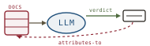

# Attribution for RAG Hallucination, *audited*

*Cliff notes on Zhao, Liu, Zheng & Lam, "Attribution Techniques for Mitigating Hallucinated Information in RAG Systems: A Survey" (arXiv 2026) — and why attribution is the cage's hard critic pointed at claims instead of plans.*

---

## The gap the survey names

RAG was sold as the cure for hallucination: bolt an external knowledge source onto the LLM and its answers become grounded. The survey's opening move is to refuse that story. Retrieval-Augmented Generation *moves* the failure surface — it does not remove it. The retriever can pull stale, irrelevant, or unsupported passages; the generator can ignore, contradict, or over-trust whatever it was handed. The interaction between the two introduces hallucination modes that neither component exhibits alone.

The contribution is organizational, not algorithmic. The authors survey a field that already has dozens of attribution techniques (Self-RAG, RARR, CoVe, CaLM, SelfCheckGPT, and many more) but no shared frame. They supply two: a **taxonomy** of the hallucination types RAG actually produces, and a **unified four-module pipeline** every attribution method slots into. Then they cross the two — which module mitigates which failure — and that cross-tab is the useful artifact.

> **The one-line claim.** Attribution is the discipline of making every generated claim *verifiably supported by retrieved content*. The survey's job is to catalog (a) the ways that support breaks and (b) where in the RAG pipeline you can repair it.

For harebrain this lands directly on the seam. A RAG system is the cage feeding *retrieved evidence* into a leaf call; attribution is what forces the brain's output to trace back to that evidence — i.e., the seam returning a **typed, sourced verdict** rather than free text. Read that way, the survey's taxonomy is a precise spec for what the transition guards and critics must catch, and the pipeline is the LLM-Modulo Generate-Test-Critique loop with retrieved documents as the test oracle.

## Six ways RAG hallucinates

The taxonomy is the spine of the paper (their Figure 2). Six failure modes, each defined by *where in the retriever→generator interaction* it originates.

*Six failure modes, split by origin. Two are the retriever's fault; four are the generator's. The harebrain reading at the bottom is the load-bearing line.*

| Type | What goes wrong | Born at | Survey's go-to modules |
|---|---|---|---|
| **Overconfidence** | Certainty exceeds the evidence — confident assertion of an unsupported fact | generator | T3 prompt engineering, T4 correction |
| **Outdatedness** | Was correct once, now obsolete; the retriever surfaced stale refs | retriever | T1 query refining, T2 reference ID |
| **Unverifiability** | No retrieved evidence backs the claim at all | retriever | T2 reference ID, T4 correction |
| **Instruction deviation** | Answer drifts off the user's actual intent | generator | T1, T2, T3 |
| **Context inconsistency** | The answer *contradicts* its own cited references | generator | T3 prompt engineering, T4 correction |
| **Reasoning deficiency** | Flawed chain-of-thought; an early error propagates down the chain | generator | T3 prompt engineering, T4 correction |

Two readings matter for harebrain.

First, the split is *not* even. Only two modes (outdatedness, unverifiability) are retrieval faults — failures of *what got fetched*. The other four are generation faults — failures of *what the brain did with what it was handed*. That asymmetry is the whole argument for a cage: better retrieval fixes a third of the problem; the rest is the brain ignoring or mis-using grounding it already had.

Second — and this is the opinionated part — a harebrain blackboard architecture *prevents two of the six by construction*. If the blackboard holds the retrieved references as typed, timestamped facts and the leaf call can only read from it, then **outdatedness** collapses to a freshness predicate on a blackboard cell (a decaying entry), and **context inconsistency** becomes structurally hard because there is no second, ungrounded context for the answer to drift toward — the references *are* the context. The remaining four (overconfidence, unverifiability, instruction deviation, reasoning deficiency) are properties of the generated text and still demand an explicit critic. The blackboard is necessary; it is not sufficient.

> **The trap to mark.** "We retrieved the right docs" is not "the answer is supported by them." Outdatedness and unverifiability are about *retrieval*; the other four are about *what the brain wrote given good retrieval*. A system that only hardens its retriever has fixed two of six and shipped the rest.

## The unified pipeline — and why its last module is a critic

Every attribution method in the survey decomposes into four modules (their Figure 1 and Section 2), each a typed transformation. The notation is theirs:

| Module | Transformation | Job |
|---|---|---|
| **T1 — Pre-retrieval query refining** | `q' = T(q)` | rewrite the query so retrieval lands better |
| **T2 — Post-retrieval reference identification** | `R_final = V(R')` | filter / rerank retrieved set down to verifiable refs |
| **T3 — Pre-generation prompt engineering** | `P = S(q', R_final)` | build the grounded prompt that conditions the leaf call |
| **T4 — Post-generation response correction** | `A_corrected = C(q', A_gen, R_final)` | check the answer against refs; correct or regenerate |

Redrawn as a loop, the shape is unmistakable.

*T1 through T3 set up a grounded leaf call. T4 is the part that closes the loop — and T4 is a critic. This is Generate-Test-Critique with retrieved evidence as the oracle.*

T1–T3 are *setup*: they shape the query, select the evidence, and assemble the prompt so the single leaf call is as grounded as it can be before it fires. The whole verification burden lands on **T4**, which reads the generated answer alongside `R_final` and decides whether the claims are supported. On success it emits the attributed response; on failure it back-prompts a regeneration. That is exactly the [[llm-modulo]] Generate-Test-Critique loop, with one substitution: the test oracle is not a formal verifier like VAL, it is *agreement with retrieved documents*.

This is where the survey quietly inherits LLM-Modulo's soundness problem without naming it. The strength of the loop is the strength of the T4 critic. If T4 is an NLI model or a rule that checks claim-against-citation, you have something close to a sound check. If T4 is *the same LLM* asked to grade its own answer, you have a soft critic with no soundness to inherit — and the survey's own Section 3.8 flags this as the **"LLMs as retrieval judges"** circularity: using a hallucination-prone model class to detect hallucination, where the judge inherits the same biases and blind spots.

## The practitioner table the survey is really selling

Section 3 walks each of the six types and lists the techniques that target it. The value is the routing: it tells you *which module* to invest in given *which failure* dominates your workload. Compressed:

- **Overconfidence** → T3/T4. Verbal Uncertainty Calibration (VUC) injects hedging aligned to the references; SelfCheckGPT samples multiple responses and keeps the one most consistent with retrieved evidence; RLKF penalizes confident-but-wrong outputs with a reward model.
- **Outdatedness** → T1/T2. SmartBook constrains retrieval to recent sources; WebCPM/WebGPT lean on live web search as an up-to-date store; Fact Duration Prediction scores the temporal validity of a reference before trusting it.
- **Unverifiability** → T2/T4. Reranking (REPLUG, AAR, Self-RAG) and fine-grained reference selection (CoTAR, PRCA, RECOMP) on the retrieval side; Self-Refine, CaLM, AGREE (NLI-based) and RARR on the correction side.
- **Instruction deviation** → T1/T2/T3. Query decomposition (Blueprint, DSP, ToC), relevance reranking against intent (Self-RAG, LLatrieval, QLM), and template selection (UPRISE).
- **Context inconsistency** → T3/T4. Explicit-citation prompting (QUIP, RECITE, SmartBook) and statement-level NLI correction (SourceCheckup, WebCiteS, EFEC).
- **Reasoning deficiency** → T3/T4. Structured-evidence prompting (SubgraphRAG, Self-Reasoning) and chain-of-thought repair (CoVe, SearChain, Verify-and-Edit).

The pattern across all six: the lever is either *fix what you fetched* (T1/T2) or *check what you wrote* (T3/T4). There is no module that makes the brain trustworthy on its own. Same shape as the [[hallucination-recitations]] finding — grounding is a retrieval-and-verification problem, not a better-prompting problem.

## What the survey admits it can't do

Section 3.8 is unusually candid, and several of its limitations are direct constraints on a harebrain RAG cage.

- **Single-source validation.** Most methods check a claim against *one* reference. Open-domain or multi-perspective questions need agreement across diverse sources — a quorum, not a lookup.
- **The judge is the defendant.** LLM-as-retrieval-judge (LLatrieval, CoVe) is circular: the verifier shares the generator's failure modes. Without external calibration there is "limited consensus on how reliable LLMs are in scoring retrieval quality."
- **Long-context decay.** Methods that truncate or stuff long contexts lose evidence exactly when multi-hop QA and document-level work need it most.
- **CoT error accumulation.** An early wrong step in a reasoning chain poisons the rest; robust *intermediate* validation is still largely missing.
- **One-shot brittleness.** Hand-engineered single-shot prompts and static templates don't transfer across domains; few-shot is more flexible but burns tokens and still trips on unseen instructions.
- **External-DB safety.** The grounding store itself can be incomplete, wrong, or unsafe — and live-web grounding adds source-credibility and legality problems the system can't moderate.

> **The harebrain consequence.** Every one of these is an argument for *typing the seam*. A blackboard cell that records `claim → {source, span, freshness, support_score}` and a guard that refuses to advance the chart until support clears a threshold turns "the judge is the defendant" from a silent risk into an explicit, auditable verdict. The survey describes the failure; the cage is where you'd contain it.

## Where this sits in the harebrain hypothesis

The harebrain thesis is `harebrain = fast LLM brain × structured game-AI cage`. A RAG system is the cleanest instance of the cage there is: it literally fetches evidence and hands it to the leaf. Attribution is the mechanism that binds the fast, ungrounded brain to that evidence — a species of the cage's hard critic, applied to *claims* rather than *plans*. That is the throughline across this cluster ([[llm-modulo]], [[llm-attribution-survey]], [[hallucination-recitations]], [[hart]]): evidence-tracing is how you keep a confident generator honest.

*Same shape, claims instead of plans. Rows 3 and 6 are soft — they earn no soundness, and the figure says so.*

| RAG attribution | harebrain |
|---|---|
| Retrieved references `R_final` | The cage feeds the leaf — evidence on the blackboard before the call |
| T2 reference identification | Transition guard (hard) reading the blackboard |
| T4 response correction | EDD adversarial review on each transition |
| Attribution itself (claim → source span) | The seam — host import returning a typed, sourced verdict |
| T1→T2→T3→T4 pipeline | Generate-Test-Critique loop, run on claims |
| LLM-as-retrieval-judge | Soft-critic circularity — no soundness to inherit |
| T1 query refining (`q' = T(q)`) | AI Director shaping what the leaf fetches |

### What the paper gives harebrain

- **A claim-grained restatement of the seam.** [[llm-modulo]] framed the seam as `host import → typed verdict` at the *plan* level. This survey supplies the *claim* level: the verdict harebrain should return from a RAG host import is not "answer text" but a structured `{claim, source, span, support}` tuple. Attribution is the seam's content, not an add-on.
- **A failure catalog for guard design.** The six-type taxonomy is a checklist for what a RAG chart's guards must catch. It also tells you which two (outdatedness, context inconsistency) a decaying blackboard handles for free, so you spend critic budget on the other four.
- **Confirmation that the critic is the loop.** T4 is the only module that closes the pipeline, exactly as the critic bank closes LLM-Modulo. RAG without a T4 critic is open-loop generation that *happens* to read documents — not attribution.
- **The circularity warning, named.** "LLMs as retrieval judges" is the soft-critic trap from [[llm-modulo]] in RAG clothing. Harebrain must classify its RAG guards: an NLI/citation check is hard-ish and sound-ish; an LLM grading its own answer is soft and inherits no soundness. The mapping figure marks both.

### What harebrain pushes that the survey doesn't

- **Per-claim, not per-response.** The survey's T4 corrects a *whole response* against references. Harebrain pushes the check inward — one guarded leaf call per state, with each emitted claim attributed at the transition rather than the whole answer audited at the end. This catches reasoning-deficiency drift *during* the chain (the survey's own admitted weakness) instead of after it.
- **Freshness as a first-class blackboard property.** The survey treats outdatedness as a retrieval-time concern (T1/T2). Harebrain makes it a *decaying blackboard cell*: a reference carries a half-life, and the guard reads its current confidence. Outdatedness stops being a fetch problem and becomes a state property the chart can route on.
- **The quorum the survey wishes it had.** Single-source validation is the survey's first admitted limitation. Harebrain's utility scoring over a blackboard naturally accommodates a *support quorum* — advance only when N independent sources agree — which the survey gestures at but no single method implements.

> **The honest bound, in the survey's own vocabulary.** Where T4 is a sound check (NLI against a citation, a deterministic span-match), harebrain inherits a real attribution guarantee and can return a defensible sourced verdict. Where T4 is the LLM judging itself, harebrain is running the same circular loop the survey flags — a graded essay about its own grounding, not a verified attribution. The seam is typed either way; only one of them is *trustworthy*, and the type system should say which.

## What's worth taking away

- The six-type taxonomy is the right spec for RAG transition guards. Adopt it, and note that a decaying blackboard handles outdatedness and context-inconsistency by construction.
- The four-module pipeline is Generate-Test-Critique with documents as the oracle. T4 is the critic; a RAG system without one is open-loop.
- Attribution belongs *in* the harebrain seam definition, at claim granularity: `host import → {claim, source, span, support}`, not free text.
- The "LLMs as retrieval judges" circularity is the soft-critic trap. Classify every RAG guard as hard (sound-ish) or soft (no soundness inherited), and don't market a stronger claim than the critic earns.
- Harebrain's per-claim, decaying-blackboard, quorum-scored variant directly attacks three limitations the survey admits — mid-chain reasoning drift, freshness, and single-source validation — but only buys soundness where the underlying check is sound.

---

**Sources.** Zhao, Y., Liu, Z., Zheng, Y., & Lam, K.-Y. "Attribution Techniques for Mitigating Hallucinated Information in RAG Systems: A Survey." Nanyang Technological University, Singapore, 2026. [arXiv:2601.19927](https://arxiv.org/abs/2601.19927) ([raw PDF in this folder](attribution-techniques-rag-survey-2601.19927.pdf)). Key techniques referenced above appear in the survey's bibliography: Self-RAG (Asai et al., 2023), RARR (Gao et al., 2022), CoVe (Dhuliawala et al., 2023), CaLM (Hsu et al., 2024), SelfCheckGPT (Manakul et al., 2023), VUC (Ji et al., 2025), CoTAR (Berchansky et al., 2024), RECOMP (Xu et al., 2023), SourceCheckup/WebCiteS, SubgraphRAG (Li et al., 2024), SearChain (Xu et al., 2024), Verify-and-Edit (Zhao et al., 2023). All diagrams above are original SVGs drawn for this page.
