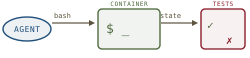
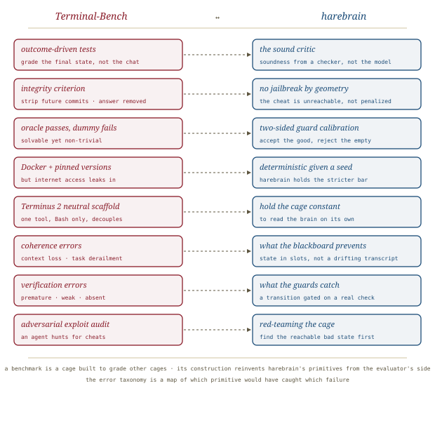

# Terminal-Bench, *graded*

*Cliff notes on Merrill, Shaw, Carlini et al. (85 authors across Laude Institute, Stanford, Anthropic, and ~40 universities), "Terminal-Bench: Benchmarking Agents on Hard, Realistic Tasks in Command Line Interfaces" (arXiv:2601.11868, January 2026). This is the scoreboard the rest of the bibliography keeps pointing at — the benchmark where [Meta-Harness](../meta-harness/meta-harness.md) measured its 6× and [agent-harness-anatomy](../agent-harness-anatomy/agent-harness-anatomy.md) moved an agent from Top 30 to Top 5. We have read the claims that stood on this ruler; now we read the ruler. And it returns a verdict of its own that the harness camp has to answer.*

---

## The benchmark under the other papers

Most of this series has been about *methods* — ways to build, search, or document the cage. Terminal-Bench is not a method. It is the **measuring instrument**, and that makes it load-bearing in a different way: every quantified claim about harnesses in the recent literature was scored *here*, on Terminal-Bench 2.0. When Meta-Harness reports its TerminalBench-2 resolve rates, when the harness-anatomy post reports Top 30 → Top 5, this is the substrate. Read the instrument and the claims built on it become legible.

The pitch is a difficulty pitch. Existing agent benchmarks, the authors argue, *"either do not measure real-world tasks, or are not sufficiently difficult to meaningfully measure frontier models."* Terminal-Bench 2.0 is the corrective: **89 tasks** in real terminal environments, each with a unique containerized environment, a human-written solution, and comprehensive verification tests. The headline number is a difficulty number — frontier models and agents resolve **fewer than 65%** of tasks; smaller models land around **15%**.

> **Why the terminal.** *"A ubiquitous, versatile, and powerful interface … used for highly-skilled and valuable work like software engineering, scientific computing, cybersecurity, and machine learning."* The terminal is the universal substrate agents already act through — Cursor, Codex CLI, Claude Code, Gemini CLI all reduce to issuing shell commands. The paper notes, drily, that Anthropic claims Claude Code drives **$1B in run-rate revenue**. The terminal is where the money is, so it is where the benchmark is.

## What a task is

The unit of the benchmark is deliberately spare, and the spareness is the design.

*A task is an instruction, a Dockerfile, a hidden test set, and a hidden human oracle solution. The agent gets the first two and works inside the container. The grade is read off the **final state**, never the commands or the console output.*

That last point is the whole philosophy: Terminal-Bench is an *"outcome-driven framework where each agent is free to accomplish the task using a variety of approaches."* The tests verify *"properties of the final container state; they do not test the agent's commands or console output."* There is no rubric for *how* you got there — only whether the world ended up correct. This is the cleanest possible separation of policy from verification, and we will come back to why it matters to harebrain.

Three criteria define a verified task, and each one is a familiar idea wearing benchmark clothes:

| Criterion | The rule | What it really is |
|---|---|---|
| **Specificity** | tests pass *iff* the container ends in an acceptable state | the spec captures all correct end states — no false accepts, no false rejects |
| **Solvability** | the oracle solution, when run, makes all tests pass | the task is reachable; a real workflow exists |
| **Integrity** | no shortcut that wouldn't exist in a real deployment | e.g. *"all future commits should be removed from the history so that the agent cannot cheat by viewing the repository's future state"* |

Integrity is the sharp one. The defense against cheating is not a penalty term — it is *removing the cheat from the environment entirely*. You cannot read the answer from a future git commit because the future commits are gone. Hold that thought; it is harebrain's strongest property restated by a benchmark author.

> **The cost of trust.** Tasks were crowd-sourced — **93 contributors created 229 tasks**, of which **89** survived. Each task ran a two-phase gauntlet: pre-merge (contributor checklist, automated CI that runs the oracle to confirm solvability and a dummy agent to confirm non-triviality, an LLM code review, then expert human review) and post-merge (powerful-model trajectory experiments, manual trajectory audit, and an **adversarial exploit audit** where an agent actively hunts for cheats). The bill: *"approximately three hours of combined reviewer attention"* per task — *"multiple hundreds of person-hours … excluding the time spent creating the tasks."* Difficulty is cheap to claim and expensive to certify; the paper paid.

The tasks are genuinely long-horizon. The reported completion estimates: for a domain **expert**, 48.6% take under an hour, 47.3% take an hour to a day, 4.1% take a day to a week; for a **junior engineer**, the mass shifts hard — 71.6% take an hour to a day and 16.2% take a day to a week. One task, `fix-ocaml-gc` (repair the OCaml garbage collector after a failed optimization), is estimated at nearly a day for an expert and **ten days for a junior**. The category spread is broad: Software Engineering is the largest single bucket (26 of 89) but no category dominates — System Administration, Data Science, Security, and Scientific Computing each contribute ~8, with a long tail down to Games, Video Processing, and Personal Assistant.

## The leaderboard, and the lever it measures

This is the section the harness camp has to read carefully. The evaluation is enormous — **6 agents × 16 frontier models, ≥5 runs each, 32,155 trials.** To decouple model from scaffold, the authors built **Terminus 2**, a deliberately minimal neutral harness: a single tool, a headless terminal, Bash only.

| | Resolution rate |
|---|---|
| Codex CLI × GPT-5.2 | **63%** (best) |
| Terminus 2 × Claude Opus 4.5 | 58% |
| Terminus 2 × Gemini 3 Pro | 57% |
| *best open-weight* — Terminus 2 × Kimi K2 Thinking | 36% |

The top **13** positions are all proprietary models. Fine. But buried in the results prose is the sentence that puts this paper in tension with everything else in the bibliography:

> **The benchmark's own verdict.** *"Codex CLI resolution rate increases by 52% when using GPT-5.2 instead of GPT-5-Nano, while Gemini-2.5-Pro sees a 17% increase in resolution rate when paired with Terminus 2 instead of OpenHands, implying that **model selection is usually more important than agent scaffold** when optimizing for performance."*

*The benchmark measures both levers and finds the model the bigger one. That looks like a refutation of the "harness is the dominant surface" thesis. It is not — but the reconciliation is the interesting part.*

So here is the collision, stated plainly. [agent-harness-anatomy](../agent-harness-anatomy/agent-harness-anatomy.md) says *"if you're not the model, you're the harness"* and reports a Top 30 → Top 5 jump from harness edits alone. [Meta-Harness](../meta-harness/meta-harness.md) quantifies a 6× harness gap. Terminal-Bench — the benchmark **both of those ran on** — turns around and says model > scaffold. Who is right?

**All of them, in their own regime.** Three observations resolve it:

- **They sweep different ranges.** Terminal-Bench's "model lever" spans the *entire capability range* — GPT-5-Nano to GPT-5.2, a chasm. Its "scaffold lever" spans two *existing* scaffolds (OpenHands → Terminus 2). When the model gap is that wide, raw capability sets a ceiling no scaffold can close. The harness camp holds the model **fixed at the frontier** and varies the harness — a regime where the top cluster is tightly packed (63 / 58 / 57) and the scaffold decides leaderboard *order*. Both true; different cuts.
- **"Scaffold" ≠ "optimal harness."** Terminal-Bench's 17-point swing is between two hand-built agents. Meta-Harness's 6× is the gap between a *searched-optimal* harness and a poor one — a far wider space than the six scaffolds tested here. The benchmark samples the harness axis sparsely; it does not bound it.
- **The benchmark itself concedes the confound.** *"Many agent scaffolds have been engineered to accommodate the tendencies of certain models, especially when the model and agent are developed by the same organization."* That is why Terminus 2 exists — a neutral testbed to *strip* the harness confound. The paper is not denying the harness matters; it is controlling for it so the model signal is readable.

The honest synthesis: **capability sets the ceiling; the harness decides how much of the ceiling you reach.** Across a wide capability gap the ceiling difference dwarfs the realization gap, so the model "wins." At the frontier, where ceilings converge, the realization gap *is* the whole game — and that is the regime the 6× and the Top-5 jump live in. Terminal-Bench doesn't refute the harness thesis; it locates it.

> **A quieter result with teeth.** *"Higher token count does not necessarily correlate with better performance,"* and there is *"essentially no correlation between the number of average turns per trial and model success rates."* More thinking, more turns, more tokens — none of it buys resolution on its own. That is a direct rebuke to "just let it run longer" and a point in favor of *structure over volume*, which is the whole harebrain wager.

## Difficulty is mostly legible — except where intuition beats pattern

The authors check their human difficulty labels against an empirical measure (Terminus 2's average pass rate across frontier models). Correlation is positive and significant (r = 0.436, p < 0.001), and **93.3% of human-hard tasks are also empirically hard** — strong agreement at the top end. The interesting failure is the other corner: **54.5% of human-*medium* tasks are empirically *hard*.** These are the tasks *"where human intuition provides advantages that models lack … creative or adversarial reasoning rather than pattern-following"* — `break-filter-js-from-html` (XSS filter bypass), `winning-avg-corewars` (Redcode strategy), `feal-differential-cryptanalysis`. Models clear the pattern-heavy work and stall where a human would *out-think* the problem. A nice, concrete map of the current frontier's shape.

## The error taxonomy is a map of which cage would have caught it

The trajectory-level error analysis adapts the Multi-Agent System Taxonomy (MAST) down to three classes, scored by a GPT-5 judge calibrated to 90% agreement (92% precision, 90% recall) against 120 human-labeled traces:

| Class | Subcategories | The harebrain primitive it indicts |
|---|---|---|
| **Execution** | disobey spec · step repetition · unaware of termination | guards / explicit terminal states — dominates for Opus 4.5 and GPT-5.2 |
| **Coherence** | reasoning-action mismatch · **context loss** · **task derailment** | the blackboard — state in slots, not a drifting transcript |
| **Verification** | premature termination · no/incorrect verification · **weak verification** | the sound critic — a transition gated on a real check |

Execution errors dominate the frontier closed models; the open-weight Qwen Coder 480B spreads its failures more evenly. The command-level analysis (3,800 sampled failures) is even more concrete: command error rates run **9.2% (Grok 4) to 26.7% (GPT-OSS-120B)**, and the single most common failure is *command not found / not in PATH* (**24.1%** of all failures), followed by app/executable failures (9.6%). Read top-down, the taxonomy is exactly a list of which harebrain primitive would have intercepted which failure — and the fact that *Coherence* and *Verification* are large, separable classes is the empirical case for having a blackboard and a critic at all.

> **On contamination.** Agents have internet access (they install packages, query the web), so in principle one could find the dataset and read the oracle. The authors report *"not observed this behavior in tens of thousands of agent trajectories,"* embed the Big-Bench canary string in every file for decontamination, and concede a private test set is out of scope. They also flag the cost of internet access honestly: it *"introduces external dependencies — agents may call APIs or download packages, and even stable resources can change over time."* Which is precisely the determinism leak harebrain refuses to accept. More on that below.

## Where this sits in the harebrain hypothesis

The harebrain thesis is `harebrain = fast LLM brain × structured game-AI cage`. Terminal-Bench measures the *product* of brain and cage — it is the scoreboard, not a competitor to either factor. But a benchmark is itself a cage: it is a structure built to grade other structures, and to build it well the authors had to reinvent harebrain's primitives **from the evaluator's side**. That convergence is the interesting part.

*A benchmark built to grade cages ends up rebuilding the cage's primitives — outcome-driven tests as the sound critic, the integrity criterion as no-jailbreak-by-geometry, the neutral scaffold as holding the cage constant to read the brain.*

| Terminal-Bench | harebrain |
|---|---|
| Outcome-driven tests (grade the final state) | The **sound critic** — soundness from a checker, not the model |
| Integrity criterion (strip future commits) | **No jailbreak by geometry** — the cheat is *unreachable*, not penalized |
| Oracle passes, dummy fails | Two-sided guard calibration — accept the good, reject the empty |
| Docker + pinned versions (but internet leaks in) | *Deterministic given a seed* — harebrain holds the stricter bar |
| Terminus 2 neutral scaffold | Hold the cage constant to read the brain on its own |
| Coherence errors (context loss, derailment) | What the **blackboard** exists to prevent |
| Verification errors (premature, weak) | What the **guards** catch |
| Adversarial exploit audit | Red-teaming the cage |

Three of these are worth more than a row.

### Outcome-driven grading is the sound critic, instantiated

[LLM-Modulo](../llm-modulo/llm-modulo.md)'s thesis is that soundness is inherited from a sound checker and never from the model. Terminal-Bench *is* that checker, made the grading mechanism: the tests are a computational, deterministic verifier over the final state, blind to how the agent got there. This is the strongest possible vindication of the hard-critic line — an entire benchmark built on the premise that *what the model said* is irrelevant and *what the world became* is everything. Harebrain's guards are the same object pointed inward (gate a transition) instead of outward (grade a run).

### The integrity criterion is "no jailbreak by geometry"

Harebrain's strongest claim is topological: the unwanted state is *unreachable*, not merely discouraged. Terminal-Bench's integrity rule is that claim applied to cheating — you don't *penalize* reading the answer from a future commit, you *delete the future commit*. The cheat is removed from the reachable state space. A benchmark author and a cage author, reasoning independently, both landed on: make the bad path impossible, don't price it. That is not a coincidence; it is the same insight about where trust comes from.

### The determinism gap is real and unclosed

Here Terminal-Bench falls *short* of the harebrain bar, and says so. It pins package versions and ships prebuilt Docker images — but it allows internet access, and concedes that *"variability in machine resources and container runtime enforcement can lead to differences in effective task environments."* Harebrain's cage buys *deterministic given a seed*: same inputs, same seed, same trace. Terminal-Bench cannot promise that, because realism (real packages, real network) and determinism are in tension and it chose realism. The lesson is not that the benchmark is wrong — it is that **determinism is a property you must build in from the start; you cannot bolt it onto an environment that reaches the open internet.** It is the one place the brain×cage scoreboard cannot grade what harebrain most wants graded.

### Takeaways for the bibliography

- **This is the substrate under the harness papers.** Cite Terminal-Bench 2.0 wherever Meta-Harness's 6× or the Top 30 → Top 5 jump is invoked — they are claims *about this ruler*. The ruler is now in the bibliography in its own right.
- **The "model > scaffold" finding is not a refutation; it is a regime boundary.** Capability sets the ceiling, the harness decides reach. Wide capability gap → model dominates; frontier cluster → harness dominates. State the regime and the contradiction dissolves.
- **The error taxonomy is free design feedback.** Coherence and Verification are large, separable failure classes — empirical evidence that a blackboard and a critic earn their keep. The command-level "command not found 24.1%" finding argues for an environment-grounding guard before anything else.
- **Token count and turn count don't correlate with success.** Structure over volume — the harebrain wager — has benchmark support. "Let it run longer" is not a strategy.
- **Determinism is the unclosed gap.** Terminal-Bench traded it for realism and admitted it. Harebrain's deterministic-given-seed property is exactly the thing a real-terminal benchmark cannot offer, and exactly the thing the workflows harebrain targets most need.

> **The synthesis, stated plainly.** Terminal-Bench is the cage built to grade cages, and in building it the authors rediscovered harebrain's primitives from the outside: tests-as-sound-critic, integrity-as-unreachability, neutral-scaffold-as-controlled-variable. Where it diverges — accepting non-determinism for realism — it marks the boundary of what a public benchmark can certify and what a trusted cage must still own privately. The instrument validates the primitives; it cannot validate the one property it had to give up.

---

**Sources.** Merrill, M. A., Shaw, A. G., Carlini, N., et al. (85 authors). "Terminal-Bench: Benchmarking Agents on Hard, Realistic Tasks in Command Line Interfaces." [arXiv:2601.11868v1](https://arxiv.org/abs/2601.11868) [cs.SE, cs.AI], January 2026 ([raw PDF in this folder](Terminal-Bench-Benchmarking-Agents-on-Hard-Realistic-CLI-Tasks-2601.11868.pdf)). Lead affiliations: Laude Institute, Stanford University, Anthropic, with contributors across ~40 universities and labs. Benchmark and harness released at [tbench.ai](https://tbench.ai); tasks distributed via the Harbor registry (`harbor run -d terminal-bench@2.0`); experiment configs at [github.com/laude-institute/terminal-bench-experiments](https://github.com/laude-institute/terminal-bench-experiments). Related framing in this series: [Meta-Harness, *searched*](../meta-harness/meta-harness.md) and [agent-harness-anatomy](../agent-harness-anatomy/agent-harness-anatomy.md) — both scored on this benchmark — plus [LLM-Modulo, *redrawn*](../llm-modulo/llm-modulo.md) for the soundness-from-a-checker line. All diagrams above are original SVGs drawn for this page.
