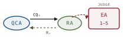

# The tri-agent clarification framework, *staged*

*Cliff notes on Zhao, "A Tri-Agent Framework for Evaluating and Aligning Question Clarification Capabilities of Large Language Models" (KDD '25) — a Generate-Test-Critique loop pointed at one narrow skill: does the model ask before it acts? In this repo it already has a name — the **Tri-Agent Framework**, and its judge is a **soft critic** in [LLM-Modulo](../llm-modulo/llm-modulo.md) terms. This page is also a worked example of where the soft-critic story runs out.*

---

## The capability under test: ask before you act

Most LLM benchmarks present a prompt and grade the answer. But a large class of real failures happens *before* the answer: the user's request was ambiguous, the model charged ahead on a guess, and the guess was wrong. The competent move — the one a good analyst makes — is to *notice the gap and ask a clarifying question* rather than hallucinate a specification.

That is the skill this paper isolates and scores. Not "can the model answer," but "can the model recognize that it cannot yet answer, ask the right questions, integrate the replies, and stop asking once the intent is pinned down." It is a dialogue-shaped capability, and static input-output benchmarks miss it entirely.

> **The one-line claim.** You can evaluate question-clarification by staging a conversation between three LLM agents — one that asks, one that plays a (sometimes difficult) user, and one that judges the transcript against a hidden ground-truth intent — and reading off a rubric. The framework is dynamic where the capability is dynamic.

## Three agents, one loop

The framework's name is its architecture. Three LLM roles, one of them the system under test.

*The unit of evaluation is a whole conversation, not a turn. The ground truth is the answer key the judge holds and the respondent is secretly steered by — and the QCA never sees.*

- **Question Clarifying Agent (QCA)** — the system under evaluation. Given an ambiguous initial query `Q_orig`, it must detect the ambiguity, generate relevant clarifying questions, interpret the answers, manage a multi-turn dialogue, handle unsupported inputs, and finally formulate a well-specified `Q_final`. Six jobs, and "answer the question" is not one of them.
- **Respondent Agent (RA)** — a simulated human user. It is handed the ground-truth query `Q_gt` (so its answers stay consistent with a real intent) plus a **persona**: cooperative, or vague, or deliberately evasive, or instructed to inject *unsupported* entities the system can't handle. The RA is the adversary that makes the test more than a happy path.
- **Evaluator Agent (EA)** — an LLM-as-a-judge. After the dialogue closes, it reads the full transcript (`Q_orig`, every `CQ_i`/`R_i` pair, and `Q_final`) plus `Q_gt`, and scores the QCA against a rubric.

The protocol is a five-step loop: initialize a test case → present `Q_orig` to the QCA → run the clarify/respond exchange for as many turns as the QCA needs → the QCA emits `Q_final` → the EA scores the transcript against `Q_gt`. One implementation detail earns its keep: all three agents were instructed to reason inside `<think>` tags before answering in `<output>` tags, and the author reports a significant quality lift from that test-time-compute split.

A structural fact worth marking now, because the harebrain reading turns on it: **all three agents are the same model — Claude 3.5 Sonnet.** The thing being tested, the thing stress-testing it, and the thing judging the result share weights.

## Manufacturing ambiguity

The cleverest part of the paper is the data recipe, and it runs *backwards* from how you'd first guess.

*Author the answer, then ablate it into a question. The ground truth exists before the test does — which is exactly why the test has a defensible key.*

You don't write ambiguous questions and hope you know what they mean. You start from a **base question** that is inherently ambiguous in a domain (the paper uses supply-chain queries — "What is the forecast?"), attach typed **entity slots** marked *mandatory* (M) or *optional* (O), and then:

1. **Instantiate `Q_gt`** — bind the slots to specific values to get a fully specified, unambiguous query: *"forecast for SKU123 at Warehouse-A for next month."* This is the intent the QCA must recover.
2. **Strategically omit** — drop some or all of those bound values to derive `Q_orig` at a chosen ambiguity level: from "missing the optional Product" all the way down to the bare base question with nothing bound.

The QCA's task is to climb back up that ladder — to figure out *which slots are already pinned and which still need asking* — without ever seeing `Q_gt`. A subtle design choice keeps it honest: a fully clarified query need not fill *every* optional slot (a user may genuinely want aggregated "all products"), so the QCA can't win by blindly demanding every field. It has to distinguish *mandatory-and-missing* from *optional-and-fine-to-aggregate*.

This is the same move [LLM-Modulo](../llm-modulo/llm-modulo.md) makes when it generates plans against a known goal, and the same move the wumpus runner makes when it authors a seed with a known oracle solution: **the ground truth is constructed first, and the test is derived from it.** That ordering is what gives the evaluation a key it can defend.

## The metrics, and what they found

The EA scores nine metrics across six categories, most on a 1–5 scale. Run over 200 supply-chain dialogues, the QCA (Claude 3.5 Sonnet) posted strong numbers with two honest soft spots.

*Strong on noticing ambiguity (0.92) and asking relevant questions (4.48); weakest on unsupported inputs (3.75). The 13% of failures cluster into two patterns — and both are guard-shaped.*

| Category | Metric | Score |
|---|---|---|
| Ambiguity Handling | Detection Accuracy (AH-DA) | 0.92 accuracy |
| Ambiguity Handling | Completeness of Clarification (AH-CC) | 4.15 / 5 |
| Question Quality | Relevance (QQ-Rel) | 4.48 / 5 |
| Question Quality | Clarity & Conciseness (QQ-CC) | 4.25 / 5 |
| Dialogue Efficiency | Avg. Number of Turns (DE-Turns) | 4.83 turns |
| Language Appropriateness | Handling of Unsupported Inputs (LA-Uns) | 3.75 / 5 |
| Final Question Alignment | Semantic Fidelity (FQA-SF) | 4.38 / 5 |
| Final Question Alignment | Precision (FQA-Prec) | 4.29 / 5 |
| Overall | Task Success (OTS) | 0.87 success rate |

The two failure modes in the ~13% that missed OTS are the interesting part, because they are not random:

- **Premature termination.** Asked "for which month?", the RA replies "the upcoming summer month," and the QCA *accepts it* — even though that's still June-or-July-or-August. The final query inherits the imprecision and fails against a `Q_gt` that wanted "June 2025."
- **Missed mandatory entity.** The QCA correctly captures a broad specifier like "all products" but then forgets to confirm a *different* mandatory slot — say, a required date range — leaving `Q_final` incomplete for backend execution.

Both failures have the same shape: **a slot was left unbound that the agent should not have been allowed to leave unbound.** Hold that thought; it's where the cage walks in.

## Does the judge tell the truth?

The framework's whole output is whatever the EA says — so the EA itself has to be validated against humans, or the numbers are an LLM grading an LLM with no ground in human judgment. The paper is commendably upfront that this is the weak link, and reports a pilot: on one metric (Completeness of Clarification), one annotator (the author) scored 50 dialogues, and the EA's scores correlated at **Pearson r = 0.87**.

That's a real result, and the paper does not oversell it. It explicitly lists what a *real* validation would require: multiple independent annotators, calibration training, and an inter-coder-reliability statistic (Krippendorff's α > 0.70) to establish a trustworthy human gold standard — all marked as future work.

> **The honesty is the point, and also the catch.** One metric, one annotator, no inter-coder reliability, no confidence intervals. By the bar this repo already adopted — the [ABC checklist](../agentic-benchmarks/agentic-benchmarks.md)'s `O.c.1` (an LLM judge must show *documented* human agreement) — a single-annotator pilot is a promissory note, not a validation. The framework knows exactly which door it hasn't walked through yet.

## Where this sits in the harebrain hypothesis

The harebrain thesis is `harebrain = fast LLM brain × structured game-AI cage`. The tri-agent framework is a clean, small instance of the brain-plus-loop half — a Generate-Test-Critique cycle whose critic happens to be soft all the way down. The mapping is direct, and the gaps are instructive.

*Same shape, different vocabulary. The one green seam is the place a sound check is actually available — and the paper hands it to a judge anyway.*

| Tri-agent framework | harebrain |
|---|---|
| QCA (candidate generator + spec refiner) | LLM at the leaf — one call per state, behind a guard |
| RA (adversarial persona: vague / evasive / unsupported) | EDD adversarial review — a simulated environment, automated |
| EA (LLM-as-judge, 1–5 rubric) | Soft critic — graded verdict, not sound |
| `Q_gt` (ground-truth query, mandatory slots) | Oracle / ground truth — slot equality is a *hard* check |
| Clarify loop (`CQ_i` / `R_i` until resolved) | Ask-until-bound chart subgraph — guard blocks exit until slots filled |
| Synthetic ablation (author `Q_gt`, omit to make `Q_orig`) | Slow-clock authoring — seed first, derive the test from it |

### What the paper gives harebrain

- **A first-class name for a capability the cage needs: knowing when to ask.** [LLM-Modulo](../llm-modulo/llm-modulo.md) lists "specification refiner" as one of the LLM's six roles — if the spec is incomplete, the LLM helps the user flesh it out before generation. This paper takes that one role and makes it the *whole* evaluation target, with a metric suite attached. In harebrain terms, "is the spec complete enough to act?" is a transition guard: a chart can route to an *ask* state instead of a *do* state, and this framework is how you'd benchmark the LLM sitting at that fork.
- **The RA as a reusable adversarial-environment pattern.** An LLM simulator handed a hidden ground truth and a troublemaking persona — injecting unsupported entities, giving evasive half-answers — is exactly EDD adversarial review, automated and pointed at a sub-dialogue. Harebrain can lift the RA wholesale as a way to stress-test any clarification subgraph: a cheap, scriptable opponent that probes whether the cage actually holds when the user is unhelpful.
- **Author-the-answer-then-ablate, as a synthetic-test recipe.** Generating `Q_gt` first and *deriving* `Q_orig` by omission is the same discipline as authoring a wumpus seed with a known oracle solution. It guarantees the test has a defensible key, and it lets you *dial* difficulty (how many slots you omit) the way Mystery-Wumpus dials the retrieval-vs-reasoning gap. The recipe belongs in harebrain's test-authoring toolkit.

### What harebrain pushes that the paper doesn't

- **Put a hard check where one is free.** The EA judges everything — including `FQA-Prec` and `OTS`, which are really asking *did `Q_final` bind the same mandatory entities as `Q_gt`?* That is a **set-equality question with a deterministic answer.** [LLM-Modulo](../llm-modulo/llm-modulo.md)'s lesson is that a framework's soundness is inherited from its *hard* critics, and this framework has none: it outsources a checkable comparison to a soft critic. Harebrain would split the rubric — let the EA grade the genuinely subjective bits (clarity, relevance, language), but check mandatory-slot coverage with code. The green seam in the diagram is that one place, and the paper paints it soft.
- **Turn the two failure modes into unreachable states.** Both OTS failures — premature termination, missed mandatory slot — are exactly the failures a transition guard makes *impossible*. Model the clarification dialogue as a chart: states for `detect → ask → integrate → confirm → finalize`, with a guard on the edge into `finalize` that **blocks the transition until every mandatory slot is bound.** "The QCA occasionally accepted an ambiguous answer" becomes "the chart cannot leave the asking state until the slot is filled." That is the harebrain payoff stated in the paper's own failure vocabulary: don't grade the agent for skipping a step — build a cage where the step can't be skipped.

> **The trap to mark, in the paper's own vocabulary.** Do not read "we validated the judge (r = 0.87)" as "the judge is validated," and do not read "87% task success" as a sound benchmark number. There is no hard critic anywhere in this loop: the QCA, the RA, *and* the EA are all the same model, so a blind spot in Claude-as-clarifier can be invisible to Claude-as-judge — correlated errors, not independent verification. The framework is a soft-critic loop wearing benchmark clothes; by [ABC](../agentic-benchmarks/agentic-benchmarks.md)'s lights it lacks the validated judge (`O.c.1`), the confidence intervals (`R.10`), an oracle solver, and a trivial-agent baseline. Treat its scores the way LLM-Modulo says to treat any all-soft-critic result: a graded essay, useful as a draft signal, not a verified plan. The one number you *could* make sound — mandatory-slot coverage — is the one the paper hands to the judge.

## What's worth taking away

- Question clarification is a real, isolable capability, and this framework is a clean way to stage it: an asker, an adversarial simulated user, and a judge, scored over whole conversations rather than single turns.
- The data recipe is the keeper. Author the ground truth, ablate it into graded-ambiguity queries, make the agent climb back. Same discipline as a seeded oracle; same payoff — a test with a defensible key and a difficulty dial.
- The framework is an all-soft-critic loop, and its own results page proves the cost: the two failure modes are slot-binding failures a hard guard would have prevented, and the judge that scored them is the model judging itself.
- The harebrain move is to refuse the soft/hard conflation: grade the subjective metrics with the EA, *check* mandatory-slot coverage with code, and model the dialogue as a chart whose `finalize` edge is guarded so the documented failures become unreachable rather than merely penalized.
- Where you have a constructible ground truth — and clarification, like wumpus, does — you have the option of a sound check. Spend it. The paper shows what happens when you don't: honest numbers you can't fully trust, because nothing in the loop was ever sound.

---

**Sources.** Zhao, Yikai. "A Tri-Agent Framework for Evaluating and Aligning Question Clarification Capabilities of Large Language Models." *KDD '25: Proceedings of the 31st ACM SIGKDD Conference on Knowledge Discovery and Data Mining*, Toronto, ON, Canada, 2025 ([raw PDF in this folder](a-tri-agent-framework-for-evaluating-and-aligning-question-clarification-capabilities-of-large-language-models.pdf)). Related in this repo: [LLM-Modulo](../llm-modulo/llm-modulo.md) (the soft/hard critic distinction and the soundness-from-hard-critics rule this page leans on), [ABC / rigorous agentic benchmarks](../agentic-benchmarks/agentic-benchmarks.md) (the judge-validation and reporting bar), [AdvancedIF](../advanced-if/advanced-if.md) and [ComplexBench](../complexbench/complexbench.md) (LLM-judge–human agreement), and the [harebrain thesis](../../harebrain/harebrain.md). Adjacent clarification benchmarks the paper cites: ClarQ-LLM, AGENT-CQ, CLAMBER, InfoQuest, APA. All diagrams above are original SVGs drawn for this page in the harebrain palette.
