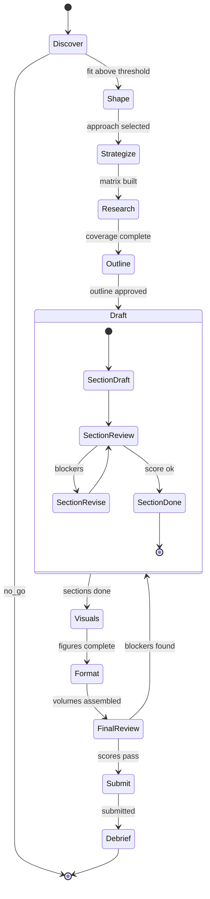
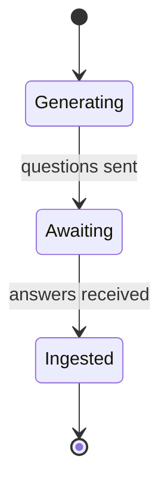

# SBIR proposal as a harebrain chart

*An application sketch — what the SBIR/STTR proposal pipeline looks like authored as a chart, not a workflow.*

---

## The bet

The SBIR proposal lifecycle is the harebrain sweet spot: small named state space (~10 waves), high per-state judgment (writing, scoring, reviewing), long-running, human-in-the-loop, compliance-driven. It's the top three rows of the harebrain tradeoff table (`harebrain/harebrain.md:213-222`).

Today the `sbir:*` plugin is a hand-rolled chart — skills as states, agents as leaves, `proposal-status` as a poor blackboard. The proposal here: make the chart *real* (MPL source), give it a real blackboard with decay, use LangGraph only inside waves that need a subworkflow, and put one model call at every leaf simple enough not to.

> `proposal_writer = bounded SBIR chart × LangGraph subworkflows × LLM leaves`

## The top-level chart



Guards are shown as terse labels here; the real chart spells them out (`reviewer_score >= 0.8 and blockers = 0`, etc.) as MPL rule expressions.

**Orthogonal region: TPOC Q&A.** Running alongside `Strategize` through `Outline`, a second region handles TPOC questions independently. Answers can arrive at any time and the chart needs to update `compliance_matrix` and `selected_approach` when they do, without rewriting the main flow. That's exactly the Harel-orthogonality use case (`harebrain/harebrain.md:73`).



Mermaid can't cleanly draw a region orthogonal *across* multiple parent states — in MPL this is a sibling region of the top chart, live from Wave 1 through Wave 3.

## What lives at each leaf

Pick the lightest middle layer that earns its weight (`harebrain/harebrain.md:195-201`).

| Wave state | Work per state | Layer | Notes |
|---|---|---|---|
| `Discover.FindSolicitations` | Tool-routing over gov search APIs | **Agent** | One LangChain agent step |
| `Discover.ScoreFit` | Classification against profile | **Model** | One inference, structured output |
| `Discover.GoNoGo` | — | **Human gate** | Chart waits |
| `Shape.GenerateApproaches` | Multi-step: read solicitation → generate N → score each | **LangGraph** | Subgraph with parallel scoring |
| `Strategize` | One agent step (TRL, teaming, budget) | **Agent** | Structured output → blackboard |
| `Strategize.ComplianceMatrix` | PDF parse + structured extraction | **Agent** | Tool: PDF reader + extractor |
| `Research` | Parallel: prior-art, patents, market, competitors | **LangGraph** | Fan-out / fan-in subgraph |
| `Outline` | One agent step against compliance matrix | **Agent** | — |
| `Draft.Section[*]` | Draft → review → revise loop per section | **LangGraph** | Subgraph; one instance per section (orthogonal) |
| `Visuals.Figure[*]` | Spec → generate → critique → accept | **LangGraph** | Subgraph per figure |
| `Format` | Apply spec, assemble volumes | **Agent** | Tool: docx/LaTeX writer |
| `FinalReview` | Parallel: evaluator-sim + red-team + clarity | **LangGraph** | Fan-out, converge, decide |
| `Submit` | Portal API + archive | **Agent** | Tool: portal client |
| `Submit.Confirm` | — | **Human gate** | Chart waits for human submit |
| `Debrief` | Ingest outcome, categorize, generate lessons | **Agent** | One step |

No wave needs the full Policy → Orchestration → Agent → Model stack at every leaf. Half the leaves are single Agent steps; two or three are bare Model calls.

## The blackboard

Typed, keyed, with decay. The chart reads slots; agents write slots. Prompts are built *from* the blackboard, not from a rolling transcript (`harebrain/harebrain.md:54`).

| Key | Type | Lifetime | Notes |
|---|---|---|---|
| `solicitation` | `Solicitation` | pinned | Full text + parsed metadata |
| `topic_id` | `str` | pinned | — |
| `deadline` | `datetime` | pinned | Director derives `time_remaining` live |
| `selected_approach` | `Approach` | pinned | Set after Shape |
| `compliance_matrix` | `Matrix` | pinned (mutable) | Items gain evidence references as drafts land |
| `tpoc_answers` | `dict[str, Answer]` | pinned, freshness-tracked | Stale if `> 7d` |
| `user_constraints` | `list[Constraint]` | pinned | "Don't reuse Phase II Y boilerplate," etc. |
| `corpus_hits` | `list[CorpusHit]` | decays (~30d half-life) | Past-performance retrievals |
| `research_findings` | `list[Finding]` | decays (~30d half-life) | Patent / market / prior-art results |
| `section_drafts[name]` | `Section` | per-section live | Status, revision count, last reviewer score |
| `page_budget[volume]` | `int` | live | Recomputed each tick |
| `evaluator_scores` | `list[Score]` | accumulating | Per pass, with confidence |
| `quality_preferences` | `QualityProfile` | pinned | Per-proposal voice/tone/density |

Pinned constraints survive the run; research decays so the agent doesn't pitch stale prior art two weeks into drafting.

## The director

A non-embodied agent sampling the blackboard and the chart's active state on its own clock. Modulations, not actions (`harebrain/harebrain.md:107`).

Watches:
- **Page budget vs. drafts** — fires if any section is `> 1.2x` budget.
- **Reviewer score plateau** — fires if `section_drafts[s].reviewer_score` hasn't improved in 3 revisions (stuck loop → escalate or move on).
- **Compliance coverage vs. time** — fires if `uncovered_items > 0 ∧ time_remaining < 5d`.
- **Strategy drift** — fires if drafts contradict `selected_approach` (sample sections, ask "does this still match the strategy?").
- **TPOC staleness** — fires if `tpoc_answers` is older than 7d when used to justify a draft claim.

Outputs are interrupts the chart routes on: `Director.escalate(s)`, `Director.demand_evidence(claim)`, `Director.force_transition(SectionDone)`.

## The seam

The chart calls into the brain through one boundary, one value, one direction (`harebrain/harebrain.md:122`).

```mpl
host import {
    score_fit(s: Solicitation, p: CompanyProfile) -> {score: float, recommend: Verdict};
    extract_compliance(s: Solicitation) -> Matrix;
    draft_section(brief: SectionBrief, bb: Blackboard) -> Section;
    review_section(sec: Section, rubric: Rubric) -> {score: float, blockers: list[str]};
    simulate_evaluator(volume: Volume) -> EvaluatorScore;
} from llm;
```

Each host import is a host function whose return value is typed. The chart routes on the return. The LLM cannot reach a state the chart doesn't declare, fire a transition that isn't there, or invent an action outside the rule grammar.

Drafting agents that need a subgraph (Section, Research, Visuals, FinalReview) close over a LangGraph instance inside the host function — but they still return a typed verdict that the chart routes on. **The LangGraph runs *inside* the seam.**

> **Trap to avoid.** A host function that *also* sends email or hits an API on its way to returning a string has put the LLM in direct control of those effects, regardless of what the chart permits. Host functions return verdicts. *Rules* act on verdicts. Submission must be a `Submit` state with an explicit transition guard, not a side effect of `draft_section()`.

## What to build first

The harebrain "what to build first" prescription, applied:

1. **Pick one wave with a small state space and rich per-state judgment.** `Draft.Section` is the obvious one — high payback (most pages, most revision cycles, most LLM drift today), small chart (draft → review → revise → done), clear blackboard slots, clear guard (`reviewer_score >= 0.8 ∧ blockers = 0`).
2. **Wrap it as an MPL chart.** States above, transitions guarded against `section_drafts[name]`.
3. **Give it a real blackboard slice.** `section_drafts[name]`, `compliance_matrix`, `quality_preferences`, `page_budget`, `selected_approach`. Decay nothing yet — section work is short-horizon.
4. **One LLM call per leaf, prompts built from the blackboard.** `draft_section`, `review_section`, `revise_section` as host imports returning typed verdicts.
5. **Add a director with the reviewer-score-plateau check.** Cheap to leave on, loud when it fires. That single director rule probably catches the most common stuck-loop failure mode of the current writer-reviewer skill.

Then measure: **does the section finish without getting stuck?** Every drift is locatable to a state; every wrong revision is locatable to a reviewer threshold; every stale claim is locatable to a blackboard slot.

If it works, lift the same pattern up to the wave level (`Research`, `FinalReview`) and let the top-level chart manage handoffs. If it doesn't, you'll have learned *which* piece refused — and that diagnostic surface is already better than "the agent went sideways and we don't know where" (`harebrain/harebrain.md:236`).

## Where this sits

| Source | What it contributes |
|---|---|
| [Harebrain, *sketched*](harebrain/harebrain.md) | The four-layer stack (Policy / Orchestration / Agent / Model), the seam, the cage's bound. |
| [MPLv2 vs. Harel](mpl/mpl.md) | The chart artifact, the Manifest, deterministic conflict resolution. |
| [Traditional Game AI Primitives](game-ai/game-ai.md) | Blackboard with decay, utility scoring, AI director. |
| Existing `sbir:*` plugin | The lifecycle, the agent roster, the compliance discipline — the hand-rolled cage to formalize. |
