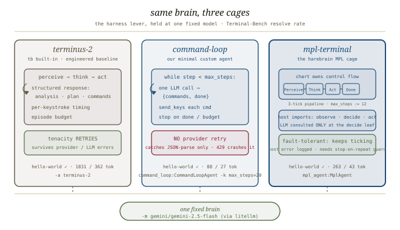
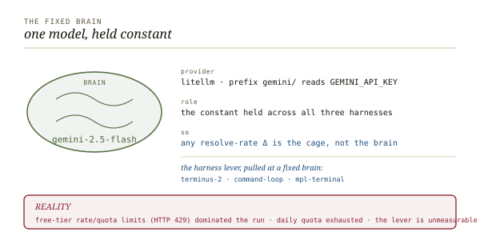
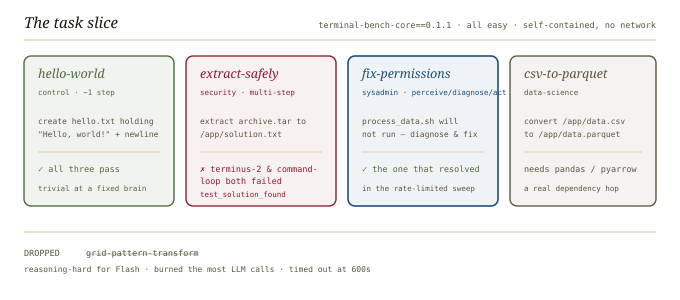
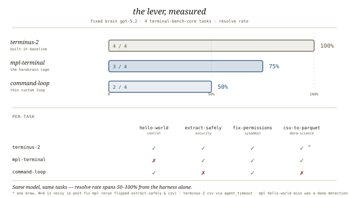

# Swap the cage, fix the brain, *staged*

*A harness comparison on Terminal-Bench: hold the model fixed and swap the harness across three agents, reading resolve rate (and tokens, and time) on a task slice. This is the "harness lever at a fixed brain" — the same lever [Meta-Harness](../../docs/research-summaries/meta-harness/meta-harness.md) quantified at 6× and [agent-harness-anatomy](../../docs/research-summaries/agent-harness-anatomy/agent-harness-anatomy.md) showed as Top 30 → Top 5, both on this ruler. We ran it **twice**: first on free-tier `gemini-2.5-flash` (rate-limited into noise — the reproduction-cost lesson), then on **`gpt-5.2`** (the paper's #1 model, clean). On gpt-5.2 the lever is real: **resolve rate swings 50% → 100% from the harness alone.*

---

## The three harnesses

The experiment is a controlled swap. One brain, three cages, one ruler. Each cage is driven by the same `-m` model; the only thing that changes is who owns control flow.


*The same model at the leaf; three different geometries around it. terminus-2 is Terminal-Bench's neutral baseline, command-loop is the minimal worked example, mpl-terminal is the harebrain cage.*

| | **terminus-2** | **command-loop** | **mpl-terminal** |
|---|---|---|---|
| **What it is** | Terminal-Bench **built-in** neutral agent — the engineered baseline | our minimal **custom** Python agent | the harebrain **MPL cage** |
| **File** | tb built-in (no repo file) | [`agents/command_loop.py`](../agents/command_loop.py) | [`agents/mpl_agent.py`](../agents/mpl_agent.py) + [`agents/terminal.mpl`](../agents/terminal.mpl) |
| **Control flow** | engineered perceive/think/act loop: structured analysis+plan+commands response, per-keystroke timing, episode budget | a thin `while` loop: one structured LLM call per step → `{commands, done}`, send each via `send_keys`, stop on `done` or `max_steps` | the **chart owns control flow** as explicit states `Perceive → Think → Act → Done`; a 3-tick pipeline, one side-effecting host call per transition |
| **Where the LLM is consulted** | inside the loop, per turn | once per step (returns a command list) | **only at the `decide` leaf** — `observe`/`act` are pure host calls |
| **Step budget** | episode budget | `max_steps` default 15 (we ran 20) | chart var `max_steps := 12` |
| **Retry / fault tolerance** | **tenacity RETRIES** on provider/LLM errors | catches only JSON-parse errors; a provider error **crashes it** (no retry) | a host-import exception is logged per-rule and the sim **keeps ticking** — but needs a stop-on-repeated-failure guard |

## The fixed brain

The model is held constant so any resolve-rate delta is attributable to the cage, not the brain. We held it twice.


*One brain, called through litellm — the provider prefix selects the key (`gemini/` → `GEMINI_API_KEY`, `openai/` → `OPENAI_API_KEY`). Holding it identical across all three cages is what isolates the harness lever.*

- **Run 1 — `gemini/gemini-2.5-flash` (free tier).** Hit HTTP 429 rate/quota limits, then daily-quota exhaustion. The lever was **unmeasurable** — see [§ Results](#results).
- **Run 2 — `openai/gpt-5.2` (paid).** The Terminal-Bench leaderboard #1 model (Codex CLI × GPT-5.2 at 63%). Clean: this is the run the headline numbers come from.

## The task slice

The slice is drawn from `terminal-bench-core==0.1.1`, all **easy** difficulty, all self-contained (no network).


*Four easy, network-free tasks plus one dropped. grid-pattern-transform was reasoning-hard for Flash, burned the most LLM calls, and timed out at 600s — excluded from the slice.*

| Task | Category | What it asks |
|---|---|---|
| **hello-world** | control | create `hello.txt` containing `Hello, world!` + newline (~1 step). Expected: all harnesses pass. |
| **extract-safely** | security | extract `archive.tar` to `/app/solution.txt`; multi-step. |
| **fix-permissions** | sysadmin | a `process_data.sh` won't run — diagnose and fix it (perceive → diagnose → act). |
| **csv-to-parquet** | data-science | convert `/app/data.csv` → `/app/data.parquet` (needs pandas / pyarrow). |
| ~~grid-pattern-transform~~ | *dropped* | reasoning-hard for Flash, most LLM calls of any task, **timed out at 600s** — excluded from the slice. |

## How we run it

Terminal-Bench's orchestrator cannot run natively on Windows — it assumes a POSIX host (it builds container paths with backslashes, so files land in `\tmp` not `/tmp`, and it shells out to `rm`). So it runs as a **Linux process inside WSL2 Ubuntu**, talking to a WSL2-backed Docker Desktop.


*The tb orchestrator runs as a Linux process in WSL2 because it assumes a POSIX host. Docker Desktop is WSL2-backed with Ubuntu integration; tb spins up one container per task trial via docker-compose and grades on the final container state.*

The stack, concretely:

- **Windows 11 host.** The orchestrator runs inside **WSL2 Ubuntu** (the default distro) because it is a POSIX-only tool.
- **Docker Desktop**, WSL2-backed with integration enabled for Ubuntu. tb talks to the Docker daemon and spins up **one Linux container per task trial** via docker-compose. Each container gets the instruction + Dockerfile; the tests and human oracle are hidden; grading reads the **final container state**.
- **tb is a uv tool pinned to Python 3.13** (3.14 crashes its typer CLI). For the MPL agent, `mpl` is installed into the tb venv (`uv tool install --with <mplv2 path>`).
- The repo is reachable from WSL at `/mnt/c/Users/PhilVanEvery/Git/github/pmvanev/harebrain`. Run outputs go to the WSL ext4 fs (`~/tb-runs`), **not** `/mnt/c` — Docker IO over `/mnt/c` is slow.
- The API key is forwarded from the Windows process env into WSL via **WSLENV** at run time (never printed). Custom agents load with `PYTHONPATH=.../terminal-bench/agents` + `--agent-import-path module:Class`.

The exact commands, driven from a Windows PowerShell prompt. WSL commands are double-quoted with absolute paths because single-quoted `$`-vars and pipes get mangled in the PS → WSL handoff. Swap `-m gemini/gemini-2.5-flash` for `-m openai/gpt-5.2` (and the key var) to switch brains:

```powershell
# Forward the key into WSL (never printed). Gemini run:
PS> $env:WSLENV="GEMINI_API_KEY"
# gpt-5.2 run: hydrate the user-scope key into the process env first, then forward it
PS> $env:OPENAI_API_KEY = [Environment]::GetEnvironmentVariable('OPENAI_API_KEY','User'); $env:WSLENV="OPENAI_API_KEY"

# 1. terminus-2 — the built-in neutral baseline
PS> wsl -d Ubuntu -u root -e bash -lc "export PATH=$HOME/.local/bin:$PATH; tb run -d terminal-bench-core==0.1.1 -t hello-world -t extract-safely -t fix-permissions -t csv-to-parquet -a terminus-2 -m openai/gpt-5.2 --n-concurrent 1 --output-path ~/tb-runs/gpt52/terminus2"

# 2. command-loop — minimal custom agent (add PYTHONPATH; swap -a for --agent-import-path + -k)
PS> wsl -d Ubuntu -u root -e bash -lc "export PATH=$HOME/.local/bin:$PATH; export PYTHONPATH=/mnt/c/Users/PhilVanEvery/Git/github/pmvanev/harebrain/terminal-bench/agents; tb run -d terminal-bench-core==0.1.1 -t hello-world -t extract-safely -t fix-permissions -t csv-to-parquet --agent-import-path command_loop:CommandLoopAgent -k max_steps=20 -m openai/gpt-5.2 --n-concurrent 1 --output-path ~/tb-runs/gpt52/commandloop"

# 3. mpl-terminal — the harebrain MPL cage (same PYTHONPATH; different import path)
PS> wsl -d Ubuntu -u root -e bash -lc "export PATH=$HOME/.local/bin:$PATH; export PYTHONPATH=/mnt/c/Users/PhilVanEvery/Git/github/pmvanev/harebrain/terminal-bench/agents; tb run -d terminal-bench-core==0.1.1 -t hello-world -t extract-safely -t fix-permissions -t csv-to-parquet --agent-import-path mpl_agent:MplAgent -m openai/gpt-5.2 --n-concurrent 1 --output-path ~/tb-runs/gpt52/mpl"
```

> **Free zero-cost checks.** `-a oracle` runs the reference solution (should resolve); `-a nop` does nothing (should fail). Both are quota-free smoke tests of the harness plumbing before you spend a single LLM token.

## Results

### Run 2 — gpt-5.2 (the clean measurement)

Same model, same four tasks. The harness is the only variable, and it moves the number.


*One draw: resolve rate spans 50–100% from the harness alone (N=4 is noisy — see the variance note below). terminus-2's csv passed via an agent_timeout; mpl-terminal's hello-world miss was a done-detection bug, since fixed.*

| Cage | Resolve | Input tok | Output tok | Agent time (Σ over 4 tasks) |
|---|---|---|---|---|
| **terminus-2** (built-in baseline) | **100%** (4/4) | 7,893\* | 1,537\* | ~500 s |
| **mpl-terminal** (the cage) | **75%** (3/4) | 8,788 | 648 | **~89 s** |
| **command-loop** (thin loop) | **50%** (2/4) | 567\* | 319\* | ~195 s |

\* Timed-out trials record **0 tokens** (the count only returns when the agent finishes cleanly), so terminus-2's and command-loop's token totals undercount their csv-to-parquet work.

Per-task pass/fail (✓ resolved · ✗ failed):

| Task | terminus-2 | command-loop | mpl-terminal |
|---|:--:|:--:|:--:|
| hello-world | ✓ (7 s · 1744/284) | ✓ (2 s · 89/28) | **✗** (2 s · 115/28) |
| extract-safely | ✓ (13 s · 2382/566) | **✗** (5 s · 81/208) | ✓ (4 s · 299/84) |
| fix-permissions | ✓ (17 s · 3767/687) | ✓ (5 s · 397/83) | ✓ (10 s · 1304/131) |
| csv-to-parquet | ✓\* (**463 s** · timeout) | **✗** (**182 s** · timeout) | ✓ (73 s · 7070/405) |

Read it straight:

- **A lever is visible** (this draw). At one fixed brain, resolve rate runs **50% (command-loop) → 75% (mpl-terminal) → 100% (terminus-2)**. The engineered baseline tops out; the thin loop trails. But see the variance caveat below — N=4 is one noisy sample, not an estimate.
- **The csv-to-parquet divergence (first draw) is the sharpest signal.** The MPL cage solved it in **73 s / 7,070 input tokens**, while terminus-2 spun ~**7.7 min** (squeaking a pass on final-state after a timeout) and command-loop spun ~**3 min** and failed. *Caveat: on the post-fix rerun the cage also timed out on csv — it's a high-variance task for all three, not a reliable cage win.*
- **The cage had a real bug — found and fixed.** `mpl-terminal` failed the trivial `hello-world` while solving harder tasks. Root cause: the `decide` leaf returned the `__DONE__` sentinel whenever the model set `done=true`, **discarding the command** — so a one-shot answer (`{command, done:true}` together) finished having sent nothing (`commands.txt` confirmed zero agent commands). Fixed to always run a pending command and finish only when none remains; `hello-world` now passes (verified 2/2). The cage's legibility is exactly what made this a one-line locate-and-fix.
- **Cost vs. reach:** command-loop is cheapest (567 in / 319 out) and weakest; the cage spends the most input tokens but, when it converges, finishes fast in wall-clock because it doesn't burn minutes timing out. Tokens, time, and resolve are three different axes and the harness moves all three.

> **Small-N variance — read this before the numbers.** These are **single draws** on a 4-task slice with a stochastic frontier model. After the `hello-world` fix, a full-slice mpl rerun drew **2/4** — `extract-safely` and `csv-to-parquet` flipped to failures (csv timed out ~10 min) even though both passed in the first draw; only `fix-permissions` passed in *both* mpl runs. terminus-2 and command-loop were each run only once, so their rows are equally single samples. Treat the per-task ✓/✗ and the exact percentages as noisy points; the **spread** and the **qualitative findings** (the retry axis, the now-fixed bug, the cost/latency split) are the durable signal. A real estimate needs `--n-attempts` (pass@k) over a wider slice.

### Run 1 — gemini-2.5-flash (the capacity lesson)

The first attempt, on the free Gemini tier, never got to measure the lever:

| Run | Concurrency | Result | What happened |
|---|---|---|---|
| Clean control (each harness, individually) | 1 | hello-world **resolved by all three** | terminus-2 1831/362 · command-loop 88/27 · mpl-terminal 263/43 |
| 4-task sweep | 2 | terminus-2 25% · command-loop 25% | both only fix-permissions; **rate-limit-dominated** — most trials crashed on `RateLimitError`; mpl wedged and was killed |
| Retry | 1 | **0/4** | Gemini free-tier **daily quota exhausted** — a single direct call returned 429 |

The free tier's rate limiter, not cage quality, decided every multi-task run. That is itself the finding: **entering the harness-lever regime is gated on API *capacity*, not just on picking the right model.**

## What we learned

- **The harness lever reproduces locally — given capacity.** On gpt-5.2 it's a clean 2× swing (50% → 100%) across three cages at a fixed brain. On free-tier Gemini it was unmeasurable noise. The [Terminal-Bench summary](../../docs/research-summaries/terminal-bench/terminal-bench.md)'s regime boundary holds — *capability sets the ceiling, the harness decides reach* — and its **$1–100/run** cost note is the price of admission we couldn't pay for free.
- **A cage's failures are localizable — that's the real payoff.** mpl-terminal's `hello-world` loss traced to a single `decide`-leaf line (it discarded the command on `done=true`); the explicit control flow turned a mystery failure into a one-line fix, verified by rerun. That legibility — not a headline resolve rate — is what the cage buys. (Its csv-to-parquet win was one draw; a rerun timed out, so don't over-read it.)
- **Resolve rate alone is the wrong scoreboard.** The token and time columns tell a different story than the ✓/✗ grid: terminus-2's 100% cost ~500 s of wall-clock (a 7.7-min timeout it survived), and the cage's 75% came in at ~89 s. A harness comparison needs all three axes.
- **"Handle provider errors" is harness work.** terminus-2 retries on provider errors (tenacity); our two minimal agents crash; the MPL cage keeps ticking past host errors but needs a stop-on-repeated-failure guard. This axis decided the *Gemini* run entirely.

## Next steps

- ✅ **`-m openai/gpt-5.2`** — done (above), the Terminal-Bench #1 model.
- ⏳ **`-m anthropic/claude-opus-4-8`** — the Meta-Harness Opus family, the brain behind the 6× harness gap. Same commands, swap the `-m` and forward `ANTHROPIC_API_KEY`.
- ✅ **Cage `hello-world` bug — found & fixed.** The `decide` leaf no longer discards a command on `done=true`; `hello-world` now passes (verified 2/2).
- 📈 **Pin the rates** — N=4 single draws are noisy (the post-fix mpl rerun swung 75% → 50% on task flips). Use `--n-attempts` (pass@k) over a wider slice, plus a harder tier (TB-2 via Harbor), to turn the spread into a real estimate.
